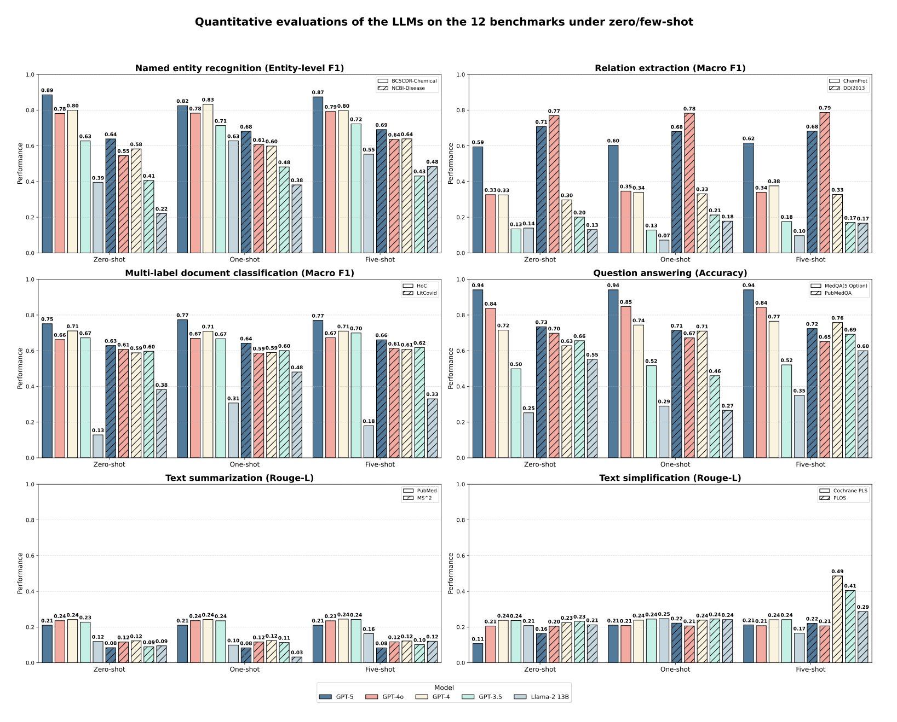
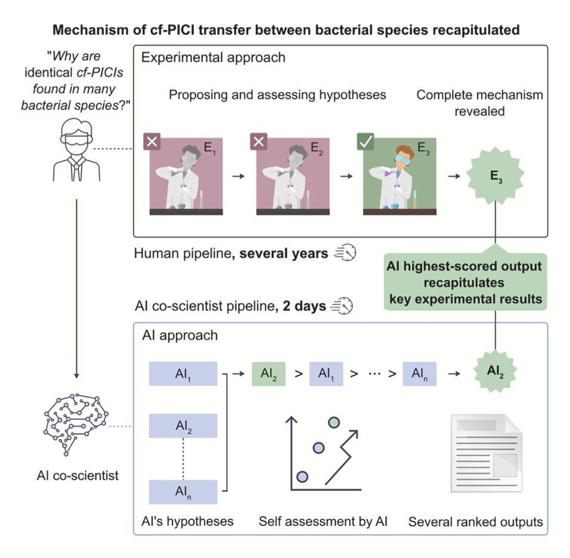
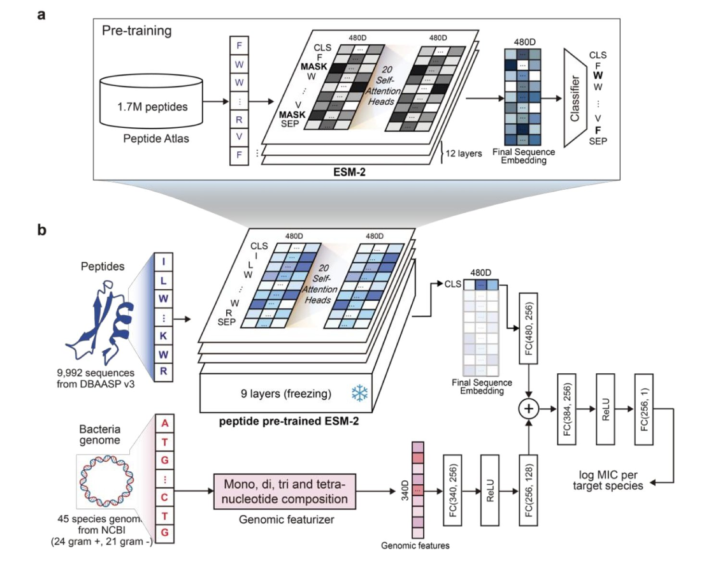
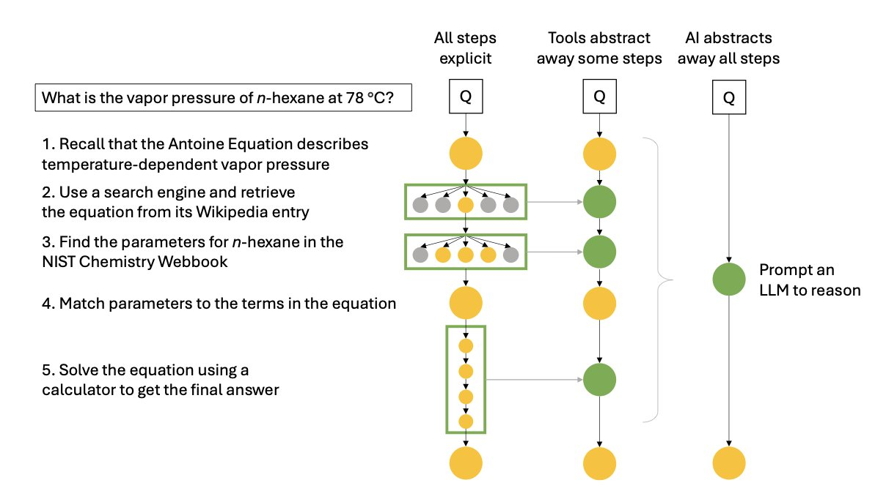

## 目录  
1. 这个叫 SENA-discrepancy-VAE 的新模型，总算给因果推断 AI 装上了一本生物学「词典」，让我们终于能看懂它在细胞里到底看到了什么。
2. GPT-5 在生物医药问答上表现惊人，但在需要高精度的任务中仍有局限，预示着通用大模型与领域专用模型的混合应用将是未来方向。
3. AI 首次在实验验证前，独立提出并准确预测了复杂的生物学机制，展示了其作为科学发现引擎的巨大潜力。
4. LLAMP 是一款创新的物种感知 AI 模型，它通过精准预测抗菌肽对特定细菌（包括未知菌种）的活性，显著推动了对抗多重耐药性病原体的研究进展。
5. AI 在化学领域的下一步，不是识别更多模式，而是学会像科学家一样进行分步推理，这将从根本上改变我们的研发方式。

## 1. AI 搞懂细胞因果？SENA 模型硬核解析  
  
  

做生物学研究的，谁没被 AI 的「黑箱」搞得头大过？那些模型能预测，这没错，但你问它为什么这么预测，它就给你一堆谁也看不懂的「潜在变量」，跟一锅数字乱炖似的。你想从里面挖出点生物学机理，简直比从草垛里找针还难。  
  
这篇论文里的 SENA-discrepancy-VAE，想干的就是把这锅乱炖变成一桌井井有条的分子盛宴。  
  
它的思路其实很直接，甚至有点「粗暴」。以前的模型是先让 AI 自由学习，然后再拿生物学知识去「翻译」它的结果，效果往往很糟糕。而 SENA 模型反其道而行之，它在训练开始前，就把一本厚厚的「生物学通路知识库」直接塞给了模型。具体来说，它的编码器（SENA-δ）被设计成一个特殊的蒙版多层感知机，每个节点都明确对应一个生物学过程。这就好比，你不是让一个不懂建筑的人去盖房子然后你再评价，而是一开始就给他一套详细的图纸，告诉他哪里是承重墙，哪里是管线。  
  
这样一来，模型输出的就不再是无意义的数字，而是直接对应到「通路 A 活性」、「通路 B 活性」这样我们能理解的概念。更妙的是，它还能区分出由扰动直接引发的「因果通路原型」（causal pathway archetypes）和下游的「元通路活动」（meta-pathway activities），这在生物学上是完全说得通的——一个基因敲除，可能直接打击某个核心通路，然后引发一连串的次生反应。  
  
光说不练假把式。研究者把它扔到两个真实的 Perturb-seq 数据集（Norman2019 和 Wessels2023）里去「实战演练」。结果呢？在预测双基因扰动这种复杂问题上，它的准确率和那些不带任何生物学约束的顶尖模型打了个平手，甚至在某些情况下还略胜一筹。这就很了不起了。通常我们认为，给模型增加的约束越多，它的性能就越可能下降。SENA 证明了，只要约束加得对，AI 戴着「镣铐」也能跳出漂亮的舞蹈。  
  
但这还不是最激动人心的。最有价值的部分在于它的可解释性。当模型告诉你，扰动 A 导致了因子 X 的变化，而这个因子 X 能直接映射到「氧化应激通路」，这就不是一个简单的相关性结论了。这是一个有生物学逻辑支撑的、可供验证的因果假说。研究者展示的案例，比如模型自主发现的过氧化氢生成与内皮细胞行为之间的关系，就与已知的生物学事实吻合。这意味着，我们终于有了一个工具，能帮助我们从海量的单细胞数据中，系统性地、有逻辑地挖掘新的生物学机制。  
  
当然，也不是完美的。作者自己也坦白，模型目前假设一个干预只对应一个核心的潜在因子，这在复杂的细胞世界里显然是过于简化的。一个药物下去，往往是「一石激起千层浪」，多个通路都会被同时搅动。不过，这毕竟是迈向真正可解释、可信赖的生物学 AI 的重要一步。它告诉我们，与其让 AI 在黑暗中独自摸索，不如一开始就给它点一盏生物学知识的明灯。  
  
📜Title: Interpretable Causal Representation Learning for Biological Data in the Pathway Space  
📜Paper: https://arxiv.org/abs/2506.12439v1  
💻Code: https://github.com/ML4BM-Lab/SENA  

## 2. GPT-5 生物医药评测：AI 制药迎来新拐点？  
  
  

一篇关于 GPT-5 在生物医药领域表现的评测论文刚刚发布，我第一时间读完了。作为一名研发科学家，我的第一反应是：这既是意料之外，又是情理之中。  
  
**知识问答：一个刚毕业的顶尖医学生**  
  
最惊人的结果来自 MedQA 数据集，GPT-5 的准确率达到了 94.1%。MedQA 基本就是美国执业医师资格考试题库。这意味着，一个通用的、未经特定生物医药数据微调的大语言模型 (Large Language Model, LLM)，已经具备了回答专业级医学问题的能力。  
  
这在几年前是不可想象的。过去，要达到这个水平，我们需要用海量专业数据对模型进行监督式微调。现在，GPT-5 就像一个博闻强记、刚从顶尖医学院毕业的学生，他读完了所有教科书，记忆力超群。你问他任何基于现有知识的问题，他都能对答如流。  
  
这对我们的日常工作意味着什么？以后进行文献调研、快速获取某个靶点或疾病的基础知识，GPT-5 会是一个极其高效的助手。  
  
**读懂论文：更化学家助手**  
  
除了问答，评测还考察了命名实体识别 (Named Entity Recognition, NER) 和关系提取。简单说，就是模型能不能从一句话里准确地找出化学物质、基因、疾病，并理解它们之间的关系，比如「药物 A 抑制靶点 B」。  
  
在这方面，GPT-5 同样超越了 GPT-4 和 GPT-4o。它在化学实体识别上的 F1 分数达到了 0.886。这意味着模型在阅读文献时，能更准确地圈出里面的化合物。在理解化学物和蛋白质相互作用 (ChemProt) 方面，它也表现更好。  
  
这对于构建知识图谱、自动化筛选文献信息至关重要。先让模型把海量文献读一遍，提取出关键的实体和关系，然后我们再在这些结构化信息的基础上进行深入分析。  
  
**现实的骨感：边界感和精确性是命门**  
  
现在来说说模型的局限。论文指出，GPT-5 在疾病实体识别这类任务上表现不佳。  
  
为什么？因为这类任务要求极高的「边界感」。比如一句话里提到「非小细胞肺癌」，模型需要精确地把这几个字标记出来，多一个字或者少一个字都不行。在临床记录或药物警戒报告中，这种精确性是生死攸关的。  
  
GPT-5 这种通用大模型，就像一个知识渊博但有点「粗线条」的顾问。它知道概念，但对精确的边界定义不那么敏感。相比之下，那些用专业数据精调过的专用模型，就像经验丰富的外科医生，下刀精准，毫不含糊。  
  
同样的问题也出现在文本摘要上。让 GPT-5 总结一篇复杂的临床试验报告，它可能会遗漏关键的阴性结果，或者无法捕捉到数据背后微妙的统计学意义。在我们的领域，细节决定成败。  
  
**提示工程的瓶颈**  
  
研究者还发现了一个有趣的现象：对于 GPT-5 这样的大模型，用几个例子来引导它（也就是少样本提示）所带来的性能提升非常有限。  
  
这说明什么？模型内部的知识已经非常丰富，简单的「教几遍」已经无法带来质的飞跃。想让它表现得更好，我们需要更复杂的策略，比如把它和我们内部的数据库、检索引擎结合起来（即检索增强生成，Retrieval-Augmented Generation, RAG），让它能接触到最新、最准确的私有数据。  
  
所以，这篇评测给我们的启示很明确。GPT-5 是一个强大的新工具，但它不是万能的。它是一个出色的「通才」，能极大地提高我们获取和处理公开知识的效率。但在那些需要极致精确和深度领域洞察的环节，我们仍然离不开专业的、精细打磨的「专才」模型。  
  
未来的方向很可能是混合模式：用 GPT-5 作为知识入口和交互界面，背后连接着各种为特定任务（如分子结构分析、临床数据解读）量身定制的专用模型。  
  
📜Title: Benchmarking GPT-5 for biomedical natural language processing  
📜Paper: <https://arxiv.org/abs/2509.04462>  

## 3. AI 抢先一步：揭示细菌基因转移的惊人机制  
  
  

做科研的人都有过这种经历：你花了好几个月甚至几年时间，终于在实验室里弄清楚了一个复杂的生物学机制，正准备整理数据发表文章。这时，如果有人告诉你，一个 AI 模型在你之前就已经准确地推导出了整个过程，你会作何感想？这正是这篇《细胞》论文带来的震撼。  
  
这件事的核心是一个叫做「衣壳形成噬菌体诱导的染色体岛」（capsid-forming phage-inducible chromosomal islands, cf-PICIs）的东西。你可以把它想象成细菌世界里的「寄生快递」。这些 cf-PICIs 是一段 DNA，平时潜伏在细菌的染色体上。一旦有噬菌体（bacteriophage）病毒入侵，它们就会被激活，然后「劫持」病毒的衣壳蛋白，把自己打包成病毒的样子，再借机转移到其他细菌中。这个过程是细菌水平基因转移（Horizontal Gene Transfer）的一种关键方式，也是细菌快速进化的一个重要原因。但这个「劫持」和「打包」的具体过程，一直是个谜。  
  
研究者们通过大量实验，已经基本摸清了其中的机制，但结果还未发表。与此同时，他们把这个问题抛给了他们开发的 AI「合作科学家」。他们先用相关的生物学知识对 AI 进行「预训练」，然后让它基于现有的公开文献，对 cf-PICIs 的基因转移机制提出假说。  
  
结果让人大吃一惊。AI 提出的一个核心假说，竟然和他们藏在抽屉里的实验结果完全吻合。这就像你精心设计了一个魔术，还没等表演，台下一个观众就把你的所有手法都准确地说了出来。这证明 AI 不再只是一个信息检索或数据处理的工具，它已经具备了一定的「创造性」，能够像人类科学家一样，从已知信息中推导出未知的、全新的科学机制。  
  
AI 为什么能做到这一点？一个关键原因是它没有人类的思维定势。科学家在思考问题时，往往会受到现有理论框架和过往经验的束缚，容易忽略一些「离经叛道」的可能性。但 AI 不会，它只是基于概率和逻辑进行推理，因此能发现一些被人类专家忽视的连接点。在这项研究中，AI 提出的某些可能性是研究团队从未考虑过的，这为他们打开了新的研究方向。  
  
当然，这并不意味着科学家要失业了。恰恰相反，这突显了人类专家在科研中不可替代的作用。AI 可能会一口气生成几十上百个假说，其中许多在生物学上是荒谬的。哪一个假说最有可能成立？哪一个最值得投入资源去验证？这些判断仍然需要依赖科学家的经验、直觉和批判性思维。AI 提供了「可能性」，而人类负责筛选出「可行性」。  
  
这项工作也把一些新问题摆在了我们面前。比如，当一个发现是由 AI 做出时，知识产权和论文署名该如何界定？这不再是简单的技术问题，而是涉及科研伦理和规范的深层挑战。  
  
总的来说，这项研究给了我们一个清晰的信号：AI 正在从一个辅助工具，转变为一个能够独立提出深刻见解的科研伙伴。它不会取代科学家，但它会彻底改变我们做科研的方式。未来，最高效的研发团队，很可能就是由顶尖的人类科学家和强大的 AI 科学家共同组成的。  
  
📜Title: AI Mirrors Experimental Science to Uncover a Mechanism of Gene Transfer Crucial to Bacterial Evolution  
📜Paper: https://www.cell.com/cell/fulltext/S0092-8674(25)00973-0  

## 4. LLAMP：AI 精准狙击细菌，新药研发提速！  
  
  

面对日益严峻的细菌耐药性挑战，科学家们一直在寻找新的「弹药」。现在，一款名为 LLAMP 的 AI 模型横空出世，给抗菌肽（AMPs）的发现和优化带来了新思路。这款模型不只是个普通的预测工具，它是个「懂行」的专家，特别擅长识别哪些抗菌肽能干掉特定的细菌。  
  
LLAMP 的「杀手锏」在于它独特的双重输入设计。研究者首先使用了一个基于 ESM-2（一种强大的蛋白质语言模型）并且针对肽序列特性精细调校过的模型作为基础。然后，他们再将特定细菌的基因组衍生特征（比如核苷酸组成向量）一同「喂」给模型。这样一来，LLAMP 既能深入理解肽序列的内在模式，又能充分考虑不同细菌的「个性」，从而对抗菌肽在特定细菌中的最小抑菌浓度（MIC）做出非常准确的预测。  
  
效果怎么样？数据说话。在多个基准测试中，LLAMP 都「秀出」了优异的性能。例如，在针对已知测试菌种的预测中，其皮尔逊相关系数（PCC）达到了 0.735，均方根误差（RMSE）低至 0.521。更厉害的是，当面对模型从未「见过」的细菌和肽组合时，PCC 依然能达到 0.668，这充分展现了它强大的泛化能力，不怕遇到「新面孔」。  
  
跟当前一些先进模型（如 ESKAPEE-MICpred 和 GRAMPA-CNN）相比，LLAMP 的表现要么更胜一筹，要么不相上下。但 LLAMP 有一个独特优势：它能够支持对多达 45 种不同细菌的预测，并且对新出现的、未曾训练过的细菌种类也表现出良好的适应性。这一点对于快速响应新型病原体的药物研发来说，太重要了。  
  
研究者还通过消融研究（就是把模型的某些部分去掉再看效果）证实了设计思路的巧妙之处。结果显示，无论是针对肽序列的专门预训练，还是对 Transformer 模型层的后续微调，都是 LLAMP 高性能的关键。少了任何一个环节，模型的准确率都会明显下降，这反过来证明了整个训练流程设计得非常合理。  
  
LLAMP 也不仅仅是个「黑箱」模型。通过分析模型的注意力机制，研究者还「揪出」了那些对抗菌活性贡献最大的关键氨基酸残基，比如苯丙氨酸、赖氨酸和色氨酸。这些发现不仅让模型的工作方式更加透明，也为科学家们优化和设计新的抗菌肽提供了实实在在的指导。  
  
如此出色的表现，离不开海量数据的支撑。LLAMP 的训练集非常庞大，包含了来自 PeptideAtlas 数据库的超过 170 万条肽序列，以及从 DBAASP v3 数据库中提取的、覆盖 45 个细菌物种的近万个带有 MIC 实验数据的肽。为了确保评估的「硬核」程度，研究者还使用了 GRAMPA 和 ESKAPEE 等公开数据集进行了全面的交叉验证。  
  
别看 LLAMP 这么强大，它的设计还充分考虑了实用性和可扩展性。研究者选用的是参数量为 3500 万的 ESM-2 模型版本，训练数据也都来自公开可获取的资源。这意味着 LLAMP 有潜力被方便地集成到高通量的抗菌肽筛选平台中，从而真正加速新型抗生素的发现进程。这项研究将语言模型和基因组学巧妙地结合起来，为 AI 指导下的肽类疗法设计开辟了新道路，很有可能改变抗生素的发现流程。  
  
📜Paper: <https://www.biorxiv.org/content/10.1101/2025.05.20.654992v1>  

## 5. 超越模式识别：AI 化学家的推理进化  
  
  

我们整天都在谈论 AI 如何颠覆药物研发，但大多数讨论都集中在模式识别上——比如从海量数据中预测分子活性。这很重要，但它不是研发的全貌。作为一名研发人员，我们都知道，真正的工作是建立在一步一步的逻辑推理之上的。看到一个新靶点，我们如何设计分子？看到一个意外的实验结果，我们如何提出新的假说？这才是核心。  
  
马里兰大学 Tyler R. Josephson 的这篇新论文，恰好就切中了这个要害。它不是在讲一个更花哨的预测模型，而是在讨论一个更根本的问题：我们如何让机器学会像化学家一样「思考」？  
  
作者首先做了一件基础但极其重要的事：他把化学家的推理过程系统地拆解为七种类型。比如，我们通过观察一系列反应结果来总结规律，这是**归纳推理 (inductive reasoning) **。我们根据已知的反应机理来预测一个新反应的结果，这是**演绎推理 (deductive reasoning) **。当我们看到一个意想不到的产物，反过来推测可能发生了什么新反应，这叫**溯因推理 (abductive reasoning) **。  
  
把这些思维方式明确定义出来，就像是为训练 AI 制定了一份清晰的教学大纲。我们不再是模糊地要求 AI「更智能」，而是可以具体地训练它在特定任务中运用特定的推理逻辑。  
  
这引出了论文的另一个核心观点：推理不仅仅是知道一个结论（命题式），更重要的是知道得出结论的过程（分步式）。现在的大语言模型 (LLMs)，很多时候只是记住了「输入 A，输出 B」的关联。你问它一个合成路线，它可能会给你一个看似合理的答案，但这个答案很可能是它从数据库里「缝合」出来的，而不是它真正理解了每一步的化学原理后「推导」出来的。  
  
这就造成了一个大问题：它的答案不可靠，而且我们无法验证它的思考过程。在药物研发这种人命关天的领域，一个黑箱式的、无法解释其推理过程的工具是极其危险的。我们需要的是一个能展示其工作步骤的 AI，如果它出错了，我们能准确地找到是哪一步推理出了问题。  
  
那么，一个真正具备推理能力的 AI 能为我们做什么？作者指出了几个激动人心的方向：  
  
1.  **无错误的科学计算软件** ：让 AI 自动编写和验证用于分子模拟或数据分析的代码。这意味着我们可以从繁琐的编程和调试中解放出来，专注于科学问题本身。  
2.  **可外推的预测模型** ：目前的模型在训练数据范围内表现很好，但一遇到全新的分子骨架就失灵了。一个懂得化学基本原理的 AI，可以像人类化学家一样，在新领域做出更可靠的预测。  
3.  **逆向设计 (Inverse design) ** ：这或许是最令人期待的应用。我们不再是筛选百万个分子去找一个能用的，而是直接告诉 AI：「我需要一个能结合某靶点、ADME 属性良好、而且三步就能合成的分子。」然后，AI 通过推理化学规则，直接为你设计出符合所有条件的分子。  
4.  **自动化假说生成** ：AI 可以分析海量的文献和实验数据，从中发现人类研究者忽略的潜在关联，并自动提出新的、可供验证的科学假说。这将极大加速我们的创新循环。  
  
这篇论文为我们描绘了一幅蓝图。AI 在化学领域的未来，不应止步于一个更强大的模式识别器，而应该进化成一个真正的科研伙伴——一个能够理解并执行严谨逻辑推理的「AI 化学家」。实现这一目标还有很长的路要走，但方向已经明确了。  
  
📜Title: Automating Reasoning in Chemical Science and Engineering  
📜Paper: <https://doi.org/10.26434/chemrxiv-2025-q9bb1>
