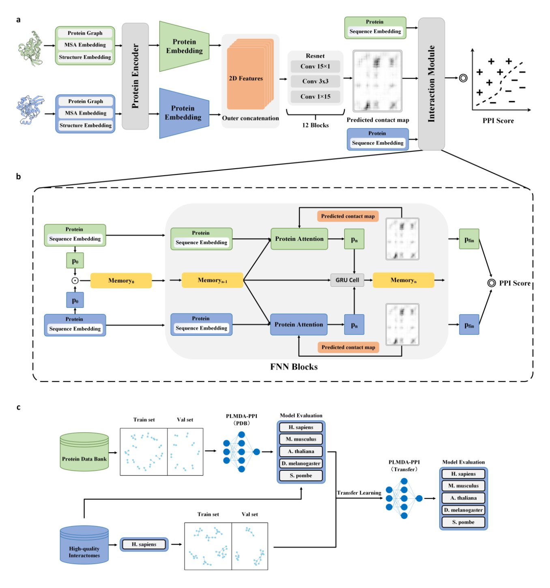
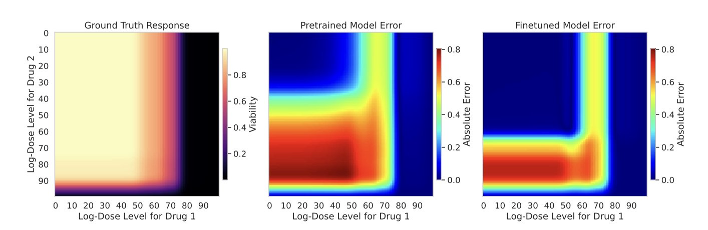
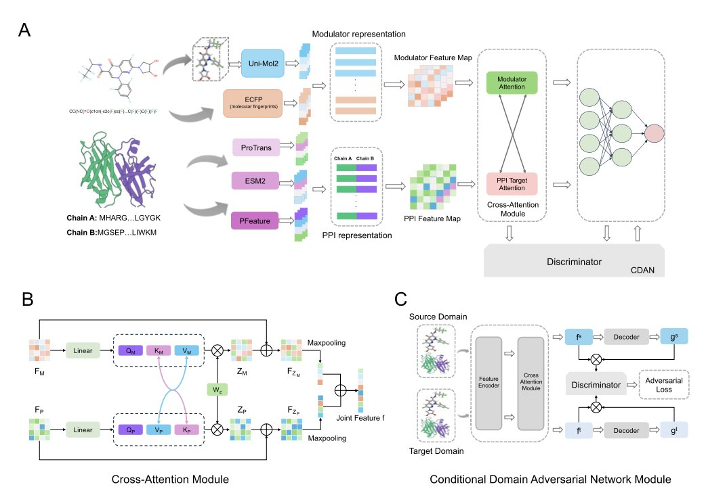
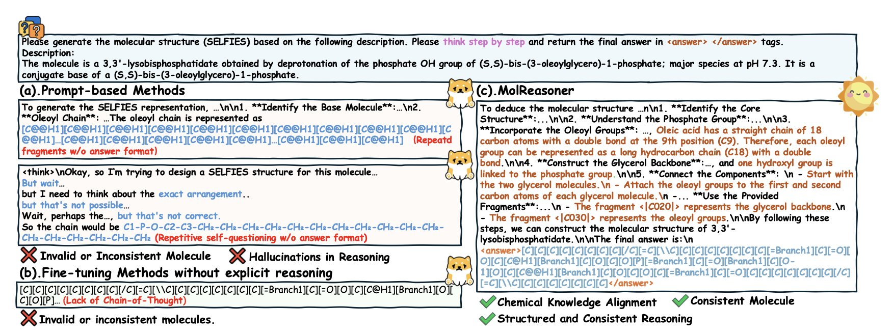
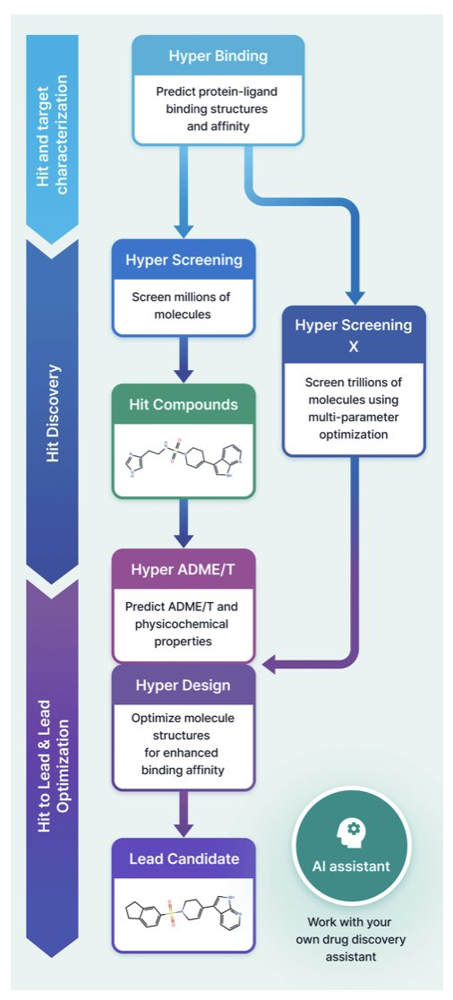

## 目录  
1. 这款新的 AI 模型 PLMDA-PPI 之所以强大，在于它不再满足于简单判断蛋白质是否相互作用，而是深入到物理层面，预测它们结合的具体「触点」，这让它在面对全新蛋白质时表现得异常稳健。
2. 研究者利用预训练深度学习模型，智能挑选初始药物组合与剂量，解决了「无先验数据」时个性化药物筛选的「冷启动」难题。
3. AlphaPPIMI 框架通过融合多模态预训练模型和对抗性网络，提升了 PPI 调节剂预测的准确性和泛化性，为靶向蛋白质界面的药物发现提供了新工具。
4. MolReasoner 用「先上课、再辅导」的两步法，强迫 AI 停止死记硬背，开始像化学家一样思考，这让它的答案不仅更准，而且第一次有了「为什么」。
5. HyperLab 试图将复杂的计算流程打包成一个网页工具，让药物化学家也能轻松上手，其核心优势在于速度与精度的平衡。

## 1. AI 预测 PPI：不只猜「Yes/No」，更看清「握手」细节  
  
  

在计算生物学这个领域，我们早就对各种预测模型见怪不怪了。它们中的大多数，说白了，就像是只会背题库的学生，在训练集和相似数据上表现优异，可一旦遇到点新东西——比如一个序列没怎么见过的蛋白质——立刻就原形毕露。蛋白质相互作用（PPI）预测尤其如此，这感觉糟透了。  
  
现在，一篇新论文里的 PLMDA-PPI 模型，看起来像是那个真正理解了物理原理的学霸。  
  
这个模型最地方，在于它解决问题的方式。研究者没有再走「暴力拟合」的老路，而是设计了一套「机制感知」的框架。什么意思？它不光要回答「这两个蛋白会不会结合？」（一个 Yes/No 的问题），还必须同时指出「它们是通过哪些具体的氨基酸残基‘握手’的？」。  
  
这就好比，你不仅要猜两个人是不是朋友，还得描述出他们上次见面的场景细节。如果你能准确说出细节，那你猜对的概率就大大提升了。这种双重任务迫使模型去理解蛋白质相互作用的物理化学本质，而不是仅仅记住某些序列片段好像总是一起出现。  
  
为了实现这一点，研究者用了一个很扎实的办法：拿 PDB 数据库里那些经过实验验证、有清晰三维结构的蛋白质复合物来训练模型。这可是金标准的数据。通过这种方式，模型学到的不仅仅是抽象的序列关系，更是实打实的几何和物理接触。  
  
结果呢？简直是降维打击。在那些专门设计的、用来考验模型泛化能力的「严苛」测试集上（也就是用序列相似度极低的蛋白），老牌的 SOTA 模型们纷纷败下阵来，而 PLMDA-PPI 依然坚挺，准确率和鲁棒性都高出一大截。这充分说明，它真的学到了更底层的规律。  
  
对于做药的人来说，它的价值可太大了。PPI 是公认的「难成药靶点」富矿，很多疾病都和蛋白间的异常「勾结」有关。但它们的结合界面通常又大又平，小分子很难下手。一个能精准预测出结合「热点」残基的工具，就等于给药物设计者递上了一张高精度的藏宝图。我们就可以集中火力，去设计能够精准「楔入」这些关键触点的分子，无论是小分子、多肽还是 PROTAC。  
  
所以，PLMDA-PPI 不只是又一个 PPI 预测器。它提供了一种更建模思路——教 AI 像结构生物学家一样思考。这种范式，未来完全可以推广到 RNA、DNA 等其他生物大分子的相互作用预测上。这才是真正让人兴奋的地方。  
  
📜**Title**: Mechanism-Aware Protein-Protein Interaction Prediction via Contact-Guided Dual Attention on Protein Language Models  
📜**Paper**: https://www.biorxiv.org/content/10.1101/2025.07.04.663157v2  
💻**Code**: https://github.com/ChengfeiYan/PLMDA-PPI  

## 2. AI 指导个性化药物联用，解决「冷启动」难题  
  
  

在个性化肿瘤治疗中，我们常常面临一个棘手的问题：面对一个新病人，我们手上有几百种抗癌药，到底该先测试哪几种药物的组合？这就像让你在没有地图的情况下，走进一座陌生的城市寻找宝藏。你无法把每条街道都走一遍，时间和资源都不允许。这就是药物筛选中的「冷启动」（Cold-Start）问题。  
  
这篇论文的作者们想解决的就是这个「导航」问题。他们训练了一个深度学习模型，这个模型可以看作是一张提前绘制好的「药物 - 疗效地图」。  
  
首先，研究者用海量的历史数据来训练这个模型。这些数据包含了各种药物组合在不同剂量下对肿瘤细胞的杀伤效果。模型通过学习这些数据，为每一种药物组合生成了一个独特的数学表达，也就是「嵌入」（Embedding）。你可以把这个嵌入理解成地图上的一个坐标。作用机制相似的药物组合，它们的坐标在地图上就会彼此靠近。  
  
有了这张地图，当新病人出现时，我们就可以开始规划「探索路线」了。我们不可能测试地图上的每一个点，所以需要选出最有代表性的几个。研究者用了一种叫做 K-medoids 的聚类算法。这个算法能自动在地图上找出几个核心区域，并从每个区域中挑选一个最具代表性的点。这就像旅游规划，我们不会去城市的每个角落，而是选择几个能代表城市风貌的景点，比如商业区、老城区和艺术区。这样做可以保证我们最初测试的药物组合足够多样，覆盖了不同的作用机制，大大降低了「押错宝」的风险。  
  
选好了药物组合，接下来是决定测试哪些剂量。传统的做法可能是测试一个很宽的剂量范围，但这同样非常耗费资源。这个模型还能派上用场。它不仅能预测一个组合是否有效，还能预测出完整的剂量 - 反应曲线。  
  
熟悉药物研发的人都知道，这条曲线上并非所有点的信息价值都一样。通常，曲线斜率变化最大的地方，也就是 IC50 值附近，包含的信息最多。模型通过分析预测出的曲线形状，给每个剂量点打出一个「重要性分数」。分数越高的点，说明它在确定药物效力时越关键。这样，我们就可以把有限的实验资源集中在这些「高价值」的剂量点上，用最少的实验次数，获取关于药物敏感性的最多信息。  
  
为了验证这个策略是否有效，研究者进行了回顾性模拟。他们利用现有的大型药物筛选数据库，假装对里面的样本一无所知，然后用他们的方法来选择初始实验。结果显示，与随机选择等基线方法相比，这种新策略能更快、更准地找到有效的药物组合。  
  
对于个性化药物开发来说，这是一个很实用的进步。它意味着在临床研究的早期阶段，我们能更高效地为患者筛选潜在的联合用药方案，更快地做出决策。  
  
📜Paper: <https://arxiv.org/abs/2509.07850v1>  

## 3. AI 预测 PPI 抑制剂：AlphaPPIMI 深度解读新范式  
  
  

在药物研发领域，靶向蛋白质 - 蛋白质相互作用（Protein-Protein Interactions, PPIs）一直是个硬骨头。这些相互作用界面通常又大又平，不像传统的酶活性口袋那样清晰明确，所以想找到能精准「卡位」的小分子异常困难。每当有新的计算工具声称能在这方面取得突破，我们都会竖起耳朵听。  
  
最近，Liu 和他的团队发表了一篇关于 AlphaPPIMI 的工作，这正是我们关注的那种进展。他们构建了一个新的深度学习框架，目标很明确：更准、更可靠地预测哪些小分子能够调节 PPI。  
  
这个模型最巧妙的地方在于它的核心——一个特制的跨注意力（cross-attention）模块。传统的模型往往是分开看小分子和蛋白质，然后再把信息简单拼在一起。AlphaPPIMI 的工作方式不一样。你可以把它想象成一个精通「化学」和「生物」两种语言的翻译。它先把小分子的三维结构信息（来自 Uni-Mol2 模型）和蛋白质序列信息（来自 ESM2 和 ProTrans 模型）这些「母语」资料准备好。然后，跨注意力模块就开始工作，它让小分子的特征和蛋白质界面的特征相互「对话」，动态地分析一个小分子的某个基团是如何影响蛋白界面上某个氨基酸的，反之亦然。这样一来，模型就不再是孤立地看问题，而是建立了一个深度的、与上下文相关的相互作用模型。  
  
做计算辅助药物发现（CADD）的人都知道，模型泛化性是个大问题。一个模型在训练集上跑得再好，如果换个新的、没见过的靶点家族就失灵，那它的实用价值就大打折扣。研究者们用了一个叫作条件域对抗网络（Conditional Domain Adversarial Networks, CDAN）的技术来应对这个挑战。这个方法很有意思。它在主模型旁边加了一个「捣蛋鬼」网络。主模型的任务是预测分子与靶点的相互作用，而「捣蛋鬼」的任务是猜这个相互作用数据来自哪个蛋白家族。主模型的目标就变成了，既要做好预测，又要想办法「欺骗」那个捣蛋鬼，让它猜不出来。如果能成功骗过它，就说明主模型学到的特征是普适的结合规律，而不是某个特定蛋白家族的「土规矩」。这大大增强了模型在真实世界中面对新靶点时的可靠性。  
  
当然，光有理论还不够，得看实战效果。作者们在自己构建的基准数据集上进行了大量测试，AlphaPPIMI 的表现优于现有方法。更关键的是，他们做了案例分析。比如，他们用这个模型去筛选 Hsp90-Cdc37 复合物的抑制剂，这是一个公认有价值但不好下手的 PPI 靶点。模型成功地找出了一些有潜力的候选化合物。他们还将此方法应用于 gp120/CD4 相互作用，这与 HIV 药物的开发直接相关。这些例子说明，AlphaPPIMI 不仅仅是个学术模型，它有潜力在虚拟筛选中帮助我们从数百万个分子中优先挑选出最值得合成和测试的那些，这能实实在在地节省时间和研发成本。  
  
📜Title: Alphappimi: a comprehensive deep learning framework for predicting PPI-modulator interactions  
📜Paper: https://doi.org/10.1186/s13321-025-01077-2  

## 4. AI 不再背答案：MolReasoner 教它化学推理  
  
  

我们现在拥有的大语言模型，就像一个记忆力超群但缺乏理解力的学生。你问它一个分子的性质，它能从浩如烟海的记忆库里给你调出一个八九不离十的答案。但你问它「为什么」，或者让它基于化学原理去设计一个新分子，它就常常暴露出自己只是个「背答案」的机器，而不是一个会「解题」的化学家。  
  
MolReasoner 采取的策略非常像我们培养一个优秀学生的过程：先上课，再做题，最后请个好家教。  
  
**第一阶段：上大课 (Mol-SFT) **  
这一步的目标，是让 AI 先学会「解题格式」和基本的「化学语法」。研究者们没有直接把乱七八糟的真实数据扔给模型，而是让 GPT-4o 这样的「博士生」，先去生成一大批带有「思考链」（Chain-of-Thought）的解题过程。比如，在描述一个分子时，它会先说「这个分子含有一个给电子的甲氧基和一个吸电子的硝基……」，然后再给出结论。  
  
但他们没有完全相信这个「博士生」。他们还请了「化学专家」（可能是人工，也可能是其他验证工具）来批改这些作业，确保每一个推理步骤都是化学上靠谱的。这样，他们就得到了一本高质量的、充满了正确解题范例的「教科书」。用这本教科书去对模型进行监督微调（SFT），AI 就先学会了说「人话」，或者说，化学家的「行话」。  
  
**第二阶段：一对一辅导 (Mol-RL) **  
学会了解题格式还不够，还得做得又快又好。于是，第二阶段的强化学习（RL）就上场了。这就像一个严格的家教，盯着 AI 做题。它用的「奖励函数」非常精妙，不只是看最终答案对不对，还会检查 AI 的每一步推理。如果 AI 的推理过程逻辑清晰、符合化学原理，就给高分奖励；如果它开始胡说八道，哪怕最后蒙对了答案，也得不到奖励。  
  
通过这种「过程和结果并重」的辅导，AI 被迫去学习真正的化学逻辑，而不是投机取巧。  
  
MolReasoner 在分子描述（给一个分子写一段化学描述）和基于文本的分子生成（根据一段描述画出分子）这两个任务上，都取得了碾压性的优势。它生成的描述更准确，设计的分子也更合理、更有效。  

📜Title: MolReasoner: Toward Effective and Interpretable Reasoning for Molecular LLM  
📜Paper: https://arxiv.org/abs/2508.02066v1  
💻Code: https://github.com/545487677/MolReasoner  

## 5. HyperLab 评测：AI 制药平台，准度直逼 AF3  
  
  

市面上从不缺 AI 药物发现平台，几乎每周都有新的工具冒出来。那么，HITS 团队开发的这个 HyperLab 有什么特别之处？它的定位很明确：做一个简单易用的网页版工具，把从苗头化合物筛选到先导化合物优化的全流程整合起来。目标用户就是一线研发人员，尤其是那些不精通计算化学的药物化学家和生物学家。  
  
我们先看它的核心功能——Hyper Binding。这个模块用来预测小分子和蛋白靶点的结合模式。这是所有结构驱动药物设计 (Structure-Based Drug Design, SBDD) 的起点，预测得准不准，直接决定了后续优化的方向对不对。研究者用 PoseBuster v2 这个公开基准集对它做了测试，结果显示准确率达到了 77%。  
  
这是一个很有意思的数字。传统的分子对接软件，比如 Glide 或 GOLD，在这个数据集上的表现通常在 60-70% 之间。而目前最顶尖的模型之一 AlphaFold3，准确率是 84%。HyperLab 的 77% 恰好卡在中间，比传统方法好，离顶级模型差距不大。但它的优势在于速度。对于药物化学家来说，这意味着你可以在一个上午测试几十个新设计的分子结构，而不是把一个分子扔给计算组然后等上一天。用一点精度换取巨大的速度提升，在早期探索阶段，这笔交易很划算。  
  
平台的另一个亮点是 Hyper Screening X。它提供了一个包含 11 万亿（11 trillion）个分子的虚拟库。这个数字是什么概念？传统的实体化合物库，比如 Enamine REAL Space，规模在百亿级别，已经非常庞大了。11 万亿意味着化学空间被极大地拓展了。这不只是一个静态的库，它利用了生成式 AI，可以在这个巨大的化学空间里进行优化，帮你找到全新的、有活性的分子骨架。这对于寻找「first-in-class」药物来说，吸引力很大。  
  
HyperLab 还把分子设计 (Hyper Design) 和成药性预测 (Hyper ADME/T) 都整合了进来。这就形成了一个闭环。你可以先用 Hyper Screening 找到一个苗头化合物，然后用 Hyper Binding 分析它和靶点的相互作用，接着在 Hyper Design 里修改它的化学结构，改完之后立刻用 Hyper ADME/T 预测一下溶解度、代谢稳定性等性质。整个流程在一个网页里就能完成，不用在好几个软件之间来回切换。  
  
当然，只说不练假把式。研究者展示了一个内部案例，他们利用 HyperLab 平台从头开始，最终得到了纳摩尔（nanomolar）级别的活性化合物，并且这些化合物的活性都得到了实验验证。虽然这是内部数据，需要持保留态度，但它至少证明了这套流程在实践中是走得通的。  
  
最后，平台还内置了一个 AI 助手。它可以帮你搜索数据库、画图分析，或者在你不知道某个功能怎么用的时候提供指导。这进一步降低了使用门槛。  
  
总的来看，HyperLab 的思路不是追求单一指标的极致，而是在精度、速度和易用性之间找到了一个不错的平衡点。它想做的，是把计算辅助药物发现这个原本属于少数专家的「屠龙技」，变成每个药物研发人员都能随手使用的工具。  
  
📜Title: Accelerating Drug Discovery with HyperLab: An Easy-to-Use AI-Driven Platform  
📜Paper: <https://www.biorxiv.org/content/10.1101/2025.08.31.672525v1>
