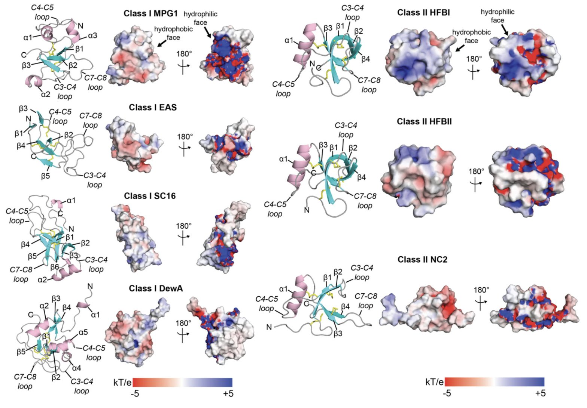
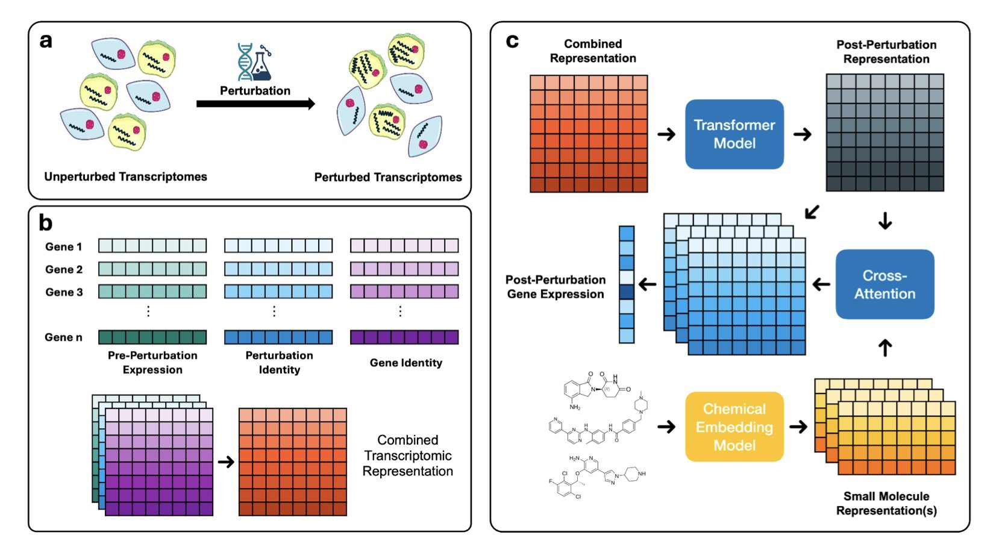
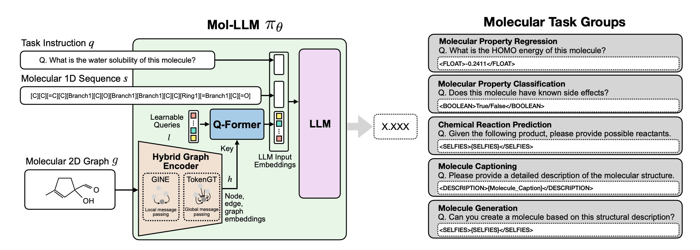

## 目录  
1. AlphaFold 绘制了数千种疏水蛋白的结构图谱，揭示了新特征和进化分支，但预测其动态自组装行为仍是关键挑战。
2. OmniPert 将基因编辑和药物筛选这两个原本独立的世界，在单细胞分辨率的虚拟实验台上强行融合，为我们提供了一个前所未有的上帝视角来审视细胞应答。
3. ADGSyn 凭借创新的双流注意力 GNN 和 AMP 训练，实现了抗癌药物协同效应预测的性能新高和效率飞跃。

## 1. AlphaFold 揭秘真菌疏水蛋白：结构蓝图与挑战  
  
  

真菌疏水蛋白（Hydrophobins）是一类很有意思的小蛋白。你可以把它想象成自然界的「特氟龙」，它能让蘑菇在雨后「出淤泥而不染」。这些蛋白的核心能力是在水 - 空气或水 - 固体界面上自组装成一层稳定的疏水膜。这使得它们在生物材料、涂层甚至药物递送领域都有巨大的应用潜力。但问题是，它们的序列多样性极高，结构研究起来一直很棘手。  
  
现在，AlphaFold 来了。我们都知道它在预测蛋白单体结构上的威力。这篇新研究就是想看看，用 AlphaFold 这把「锤子」去砸疏水蛋白这颗「钉子」，效果怎么样。  
  
首先，研究者们做了一个基准测试，看看 AlphaFold 的预测靠不靠谱。结果不出所料：对于疏水蛋白中那个保守的 β-桶核心结构，AlphaFold 的预测非常准。这个核心就像房子的承重墙，决定了蛋白的基本形态。  
  
但有意思的地方在于那些柔性的、功能性的环区（loops）。在这些区域，AlphaFold 的预测置信度（pLDDT 分数）明显下降。这并不是说 AlphaFold 失败了，恰恰相反，它准确地告诉我们：「嘿，这部分结构不稳定，可能是柔性的。」对于做研发的人来说，这是个关键信息。这些柔性区域往往是蛋白发挥功能的「工作端」，比如与其他分子相互作用或者感受环境变化。知道哪里稳定、哪里柔性，是设计新功能蛋白的第一步。  
  
这项工作最精彩的部分，是他们一口气分析了超过 7000 个疏水蛋白序列。这不再是看一两个蛋白的「单兵作战」，而是绘制了整个家族的「结构地图」。通过这种大规模建模，他们把这些蛋白清晰地分成了六个不同的进化分支（clades），并构建了详细的进化树。这就像从基因组学角度为这个蛋白家族重新修了一遍「家谱」，让我们能看清不同分支在结构上的细微差异，进而推测它们的功能分化。  
  
在这个过程中，他们还发现了一些「非主流」的疏水蛋白。比如，有些蛋白的 N-端拖着一条长长的「尾巴」，有的则多出了一对二硫键（总共五对），甚至还有多个疏水蛋白结构域串联在一起的「多聚疏水蛋白」（polyhydrophobins）。每一个「非主流」特征都可能对应着一种特殊的功能。多一对二硫键，蛋白的稳定性可能会天差地别；那条长尾巴，可能像个「抓手」，负责与其他蛋白结合。这些发现为我们理解疏水蛋白的多样性和改造它们提供了全新的思路。  
  
当然，AlphaFold 也不是万能的。研究者们坦诚，当涉及到疏水蛋白最核心的功能——自组装和膜结合时，目前的模型就有点力不从心了。AlphaFold 设计出来是预测单体结构的，它并不知道这些单体要如何在界面上像铺地砖一样排列起来。这是目前计算结构生物学面临的共同挑战：从单个零件的蓝图，推测出整个机器如何运转。  
  
未来的方向很明确，需要将 AlphaFold 的静态结构预测与能够模拟动态过程的工具（比如分子动力学模拟）结合起来，或者融入更多的实验数据，才能真正揭开疏水蛋白自组装的秘密。  
  
📜Title: AlphaFold modeling uncovers global structural features of class I and class II fungal hydrophobins  
📜Paper: https://onlinelibrary.wiley.com/doi/10.1002/pro.7027  

## 2. OmniPert：一个模型搞定基因和药物扰动预测  
  
  

做药的都知道，我们的日常就是在跟复杂性搏斗。我们往细胞里扔进一个小分子，或者敲掉一个基因，然后屏住呼吸，看看会发生什么。这过程又慢又贵，而且很多时候，我们看到的只是一个平均效应。这就好比听交响乐却只能站在音乐厅门外，你能听到大概的旋律，但里面到底是哪个小提琴手拉错了音，你根本无从知晓。  
  
单细胞测序技术让我们终于能走进音乐厅，听到每个乐手的演奏。但问题又来了，一场一场地听（做实验）还是太费劲。而且，我们一直以来都像是分裂的工匠，搞基因编辑的和搞化学筛选的，用的是两套不同的预测模型，各说各话。  
  
现在，OmniPert 来了。研究者们干了一件相当野心勃勃的事：他们用一个基于 Transformer 的大家伙，把基因扰动和化学扰动这两件事给统一了。你可以把它想象成一个精通生物学和化学「双语」的翻译家。它被喂了海量的单细胞数据，学会了细胞在被不同方式「折腾」后的反应模式。  
  
这玩法就完全不一样了。它不再是简单的「输入 A，预测 B」。它更像一个生物学的「飞行模拟器」。你可以问它一些以前只能靠昂贵的湿实验来回答的疯狂问题：「如果我把这个癌细胞里的明星致癌基因 KRAS 敲掉，同时用我手头这个新化合物处理它，细胞会作何反应？而且，不是一整个群体的反应，是某个特定的、具有耐药潜力的亚群细胞会怎么样？」在过去，要回答这个问题，需要的人力、物力和时间，足以让任何一个项目负责人头皮发麻。现在，你可以在电脑上先跑个模拟。  
  
更绝的是它的「反事实推断」能力。这就像你给 GPS 输入目的地，它能帮你规划出最佳路线。你可以对 OmniPert 说：「我希望这群癌细胞的转录组状态变得更像正常细胞。」它会反向计算，然后告诉你：「行，那你试试敲低这个基因，再配上那个小分子。」这就让它从一个被动的预测者，变成了一个主动的策略师，一个潜在的药物设计「军师」。它能启发我们去寻找毒性更低、作用更精准的疗法。  
  
当然，我们得保持清醒。任何模型的能力都取决于它「吃」下去的数据质量和广度。它对没见过的新药、新靶点、新细胞系的泛化能力如何？这才是检验它到底是「神器」还是「玩具」的试金石。模型给出的任何诱人假设，最终还是要回到实验台，用移液枪和培养皿来验证。  
  
所以，OmniPert 不会让做实验的失业。恰恰相反，它可能会让我们变得空前高效。它就像一个能力超强的侦察兵，能帮我们在药物研发这片广袤而危险的无人区里，标出最值得探索的几个方向。在资源和时间都极其宝贵的制药界，这本身就是巨大的价值。  
  
📜Title: OmniPert: A Deep Learning Foundation Model for Predicting Responses to Genetic and Chemical Perturbations in Single Cancer Cells  
📜Paper: https://www.biorxiv.org/content/10.1101/2025.07.02.662744v1  
💻Code: https://github.com/LincolnSteinLab/OmniPert  

## 3. ADGSyn 登场！药物协同预测提速 3 倍，更准更高效  
  
  

抗癌药物联用是提高疗效、克服耐药性的重要策略。但是，如何快速准确地筛选出具有协同效应的药物组合，一直是块难啃的骨头。现在，一个名为 ADGSyn 的新模型来了，它用双流注意力图神经网络 (GNN) 框架，不仅预测性能顶尖，训练时间还大大缩短。  
  
ADGSyn 的核心武器是它的双流注意力机制。这个设计能明确地分别对「药物 - 药物」和「药物 - 细胞系」这两种关键相互作用进行建模，比那些一股脑处理的模型（比如 DTSyn 和 AttenSyn）预测结果更稳健，也更符合生物学直觉。更有意思的是，研究者设计了共享的投影矩阵。这就像给不同的药物分子特征安上了一个「翻译器」，让它们在统一的特征空间里对齐。这样一来，模型就能更好地认出不同药物中化学结构相似的部分，大大增强了模型的泛化能力和可解释性——能更清楚地知道模型为什么这么判断。  
  
为了让模型训练又快又省，ADGSyn 还集成了自动混合精度（AMP）技术。结果相当给力：显存占用直接砍掉 40%，训练速度飙升 3 倍，而且性能一点没掉。这意味着，就算用普通的消费级 GPU 也能跑大规模的预测任务了。在数据输入上，ADGSyn 也不走寻常路。它不只看化学描述符，而是直接处理完整的分子图（从 SMILES 字符串转换而来），同时还把来自 CCLE 数据库的基因表达谱信息也整合进来。这样，结构信息和基因组背景就都能兼顾到了。  
  
模型内部，一个双注意力池化模块通过 tanh 激活的交叉注意力机制，动态地给节点间的相互作用赋予权重。之后再跟上一个后置残差的 LayerNorm，确保梯度能稳定传播，训练过程更平滑。  
  
是骡子是马，拉出来遛遛。在经典的 O'Neil 基准数据集（包含 13243 个药物 - 细胞系组合）上，ADGSyn 在所有主要评估指标上都秀翻全场，把八个基线模型甩在身后：AUROC 达到 0.92，AUPR 0.91，准确率 (ACC) 0.86，科恩 Kappa 系数 (Cohen’s Kappa) 0.72——这个 Kappa 值尤其说明了它与专家判断的一致性非常高。研究者还做了消融实验，把共享投影矩阵或者双流注意力去掉试试看。结果呢？性能明显下降。这恰恰证明了模型的每个组件都不是吃素的，都为整体的强大贡献了力量。  
  
跟 MR-GNN、DTSyn、DeepSynergy 这些前辈比起来，ADGSyn 在准确率上不相上下甚至更好，但计算开销小得多。别人跑一轮（epoch）要 12 到 15 秒，ADGSyn 不到 4 秒就搞定了。从模型架构来看，ADGSyn 巧妙地组合了 GAT 层（负责局部和全局的图信息聚合）、LSTM 层（用于序列结构建模）和 MLP（进行最终的协同效应预测），可以说是为处理复杂多样的生物数据量身定制的。  
  
虽然 ADGSyn 在效率和性能上已经很能打了，但研究团队还有更大的目标。他们计划未来把生物网络层面的信息（比如蛋白质相互作用网络或代谢网络）也整合进来，进一步提升模型的可解释性，并扩大其应用范围。ADGSyn 为高效、可解释的药物协同效应预测树立了一个新标杆，对于那些研究资源有限或者临床环境中需要快速决策的场景，它尤其有用武之地。  
  
💻Code: <https://github.com/Echo-Nie/ADGSyn.git>  
📜Paper: <https://arxiv.org/abs/2505.19144>
