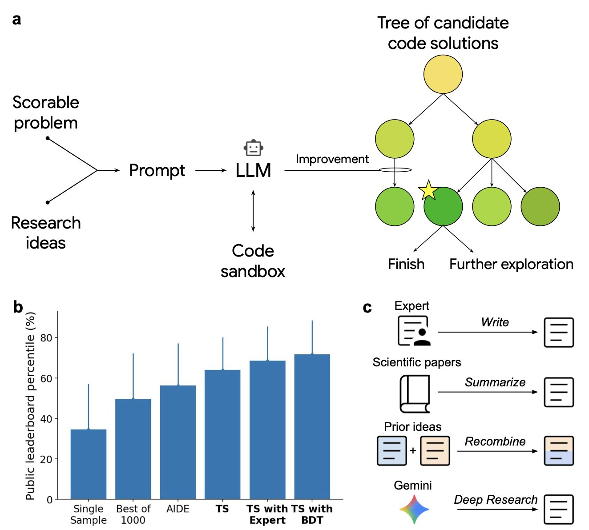
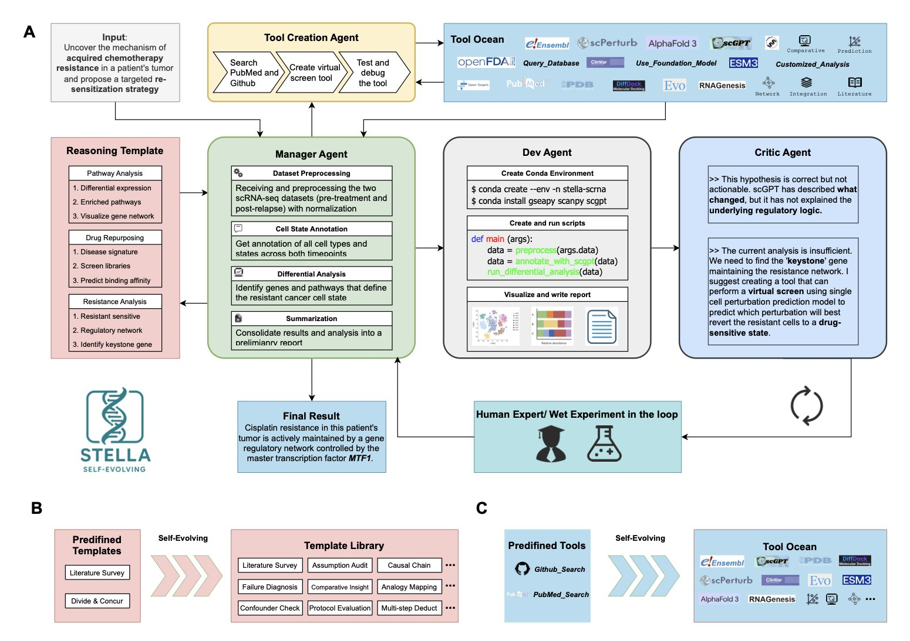
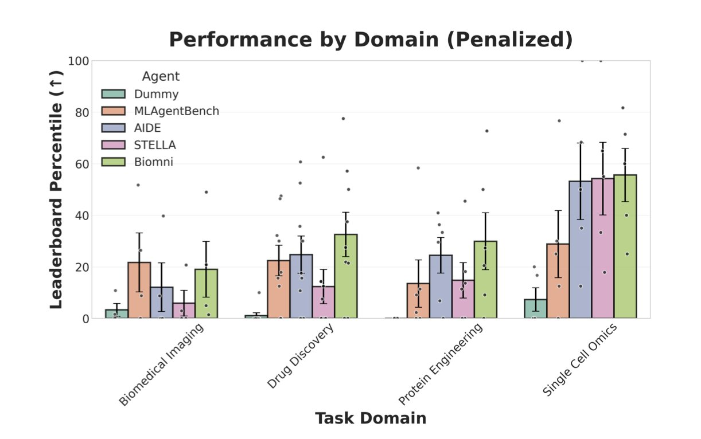

## 目录  
1. 研究者开发了一个结合大语言模型和树搜索的 AI 系统，它能像专家一样编写和优化代码，系统性地发现超越人类水平的科学计算方法。
2. 这不是又一个问答机器人，STELLA 是一个能像科研团队一样自主进化、甚至能按需「发明」新工具的 AI 智能体。
3. BioML-bench 这个新基准表明，AI 代理在生物医药领域的表现，核心瓶颈不在于模型本身，而在于底层的工程实现和框架支持。

## 1. AI 自动编程，系统性超越人类专家  
  
  

在科研领域，我们经常花费大量时间编写和调试代码来处理数据。这个过程充满了反复试错，尤其是在开发新的分析方法时，我们常常依赖直觉和经验来组合不同的算法模块。这篇新论文展示了一种 AI 系统，它想把这件事变成一个系统化的、可自动执行的工程问题。  
  
这个系统的工作原理其实很直观，它由两个核心部件组成：一个大语言模型（LLM）和一个树搜索（TS）算法。  
  
可以把大语言模型想象成一个知识渊博但缺乏条理的初级研究员。你给它一个目标，比如「为单细胞数据找到一个更好的批次校正方法」，它就会从海量的文献和代码库中汲取灵感，提出一堆可能的代码片段或改进思路。  
  
而树搜索算法则扮演着严谨的资深科学家角色。它接管大语言模型产出的所有想法，将它们组织成一个巨大的「决策树」。然后，它开始有条不紊地探索这棵树的每一个分支，把想法 A 和想法 B 组合起来测试一下性能，再用想法 A 和想法 C 组合起来测试一下。每一步都用一个明确的量化指标来评估结果好坏。  
  
这种「生成 + 搜索」的模式，让 AI 不再是简单地写代码，而是在一个广阔的「解空间」里进行系统性探索。它能发现那些人类研究员因为思维定式或精力有限而容易错过的、非直观的解决方案组合。  
  
我们来看看它在几个硬核领域的实战表现。  
  
在单细胞数据分析中，构建一个高效的分析流程是出了名的麻烦。研究者们发现，这个 AI 系统竟然自主发现了 40 种全新的分析方法，在公开的排行榜上击败了所有由人类专家提交的方法。比如，它通过将两种已知的批次校正方法巧妙地结合，创造出了一种效果更好的混合策略。一个人或许也能想到，但这个 AI 能穷尽各种可能的组合方式，然后告诉你哪种最好。  
  
在流行病学领域，它同样表现出色。美国疾控中心 (CDC) 预测新冠住院人数时，采用的是一种集合模型 (ensemble model)，也就是综合多个独立模型的预测结果来提高准确性。这个 AI 系统独立生成了 14 种新的预测模型，每一种的性能都超过了 CDC 的整个集合模型。这说明它在处理时间序列预测这类经典问题上，找到了更优的信号组合与权重分配方式。  
  
一个让我觉得很有意思的应用是在斑马鱼神经科学研究中。系统不仅在预测神经活动方面超越了现有所有方法，还轻松地将一个复杂的生物物理模拟器整合进了它的解决方案。在实际研发中，让代码去调用一个非标准的、领域特有的工具通常很棘手。这个 AI 却能做到无缝衔接，就像一个助手，你告诉他要用某个特定的精密仪器，他就能自己摸索出用法并把它融入整个实验流程。  
  
这个工具的意义，不是为了替代科学家，而是把我们从繁琐的代码优化和方法探索中解放出来。它就像一个精力无限、不知疲倦的博士后，可以 24 小时不停地测试上千种参数组合，并且「读」过这个领域的所有相关论文。  
  
它把经验性的方法开发，变成了一个可以被机器大规模执行的搜索任务。对于药物研发这样需要从海量复杂数据中寻找规律的领域，这种加速意味着我们可以更快地验证假设、迭代想法。  
  
📜Paper: https://arxiv.org/abs/2509.06503  

## 2. STELLA: 会自己造工具的自进化 AI 科研智能体  
  
  

老实说，每当看到又一个「突破性」的生物医学 AI 模型时，我的第一反应总是先保留几分怀疑。我们见过太多雷声大雨点小的东西了。但这次的 STELLA，有点不一样，它似乎真的摸到了一些门道。  
  
市面上多数 AI Agent，说白了，就像一个装备了固定瑞士军刀的实习生。它们能用现成的工具，比如调取 PubMed 数据或者跑个 AlphaFold。可一旦遇到工具箱里没有的趁手家伙，基本就歇菜了。STE-LLA 不一样，它不仅有个工具箱，它自己就是个工具匠。  
  
这套系统的精髓在于其内部的「组织架构」。研究者设计了一个四智能体协同的闭环系统，这听起来就像一个微缩版的研发小组：  
1.  **管理者 (Manager) ** ：像个项目负责人（PI），负责把一个复杂的生物学问题拆解成一个个可以执行的小任务。  
2.  **开发者 (Developer) ** ：就是那个干活的研究生或博后，拿到任务后就去写代码、调用工具库来解决问题。  
3.  **批判者 (Critic) ** ：这角色太真实了，简直就是实验室里那个总爱挑刺、但也让你不得不服的同行。它会严格审查开发者的方案和结果，提出改进意见，确保方向没跑偏。  
4.  **工具创造者 (Tool Creator) ** ：这是点睛之笔。当现有工具无法解决问题时，这位「大神」能当场写一个新的脚本或工具出来，然后把它扔进一个叫「工具海洋 (Tool Ocean)」的共享库里，以后大家都能用。  
  
这种「边打仗边造枪」的能力才是它最可怕的地方。在化疗耐药性的案例研究中，STELLA 不只是分析了一通基因表达数据。它发现需要一个特定的虚拟筛选工具来验证某个假设，于是，它就自己动手「造」了一个，并用它成功揪出了耐药性的关键驱动因子——转录因子 MTF1。对于做药的人来说，这意味着什么不言而喻。从「想到」到「做到」，中间构建新工具的鸿沟，它自己填上了。  
  
更让人印象深刻的是，这东西真的会「成长」。在基准测试里，它反复刷题，分数能从 14% 提高到 26%。这不是简单的记忆，而是通过不断试错，优化了它的「解题思路模板库 (Template Library)」，下次遇到类似问题时，它会干得更漂亮。  
  
所以，STELLA 给我的感觉，已经不是一个单纯的工具了。它更像一个初级的、但学习能力极强的科研助理。它不再是被动地回答问题，而是开始主动地学习如何更好地解决问题，甚至创造解决问题的方法。我们离真正的「AI 科学家」或许还有很长的路，但 STELLA 无疑让我们看到了一个更清晰、更具操作性的方向。  
  
📜Paper: <https://arxiv.org/abs/2507.02004v1>  

## 3. AI 制药代理不行？新基准 BioML-bench 揭示工程短板  
  
  

最近我们总能看到各种关于 AI 代理（AI Agents）要如何颠覆科学研究的讨论。听起来很美好，但作为一线研发人员，我们总会问一个问题：这东西在真实的、复杂的生物医药研发任务里到底跑得怎么样？做一个酷炫的演示很容易，但要让它稳定地解决一个从头到尾的真实问题，完全是另一回事。  
  
现在，终于有团队做了个「考场」来严格检验这些 AI 代理的真实水平。这个考场就是 BioML-bench。  
  
它不是那种简单的问答测试。它是给 AI 代理一个完整的项目任务，比如，「这里有一堆蛋白质序列数据，请你建立一个预测模型，评估它的性能，然后提交预测结果。」整个过程需要代理自己理解任务、解析数据、编写代码、训练模型，最后输出一个能用公开标准衡量的结果。这才是真实世界的工作流。这个基准覆盖了四个核心领域：蛋白质工程、单细胞组学、生物医学成像和药物发现。  
  
研究者拉了四个 AI 代理来考试：两个是生物医药领域的「专科生」（STELLA, Biomni），另外两个是「通才生」（AIDE, MLAgentBench）。  
  
结果有点让人清醒。总体来看，这些代理的表现都不如人类科学家设定的基线水平。更出乎意料的是，「专科生」并没有表现出压倒性优势。这说明，仅仅给代理灌输生物医药领域的知识，似乎并不能保证它就能把活干好。  
  
那谁表现得更好，又是为什么？  
  
通用代理 AIDE 在一个蛋白质工程任务中拿到了高分。它的制胜法宝不是什么神秘的生物学直觉，而是扎实的机器学习工程能力。它没有简单地把蛋白质序列当成一串字母扔进模型，而是做了细致的特征工程，从原始序列中计算了各种进化和生物物理学相关的数值。它还用了模型堆叠（model stacking）这类高级技巧来提升预测精度。这套操作，就是一个经验丰富的数据科学家会做的事情。  
  
反过来看，那些失败的案例也很有启发性。代理们犯的错误，大多不是因为逻辑不通或者思路错了，而是非常实际的工程问题。比如，代码写着写着就把内存耗尽了；脚本里有个 bug，但它没发现，最后默默地给出了一个错误的结果；或者程序遇到一个异常就直接崩溃了。  
  
这说明了什么？目前 AI 代理的最大短板，可能不是它的大脑（大语言模型），而是它的身体和四肢，也就是我们所说的「脚手架」（scaffolding）。这个脚手架是负责管理任务执行、处理代码错误、分配计算资源的整个支持系统。如果这个系统很脆弱，那再「大脑」也无法稳定地完成复杂任务。  
  
所以，BioML-bench 这项工作最大的价值，是把我们的注意力从对 AI 代理天花乱坠的想象，拉回到了最基础、也最重要的工程问题上。下一步，我们努力的方向或许不应该是去训练一个更懂生物学的模型，而是去打造一个更稳定、更鲁棒的执行框架。一个科学家，也需要一个设备精良、管理有序的实验室才能出成果。对于 AI 代理来说，这个「实验室」就是它的工程脚手架。  
  
好消息是，研究者们已经把 BioML-bench 做成了一个可以用 pip 直接安装的软件包，还附带了教程。这意味着任何人都可以用它来测试和改进自己的 AI 代理。这才是推动领域前进的正确方式：建立标准，公开测试，然后快速迭代。  
  
📜Paper: <https://www.biorxiv.org/content/10.1101/2025.09.01.673319v1>
