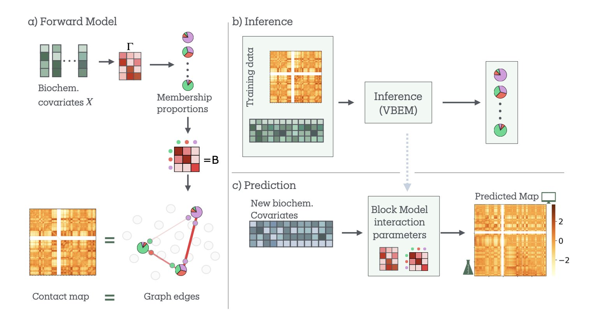
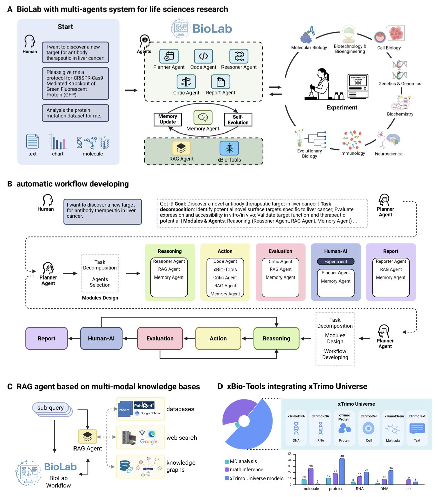
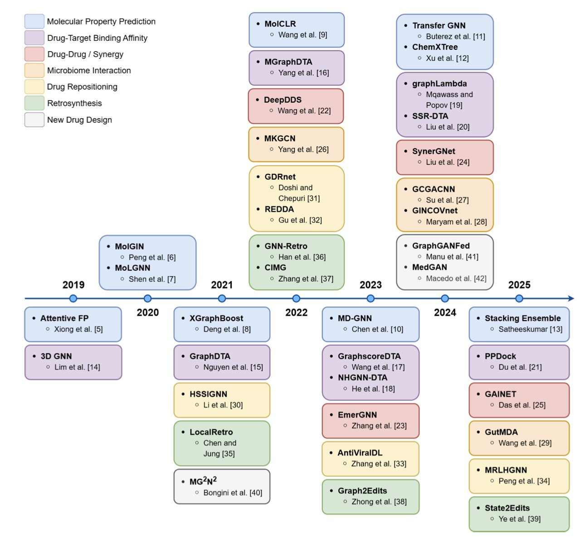

## 目录  
1. bioSBM 模型将表观遗传数据融入随机区组模型，为预测染色质三维结构并理解其生化调控机制提供了新工具。
2. BioLab 通过整合多个专用基础模型和智能体，首次实现了从靶点发现到湿实验验证的端到端、全自主抗体设计，并成功优化了帕博利珠单抗。
3. 图神经网络（GNN）正全面渗透从靶点发现到分子设计的药物研发各环节，但要真正落地，还需解决数据、模型和可解释性三大挑战。

## 1. bioSBM：用图模型连接表观遗传与 3D 基因组  
  
  

做基因组三维结构研究的人，手里常有两套地图。一套是 Hi-C 数据，它告诉你基因组的「路网结构」，也就是哪些 DNA 片段在空间上靠得近。另一套是表观遗传数据，比如 ChIP-seq，它告诉你每条路上的「建筑类型」，比如哪里是活跃的启动子（商业区），哪里是沉默的异染色质（工业区）。我们一直都想知道，这两套地图之间到底有什么关系？为什么路网会这样连接不同的功能区？  
  
现在，有研究者开发了一个叫 bioSBM 的新模型，试图回答这个问题。  
  
这个模型的核心是`随机区组模型 (Stochastic Block Model, SBM)`。SBM 是网络科学里的一个经典工具，它的工作原理很简单：把网络里的节点（这里是基因组区域）根据它们的连接模式进行分组。比如，A 组的节点内部连接很紧密，但和 B 组的连接就很少。在基因组里，这就能帮我们找到像`拓扑关联结构域 (Topologically Associating Domain, TAD)` 这样的社群。  
  
bioSBM 的巧妙之处在于，它不只看「谁和谁连接」这个路网信息。它还把第二套地图，也就是生化特征（比如组蛋白修饰），作为协变量加了进来。模型在判断两个基因组区域是否应该互动时，不仅考虑它们过去的互动频率，还会考虑它们的「身份」——它们是活跃的增强子，还是被抑制的区域？这就好比一个城市规划师，不仅看交通流量，还考虑地块的功能属性来规划路网。  
  
模型还有一个关键特性，叫「混合成员」 (mixed memberships)。传统的分类方法很死板，一个基因组区域要么是 A 区（活跃），要么是 B 区（沉默）。但生物学现实复杂得多。一个基因可能在某些条件下活跃，在另一些条件下则保持沉默。bioSBM 允许一个基因组区域同时属于多个社群，比如 70% 的属性像「活跃转录区」，30% 的属性像「多梳蛋白抑制区」。这更接近真实情况。  
  
为了验证模型，研究者把它用在了大家都很熟悉的 GM12878 细胞系上。结果很好。模型不仅识别出了传统的 A/B 区室，还发现了 7 个更精细的生物学社群，这些社群的功能注释（比如与 CTCF 结合位点、增强子等的关系）都非常清晰。这就像是从一张黑白地图升级到了一张彩色的功能分区图。  
  
最厉害的是它的预测能力。研究者用一部分染色体的数据训练模型，然后让它去预测一个它从未见过的染色体的 Hi-C 互作图谱，结果相当准确。他们还做了个更具挑战性的实验：用一个细胞系的数据去预测另一个完全不同的细胞系（HCT116），并且这个细胞系里的一个关键结构蛋白 RAD21 还被敲低了。即便如此，bioSBM 依然表现稳健。  
  
这说明 bioSBM 不只是在「拟合」数据，它确确实实学到了一些连接表观遗传和三维结构的底层规则。理解这些规则对于药物研发意义重大。如果我们能准确预测某个表观遗传修饰的改变会如何影响三维结构，进而如何影响一个癌基因的表达，那我们就能更精准地设计靶向表观遗传的药物。这个模型为我们提供了一个强大的、可解释的计算工具，让我们朝这个方向迈出了一步。  
  
📜Paper: https://arxiv.org/abs/2409.14425v2  

## 2. BioLab：AI 智能体系统实现端到端药物研发  
  
  

AI 设计的抗体，在实验中表现比默沙东的 Keytruda® (帕博利珠单抗) 还要好。  
  
这听起来很科幻，但来自 BioLab 团队刚刚发布的预印本，把这件事变成了现实。作为一名研发科学家，我看到这种能将计算设计与湿实验验证完美闭环的工作，总是会格外兴奋。  
  
这背后不是一个简单的大语言模型（Large Language Model, LLM）。BioLab 的架构更像一个高效的研究小组。系统里有八个各司其职的 AI 智能体（Agent）。比如，有一个「PI」角色的规划智能体（Planner）负责制定整体研究计划；有像「博士后」一样的推理智能体（Reasoner）来执行具体任务；甚至还有一个「审稿人」角色的批判智能体（Critic）来评估和修正结果。它们通过一个记忆智能体（Memory Agent）来共享信息、迭代优化，整个过程井井有条。  
  
这些智能体的「大脑」也不是通用的。它们基于一个名为 xTrimo Universe 的模型库，这个库包含了 104 个专为生命科学领域训练的基础模型（Foundation Models），涵盖了蛋白质、RNA、DNA、细胞等多个层面。这就好比你不会让一个历史学家去解蛋白质结构，每个任务都由最合适的「专家模型」来完成。这种专业化让 BioLab 在 PubMedQA 这类生物医学推理任务上，表现超过了 GPT-4 等通用模型。  
  
当然，跑分是次要的，真正的考验是解决实际问题。  
  
研究者给 BioLab 布置了一个硬骨头的任务：从头设计一款靶向巨噬细胞的抗体。BioLab 自主完成了从文献中挖掘靶点，到多目标抗体优化的整个计算流程。通过分子动力学模拟，系统不仅找到了亲和力更好的变体，还揭示了亲和力增强背后的结构机制——这是做药的人非常看重的。  
  
最关键的一步是闭环验证。计算设计得再好，也要回到实验台上来验证。他们将优化后的抗体（Pem-MOO-1, Pem-MOO-2）表达纯化，进行了活性测试。结果显示，新设计的抗体与 PD-1 结合的 IC50 值达到了 0.01–0.016 nM，优于亲本帕博利珠单抗的 0.027 nM。  
  
数据不会说谎，这意味着 AI 设计的分子在生物活性上确实超越了已经成药的重磅炸弹。功能实验也证实，新抗体不仅结合得更紧，在阻断信号通路、多参数性能上也表现更佳。  
  
BioLab 的工作展示了一种 AI 原生的科研范式。它告诉我们，将多个「专家」AI 组合起来，让它们自主地提出假设、设计实验、分析结果，并最终通过湿实验来验证，这条路是走得通的。这不再是单纯的计算模拟，而是真正意义上的端到端科学发现。  
  
📜Paper: <https://www.biorxiv.org/content/10.1101/2025.09.03.674085v1>  

## 3. GNN 药物发现全景图：进展、模型与挑战一览  
  
  

做药的都知道，分子本身就是一种图（Graph）。原子是节点（node），化学键是边（edge）。过去，我们总要把这种立体的结构信息压缩成一维的 SMILES 字符串，这个过程不可避免地会丢失信息。图神经网络 (Graph Neural Networks, GNNs) 的出现改变了游戏规则。它不需要这种压缩，可以直接在分子图上进行学习和推理，这让它成了药物发现领域一个无法忽视的工具。  
  
Katherine Berry 和 Liang Cheng 的这篇综述，很好地梳理了 GNN 在我们这个领域的应用现状。  
  
**GNN 首先在分子属性预测上证明了自己**  
  
这是 GNN 最早取得成功的领域，也相对容易理解。比如预测分子的 ADMET（吸收、分布、代谢、排泄、毒性）性质。模型通过学习大量已知分子，试图找出结构与性质之间的关联。早期的模型比较简单，后来的 Attentive FP、MolGIN 等模型则更进一步。它们引入了注意力机制（attention mechanism），让模型能自己判断分子中哪个官能团对特定的性质（比如毒性）影响最大。这有点像一个经验丰富的化学家，扫一眼分子结构就能抓住要害。  
  
**预测药物 - 靶点结合亲和力是真正的硬骨头**  
  
预测一个分子能否与蛋白靶点结合，以及结合的强度，这是药物发现的核心。这件事的难度在于，你不仅要考虑药物分子的结构，还要考虑蛋白结合口袋的三维结构。这就像要判断一把钥匙（药物）能不能打开一把锁（靶点），你得同时看清钥匙和锁的形状。GraphDTA、MGraphDTA 这类模型开始尝试融合这两种信息。它们分别对药物和靶点蛋白进行图编码，然后学习它们之间的相互作用。这类研究的目标，就是让计算机在海量分子库中，比高通量筛选更快、更准地找到那个「天选之子」。  
  
**药物组合与协同作用预测**  
  
在肿瘤等复杂疾病的治疗中，单一药物往往不够，联合用药才是常态。但两种药放在一起，效果是 1+1>2（协同）还是 1+1<2（拮抗）？这很难预测。DeepDDS、SynerGNet 等模型利用 GNN 来分析复杂的生物网络（比如基因调控网络或蛋白质相互作用网络）。它们试图从系统层面理解药物如何影响细胞，从而预测药物组合的效果。这对于开发新的联合疗法至关重要。  
  
**GNN 的应用远不止于此**  
  
这篇综述还提到了 GNN 在其他方向的应用。比如，预测药物与肠道微生物的相互作用，这对于理解个体化用药很有帮助。还有药物重定位（drug repositioning），也就是老药新用，GNN 可以通过分析药物和疾病的关联网络来寻找新的可能性。甚至在逆合成分析（retrosynthesis）上，GNN 也能派上用场，帮助化学家设计更优的合成路线。  
  
**挑战依然严峻**  
  
尽管 GNN 看起来前景光明，但我们一线研发人员都清楚，从论文到实际应用还有很长的路。  
  
第一个就是数据问题。「Garbage in, garbage out.」这句老话在 AI 领域尤其正确。很多公开的生物活性数据集充满了噪声，而且数据量也并不总是足够。我们需要更多高质量、多样化的实验数据来喂养这些模型，否则训练出来的模型可能只是「看起来很美」，一到真实世界的化学空间就失灵了。  
  
第二个是模型本身。GNN 的架构五花八门，到底哪一种最适合特定的化学或生物问题，并没有定论。这导致大量的「炼丹」，也就是不断调整模型参数和结构，缺乏系统性的指导。  
  
最后一个，也是最关键的，是可解释性（interpretability）。模型告诉你这个分子活性很好，为什么？是哪个子结构起到了关键作用？如果模型不能回答这个问题，它对药物化学家来说就是一个黑箱。我们无法从中学到知识，也无法基于它的判断去理性地设计下一个更好的分子。我们做的是科学，不是算命。如果不能打开这个黑箱，AI 就永远只是一个辅助筛选的工具，无法真正指导创新。  
  
这篇综述为我们描绘了一幅清晰的 GNN 药物发现地图。GNN 已经从一个学术概念，变成了药物研发工具箱里一个越来越重要的工具。下一步要做的很明确：积累更好的数据，设计更智能的模型，以及想办法让模型「开口说话」。  
  
📜Title: A Survey of Graph Neural Networks for Drug Discovery: Recent Developments and Challenges  
📜Paper: https://arxiv.org/abs/2509.07887
