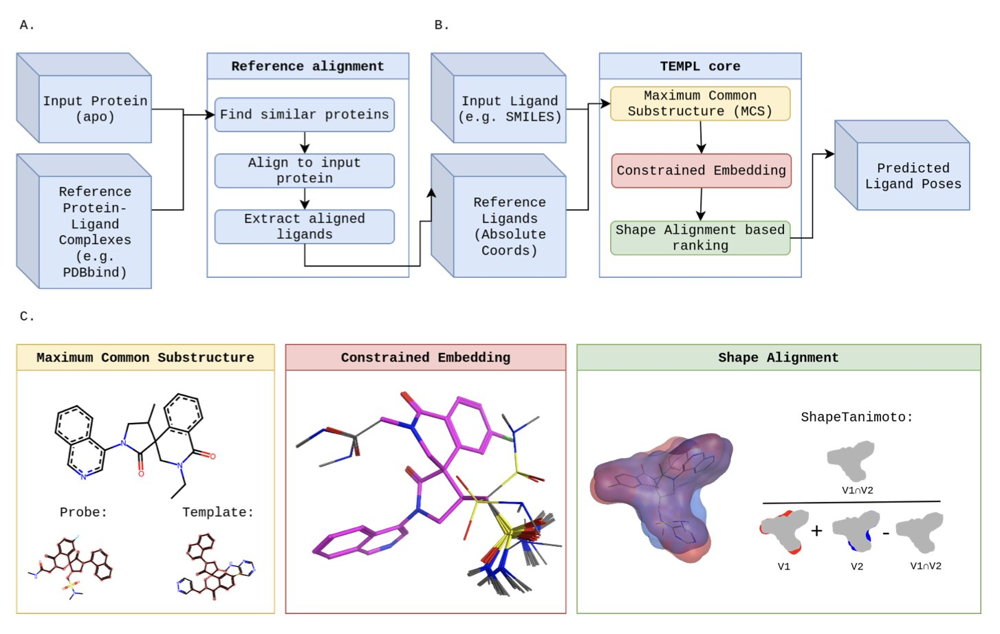
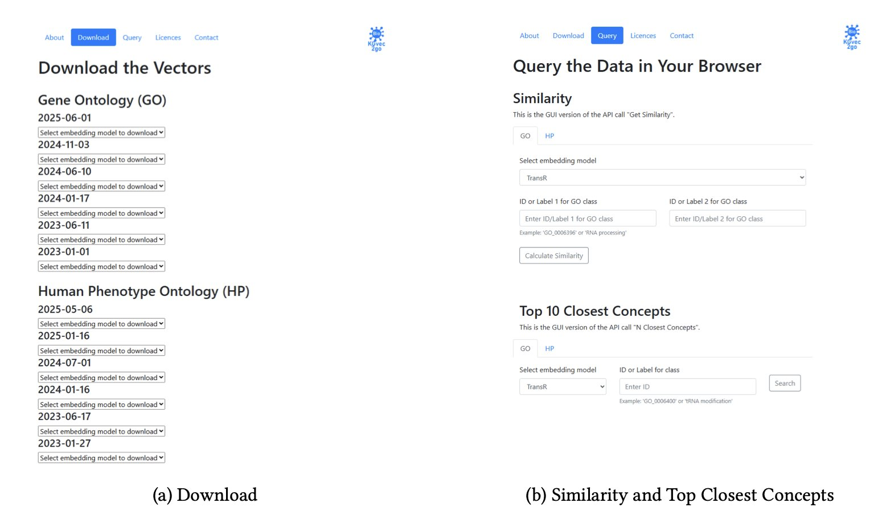
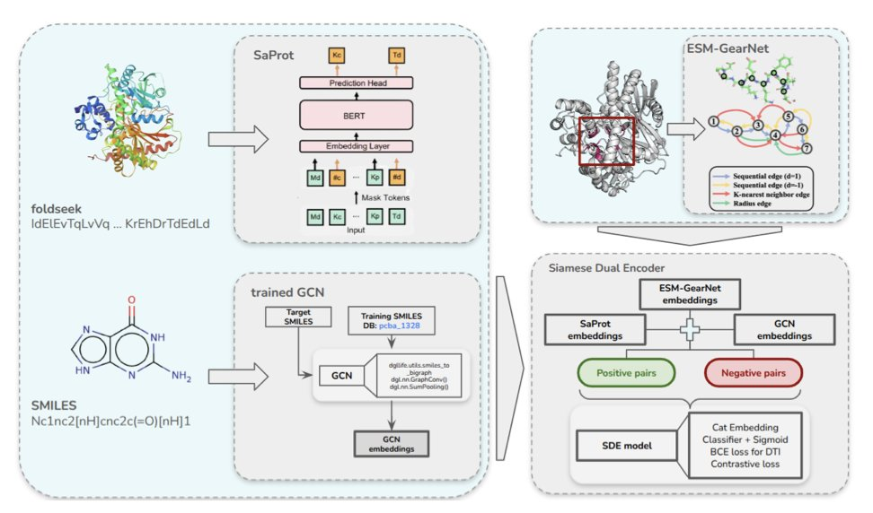
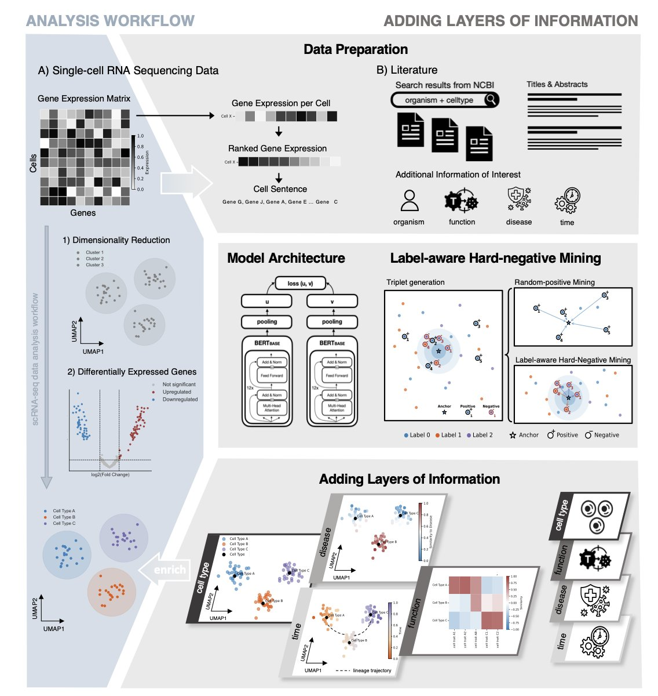
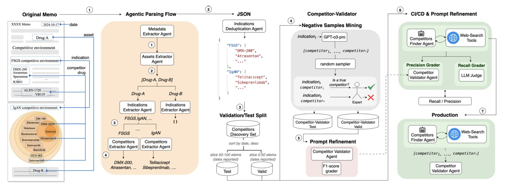

## 目录  
1. TEMPL 是一个巧妙的「作弊」基准，它揭示了许多 AI 对接模型可能只是在记忆，而非真正理解化学，为整个领域设立了新的、更诚实的评估标准。
2. Bio-KGvec2go 提供了一个即开即用的 Web 服务，自动生成并提供最新的生物医学知识图谱嵌入，让研究者告别了自行维护和更新这些复杂模型的烦恼。
3. 这不是又一个换汤不换药的 AI 模型；通过强制模型聚焦于真正的结合口袋，Tensor-DTI 给药物 - 靶点预测注入了一剂急需的现实感和稳健性。
4. 这项研究把单细胞数据变成了 AI 能「阅读」的句子，再让 AI 去海量文献中寻找匹配的段落，成功地为冰冷的基因表达数字，赋予了丰富的生物学意义。
5. 一个由 AI「发现者」和 AI「法官」组成的智能体团队，将药物资产的竞争格局分析，从一项耗时数日的手工劳动，变成了一项只需几小时的自动化流程。

## 1. TEMPL：AI 分子对接的「照妖镜」  
  
  

在计算药物化学这个领域，我们正被各种各样的、新的 AI 分子对接模型所淹没。每一篇论文都声称自己的模型更快、更准，能以前所未有的精度预测药物分子是如何与靶点蛋白「握手」的。但我们心里总有一个挥之不去的疑问：这些 AI，到底是真的学会了物理化学，还是只是成了背诵 PDB 数据库的「最强大脑」？  
  
这篇新论文，就给我们提供了一面极其有用的「照妖镜」。  
  
#### AI 学会了「抄作业」  
  
这个新方法叫做 TEMPL。它的工作原理，可以说简单得有点「无耻」。它没有试图去学习什么复杂的物理学或化学规则。它干的事，更像是我们上学时班里那个成绩中等的学生，他有一套自己的生存法则：抄作业。  
  
它是这么工作的：  
  
当你给 TEMPL 一个新分子，让它预测结合姿势时，它会先去一个巨大的参考数据库里，找一个和你的分子长得最像的、已经有晶体结构的「学霸」分子。  
  
然后，它会找出这两个分子共同的化学骨架，把这个共同的部分，像用钉子一样，死死地钉在「学霸」分子原来的位置上。  
  
最后，它再把你的分子上那些多出来的、不一样的部分，随便在周围找个舒服的位置安放好。  
  
你看，这整个过程，没有能量计算，没有物理学，只有一件事：**模仿**。  
  
#### 结果怎么样？  
  
好了，现在最有趣的部分来了。这个只会抄作业的学生，考试成绩怎么样？  
  
在一张相对简单的「考卷」（PDBBind 基准测试）上，它的正确率达到了 22.1%。这个分数，不算高，但已经和一些传统的对接软件打了个平手，甚至超过了某些深度学习模型。  
  
这就像是你发现，那个只会抄作业的学生，期末考试竟然及格了。这说明什么？这很可能说明，这张考卷出得太简单了，里面有很多题，都和练习册上的原题一模一样。  
  
而在另一张更难的、专门为了防止作弊而设计的「新高考」考卷（PoseBusters 基准测试）上，TEMPL 就原形毕露了，正确率暴跌到了 8.9%。  
  
这还没完。研究者们发现，即便是在那 22.1% 的「正确答案」里，有三分之二的姿势，在物理上是根本不可能存在的——原子之间挤得太近，都要撞到一起了。  
  
#### 这面镜子照出了什么？  
  
所以，TEMPL 是一个好用的工具吗？显然不是。  
  
但它是一个**极其重要**的工具。  
  
它为我们整个领域，设立了一个新的、有点残酷的、但绝对必要的「智商下限」。从今往后，任何一个新的 AI 对接模型，在吹嘘自己的性能之前，都必须先回答一个问题：「你考得过那个只会抄作业的 TEMPL 吗？」  
  
如果你的模型，连这个简单的、基于模板的「抄袭」方法都打不过，那你有什么理由让我们相信，你的模型是真的学到了什么深刻的物理化学原理，而不是用一种更复杂的方式，在背诵训练集呢？  
  
TEMPL，就是那面能照出 AI 模型到底是「真学霸」还是「伪学霸」的照妖镜。  
  
📜Title: TEMPL: A Template-Based Protein-Ligand Pose Prediction Baseline  
📜Paper: https://doi.org/10.26434/chemrxiv-2025-0v7b1  
💻Code: https://github.com/CZ-OPENSCREEN/TEMPL  

## 2. Bio-KGvec2go：让知识图谱嵌入永不过时，即取即用  
  
  

在生物信息学领域，知识图谱 (Knowledge Graph) 就像是描绘复杂生物学世界的一张高清地图。它把基因、蛋白质、疾病、表型这些零散的点，用它们之间的关系连接起来，形成一个巨大的网络。而知识图谱嵌入 (Knowledge Graph Embedding, KGE)，就是用数学的方式，把地图上的每一个「地点」（比如一个基因）转换成一个向量坐标。有了这些坐标，机器就能理解它们之间的远近亲疏，从而进行预测和推理。  
  
这听起来很棒，但有一个棘手的问题：生物学知识这张地图，几乎每天都在更新。新的基因功能被发现，新的疾病关联被报道。如果你用一年前的地图来导航，很可能会错过新修的地铁线，甚至走错路。同样，使用基于旧版基因本体论 (Gene Ontology, GO) 训练的 KGE，你的机器学习模型性能也会大打折扣。  
  
对于很多实验室来说，要跟上这种更新速度，代价太高了。持续不断地下载新数据、重新训练那些复杂的嵌入模型，不仅耗费大量计算资源，还非常繁琐。  
  
Bio-KGvec2go 这个平台就是来解决这个痛点的。你可以把它想象成一个「知识图谱嵌入的中央厨房」。  
  
它的工作原理很简单：  
1.  **自动监控** ：它像一个哨兵，定期去检查 GO、人类表型本体论 (Human Phenotype Ontology, HPO) 这些重要的生物学知识库有没有发布新版本。  
2.  **智能更新** ：它会计算新旧版本的校验和 (checksum)，确认内容确实发生了变化，才会启动下一步。这避免了不必要的重复劳动。  
3.  **批量生产** ：一旦确认更新，它就会自动运行一整套不同的 KGE 模型，比如 TransE、DistMult、HolE 等。研究者们很清楚，没有哪个模型是万能的。提供一个模型「工具箱」，让用户可以根据自己的研究任务（比如是预测层级关系还是关联关系）选择最合适的工具，这是一个非常内行的设计。  
  
最终，这个平台为研究者提供了三个直接了当的功能：  
  
这个工具最大的价值在于「普惠化」。它让那些没有强大计算集群的小型研究团队，也能站在同一起跑线上，用上最新、最前沿的数据表示方法。当数据和工具的壁垒被打破时，我们才更有可能在蛋白质功能预测、基因 - 疾病关联分析等领域看到更多突破。  
  
作者还计划在未来加入更多的知识图谱和嵌入模型，并优化用户体验，比如加入概念名称的自动补全和拼写纠错。这些改进会让这个本已十分有用的工具变得更加强大。  
  
📜Title: Bio-KGvec2go: Serving up-to-date Dynamic Biomedical Knowledge Graph Embeddings  
📜Paper: https://arxiv.org/abs/2509.07905  

## 3. AI 药物发现：Tensor-DTI 这次搞对了口袋  
  
  

老实说，每周我们都能看到号称要「颠覆」药物发现的 AI 新模型。但大部分嘛……只能说在论文里比在实验室里看起来更美妙。很多模型的问题在于，它们预测一个药物是否与靶点结合时，就像是想通过打量一整栋大楼来找到正确的钥匙孔，信息太多，反而抓不住重点。  
  
但这次的 Tensor-DTI，看起来有点不一样。  
  
它抓住了问题的牛鼻子：**结合口袋（binding pocket）**。药物并不是和整个蛋白质贴在一起，它只在那个小小的、形状和化学性质都刚刚好的口袋里发生作用。之前的模型要么只看蛋白质序列（像读天书），要么看整个三维结构（像看一团毛线），而 Tensor-DTI 把口袋信息作为了一个独立的、重要的输入。这就好比给侦探提供了犯罪现场的精确地图，而不是让他对着整个城市瞎转悠。  
  
它是怎么做到的？研究者用了一个叫「孪生双编码器」（Siamese Dual Encoder）的架构。听起来很花哨，但你可以把它想象成一个鉴定专家。你同时给它两个东西：一个是你确定能结合的「药物 - 靶点」对，另一个是精心构造的、看起来很像但其实不能结合的「假货」。通过对比学习（contrastive learning），模型的任务就是反复练习「找不同」，直到它能敏锐地捕捉到决定结合与否的那些微妙的化学和空间特征。  
  
这种训练方式的好处是，模型被迫学习底层的物理化学规律，而不是去记一些表面的、容易误导的模式。  
  
结果呢？它在好几个标准数据集（比如 BIOSNAP 和 BindingDB）上都把现有模型甩在了后面。但这还不是让我兴奋的。最关键的是，它在所谓的「低泄漏」数据集（比如 PLINDER）上也表现出色。这些数据集经过特殊处理，专门防止模型通过「记住」训练集里见过的药物或靶点来作弊。在这上面能成功，才说明它有了点预测「未来」的真本事。  
  
更有意思的是，这套方法不只是个「小分子专家」。作者展示了它同样适用于预测肽链 - 蛋白、甚至蛋白-RNA 的相互作用。在今天的药物研发领域，这极大地扩展了它的应用场景。从 ADC 到 RNA 疗法，到处都需要这种更通用的预测工具。  
  
当然，从一个漂亮的计算模型到一个能真正指导合成、带来新药的工具，路还很长。但 Tensor-DTI 至少走在了一条非常正确的路上——它让 AI 更懂化学家和生物学家是怎么思考药物作用的。它不再是一个黑箱，而是给了我们一个更具解释性的视角，告诉我们相互作用可能「为什么」会发生。这，才是一线研发人员真正想从 AI 那里得到的东西。  
  
📜Paper: <https://openreview.net/forum?id=jLLqGCee3R>  

## 4. AI 读论文，让单细胞数据开口说话  
  
  

任何一个处理过单细胞 RNA 测序（scRNA-seq）数据的人，都体会过那种既兴奋又沮丧的感觉。你面前是一张巨大的、五颜六色的热图，成千上万个细胞被整齐地分成了不同的簇。这很酷，但接下来呢？A 簇细胞和 B 簇细胞到底有什么区别？它们在组织里扮演什么角色？它们跟我们研究的疾病有什么关系？这些问题，单靠那张热图是回答不了的。我们手里拿着一本内容丰富的天书，却不认识上面的字。  
  
这篇新论文，就试图为我们提供一本「罗塞塔石碑」，来解读这本天书。  
  
#### 把细胞变成句子  
  
作者们的想法很巧妙。他们没有去构建一个更复杂的、试图直接从基因表达值中「悟道」的黑箱模型。他们换了个思路：我们能不能把细胞的语言，翻译成我们已经有大量文本语料库的语言——也就是人类的科学文献？  
  
他们是这么做的：  
  
第一步，他们把每个细胞变成一个独特的「句子」。这个句子的构成，就是这个细胞里表达量最高的那些基因，按照从高到低的顺序排列。同时，他们还会加上一些元数据，比如这个细胞来自什么组织、处于什么发育阶段。  
  
第二步，他们训练了一对「双胞胎」AI 模型。你可以把它想象成两个学生，坐在一起学习。一个学生（模型 A）专门负责阅读由无数细胞转换而来的「细胞句子」。另一个学生（模型 B）则负责阅读海量的 PubMed 论文摘要。  
  
训练的目标是，当模型 A 读到一个描述「细胞毒性 T 细胞」的细胞句子时，它在脑子里形成的「概念」，必须和模型 B 读到一篇讨论「细胞毒性 T 细胞」的论文摘要时形成的「概念」尽可能地接近。通过这种「对标学习」（对比学习），这两个模型最终学会了用同一种「语言」来思考。  
  
#### 从数据到洞见  
  
当这个系统训练好之后，神奇的事情就发生了。  
  
你给它一个新的、未知的细胞，它会把它翻译成一个「句子」，然后在那个由数百万篇论文构建的「语义地图」上，找到这个句子应该在的位置。  

这套方法，本质上是在我们原始的、单薄的单细胞数据之上，覆盖了一层厚厚的、由几十年科研文献积累而成的知识层。它没有创造新知识，但它建立了一座桥梁，连接了我们新得到的实验数据和人类已有的知识宝库。  
  
当然，它也有局限。它的能力上限，取决于现有文献的质量和广度。如果某个全新的生物学现象从未被报道过，那它自然也无从关联。  
  
但作为一个假设生成引擎，它无疑是强大的。它把我们从繁琐的人工注释和文献检索中解放出来，让我们能更快地从「看到数据」，跨越到「理解数据」。  
  
📜Paper: https://www.biorxiv.org/content/10.1101/2025.08.23.671699v1  

## 5. AI 尽职调查：2.5 天工作 3 小时搞定  
  
  

任何一个在生物技术投资或制药公司业务发展部工作过的人，都清楚地知道「尽职调查」这四个字背后，是怎样一场艰苦卓绝的战斗。尤其是绘制「竞争格局图」这一环。你需要去翻阅临床试验数据库、公司报告、新闻稿、甚至社交媒体，把所有正在研发的、针对同一个适应症的药物都给找出来。  
  
这个过程，就像是在一个信息爆炸、语言混杂、而且每天都在变化的巨大城市里，进行人口普查。它慢得令人发指，而且极易出错。我们当然想过用 AI 来帮忙。但你试一下就会发现，像 Perplexity 这样的通用工具，召回率（recall）低得可怜，它会漏掉很多关键的竞争对手。  
  
这篇新论文，就给我们展示了一套真正能解决这个问题的、务实的 AI 系统。  
  
#### 你需要的不是一个 AI，而是一个团队  
  
作者们的思路很清晰。他们没有试图去训练一个无所不能的「超级 AI」。他们做的事情更符合我们的工作常识：组建一个团队。  
  
这个团队里，有两个核心成员：  
  
第一个，是**「发现者」（Discoverer）智能体**。你可以把它想象成一个精力无限、不知疲倦的初级分析师。它的任务，就是利用网络搜索和多步推理，把互联网上所有和目标适应症相关的药物，都给挖出来。它的优点是「宁可错杀一千，绝不放过一个」，追求的是最高的召回率。  
  
但这样做的结果，就是它带回来的信息里，难免会混杂着一些不相关的、过时的、甚至是完全错误的东西。  
  
所以，第二个成员登场了。  
  
第二个，是**「法官」（Judge）智能体**。这是一个被专门训练来「事实核查」的 AI。你可以把它想象成那个经验丰富、眼神毒辣的高级合伙人。它的唯一任务，就是审查「发现者」交上来的那份长长的清单，然后毫不留情地把所有假阳性、所有 AI 的「幻觉」，都给剔除掉。它的目标，是最高的精确率（precision）。  
  
#### 结果怎么样？  
  
当这个「警察与法官」的组合开始工作时，奇迹就发生了。  
  
研究者们没有只在学术数据集上跑分。他们做了一件很扎实的事：他们把一家公司过去五年的、非结构化的尽职调查备忘录，变成了一个标准化的评估数据库。然后，他们用这个真实世界的「考卷」，对他们的系统进行了测试。  
  
结果是，这套系统的召回率，超过了 OpenAI 和 Perplexity 这些现有的工具。  
  
但这还不是最关键的。最关键的，是那个来自一家生物技术风投基金的真实案例研究。在这家基金的日常工作中，一个分析师完成一份竞争格局报告，平均需要 2.5 天。  
  
而用了这套 AI 系统后，时间缩短到了**3 小时**。  
  
这不是一个 10% 或 20% 的效率提升。这是一个数量级的飞跃。  
  
这项工作，不是又一个关于 AI 能做什么的、遥远的科幻故事。它是一个已经可以部署的、能解决我们日常工作中最痛的痛点之一的、真正的工程解决方案。它不会取代分析师，但它会把分析师从那些重复性的、繁琐的信息收集中解放出来，让我们能把宝贵的时间和智慧，投入到更高阶的战略思考中去。  
  
📜Title: LLM-Based Agents for Competitive Landscape Mapping in Drug Asset Due Diligence  
📜Paper: https://arxiv.org/abs/2508.16571
