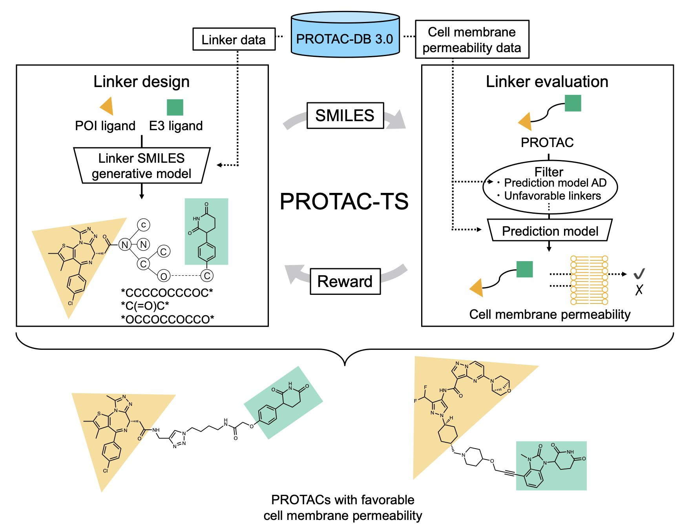
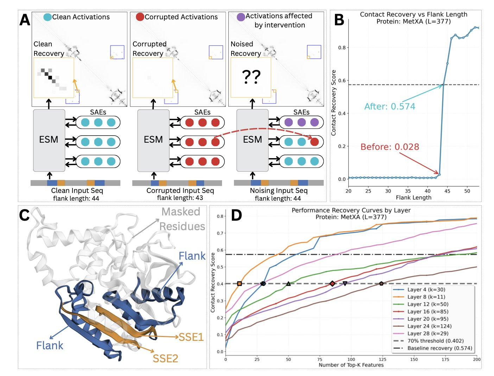
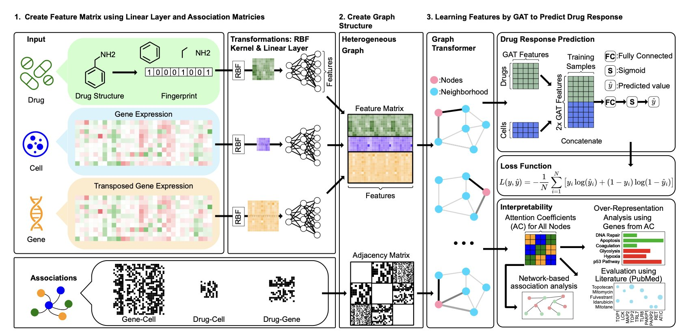

## 目录  
1. 研究者开发了一种名为 PROTAC-TS 的人工智能方法，通过强化学习来设计 PROTAC 连接子，解决了药物开发中关键的细胞膜渗透性问题。
2. 蛋白质语言模型并非不可知黑箱，其预测能力源于一个可解释的两步机制：识别局部序列基序，再激活相应的结构域。
3. drGT 模型不仅能预测药物对癌细胞的效力，还能像资深研究员一样，指出影响药效的关键基因，从而揭示 AI 的决策过程。

## 1. AI 设计 PROTAC 连接子，突破细胞膜渗透性难题  
  
  

做 PROTAC (PROteolysis TArgeting Chimera) 的都清楚，我们面临的一个核心难题就是分子太大，经常过不了细胞膜这道坎。传统的小分子药物设计遵循「类药五原则」(Lipinski's Rule of Five)，但 PROTAC 分子量动辄超过 800 Da，完全是「规则之外」(beyond Rule of Five) 的庞然大物。这就导致很多 PROTAC 在细胞实验里表现再好，到了体内也可能因为渗透性差而功亏一篑。连接子 (linker) 是调节整个分子理化性质的关键，但如何设计一个完美的连接子，很大程度上还是依赖化学家的经验和大量的试错。  
  
这篇新研究提出的 PROTAC-TS 方法，就是想用计算的方式来破解这个难题。  
  
它的工作原理分为两步。第一步，研究者们基于 PROTAC-DB 3.0 数据库，建立了一个专门预测 PROTAC 渗透性的机器学习模型。这个模型的预测表现不错，R²值达到了 0.710。在药物发现领域，对于像细胞渗透性这么复杂的生物属性，这已经是一个可靠的数字了。它意味着模型基本抓住了决定 PROTAC 渗透性的关键化学特征。  
  
第二步是整个方法的核心：用强化学习 (Reinforcement Learning) 来「生成」新的连接子。你可以把这个过程想象成训练一个 AI 玩一个「搭积木」的游戏。AI 的任务是搭建一个化学上合理、又能获得高渗透性得分的连接子。它每搭建一个片段，渗透性预测模型就会给它打分。如果得分高，AI 就获得「奖励」，然后它会倾向于重复类似的操作。经过成千上万轮的自我博弈和学习，AI 就掌握了设计高渗透性连接子的「诀窍」。  
  
这套方法靠谱吗？研究者做了关键的验证。他们让 PROTAC-TS 尝试重新设计一些已知的、渗透性很好的 PROTAC 分子，比如临床阶段分子 KT-474。结果显示，PROTAC-TS 成功生成了与这些已知分子非常相似的连接子。这就好比你开发了一个下棋 AI，如果它能复现出棋谱里的经典走法，就说明它确实学到了东西。这个结果证明了 PROTAC-TS 并非纸上谈兵，它学到的化学知识是符合现实世界规律的。  
  
这个方法目前也不是万能的。它的性能受限于训练数据集的大小，而且现在只优化了渗透性这一个指标。一个成功的 PROTAC 不仅要能进入细胞，还要能有效降解靶蛋白、溶解度要好、代谢要稳定。研究者也坦言，未来的工作需要把这些更复杂的因素整合进来。  
  
尽管如此，PROTAC-TS 依然为我们指明了一个方向。它把连接子的设计从一种「艺术创作」变成了一项可以被数据驱动的「工程任务」，让药物化学家能把精力更多地放在刀刃上，而不是在无尽的排列组合中大海捞 - 针。  
  
📜Title: Data-driven Design of PROTAC Linkers to Improve PROTAC Cell Membrane Permeability  
📜Paper: <https://doi.org/10.26434/chemrxiv-2025-24kkf>  

## 2. AI 蛋白质模型黑箱揭秘：两步看懂三维结构  
  
  

我们使用蛋白质语言模型（Protein Language Models, pLMs）预测结构多年，效果很好。但心里总有一个疑问：它到底如何工作？是理解了蛋白质折叠的物理化学原理，还是仅靠拟合数据的「大力出奇迹」？一项研究让我们得以一窥其内部的「电路图」。  
  
研究者开发了一套方法，可以精确干预模型的「思考」过程。这套方法称为「稀疏潜在空间中的因果激活补丁」（causal activation patching）。它如同对模型的神经网络进行一次精准的神经外科手术。你可以暂时「关闭」或「激活」少数关键神经元，然后观察模型预测结果的变化。通过这种方式，就能找到哪些「神经元」对最终的接触预测起了决定性作用。  
  
他们用两个蛋白质 MetXA 和 TOP2 进行分析，发现了一个清晰的两步工作流程。  
  
第一步，模型的前几层网络充当「基序探测器」（motif detectors）。它们只关注短的、局部的氨基酸序列模式，即「基序」（motif）。这些基序如同蛋白质序列上的特殊「路标」。  
  
第二步，一旦某个基序探测器被激活，它就像一个开关，「门控」（gate）或触发模型的中后层网络。这些后层网络是「结构域探测器」（domain detectors），负责识别更大范围的蛋白质结构域或家族。  
  
整个过程是：模型先在序列上找到几个关键「路标」，然后根据这些路标的组合，判断出这属于哪个已知的蛋白质家族或结构域。一旦知道了蛋白质的整体归属，预测其内部哪些氨基酸会相互接触就变得容易了。  
  
为验证这个发现，研究者还开发了两个诊断工具。一个是「基序保守性测试」（Motif Conservation Test），用以确认「基序探测器」确实在寻找生物学上保守的序列。另一个是「结构域选择性框架」（Domain Selectivity Framework），用以证明「结构域探测器」对特定的蛋白质家族有高识别特异性。结果都支持他们的假设。  
  
这是首次对蛋白质语言模型进行「电路级别」的因果分析。模型并非一个混沌的黑箱，而是演化出了一套符合生物学逻辑、且高效的内部工作机制。理解这一点，不仅能帮助我们构建更强大、更可靠的预测模型，也可能带来新的生物学洞见。  
  
📜Title: Mechanistic evidence that motif-gated domain recognition drives contact prediction in protein language models  
📜Paper: https://www.biorxiv.org/content/10.1101/2025.08.22.671739v1    
Code: https://github.com/NainaniJatinZ/plm_circuits  

## 3. drGT：AI 不仅预测药效，还能解释为什么  
  
  

药物研发涉及海量数据：一边是成千上万种化合物，另一边是数百种癌细胞系的基因表达谱和药物敏感性数据。如何关联这些信息，预测特定药物对特定癌症的疗效，始终是核心难题。许多机器学习模型能给出准确预测，但它们通常像个「黑箱」，我们只知道结果，却不明白背后的道理。  
  
drGT 模型为此提供了一种新解法。  
  
模型的核心是构建一个庞大的异构网络 (Heterogeneous Network)。这个网络如同一个复杂的社交图谱，包含三类节点：药物、基因和细胞系。它们之间的关系错综复杂：药物靶向特定基因，基因在不同细胞系中表达水平各异，药物对细胞的抑制效果也不同。drGT 将这些信息整合在一张大图中。  
  
drGT 的技术核心是图注意力网络 (Graph Transformer, GT) 架构。当药物作用于细胞时，会引发一系列连锁反应。图注意力网络如同侦探，它不会对所有线索一视同仁，而是重点「关注」 (Attention) 最关键的基因节点。  
  
这种「关注」程度通过「注意力系数」 (Attention Coefficients) 量化。高注意力系数的基因，被模型判定为对药物反应至关重要。这揭示了模型的决策依据，我们不仅获得预测结果，还得到一份「关键基因列表」，指出了可能决定药效的因素。  
  
在 GDSC 和 NCI60 等标准公开数据集上，drGT 的预测准确率 (AUROC) 最高达到 94.5%。在预测从未见过的药物或细胞系时，其 AUROC 分别达到 84.4% 和 70.6%，表现出良好的泛化能力。这种能力对探索新药和新适应症至关重要。  
  
为验证模型的可解释性，研究者将 drGT 识别出的高注意力药物 - 基因对与 PubMed 文献库进行比对。超过 63% 的关联已被文献报道，或能被其他成熟的药物 - 靶点预测模型证实。  
  
这表明 drGT 挖掘出的关联与已知的生物学知识高度吻合，增加了模型预测结果的可信度。  
  
一个仅能预测「是」或「否」的模型，在药物研发中作用有限。而 drGT 能够解释「为什么」，指出潜在的关键基因，其价值就大不相同。它能为后续实验提供方向，启发新的科学假说，例如寻找新的生物标志物 (biomarker) 或探索联合用药策略。这种连接计算预测与实验验证的工具，正是当前研究所需。  
  
📜Title: drGT: Attention-Guided Gene Assessment of Drug Response Utilizing a Drug-Cell-Gene Heterogeneous Network  
📜Paper: https://arxiv.org/abs/2405.08979v2  
💻Code: https://github.com/sciluna/drGT
