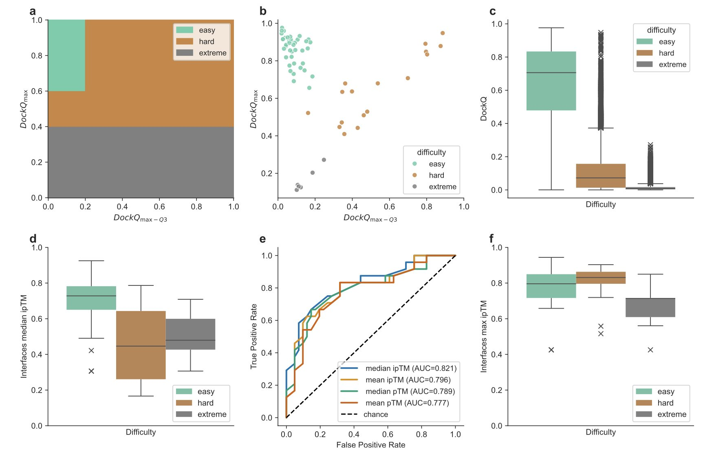
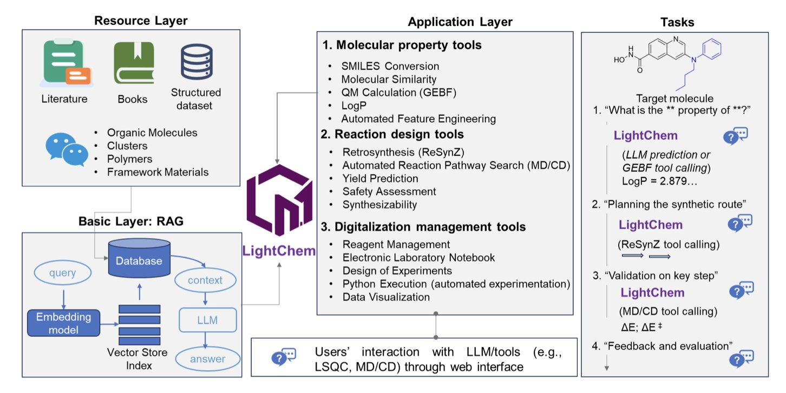
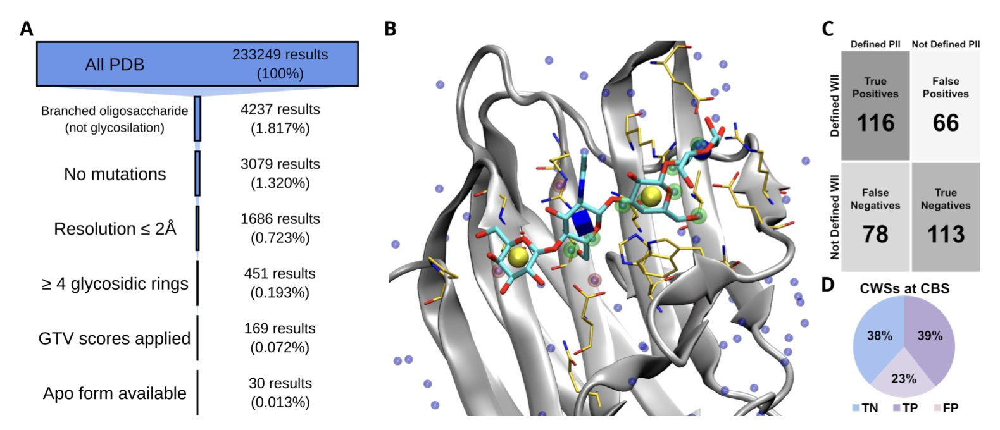

## 目录  
1. 暴力采样能提升 AlphaFold 对复杂蛋白界面的预测精度，但如何从海量模型中挑出最佳答案，仍是关键挑战。
2. LightChem 将大语言模型的推理能力与成熟的化学计算工具相结合，为化学家提供了一个轻量、精准、且专业的 AI 助手。
3. 研究者利用蛋白质结合位点的水分子结构作为「路标」，开发出一种引导式对接新方法，解决了柔性糖链分子的对接难题。

## 1. AlphaFold 大力出奇迹？暴力采样如何搞定蛋白复合物  
  
  

AlphaFold2 是一个突破性的工具，其预测单个蛋白结构的能力已很惊人。但将其用于蛋白 - 蛋白相互作用（Protein-Protein Interactions, PPIs），特别是预测两个蛋白如何结合时，它有时会出错。如同一个顶尖学生，基础题全对，但一遇到复杂的综合题，就可能给不出确切答案。  
  
标准的 AlphaFold 运行一次，通常会提供 5 个模型。如果这 5 个模型看起来都不太对，或相互之间差别很大，基本就无计可施了。对于那些结合界面复杂、柔性大的「困难」靶点，这种情况很常见。  
  
**大力真的能出奇迹**  
  
这篇文章的研究者想了一个简单直接的办法：如果 5 个模型不够，那就生成 8000 个。这就是所谓的「暴力采样」（Massive Sampling）。  
  
这个思路很直接。AlphaFold 在探索构象空间时，本身带有随机性。多跑几次，就等于给了它更多机会「撞」到正确的构象。这如同在沙滩上找一粒特定的沙子，用手抓 5 次可能找不到，但若开来一辆卡车，将整片区域的沙子都筛一遍，找到的概率就大大增加了。  
  
研究者们在 CASP16-CAPRI 竞赛上系统地测试了这个方法。他们将蛋白复合物的界面按预测难度分为「简单」、「困难」和「极端」三类。结果显示，对于「困难」级别的界面，暴力采样几乎总能生成高质量的结构模型，效果提升明显。  
  
**「偷懒」方法**  
  
为每个蛋白都生成 8000 个模型，计算成本巨大，需要动用超级计算机集群。  
  
所以，这项工作最巧妙的地方，是他们找到了一个判断「是否需要采用暴力采样」的指标。  
  
他们先用标准模式运行一遍 AlphaFold，得到几个模型，然后计算预测界面 TM 分数（interface predicted TM score, ipTM）的中位数。ipTM 分数可以理解为 AlphaFold 对自己预测的界面区域的自信程度。如果这个中位数很低，就说明 AlphaFold 自己也很「心虚」，感觉这个界面很难处理。  
  
这就是一个信号。一旦出现这个信号，就果断启动暴力采样模式。  
  
这个方法很实用。它帮助将计算资源用在刀刃上，避免了在那些本就简单的靶点上浪费算力。根据他们的数据，采用这种策略性采样，可以将预测总数从 8040 个模型减少到 2475 个，同时预测精度几乎没有损失。  
  
**新的挑战：大海捞针**  
  
暴力采样解决了一个问题，也带来了另一个问题。  
  
现在你手里有 8000 个模型，其中可能藏着最接近真实结构的「金标准」。但你怎么把它找出来？  
  
AlphaFold 自带的模型排序打分，在这种情况下不那么灵了。从 8000 个高度相似的候选中挑出最好的那一个，对现有的打分函数（Scoring function）是个巨大挑战。  
  
研究者们也坦诚，他们没有解决这个问题。但他们做了一件更有价值的事：将所有数据，包括全部模型、AlphaFold 的打分以及竞赛官方的评估结果，全部公开。  
  
这对整个领域来说是个宝贵的资源。它提供了一个绝佳的训练场和测试集，让所有从事算法开发的人，都能来尝试开发更精准的打分函数，解决这个「大海捞针」的问题。  
  
对于研发人员，这项工作提供了一个处理棘手 PPI 靶点的新思路。当你遇到一个高价值但 AlphaFold 预测不佳的复合物时，可以考虑投入计算资源进行暴力采样，这可能会带来突破。同时，它也指明了下一个技术突破点——开发出能从海量数据中精准识别最佳模型的打分算法。  
  
📜Title: MassiveFold Data for CASP16-CAPRI: A Systematic Massive Sampling Experiment  
📜Paper: https://onlinelibrary.wiley.com/doi/10.1002/prot.70040  

## 2. LightChem: 更懂化学的轻量级 AI，精准预测分子性质  
  
  

LLM 知识面广，但让它设计药物分子或规划合成路线，结果常有谬误。这如同让一个通才去做高度专精的外科手术，风险很高。化学是一门精确的学科，差之毫厘，谬以千里。  
  
LightChem 的作者采用了另一条思路。他们将 LightChem 设计成一个专业的「项目经理」，它自己不掌握所有化学细节，但知道去哪里查资料（检索增强生成），以及该调用哪位「专家」（专业工具）来解决具体问题。  
  
这个架构设计是整个工作的核心。当用户提出一个化学问题，比如预测分子的油水分配系数（PoLogP），LightChem 不会基于看过的海量文本去「创作」答案。它会启动一个专门用于此项计算的成熟模块，如 PoLogP 预测工具，然后将精确计算的结果用自然语言呈现给你。  
  
这从根本上解决了通用大模型在专业领域容易出错的问题。对于研发人员来说，可靠性是第一位的。  
  
它集成的「专家团队」包括：用于逆合成规划的 ReSynZ 模块，以及用于高精度计算的 CIM 和 GEBF 等量子化学软件包。LightChem 的能力建立在这些已被化学界广泛验证的计算方法之上。它像一个经验丰富的科学家，背后有一个装备精良的计算化学团队。  
  
研究者用几个案例展示了其能力。预测候选药物的理化性质、设计合成路线，这些都是药物化学家的日常工作。LightChem 都能完成。它还能处理更大规模的计算，比如模拟分子在沸石团簇中的结合能，或绿色荧光蛋白（GFP）发色团的激发能，结果与实验值吻合。  
  
当然，它并非万能。作者坦诚指出，在预测复杂聚集体的最高占据分子轨道 - 最低未占分子轨道（HOMO-LUMO）能隙和光学性质时，模型表现仍有待提高。这种坦诚划定了工具的能力边界，让我们知道在何种情况下可以信任它，何时需要保持谨慎。  
  
最后，这个工具提供了一个网络界面，将复杂算法打包，降低了使用门槛。它不仅是一个理论模型，更像一个可以集成到实验室工作流里的实用助手。它把知识驱动的推理和第一性原理计算连接了起来。  
  
📜Title: LightChem: A Lightweight Domain-Specific Language Model for Molecular Property and Reaction Prediction in Chemistry  
📜Paper: <https://doi.org/10.26434/chemrxiv-2025-wd80w>  

## 3. 水分子做向导，破解糖基对接难题  
  
  

分子对接（molecular docking）中，处理柔性小分子已很复杂，而对接糖链（glycan）则更为困难。糖链分子大而柔韧，构象繁多。其在蛋白上的结合位点通常又浅又平，富含亲水基团，缺乏传统药物靶点的清晰「口袋」。这导致传统的对接软件常给出能量看似合理、但化学上错误的构象。  
  
这项研究提供了一个新的解决思路。研究者关注一个问题：**在糖链结合前，蛋白结合位点里有什么？**  
  
答案是水分子。这些水分子并非随机存在，它们与蛋白表面的氨基酸形成了稳定的氢键网络。  
  
研究者意识到，这些水分子的位置，实际上标出了一张「相互作用热点图」。一个水分子能在此处与蛋白形成氢键，那么配体上一个合适的基团（如羟基）置于此位，也能形成类似的有利相互作用。  
  
基于此，他们开发了一套名为「WII 引导方法」（WIIGA）的对接流程。  
  
**它的工作原理如下：**  
1.  首先，使用一个未结合配体的 apo 蛋白结构。  
2.  识别结合位点内的所有水分子，将其位置定义为「水的理想相互作用位点」（Waters Ideal Interactions, WII）。  
3.  然后，在使用 AutoDock Vina 进行对接计算时，为打分函数增加一个「奖励项」：若糖链配体上的某个原子，恰好落在某个 WII 热点区域，并能形成化学上合理的相互作用（如氢键），则该对接构象会获得加分。  
  
这如同在寻宝游戏中提供一张标有红叉的地图，缩小了搜索范围，避免程序在无意义的构象空间中搜索。  
  
为验证该方法，研究者们建立了一个包含 30 个高质量蛋白 - 寡糖复合物的测试集。结果显示，WIIGA 的表现全面优于几个主流的糖基对接工具，包括标准版的 AutoDock Vina、Vina Carb (VC) 和 GlycoTorch Vina (GTV)，能更准确地预测出接近晶体结构的正确结合模式。  
  
该方法的一个优点是，它仅需 apo 蛋白的结构。在药物研发中，通常更容易获得靶点蛋白自身的结构，而非其与配体结合后的复合物结构。WIIGA 在更接近真实场景的交叉对接测试中，依然表现稳健。  
  
更有价值的是，此方法同样适用于药物化学家更关心的类药小分子——糖模拟物（glycomimetics），可用于设计靶向凝集素（lectin）等糖结合蛋白的小分子药物。  
  
当然，该方法也有其局限。它的一个主要限制在于蛋白质本身的构象。若蛋白在结合配体时自身会发生剧烈的构象变化（即「诱导契合」），那么基于刚性 apo 结构的 WII 热点图可能就不准确。测试结果也证实了这一点：使用 apo 结构或 AlphaFold3 预测的模型，其对接准确性低于使用实验测定的 holo 结构。这提示，对于构象柔性大的靶点，单一晶体结构可能不够，或需借助分子动力学模拟或结构系综来获得更全面的信息。  
  
这项工作为解决糖基对接这一难题提供了一个实用且巧妙的工具，它也说明，有时解决复杂问题的关键，就藏在像水这样最常见、最易被忽略的细节之中。  
  
📜Title: Guided docking using solvent structure information improves the prediction of protein-glycans complexes  
📜Paper: <https://doi.org/10.26434/chemrxiv-2025-8qvgh>
