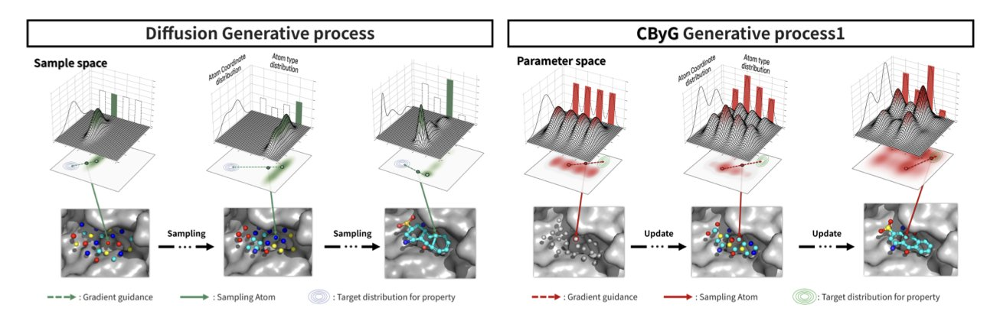
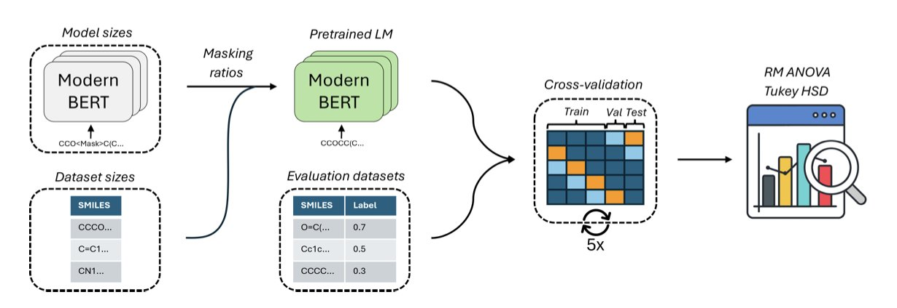
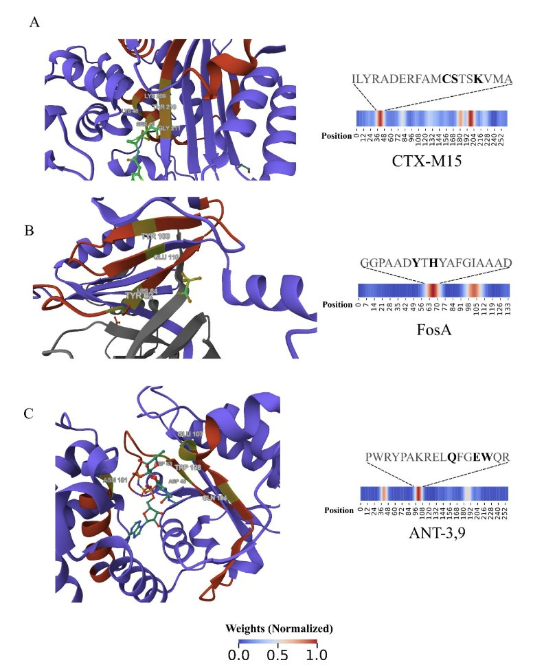

## 目录  
1. CBYG 框架通过贝叶斯流网络和梯度引导，为结构化药物设计提供了一种比扩散模型更稳定、更可控的 3D 分子生成方法。
2. 在分子语言模型领域，盲目追求大模型和大数据集并非正途，MolEncoder 证明了更优的预训练策略才是关键。
3. DeepSEA 是一个可解释的深度学习模型，它能绕过序列比对的限制，更准确地识别新型抗生素耐药蛋白，并揭示其作用机制。

## 1. CBYG：超越扩散模型，3D 分子生成迎来新范式  
  
  

做 AIDD 这些年，我们见证了 AI 生成模型的爆发。特别是基于结构的药物设计，扩散模型 (Diffusion Models) 几乎成了标配。但只要你亲手跑过这些模型，就会知道它们有多「任性」。你想要一个高亲和力的分子，它可能会给你一个化学上根本不存在的结构。这背后的核心难题，在于模型很难同时处理好两件事：原子的三维空间位置（连续坐标）和原子的类型（离散的化学元素）。它们就像两个配合不佳的舞伴，步调总是不一致。  
  
这篇来自 Choi 等人的新工作，提出的 CBYG 框架，就是来解决这个问题的。他们采用了贝叶斯流网络 (Bayesian Flow Networks, BFNs)。  
  
我们可以这样理解两者的区别。扩散模型的工作方式，好比从一团随机的「原子云」（噪声）开始，一步步把它「去噪」，最终雕琢出一个分子。这个过程很强大，但每一步的修正都可能引入不确定性，尤其是在施加外部引导（比如「提高亲和力」）时，整个系统容易崩溃。  
  
而 BFNs 的工作原理更像是在搭积木。它有一个更清晰、更有序的路径，从一个简单的初始状态，通过一系列可学习的「流动」变换，逐步构建出最终的复杂分子。这个过程的稳定性天然就更好。  
  
CBYG 的精髓在于，它在 BFNs 这个稳定的底盘上，加装了一个精准的「导航系统」——梯度引导。在分子生成的每一步，这个系统都会根据我们设定的目标（比如结合亲和力、合成可行性、选择性）计算出一个「梯度」，然后像施加一个微小的力一样，把生成过程往正确的方向推一把。  
  
打个比方，这就好比我们不是在对一块大理石进行大刀阔斧的雕刻，而是在用 3D 打印机逐层构建。我们可以在打印的每一层都进行微调，确保最终的产品完全符合设计图纸。这种方式让整个生成过程变得可控。当你想让分子更「好」一点时，模型不会给你一个完全离谱的东西，而是在现有基础上稳步优化。  
  
更让我欣赏的是研究者们设计的评估体系。很多 AI 论文热衷于在一些学术指标上刷分，但这些指标和我们制药工业的日常需求相去甚 - 远。这次，他们把重点放在了结合亲和力、合成可及性分数 (SA score) 和选择性这些我们真正关心的「硬指标」上。实验结果显示，CBYG 在这些贴近实战的基准测试中，性能超过了现有的主流模型。  
  
对于我们来说，它不再是一个充满惊喜（和惊吓）的「黑箱」，而是一个可以信赖的、能听懂我们化学直 - 觉的工程系统。CBYG 当然不是终点，但它指明了一个有吸引力的方向：让 AI 分子生成变得更像一门严谨的工程科学，而不是一门玄学。  
  
📜**Title**: Controllable 3D Molecular Generation for Structure-Based Drug Design Through Bayesian Flow Networks and Gradient Integration  
📜**Paper**: https://arxiv.org/abs/2508.21468v1  

## 2. MolEncoder：分子预训练，告别「越大越好」  
  
  

近年来，AI 领域被一个观点主导：模型越大、数据越多，效果就越好。从 GPT 到图像生成模型，这条「力大砖飞」的路线似乎百试百灵。药物发现领域也尝试借鉴，开发了基于分子 SMILES 序列的「分子语言模型」。但分子与语言不同，直接照搬自然语言处理（Natural Language Processing, NLP）的最佳实践，效果并不理想。  
  
这篇新研究表明，这种照搬是行不通的。  
  
这些模型的工作原理，是把分子的 SMILES 字符串看作一个句子，如`CCO`（乙醇）。预训练的核心是「遮蔽语言建模」（Masked Language Modeling），即玩填字游戏。随机盖住句子里的某些部分，让模型去猜。例如将`CCO`变为`C[MASK]O`，模型需根据上下文猜出被盖住的是`C`。  
  
在 NLP 领域，公认的黄金法则是遮蔽 15% 的词。但研究者发现，这套规则用在分子上效果不佳。分子的语法比人类语言严格得多。在英语里，将"a quick brown fox"换成"a fast brown fox"，意思相近。但在化学里，将乙醇（`CCO`）的一个碳换成氮（`CNO`），就变成了完全不同的物质。  
  
因此，研究者尝试提高遮蔽率。他们发现，当遮蔽率提高到 30% 时，模型在下游任务（如预测分子性质）上的表现大幅提升。这相当于给模型出了更难的考题，迫使它不再是死记 SMILES 的局部模式，而是去理解构成一个稳定、有效分子的深层化学规则。  
  
另一个发现关乎模型和数据规模。我们通常认为模型参数越多、见过的分子越多，它就越「博学」。但实验结果显示，一个仅有 1500 万参数的中等大小模型，在使用一半 ChEMBL 数据集进行预训练时，表现最佳。继续增大模型尺寸或喂给它全部数据，性能反而开始下降。  
  
这说明，对于分子性质预测这类任务，存在一个「甜点区」。超过这个区域，更大的模型可能会学到噪音，或者说，更多的参数和数据带来了「收益递减」。这对于计算资源有限的实验室是好消息，我们无需追逐动辄数十亿参数的巨型模型，也能做出顶尖成果。  
  
基于这些发现，作者构建了 MolEncoder。它是一个在「甜点区」里精心调校过的 BERT 模型。在多个行业标准测试集上，这个小巧的 MolEncoder 全面或部分超越了更大、更复杂的模型，如 ChemBERTa-2 和 MoLFormer。它用更少的计算资源，完成了更出色的工作。  
  
最后，这项研究还指出：预训练损失（pretraining loss）并不能很好地预测模型在实际任务中的表现。很多团队会盯着这个数字，认为它越低模型就越好。但事实是，必须将模型在真实的下游任务上进行测试，才能知道其真实性能。  
  
📜Title: MolEncoder: Towards Optimal Masked Language Modeling for Molecules  
📜Paper: https://doi.org/10.26434/chemrxiv-2025-h4w9d  

## 3. DeepSEA：用 AI 揪出隐形的抗生素耐药蛋白  
  
  

抗生素耐药性 (Antimicrobial resistance, AMR) 是一个日益严峻的问题。我们现在监控耐药性的主流方法，如 RGI 和 AMRFinderPlus，严重依赖序列比对。这就像手里拿着一本嫌疑人名单，然后去比对现场发现的指纹。如果罪犯是个新手，不在名单上，你就抓不到他。这些工具的假阴性率因此居高不下，一旦出现序列新颖的耐药蛋白，它们就会失灵。  
  
这篇论文里的 DeepSEA 模型，试图用一种新思路解决这个问题。它是一个卷积神经网络 (Convolutional Neural Network, CNN)，本质上是一种模式识别工具。你可以把它想象成一个训练有素的专家，看的不是完整的序列，而是序列中的关键「片段」或「基序」。它不关心整个蛋白序列和数据库里的已知序列有多像，只关心它是否包含那些赋予其耐药功能的关键结构域。  
  
这是它的工作原理。研究者用一个名为 NCRD 的非冗余综合数据库来训练模型。他们把大量的耐药蛋白和非耐药蛋白序列「喂」给 CNN。网络通过学习，自动提取出与耐药性相关的抽象特征。比如，某个特定的氨基酸组合可能形成了一个可以水解抗生素的活性位点。CNN 就能学会识别这个模式，即使它出现在一个全新的蛋白骨架上。  
  
这个模型让我欣赏的一点是它的可解释性。我们最怕的就是「黑箱模型」。一个模型告诉我这个蛋白有耐药性，但说不出为什么，那它的价值就大打折扣。DeepSEA 的研究者通过分析 CNN 内部神经元的激活模式，反向追溯是输入序列的哪个部分让模型做出了「耐药」的判断。这样一来，模型不仅给出了预测，还用高亮的方式「指」出了蛋白上可能负责降解抗生素的关键功能域。这就从一个单纯的分类工具，变成了一个能启发新实验、帮助我们理解耐药机制的工具。  
  
模型的性能数据也很扎实。在测试中，它对九类耐药蛋白的召回率 (Recall) 都超过了 0.95。这意味着它几乎能把所有真正的耐药蛋白都找出来，漏网之鱼很少。在和 RGI、AMRFinderPlus 甚至是 ESM2 这种大模型的对比中，DeepSEA 的假阴性更少。  
  
研究者还测试了它的泛化能力。他们用一些和训练集序列相似度很低的蛋白去测试模型，结果模型的精确率、召回率和 F1 分数依然很高。这说明 DeepSEA 不是靠「死记硬背」来识别序列，而是真正学到了决定蛋白耐药功能的底层规律。  
  
最后，作者们把这个模型打包成了一个开源的生物信息学工具，提供了命令行界面。这意味着任何一个实验室都可以下载下来，用于分析自己的宏基因组数据，去发现那些可能被传统方法忽略的新型耐药基因。  
  
📜Title: DeepSEA: An Alignment-Free Explainable Approach to Annotate Antimicrobial Resistance Proteins  
📜Paper: https://bmcbioinformatics.biomedcentral.com/articles/10.1186/s12859-025-06256-4  
💻Code: https://github.com/computational-chemical-biology/DeepSEA-project
