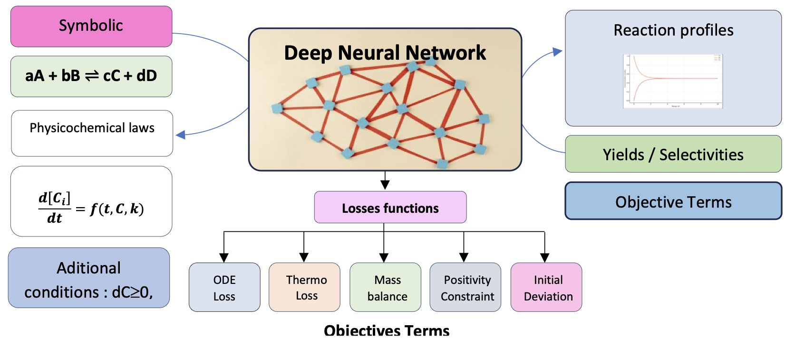
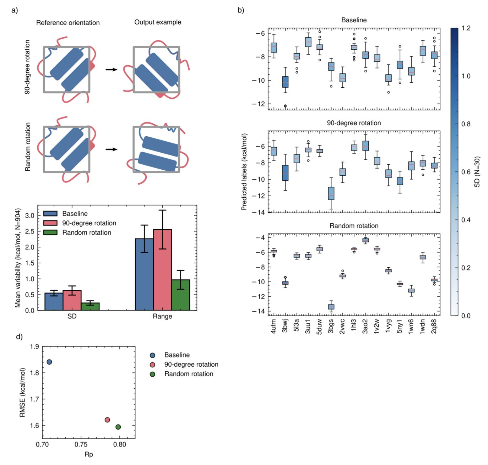
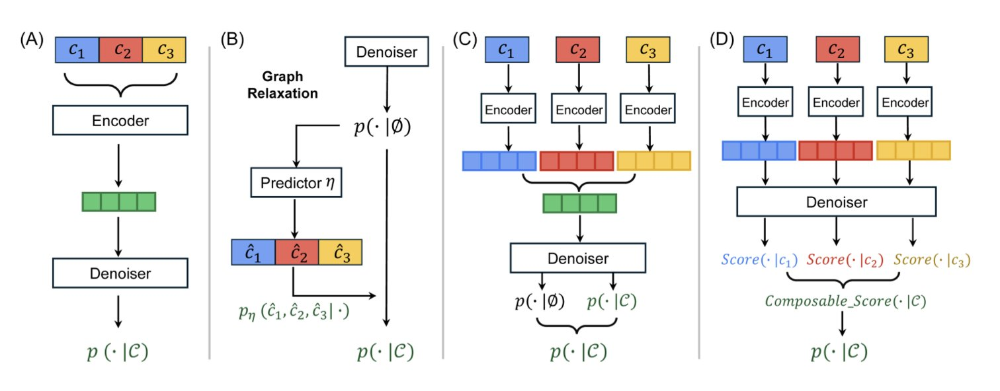

## 目录  
1. ChemAI 将物理化学定律写入代码，让 AI 仅凭化学方程式就能模拟反应过程，告别了对海量实验数据的依赖。
2. 这篇研究证明，一个简单的 AI 模型，只要用「蒙眼训练法」强迫它学习真正的分子间相互作用，就能在预测结合力上击败更复杂的模型。
3. CSGD 模型巧妙地将分数匹配技术用在离散的分子图上，让我们可以像调配方一样，自由组合多种条件来精准生成想要的分子。

## 1. ChemAI: 用物理定律教 AI 做化学反应  
  
  

我们总想要一个模型能告诉我们一个新反应会如何进行，而不用真的去烧瓶里试。传统上，这需要大量实验数据来拟合动力学模型，费时费力。但机器学习模型大多「数据饥渴」，像个只会背答案的学生，换个题型就懵了。  
  
一篇新论文介绍了一个叫 ChemAI 的模型，它试图解决这个问题。  
  
它的出发点是：只看化学反应方程式。你给它一个 A + B → C 的反应，它就能告诉你随着时间推移，A、B、C 的浓度会怎么变化。它不需要你预先提供一堆实验数据点来学习。  
  
怎么做到的？  
  
关键在于它的定制损失函数 (loss function)。  
  
可以这么理解：大多数机器学习模型的目标是让预测值和真实数据点的差距尽可能小。ChemAI 的目标更进一步，它不仅要拟合数据，还必须遵守最基本的物理化学定律。研究者把这些定律，比如质量守恒、化学动力学、热力学平衡，直接写进了模型的「评分标准」里。  
  
举个例子，模型在训练时，如果某个预测结果显示反应物的总质量增加了，那它就会因违反「质量守恒」定律而受到一个巨大的惩罚。同样，预测的浓度不能是负数，反应最终要趋向平衡，这些都是硬性约束。  
  
这样一来，ChemAI 就不是在死记硬背数据，而是在学习支配化学反应的底层规则。它把符号化的化学方程式，翻译成了一个物理上自洽的微分方程系统，然后去求解。  
  
这种方法带来的好处是显而易见的。论文展示了 ChemAI 与其他模型的对比结果，包括物理信息神经网络 (PINNs, Physics-Informed Neural Networks)、图神经网络 (GNNs) 和 Transformers。在处理带噪声的数据，或预测训练范围之外的条件时，ChemAI 的表现要好得多。这不奇怪，因为当数据变得不可靠时，那些只依赖数据的模型就会迷失方向，而 ChemAI 始终有物理定律这个「指南针」在手。  
  
研究者用它来模拟铃木偶联 (Suzuki couplings) 这样的复杂反应。做有机合成的都知道，这种多步催化循环反应的机理复杂，中间体多，难以建模。ChemAI 能够处理这种非线性系统，说明它有潜力成为一个实用的工具。  
  
我们离那个理想的「虚拟实验室」又近了一步。未来，我们或许可以先在电脑上用 ChemAI 这样的工具筛选几百种反应条件，找到最优的几个，再去实验室验证。这对药物发现中的工艺优化和新反应路径设计，价值巨大。  
  
📜Title: ChemAI: A Symbolically Informed Neural Network For Physicochemical Modeling Of Reaction Systems  
📜Paper: https://doi.org/10.26434/chemrxiv-2025-2hp4c  

## 2. AI 预测结合力：训练比模型更重要  
  
  

在计算药物化学领域，许多研究致力于构建更大、更复杂的神经网络，以解决预测蛋白质 - 配体结合亲和力的难题。一篇论文提出了一个更简单的方案，指出问题的关键或许不在于模型架构，而在于训练方法。  
  
#### AI 如何「作弊」？  
  
研究发现，许多 AI 模型在预测结合力时并未学会理解配体与蛋白质口袋在三维空间中的相互作用。  
  
它们学会了走捷径：记忆。  
  
模型看到一个配体，识别出它的一些化学特征；再看到一个蛋白质，识别出它的一些疏水性特征。然后模型建立一个简单关联：这种分子和这种蛋白凑在一起，通常得分很高。它并不关心两者是否真的匹配。这种预测方式在面对从未见过的新分子或靶点时，自然会出错。  
  
#### 纠正作弊的技巧：分子丢弃  
  
为解决这个问题，研究者提出了一种简洁的技巧，名为 「**分子丢弃」（molecular dropout**）。  
  
它的工作方式如下：在训练时，随机地只向模型展示蛋白质而不展示配体，并告知模型正确答案是「0」，即不结合。或者反过来，只展示配体不展示蛋白质，正确答案同样是「0」。  
  
这个改动从根本上改变了模型的学习方式。  
  
它迫使 AI 明白，不能仅靠单方面信息猜测答案。模型必须同时观察蛋白质和配体，理解它们之间的相互作用，才能做出正确判断。  
  
#### 数据为王  
  
研究还发现，数据增强的方式同样影响训练效果。过去，研究者习惯将分子旋转几个固定的 90 度角。但这篇论文证明，**完全随机地旋转分子**效果更好。这种方式更接近物理现实，能更好地教会 AI 理解旋转不变性。  
  
研究者将这些以数据为中心的训练方法，应用在一个名为 DockTDeep 的简单卷积神经网络（Convolutional Neural Network, CNN）上，结果令人印象深刻。  
  
这个简单的模型在一系列基准测试中，表现与那些更庞大、更复杂的模型相当，甚至更优。尤其是在「分布外」测试集，即模型从未见过的全新分子和靶点上，它的表现依然稳健。  
  
在 AI 辅助药物发现的道路上，与其追求更大、更深的模型，不如回头优化数据和训练方法，可能会事半功倍。  
  
📜Title: Data-Centric Training Enables Meaningful Interaction Learning In Protein-Ligand Binding Affinity Prediction  
📜Paper: https://doi.org/10.2643A/chemrxiv-2025-khbrl  
💻Code: https://github.com/gmmsb-lncc/docktdeep  

## 3. CSGD 扩散模型：像搭乐高一样精准生成分子  
  
  

如何设计一个分子，让它同时满足多种甚至相互冲突的性质？  
  
比如，我们想要一个分子既有很强的靶点活性，又有良好的水溶性，同时毒性还要低。这就像调试一台复杂的混音设备，推高一个推子（比如活性），可能就会影响另一个（比如溶解度）。  
  
过去的生成模型处理这个问题时，通常有些笨拙。要么需要为每一种属性组合单独训练一个模型，要么通过一些近似方法，把离散的分子结构「模糊」成连续数据来处理。后一种方法虽然能用，但常会牺牲掉化学结构的精确性，导致最后生成的分子在化学上根本不成立（即「无效分子」）。  
  
**CSGD 的解法：为离散的分子图引入「导航系统**」  
  
这篇论文里的 CSGD (Composable Score-based Graph Diffusion) 模型，提供了一个更优雅的解决方案。它的核心思路，是把在图像生成领域大放异彩的分数匹配 (Score Matching) 技术，成功地「嫁接」到了离散的分子图生成上。  
  
你可以把分数匹配想象成一个导航系统。在图像生成中，模型从一堆随机噪声出发，导航系统会一步步告诉每个像素点该往哪个方向「移动」，最终形成一张清晰的图片。这个过程在连续空间里很自然。但分子是离散的，原子之间要么有键，要么没有，不存在「半个化学键」的状态。  
  
CSGD 的聪明之处在于，它通过一种叫「具体分数」(concrete scores) 的机制，为这个离散的生成过程也装上了导航。模型不再是告诉原子「向左移动 0.5 个单位」，而是计算出在当前步骤下，添加一个原子或一根化学键的「最优概率」。  
  
**两大实用工具：CoG 和 PC**  
  
为了让这个导航系统更强大、更可靠，研究者开发了两个关键组件：  
  
1.  **可组合引导 (Composable Guidance, CoG**)  ：这就是那个「混音台」。它允许你在生成过程中，动态地、自由地组合不同的引导条件。你可以随时决定：「现在，我主要关注溶解度」，或者「接下来，把活性和低毒性的权重都调高」。这种灵活性是巨大的优势，因为你不需要重新训练模型，就可以探索无穷无尽的属性组合。实验表明，CoG 在性能上不输给目前流行的无分类器引导 (Classifier-Free Guidance, CFG)，但灵活性远超后者。  
  
2.  **概率校准 (Probability Calibration, PC**)  ：这是一个「质检员」。模型在训练时看到的数据和在实际生成时遇到的情况总会有些偏差。PC 的作用就是校正这种偏差，它会微调生成下一步结构的概率，确保最终输出的分子更符合化学规则，从而提高了分子的有效性 (validity)。  
  
**效果怎么样**？  
  
在四个公开数据集上的测试显示，CSGD 在「可控性」这项指标上，平均比之前最好的方法提升了 15.3%。当研究者设定好想要的属性后，CSGD 能更准确地生成符合这些要求的分子。同时，它生成的分子有效率高，避免了计算资源的浪费。  
  
CSGD 这样的工具改变了以往「大海捞针」式筛选分子的工作模式，让我们可以更主动、更精确地设计分子。这不仅可能加速苗头化合物到先导化合物的优化过程，也为探索更广阔、更多样化的化学空间打开了一扇新的大门。  
  
📜Title: Composable Score-based Graph Diffusion Model for Multi-Conditional Molecular Generation  
📜Paper: https://arxiv.org/abs/2509.09451
