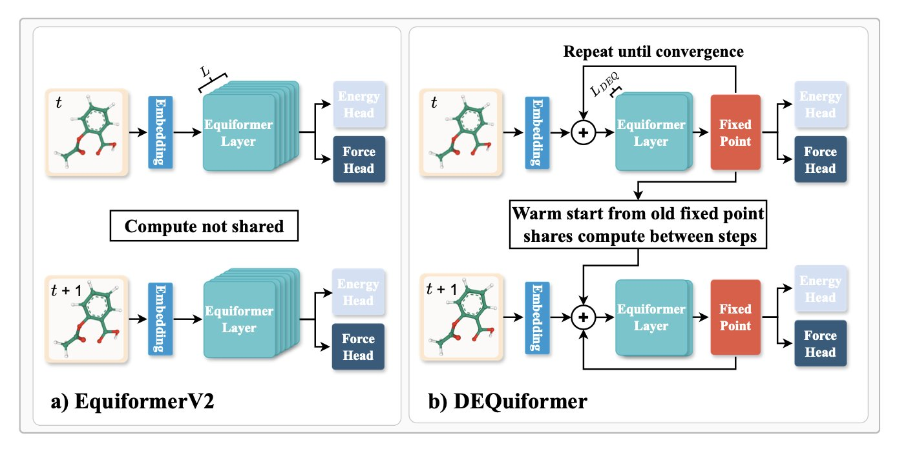
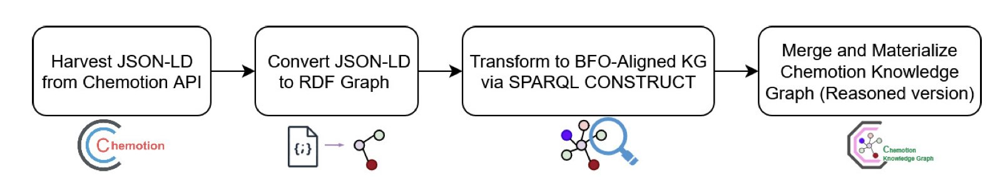
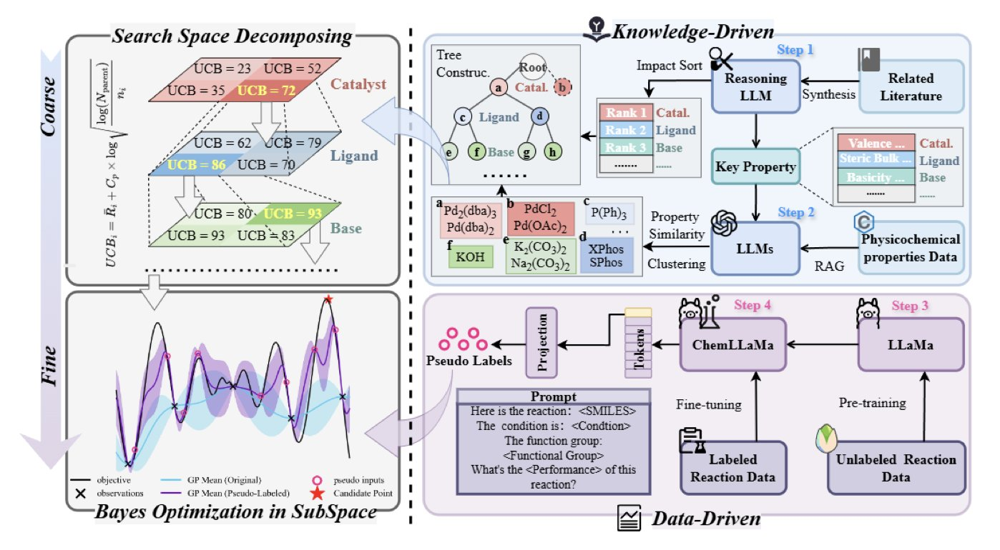

## Table of Contents
1.  Researchers improved both the speed and accuracy of simulations by reframing a machine learning force field as a Deep Equilibrium Model, taking advantage of temporal continuity.
2.  A standardized chemistry knowledge graph is being built to turn messy experimental data into structured information that AI can understand and reason with, paving the way for automated chemistry.
3.  The ChemBOMAS framework integrates a large language model into Bayesian optimization, achieving results far superior to human experts in wet-lab experiments through a two-step "coarse-to-fine" approach.

## 1. Faster, More Accurate, and Memory-Efficient Molecular Dynamics with DEQ

Anyone who runs molecular dynamics (MD) simulations knows how computationally expensive they are. Whether for drug discovery or materials science, we want simulations to be fast and accurate. Machine learning (ML) force fields were a big step up in accuracy over traditional ones, but they also came with a higher computational cost.

Traditional ML force fields have to calculate the entire system's energy and forces from scratch at every single timestep. It’s like planning your full route from home to the office at every step you take, instead of just figuring out the next step. This is wasteful, because on the femtosecond (fs) timescale, atomic positions change very little.

The authors of this paper had an idea: since the molecular state changes so little from one step to the next, shouldn't the result from the previous timestep be the best starting guess for the current one?

They adapted the state-of-the-art EquiformerV2 model into a Deep Equilibrium Model (DEQ). The name sounds complex, but the idea is simple. It transforms the force field calculation from a one-way pipeline (input to output) into an iterative process that searches for a "fixed point." The intermediate calculations from the previous step—the neural network's features—are used as the starting point for the current step's iteration. Because the molecular conformations are so similar between steps, this starting point is already close to the final answer. The model only needs a few iterations to converge, saving a lot of redundant computation.

What were the results? On standard benchmarks like MD17 and MD22, speed increased by 10-20% and accuracy improved by about 10%. Don't underestimate these numbers. For long simulations, that translates into major savings in time and electricity.

This method also requires less memory during training. This means we can train larger, more expressive models on limited hardware to simulate more complex systems. For many labs with tight budgets, this is a real benefit.

This work is more than just a trick for EquiformerV2; it's a new design philosophy. It bakes the physical intuition that "simulations are continuous in time" into the model as an inductive bias, helping it generalize better. In theory, this approach could be applied to many other equivariant graph neural network force fields, showing great potential.

📜Title: DEQuify your force field: More efficient simulations using deep equilibrium models
📜Paper: https://arxiv.org/abs/2509.08734v1

## 2. Helping AI Understand Chemistry Experiments: Building the Chemotion Knowledge Graph

Every chemist has struggled with old lab notebooks. The data is often in inconsistent formats or missing key information, making it difficult to reuse. This data exists in isolated silos, its value diminishing over time. This paper is about building bridges between those silos.

The core of this research is to create a common set of "grammar rules" for chemical data. The researchers focused on Chemotion, a popular electronic lab notebook (ELN). Their goal was to transform the raw, messy experimental data recorded by researchers in Chemotion into knowledge that machines, especially AI, can understand and reason with.

Here’s how the process works:

1.  **Data Collection**: First, they use an API to pull experimental metadata from the Chemotion system. This data initially comes in JSON-LD format, which is developer-friendly but not structured enough for machine reasoning.
2.  **Semantic Conversion**: This is the key step. The researchers use SPARQL CONSTRUCT queries to convert the JSON-LD data into RDF (Resource Description Framework) triples. You can think of an RDF triple as a simple "subject-predicate-object" sentence, like "Compound A - has molecular weight - 150.2." This structure makes knowledge representation precise.
3.  **Ontology Alignment**: RDF alone isn't enough; you need a unified framework to organize these "sentences." The researchers chose the Basic Formal Ontology (BFO) as the top-level framework. BFO is like a master grammar guide. It doesn't define specific chemical concepts but instead defines universal concepts like "entity," "process," and "role." Aligning chemical data with BFO means this data can be seamlessly connected to knowledge graphs from other fields, like biology, because they all follow the same top-level logic.

The final result is the Chemotion Knowledge Graph (Chemotion-KG). As of July 2025, the graph contains over 1.4 million RDF triples describing more than 78,000 entities, such as chemical substances, experiments, and researchers. It's not a static database; it continuously grows by absorbing new data from the Chemotion system every day.

The value of this work lies in its future. It is laying the foundation for the "self-driving lab." Imagine an AI system that wants to design experiments autonomously. It must first be able to read past experimental data to understand what reactions succeeded, which failed, and why. This knowledge graph provides that capability.

The researchers' next plans:

📜Title: AI4DiTraRe:Building the B-Compliant Chemotion Knowledge Graph
📜Paper: <https://arxiv.org/abs/2509.01536>

## 3. An AI Chemist Steps In: ChemBOMAS Achieves 96% Yield in Reaction Optimization

Optimizing chemical reaction conditions in a lab is like searching for the highest peak in a vast, dark mountain range. Temperature, solvent, catalyst, reaction time—each parameter is a dimension, combining to form a huge, unknown search space. Bayesian Optimization (BO) is a common method for this, acting like a blindfolded hiker. With each step (one experiment), the hiker learns a bit more about the surrounding terrain and decides where to go next. The method is smart, but when experiments are expensive and data points are few, the hiker moves slowly and can take a long time to find the right path.

The ChemBOMAS framework proposed in this paper gives this blindfolded hiker an experienced guide: a Large Language Model (LLM).

It works in two steps.

First, **knowledge-driven coarse-grained optimization**. Before starting to search blindly, ChemBOMAS has the LLM "look" at the reaction. Drawing on the vast chemical literature it learned during training, the LLM reasons like a senior chemist. It might say: "Based on similar reactions, the optimal temperature is likely between 80 and 120 degrees. This type of solvent should work well, while those other types can be ruled out." In this way, the LLM narrows the search space from the entire mountain range down to a few promising peaks. This avoids a lot of wasted effort in the initial exploration.

Second, **data-driven fine-grained optimization**. After identifying a few promising areas, the blindfolded hiker (the BO algorithm) gets to work. But the LLM guide doesn't leave. Within this defined region, it generates "pseudo-data points" based on the few real experimental results available. It predicts: "If we ran an experiment at this point, the result would *probably* look like this." These pseudo-data points are like a rough contour map sketched by the guide. They aren't perfectly accurate, but they give the hiker valuable information about the terrain, helping it find the path to the summit faster. This improves data efficiency and accelerates convergence.

The results are what matter. The researchers tested ChemBOMAS on four public reaction datasets, and it outperformed the baseline methods on all of them.

The wet-lab validation is even more convincing. They chose a new, quite difficult chemical reaction that had never been reported before. Human experts tried repeatedly and achieved a maximum yield of 15%, which is not an ideal outcome. Then, they let the ChemBOMAS system take over the experimental design. ChemBOMAS guided the experiments to a final yield of 96%. The contrast is striking. The AI can not only reproduce known optimization paths but also find a better solution than human experts in a new and complex chemical space.

This work paints a picture of the future of the "automated lab" or "self-driving lab." It means we can free chemists from tedious and repetitive optimization tasks, allowing them to focus on more creative scientific problems.

📜Paper: <https://arxiv.org/abs/2509.08736>
