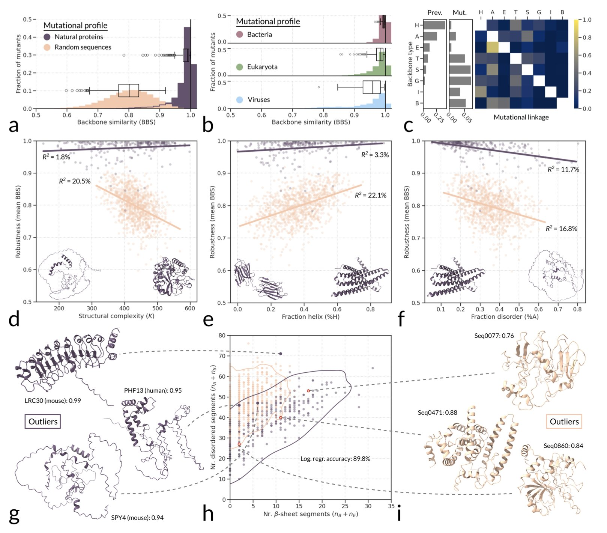
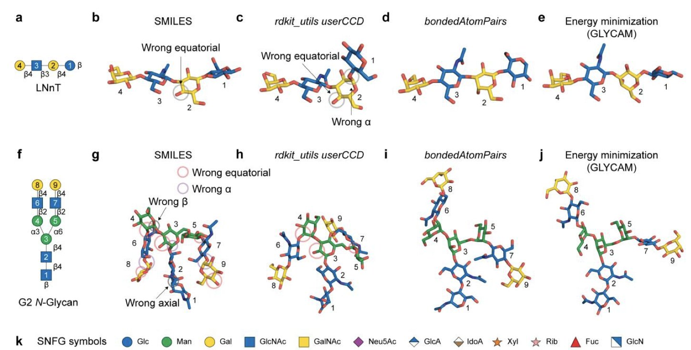
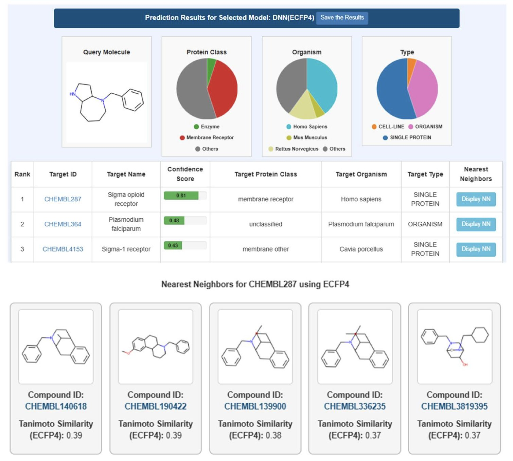

## 目录  
1. 天然蛋白质进化出了极强的突变稳健性，这很可能是为了对抗细胞内转录和翻译过程中的天然「错误率」。
2. AlphaFold 3 首次让精确预测聚糖结构成为可能，但由于聚糖自身的柔性，模型结果的解读和验证至关重要。
3. PPB3 利用深度学习和海量的 ChEMBL 数据，提供了一个免费、精准的药物靶点预测工具，能有效识别药物分子的多药理学效应。

## 1. 蛋白质的进化之谜：为何它们能如此耐受突变？  
  
  

我们总是在和蛋白质突变打交道。无论是想增强一个酶的活性，还是研究一个靶点的耐药性，我们做的第一件事往往就是定点突变。有时候一个氨基酸的改变就能让蛋白彻底失活，有时候换掉好几个也无关痛痒。这背后到底是什么规律？一项研究给出了一个来自进化层面的解释。  
  
研究者想搞清楚一个问题：天然蛋白质的结构对突变到底有多「皮实」？或者说，它们的「稳健性」（Robustness）如何？  
  
他们是这么做的。研究者构建了三组蛋白质序列：第一组是来自大自然的天然蛋白质；第二组是完全随机生成的氨基酸序列；第三组则是通过计算从头设计的（de novo）蛋白质。  
  
然后，他们使用结构预测工具 ESMFold。研究者对每一条序列都进行大量的单点突变，然后用 ESMFold 预测突变后的结构，看看这个结构和原来的相比变化有多大。  
  
结果天然蛋白质表现出了惊人的稳健性。大多数单点突变对它们的整体三维结构影响很小，就像往一栋大楼里扔一颗石子，大楼只是晃了一下。  
  
相比之下，随机序列和很多从头设计的蛋白质就脆弱多了。它们就像用积木搭起来的塔，轻轻一碰就可能散架。一个氨基酸的改变，就可能导致整个结构崩溃或重排成完全不同的样子。  
  
这个现象说明天然蛋白质的这种「皮实」特性不是凭空来的，而是有其特殊原因。  
  
研究者首先排除了一个可能性：**会不会是 RNA 的情况也一样**？他们对比后发现，RNA 的情况完全不同。无论是天然有功能的 RNA 还是随机 RNA 序列，它们的突变稳健性都差不多。这说明，蛋白质的这种高稳健性是独有的，背后有强大的进化选择压力。  
  
那么，这种压力来自哪里？会不会是遗传密码本身在「作弊」？例如，密码子设计得让突变更倾向于产生化学性质相似的氨基酸。研究者也验证了这一点。遗传密码确实有一点帮助，但这个效应太小，远远无法解释天然蛋白和随机蛋白之间巨大的稳健性差异。  
  
最终，作者提出了一个有说服力的假说：这种选择压力，很可能来自于细胞内无时无刻不在发生的「生产事故」。  
  
我们都知道，细胞内的转录和翻译过程并非百分之百精确，总会存在一定的错误率。如果一个蛋白质的结构设计得「精密」而脆弱，那么一个微小的翻译错误就可能产生一个错误折叠的、没有功能的、甚至有毒性的蛋白质。这对细胞来说是巨大的浪费和风险。  
  
所以，进化给出的解决方案是什么？就是筛选出那些对「生产事故」**容错率高**的蛋白质。一个蛋白质结构，即使某个位置的氨基酸因为翻译错误而被替换掉了，但它的整体结构依然能保持稳定、功能依然正常——这样的蛋白质显然更受进化青睐。  
  
这项研究对药物研发有启发。  
  
首先，它解释了为什么从头设计一个功能稳定的蛋白质这么难。我们设计的蛋白，就像研究里的「de novo」蛋白一样，没有经过数十亿年「容错性」的进化筛选，自然就比较脆弱。  
  
其次，对于药物靶点，这种稳健性或许可以成为一个新的评估维度。一个高度稳健的靶点，是否意味着它有更多的方式来演化出耐药性突变，而不会牺牲自身的基本功能？  
  
这让我们重新审视蛋白质，它们不仅是为特定功能而生的精密分子机器，更是为了在充满噪音和错误的细胞环境里可靠工作而演化出的、具有高度容错能力的杰作。  
  
📜Paper: <https://www.biorxiv.org/content/10.1101/2025.08.27.672565v1>  

## 2. AlphaFold 3 挑战聚糖建模：潜力巨大，仍需谨慎  
  
  

在结构生物学中，预测聚糖构象一直是个难题。蛋白质像一条由 20 种不同珠子（氨基酸）串成的链，折叠规则相对明确。而聚糖则像一串用不同连接方式（糖苷键）串起来的、种类繁多的珠子（单糖），且连接点不固定，可形成各种支链。这导致聚糖结构异常灵活，像一根湿面条，很难找到一个稳定的「正确」构象。  
  
AlphaFold 2 在蛋白质结构预测上取得了成功，但对聚糖几乎无能为力。AlphaFold 3（AF3）从一开始就被设计用来处理更广泛的分子类型，聚糖是其中最受关注的一类。  
  
这项新研究是对 AF3 在聚糖建模领域的一次压力测试。研究者首先解决了一个基础问题：如何告诉 AF3 我们想要一个聚糖？  
  
他们发现，最高效的方法是采用一种杂合语法。这如同给 AF3 提供一套乐高积 - 木。研究者先用化学组分词典（Chemical Component Dictionary, CCD）定义好各种单糖环这些「基础模块」，然后用`bondedAtomPairs`(BAP) 精确告知 AF3 这些模块之间如何连接。这避免了让 AF3 从原子层面自己搭建一个化学构型正确的糖环，降低了出错概率。  
  
有了这套方法，研究者将其应用于真实的生物学问题，如模拟酶和糖蛋白的复合物。结果令人振奋。AF3 不仅能准确预测复合物的整体结构，甚至能捕捉到一些符合生理过程的中间状态。这说明 AF3 的预测可能反映了部分生物学过程。研究证明，AF3 能够预测其训练数据中从未见过的糖蛋白复合物结构。这是一个强有力的信号，表明 AF3 具备了泛化能力，而不只是简单地记忆和复现训练集里的数据。  
  
当然，我们不能过早乐观。AF3 提供的是一个静态的、能量最低的构象快照。但聚糖在生理条件下是高度动态的，其生物学功能常由其整体的构象集合决定，而非单一构象。因此，不能将 AF3 的输出视为最终答案。它更像一个高质量的起点。拿到这个模型后，我们还需结合分子动力学（Molecular Dynamics, MD）模拟等方法探索其动态行为，并用实验数据验证。  
  
这项工作为相关研究人员提供了一个有用的工具箱，包括他们整理好的输入模板和实例，降低了使用 AF3 研究聚 - 糖的门槛。它不是一个能解决所有问题的方案，但它是一个强大的新工具，让我们首次有能力系统地探索复杂的糖生物学世界。  
  
📜Title: Modeling glycans with AlphaFold 3: capabilities, caveats, and limitations  
📜Paper: <https://academic.oup.com/glycob/advance-article/doi/10.1093/glycob/cwaf048/8242499>  

## 3. 新一代 AI 靶点预测工具 PPB3 免费上线  
  
  

在药物研发中，我们希望设计的分子能像一枚精确制导的导弹，只攻击预定目标。但现实是，几乎所有的小分子药物都是「霰弹枪」，会同时击中多个靶点。这种现象就是多药理学（Polypharmacology）。它既可能带来副作用，也可能成为新疗效的来源。因此，在项目早期摸清一个分子的潜在靶点谱，至关重要。  
  
一个新的在线工具 Polypharmacology Browser PPB3 上线了，专门用来解决这个问题。  
  
它的第一个亮点是数据。以前很多预测工具的训练数据有限。PPB3 直接用上了 ChEMBL 34 数据库。这个数据库包含超过**110 万个分子和 7500 多个靶点**。  
  
这些靶点不只是单一的纯化蛋白。PPB3 的训练集里还包含了细胞系、甚至是整个生物体的数据。这让模型的预测能力更贴近真实的生物学环境，而不是真空中的理想实验。  
  
有了好的食材，还需要好的厨师。PPB3 的核心是一个深度神经网络。它的工作原理是：你输入一个分子的结构，系统会将其转换成一种叫做「分子指纹」的数字编码。然后，这个深度学习模型会分析这个指纹，根据它在海量数据中学到的「经验」，预测出这个分子最可能作用的靶点列表。  
  
实际效果如何？研究者做了一个案例分析，拿一个新分子去测试。他们将 PPB3 的预测结果与其上一代以及其他几个公开的在线工具做了对比。结果显示，PPB3 找到了更多已知的真实靶点，同时报出的假阳性靶点更少。  
  
这一点在实际工作中很有价值。一个预测工具如果报出一大堆不靠谱的靶点，会让实验科学家浪费大量时间和资源去验证。一个更「干净」的预测结果，意味着更高的效率。  
  
作为一个免费的网页工具，PPB3 给了药物研发人员一个方便的起点。当你设计合成出一个新化合物，在投入昂贵的细胞或动物实验之前，可以先把它放到 PPB3 上运行一下。几分钟后，你就能拿到一份关于其潜在靶点谱的报告。这份报告可以帮你提前预警潜在的脱靶毒性（比如它是否会作用于 hERG 通道导致心脏毒性？），或者启发你发现新的治疗方向。  
  
📜Title: Polypharmacology Browser PPB3: A Web-based Deep Learning Tool for Target Prediction Using ChEMBL Data  
📜Paper: https://chemrxiv.org/engage/chemrxiv/article-details/68aefa76728bf9025e9acf63
