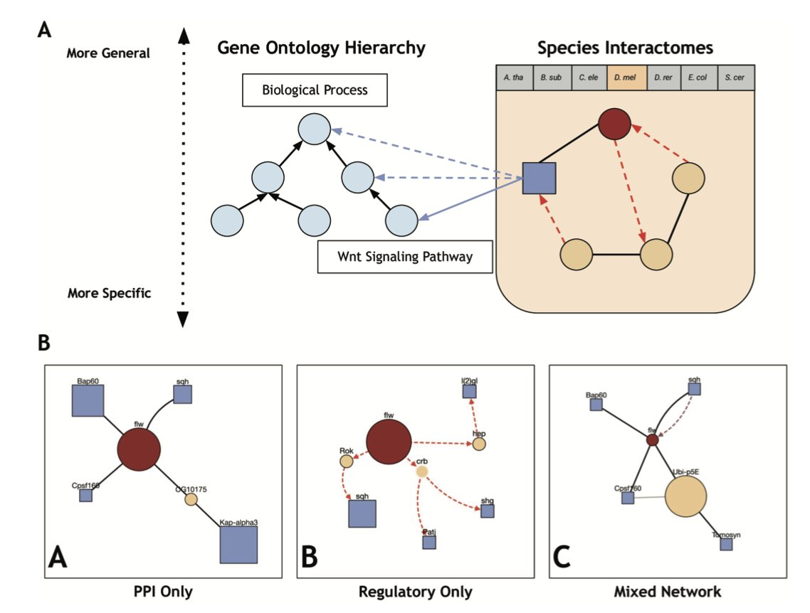
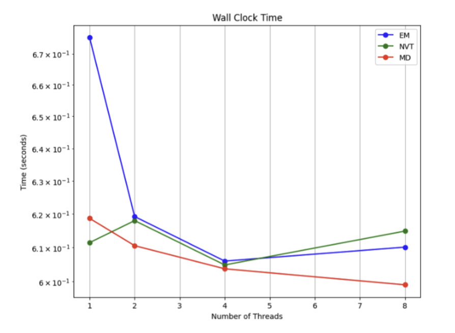
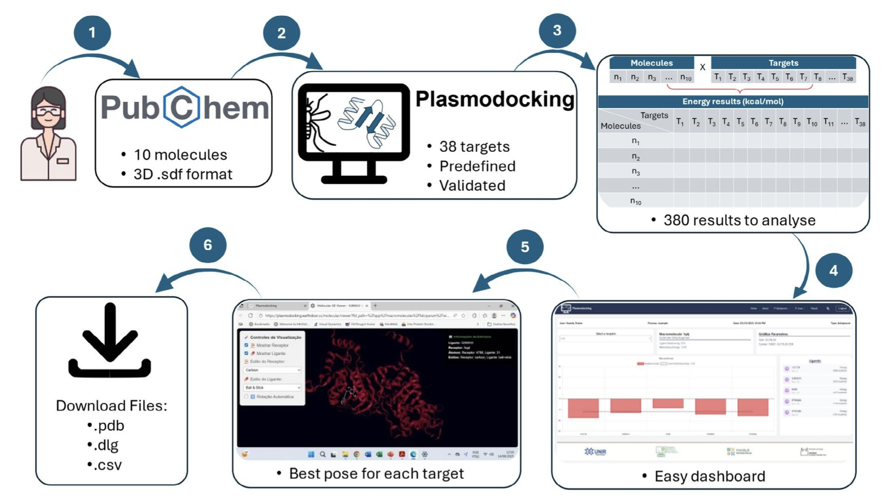

## Table of Contents
1. A new tool visually links proteins to specific biological pathways, helping us quickly form new hypotheses about target function.
2. High-Performance Computing (HPC) can speed up early-stage drug discovery, but linearly scaling computational power for complex molecular dynamics simulations remains a challenge.
3. PlasmoDocking is an open-source web tool that simplifies the complex virtual screening process for *Plasmodium falciparum* to just uploading a molecule and clicking "run," significantly lowering the barrier to entry for early-stage anti-malarial drug discovery.

## 1. ProteinWeaver: A New Tool for Visualizing Protein Interaction Networks

In drug development, we often face a common problem: we find a promising protein target, but what role does it actually play in a complex disease pathway? How does it "talk" to other members of that pathway? Figuring this out traditionally means reading a lot of papers, which is time-consuming and it’s easy to miss key information.

A new tool called ProteinWeaver offers a more intuitive solution.

It works simply. Let's say you're interested in a protein, "Protein X," and you suspect it's involved in "apoptosis." You just enter the name of Protein X and the corresponding Gene Ontology (GO) term for apoptosis into ProteinWeaver. It automatically pulls data from databases and draws a network map for you. This map clearly shows which "middlemen" connect Protein X to the broader "apoptosis" family.

The value of this map is its clarity. You can see at a glance whether Protein X is a central hub in the network or just a peripheral player. This is critical for assessing a target's importance.

ProteinWeaver also does something other interactive tools don't: it displays two different types of interactions at the same time. One is "physical binding," where two proteins fit together like LEGO bricks. The other is "genetic regulation," where a transcription factor protein "tells" another gene to start or stop transcription. Putting both types of information on one map is like having both a circuit wiring diagram and a control flowchart. It gives us a much deeper understanding of how the system works.

This network-building approach helps us quickly generate testable hypotheses. For instance, if the map shows that Protein X connects to a key pathway through a previously overlooked protein, "Protein Y," then Protein Y might be a new potential target or a useful biomarker.

What if you're dealing with a protein of completely unknown function? ProteinWeaver also has a prediction feature. It uses an algorithm called a "random walk." Imagine someone blindfolded, starting at your unknown protein and wandering randomly across the network map. The algorithm calculates where they are most likely to end up in known "functional areas" (i.e., GO terms). The area with the highest probability is the best guess for your unknown protein's function. Researchers have verified that this method is highly accurate across several model organisms.

For scientists on the front lines of R&D, ProteinWeaver is a useful tool. It consolidates vast, scattered biological data into an intuitive, interactive map, making it easier to explore target function and understand mechanisms of action. It requires no complex programming skills; you can use it with a few clicks. During early-stage target screening and validation, it can help clarify thinking and avoid detours.

📜Paper: https://journals.plos.org/plosone/article?id=10.1371/journal.pone.0331280
💻Code: https://github.com/Reed-CompBio/protein-weaver

## 2. Using HPC to Accelerate Alzheimer's Drug Development: Trading Compute for Time

Developing drugs for Alzheimer's disease (AD) is like finding a needle in a haystack. Potential targets like Aβ and Tau proteins are structurally complex, and potential compound libraries can contain millions or even billions of molecules. Testing them one by one would take forever, so computational simulation has become our "fish finder."

Molecular docking and molecular dynamics (MD) simulations are two of the main tools.

Molecular docking is like trying to fit small molecules (drug candidates) into the pockets of a target protein to see which one fits best, like testing keys in a lock. This process is computationally intensive because you have to try a huge number of "keys."

Molecular dynamics simulation goes a step further. It simulates every move a molecule makes in a realistic physiological environment, like filming an ultra-high-definition slow-motion movie of the molecule. This movie lets us see if the drug molecule remains stable after binding to the target protein and how they interact. The computational load for this is orders of magnitude greater than for docking.

Both of these steps are time-consuming and create a bottleneck in the early stages of drug discovery.

The work in this study wasn't about discovering a new drug, but about building a faster "engine" to speed up the entire screening process. The researchers turned to High-Performance Computing (HPC), what we often call supercomputing. The idea is straightforward: if one computer is too slow, use thousands of them to compute in parallel.

The researchers built a parallel workflow.

First, let's look at molecular dynamics simulation. They used the industry-standard software GROMACS and parallelized it with a hybrid MPI–OpenMP strategy. This is like managing a large construction crew. MPI assigns large tasks to different teams (compute nodes), while OpenMP lets the workers (CPU cores) within each team collaborate to finish their part of the job. In the initial stages of the simulation, like energy minimization (finding a comfortable starting position for the molecule), this "many hands make light work" approach was immediately effective, showing a clear speedup.

But it's not that simple. For larger and longer simulations, adding more compute cores led to diminishing returns in speed. This is known as a "scalability bottleneck." When there are too many workers, the cost of communication and coordination between them increases, which can slow down the overall progress. The paper candidly points out this limitation.

Now let's look at molecular docking. This is where parallel computing really shines. High-Throughput Virtual Screening (HTVS) is essentially about testing a huge number of molecules against a single target. This task is naturally divisible. You can split one million molecules among 1,000 compute cores, and each core just has to handle 1,000 molecules. They need almost no communication with each other; they just do their work and report the results at the end. The docking prototype developed by the researchers proved this: moving from serial to parallel processing drastically reduced the runtime, especially when handling a large number of molecules.

To prove the effectiveness of this workflow, they tested it on two real-world AD cases: targeting Aβ protein with prolinamide derivatives and targeting Tau protein with baicalein. The results showed that the workflow could effectively reproduce known binding modes. This means the new "engine" is not only fast but also points in the right direction.

The value of this research is that it provides a complete, reproducible HPC pipeline for drug discovery and makes all the code public. For any lab looking to build a similar platform, this is a ready-made blueprint and performance report. It shows us where HPC can be a huge help (like in high-throughput docking) and where we still need to focus on optimization (like the scalability of large-scale MD simulations).

The researchers also looked to the future, mentioning things like integrating GPU acceleration (GPUs are more efficient at this type of parallel computing), moving toward exascale computing, and even exploring quantum computing. These are all potential paths to solving the current bottlenecks.

📜Title: Parallelizing Drug Discovery: HPC Pipelines for Alzheimer's Molecular Docking and Simulation
📜Paper: <https://arxiv.org/abs/2509.00937v1>
💻Code: <https://github.com/RestartDK/alzheimer-hpc> <https://github.com/albipuliga/molecular-docking-hpc>

## 3. PlasmoDocking: Virtual Screening for Malaria Drugs with Just a Few Clicks

In anti-malarial drug discovery, virtual screening is an essential tool. It can help us quickly identify promising lead molecules from massive compound libraries. But the process is usually a hassle. You have to download the crystal structure of the target protein, clean up water molecules and extra chains, identify the active site, validate docking parameters... For someone without a background in computational chemistry, just setting up the environment can take days.

Now, someone has packaged this entire workflow into a web tool called PlasmoDocking.

Think of it as a meal prep kit. The ingredients (38 validated *Plasmodium falciparum* targets) and the cooking tools (the docking engine AutodockGPU) are all prepared for you. All you have to do is put in your own "food" (an SDF file with up to 10 molecules) and click "start cooking."

This is a huge benefit for many labs. Teams focused on biology or traditional medicinal chemistry might have a great new molecule and want to see which malarial targets it might have activity against, but they don't have a dedicated computational chemist. With PlasmoDocking, they can get a preliminary, multi-target activity assessment in minutes.

Here’s how it works:
1.  You go to the website and upload an `.sdf` file containing the structures of your designed molecules.
2.  The system uses AutodockGPU to perform molecular docking against the 38 pre-set malarial enzyme targets simultaneously.
3.  When it's done, it gives you a clear dashboard showing the binding energy and best conformation of your molecule for each target.

This multi-target screening feature is very practical. It can help you quickly determine if a molecule acts specifically on one target or is a broad-spectrum inhibitor. This provides valuable clues for later optimization and analysis of potential off-target effects.

Of course, as careful scientists, we have to ask: is this thing reliable?

The researchers did their validation work. They took the original ligands (the small molecules already bound in the crystal structures) from the 38 target proteins, removed them, and then used PlasmoDocking to "dock" them back in. The results showed that in most cases, the predicted binding poses were close to the actual poses in the crystal structures, with a Root-Mean-Square Deviation (RMSD) of less than or equal to 2.00 Å. In the field of docking, that's considered good accuracy, suggesting the platform's predictions are trustworthy.

Finally, the project is open-source. All the code is on GitHub. This means you can not only use it for free, but if you have the expertise, you can also download the code, deploy it on your own server, and even modify it to suit your needs, such as by adding new targets. This openness helps advance research in the entire field.

Overall, PlasmoDocking won't replace the detailed design and simulation work of an experienced computational chemist, but it successfully brings the barrier to entry for virtual screening down to earth. It allows more researchers to quickly and easily test their ideas, accelerating the early exploration phase of anti-malarial drug discovery.

📜Paper: https://onlinelibrary.wiley.com/doi/full/10.1002/jcc.70225
💻Code: https://github.com/LABIOQUIM/PlasmoDocking-Client
