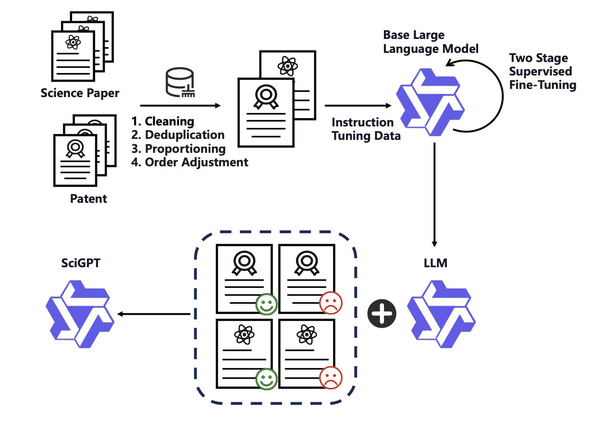
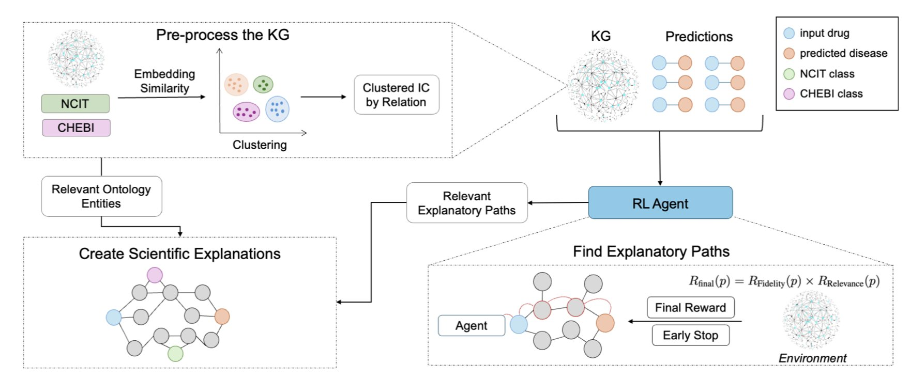
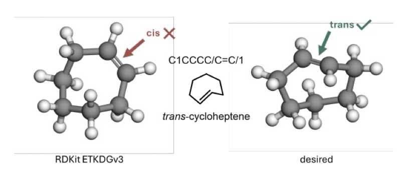

## 目录  
1. SciGPT 通过在架构和训练上的优化，专门解决了科研文献处理的难题，在特定任务上甚至超越了通用大模型 GPT-4。
2. REx 通过一个强化学习奖励机制，在知识图谱上找到了更简洁、更具生物学意义的路径，让老药新用的 AI 推荐变得可信。
3. 一种工作流，它组合现有工具，解决了从 SMILES 生成含张力环分子（strained molecule）的可靠 3D 结构的痛点。

## 1. SciGPT：专为科研打造的 AI，性能超越 GPT-4  
  
  

我们每天都在被海量的科学文献淹没。想跟上某个领域的最新进展，是一项全职工作。通用的大语言模型（Large Language Model, LLM），如 GPT-4，虽然知识渊博，但让它们去读一篇充满专业术语和复杂逻辑的论文，如同让一个博学的文科生在硬啃《有机化学》。它们能看懂字面意思，但很难抓住字里行间的精髓。  
  
SciGPT 专为此而设计。  
  
你可以把 GPT-4 想象成一个知识广博的通才，而 SciGPT 则更像一个在特定领域深耕多年的博士。它之所以更「懂行」，关键在于两方面的设计。  
  
第一，它解决了一个实际的工程问题：内存。处理一篇几十页的论文或技术报告，对很多模型来说，内存很快就会耗尽。SciGPT 用了一个叫「稀疏混合专家」（Sparse Mixture-of-Experts, SMoE）的机制。这如同一个委员会，里面有很多不同领域的专家。当遇到一个化学问题时，模型会自动激活「化学专家」，而让「物理专家」和「生物专家」休息。这样一来，每次只动用一小部分计算资源，内存占用就下来了，处理长文档变得轻松。  
  
第二，它的训练方式很聪明。研究者用了一个两步走的「蒸馏」方法。先用一个大模型（老师）的输出来训练 SciGPT（学生），让它快速掌握科学语言的基础。然后，再用高质量的科学数据进行精调。这如同先跟导师学一遍基础，再自己去啃最前沿的论文。他们还把专业的知识图谱（ontologies）整合了进来，相当于给模型内置了一本专业领域的「字典」和「关系图」，让它能理解概念之间的联系，比如某个激酶和特定信号通路的关系。  
  
在 ScienceBench 这个专门为科学任务设计的考场上，SciGPT 的成绩超过了 GPT-4。这并不奇怪。一个全科医生知识再渊博，在诊断一个罕见的遗传病时，也比不过专科医生。专用模型在自己的地盘上就是有优势。  
  
对做药的人来说，未来 AI 可以更准确地从海量专利和论文中提取化合物结构、实验数据和作用机制，甚至发现不同研究之间被忽略的联系。例如，快速筛选文献中提到过的所有靶向 KRAS G12C 的小分子，并总结它们的 ADME 数据。这能节省我们的时间。  
  
当然，作者也提到，下一步要让模型处理图表等多模态信息，并提高其可解释性。毕竟在科学研究中，我们不仅想知道答案，更想知道「为什么」。但 SciGPT 无疑开了一个好头。  
  
📜Paper: https://arxiv.org/abs/2509.08032  

## 2. REx 用强化学习为老药新用提供可信解释  
  
  

在药物研发领域，我们常听到 AI 能推荐「老药新用」的候选方案。但问题来了，AI 是怎么想的？它给出的推荐，我们凭什么相信？  
  
多数 AI 模型如同一个黑箱，你丢进去数据，它吐出来一个结果，中间过程一概不知。这对于需要严谨验证的药物研发来说，是个大麻烦。  
  
REx 模型解决了这个信任问题：不仅要给出答案，还要把得出答案的推理路径清清楚楚地展示出来，而且这条路径必须在生物学上讲得通。  
  
**REx 的工作原理**  
  
想象一个庞大的生物医学知识图谱（Knowledge Graph, KG）就像一张城市地图。这张地图上布满了点，比如药物、基因、疾病、通路等。点与点之间有路相连，代表它们之间的关系，比如「药物 A 抑制蛋白 B」，「蛋白 B 参与通路 C」，「通路 C 与疾病 D 相关」。  
  
老药新用的任务，就是在这张地图上找到一条从「药物 A」通往「疾病 D」的路径。  
  
传统的模型可能会找到一条路，但这条路可能绕了九曲十八弯，经过很多不相关的节点，没什么实际意义。REx 不一样，它用强化学习训练一个「智能体」（agent）在这张图上寻路。关键在于它的奖励机制，如同给这个智能体设置了导航规则。  
  
**规则一：走捷径，别绕路**。  
REx 引入了一个「提前终止」机制。如果智能体在图谱里走的路径太长，弯路太多，就会被扣分。这背后有个朴素的道理：在生物学上，最直接的解释往往是最可能的。这样一来，模型就倾向于寻找更简洁、更核心的因果链条。  
  
**规则二：走大路，别走小巷**。  
光走捷径还不够，路本身也得有意义。REx 会计算路径上每个节点和关系的「信息量」（Information Content）。简单来说，一个节点或关系在知识图谱里越是明确、重要，信息量就越高。比如，一条经过像 p53 这种明星抗癌通路的路径，得分就会远高于另一条经过某个冷门代谢酶的路径。这保证了 AI 给出的解释是建立在坚实的生物学知识基础上的。  
  
**效果怎么样**？  
  
研究者在 Hetionet、PrimeKG 和 OREGANO 这三个主流的生物医学知识图谱上对 REx 进行了测试。结果显示，它不仅在预测准确性上超过了当前最好的方法，更重要的是，它生成的解释路径质量更高。  
  
他们做了一个消融研究，也就是把 REx 的几个关键部件分别拿掉再测试。结果发现，一旦去掉「提前终止」或「信息量奖励」这两个机制，模型的性能就会明显下降。这证明了这套奖励设计确实是 REx 成功的核心。  
  
最有说服力的，还是领域专家的评判。研究者把 REx 和其他模型生成的解释路径拿给生物医学专家看，让他们打分。结果，专家们普遍认为 REx 给出的解释更合理、更可信。  
  
AI 在药物研发里不应该只是一个给出答案的黑箱。它应该是一个能和科学家对话、提供可验证假说的研究伙伴。REx 生成的路径「药物 A -> 靶点 B -> 通路 C -> 疾病 D」，就是一个清晰的、可以立刻拿到实验室去验证的科学假说。这才是 AI 真正能加速新药发现的地方。  
  
📜Title: Rewarding Explainability in Drug Repurposing with Knowledge Graphs  
📜Paper: <https://arxiv.org/abs/2509.02276>  

## 3. 告别垃圾 3D 结构：strainedSMILES2xyz 新工具  
  
  

做计算化学的同学，想必都遇到过这种头疼事：你拿到一个分子的 SMILES（Simplified Molecular-Input Line-Entry System，简化分子线性输入规范）字符串，想把它变成可靠的 3D 结构，结果软件给你的却是一个能量极高、键长键角完全扭曲的「怪物」。尤其当分子包含像环丁烷或者其他更奇特的桥环、螺环结构时，这种情况简直是家常便饭。  
  
我们都知道，一个错误的 3D 起始结构，对于后续的分子对接、动力学模拟或者任何依赖构象的计算来说，就是「垃圾进，垃圾出」的灾难。  
  
**问题出在哪**？  
  
RDKit、Open Babel 这些我们常用的工具包，它们内置的构象生成算法和力场，是基于大量「正常」分子的数据训练出来的。它们对常规的 sp³碳的 109.5°键角、sp²碳的 120°键角形成了肌肉记忆。但张力环系统里的化学键，如同被硬生生掰弯的钢筋，键角和键长都偏离了正常值。标准算法一看到这种情况就「懵了」，要么直接报错，要么就硬生生套用常规规则，生成一个物理上根本不可能存在的构象。  
  
**一个更「配方**」  
  
Svatunek 实验室的这个`strainedSMILES2xyz`工作流，把现有的工具（RDKit、ORCA）用一种更方式组合了起来，像一个经验丰富的老厨师，知道什么时候该用大火，什么时候该用小火。  
  
它的工作流程是这样的：  
  
1.  **第一步，给 RDKit「松绑**」。这是最巧妙的一点。它没有完全抛弃 RDKit，而是先用 RDKit 生成一个初始构象，但在生成时，它特意放宽了对几何参数的限制。这如同告诉 RDKit：「别太较真，先随便给个差不多的形状就行，我知道这个分子有点怪。」  
  
2.  **第二步，穷举可能性**。SMILES 本身可能存在立体化学的模糊性。这个工作流会系统地生成所有可能的立体异构体，确保不会因为最初的理解错误而错过正确的构象。  
  
3.  **第三步，用力场进行初步优化**。得到粗糙的 3D 结构后，用一个计算廉价的力场（如 MMFF94）快速筛选和优化一下，剔除掉那些明显不合理的构象。  
  
4.  **第四步，上「量子化学」这道硬菜**。这是保证质量的关键。前面步骤得到的最优构象，会被交给 ORCA 软件包，使用半经验量子方法（GFN2-xTB）进行最终的几何优化。力场是基于经验规则的估算，而量子化学方法是从电子结构出发进行计算，对于处理这些不寻常的电子排布和成键方式，精度要高得多。这相当于用精密仪器对零件做最后的精加工，确保尺寸分毫不差。  
  
**效果怎么样**？  
  
研究者们在一个包含 32 个张力与非张力分子的测试集上验证了这套流程。结果显示，`strainedSMILES2xyz`几乎在所有案例中都生成了正确的几何构象，完胜了 RDKit、Open Babel 和 ChemDoodle 3D。即便是对于那些让其他工具「集体阵亡」的分子，它也处理得很好。  
  
而且速度也完全可以接受，处理最复杂的分子也只需要大约 20 秒。这意味着它可以无缝集成到我们日常的计算流程中，无论是处理单个棘手的分子，还是对整个化合物库进行转换。  
  
对于研发人员来说，一个可靠、自动化的工具来处理这种基础但又至关重要的问题，能节省大量手动检查和修正模型的时间。特别是当你设计的分子包含一些新颖的、非经典的骨架时，这个工具的价值就体现出来了。它以开源的 Python 包和 Jupyter notebook 形式发布，方便我们直接上手使用和二次开发。  
  
📜Paper: <https://doi.org/10.26434/chemrxiv-2025-30dqz>  
💻Code: <https://github.com/Svatunek-Lab/strainedSMILES2xyz>
