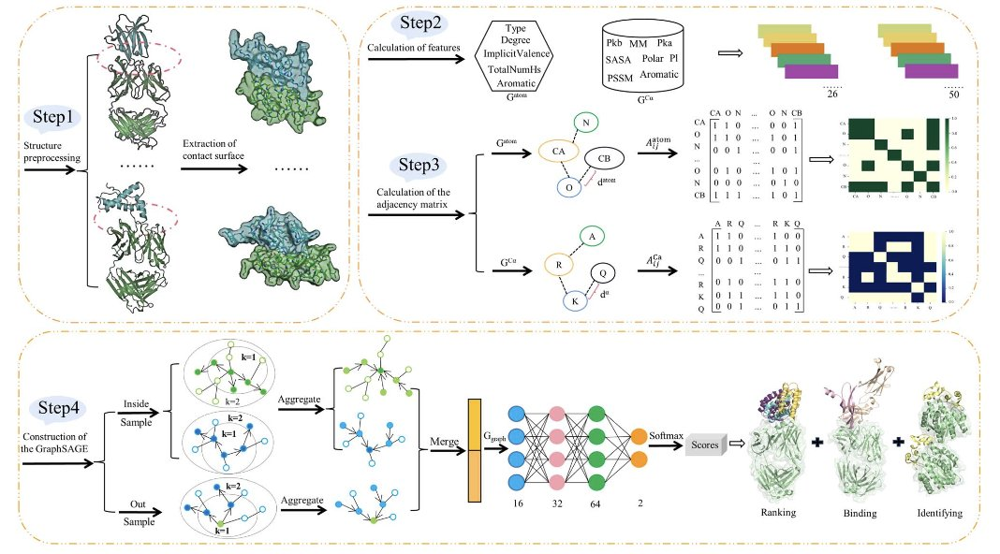
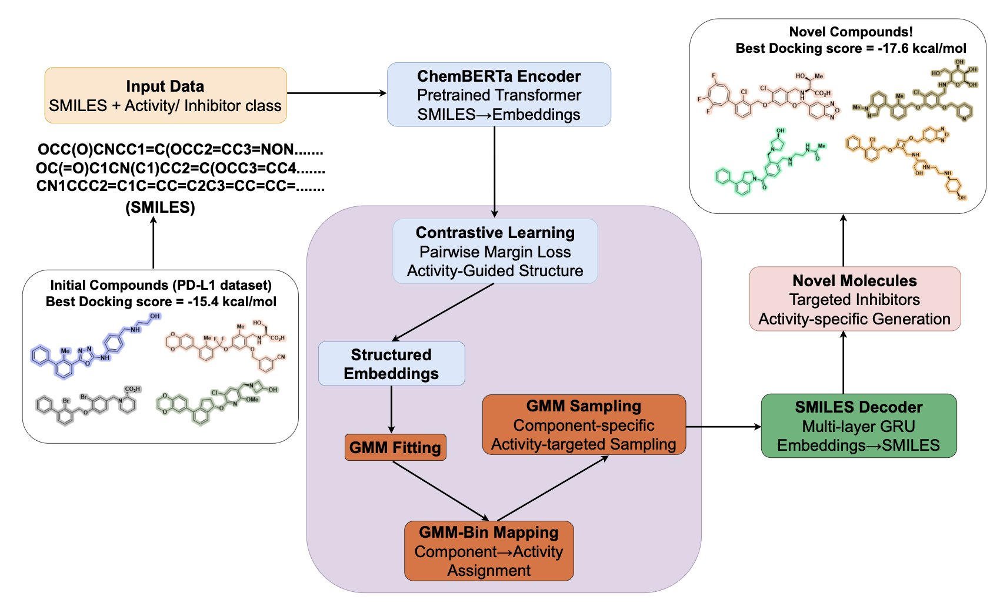
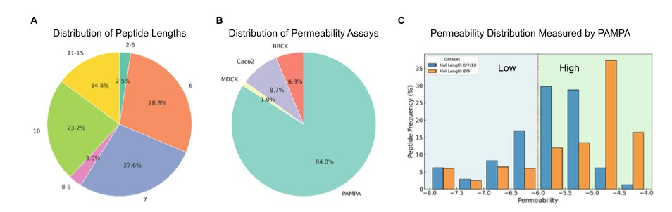

## 目录  
1. SAGERank 是一个基于图神经网络的归纳学习框架，它在抗体 - 抗原对接打分和表位预测上超越了现有方法，且对小数据集有很好的泛化能力。
2. VECTOR+ 通过属性增强的对比学习，为小样本药物发现提供了一个实用框架，能生成对接分数更优且结构新颖的候选分子。
3. 对于环肽膜透性预测，图神经网络（特别是 DMPNN）表现最佳，但要实现真正突破，未来的模型必须整合分子的三维动态结构信息。

## 1. SAGERank: 图神经网络革新抗体 - 抗原对接  
  
  

在计算结构生物学，尤其是抗体药物研发中，预测蛋白质 - 蛋白质相互作用（Protein-Protein Interaction, PPI）很困难。我们用分子对接软件跑出来一大堆可能的结合构象，然后就要面对一个核心问题：哪个才是对的？传统的打分函数，如 Rosetta 或 FoldX，各有千秋，但结果常不尽人意。  
  
SAGERank 模型提供了一个新选择，用图神经网络（Graph Neural Networks, GNN）解决这个问题。  
  
我们来看看它是怎么做的。  
  
首先，研究者把抗体和抗原的相互作用界面看作一个原子级别的图。图里的每个节点就是一个原子，原子之间的连接代表它们的相互关系。这步操作很关键，因为它把复杂的 3D 结构问题，转换成了图网络擅长处理的数据格式。  
  
SAGERank 的核心技术是 GraphSAGE（Graph Sample and Aggregate）。这个算法的厉害之处在于其「归纳学习」（inductive learning）能力。传统的图学习模型很多是「转导学习」（transductive learning），它们只能处理训练时见过的节点。换句话说，你用数据集 A 训练，就只能预测 A 里面的东西，来一个全新的蛋白 B，它就无法处理。  
  
但归纳学习不一样。GraphSAGE 通过聚合邻居节点的信息来学习每个节点的表示，它学到的是一套通用的「聚合规则」。所以，就算来一个全新的、从未见过的蛋白复合物，它也能应用这套规则去理解和预测。这对于药物研发很重要，因为我们永远在面对新的靶点和分子。  
  
结果怎么样？研究者用一个包含 287 个抗体 - 抗原复合物的数据集训练了 SAGERank。这个数据量在深度学习领域其实很小。但得益于归纳学习的能力，它的表现出色。在对接构象排序测试中，SAGERank 的命中率和成功率都明显优于 Zrank、Pisa、FoldX 和 Rosetta 这些老牌工具。这意味着，用 SAGERank 筛选，你更有可能在前几个结果里就找到那个接近天然构象的正确构象。  
  
作者还把 SAGERank 用在了其他地方：  
1.  **T 细胞受体（TCR）识别** ：它同样能很好地处理 TCR 与 pMHC 复合物的识别问题。这证明了模型的泛化能力不错，不只是个「抗体专用」工具。  
2.  **抗原表位（epitope）预测** ：它能准确圈出抗原上与抗体结合的关键区域。对于抗体设计和疫苗开发，这是个有用的功能。  
3.  **分子胶水（molecular glues**） ：研究者甚至在一个分子胶水介导的三元复合物数据集上做了测试，结果显示 SAGERank 也有潜力分辨这种包含小分子的复杂相互作用。这一下就把它的应用场景从生物大分子扩展到了小分子领域。  
  
总的来看，SAGERank 提供了一个强大、高效的 PPI 预测和打分工具。它最大的亮点在于用归纳式图神经网络解决了小数据量下的泛化难题。对于一线研发人员，这意味着多了一个更可靠的计算工具来辅助抗体设计和结构分析，而且它背后的设计思路也为解决其他分子识别问题提供了很好的借鉴。  
  
📜Title: SAGERank: Inductive Learning of Protein–Protein Interaction from Antibody–Antigen Recognition  
📜Paper: https://pubs.rsc.org/en/content/articlelanding/2025/sc/d5sc03707g  
💻Code: https://github.com/sunchuance/SAGERank  

## 2. AI 小数据生成新药？VECTOR+ 用对比学习破局  
  
  

做药物发现，我们常会遇到一个窘境：手上只有几十个活性还不错的苗头化合物，数据量太小，想用 AI 生成模型来帮忙寻找更优的分子结构，模型却「喂不饱」，根本训练不起来。这如同只给了厨师一点点盐和胡椒，却让他做出一桌满汉全席。大多数生成模型都需要成千上万个数据点才能学到东西。  
  
这篇论文里的 VECTOR+ 框架，就是为了解决这个「开局数据少」的实际问题：如果不能靠量取胜，那就让模型学会「看质量」。  
  
**它是怎么工作的**？  
  
整个流程可以分成两步。  
  
第一步，构建一个有意义的化学「地图」，即潜在空间（Latent Space）。传统的自编码器（Autoencoder）模型学习的是如何把一个分子压缩成一串数字，再把它还原回去，重点在「长得像」。VECTOR+ 不这么干。它用的是对比学习（Contrastive Learning）。  
  
你可以这么理解：模型会同时看三个分子。一个「锚点」分子（Anchor），一个和它性质类似（比如活性都很好）的「正样本」（Positive），还有一个性质不同（比如活性差）的「负样本」（Negative）。模型的目标很简单：在它的内部地图上，把「锚点」和「正样本」拉近，同时把「锚点」和「负样本」推远。  
  
反复进行这个过程，潜在空间就不再是简单地按化学结构相似度来组织了。它会根据我们关心的药理属性（比如对 PD-L1 的抑制活性）来重新「分区」。活性好的分子会聚集在一起，形成「优势区域」。这个过程不需要海量数据，因为它关注的是分子间的「相对关系」，而不是每个分子的「绝对坐标」。  
  
第二步，从「优势区域」里创造新分子。当地图画好之后，研究者用高斯混合模型（Gaussian Mixture Model, GMM）来定位那些活性最好的分子聚集区。这如同在地图上找到了几个「宝藏」的位置。然后，模型就在这些「宝藏」区域附近进行采样，生成新的分子坐标，再通过解码器把这些坐标翻译成新的化学结构。  
  
**这套方法真的管用吗**？  
  
研究者用两个靶点对它进行了验证：一个是免疫肿瘤学里的热门靶点 PD-L1，另一个是受体激酶。  
  
对于 PD-L1，他们甚至自己整理并公开了一个包含 296 个小分子抑制剂的数据集，这本身就是个不小的贡献。实验结果很实在：VECTOR+ 生成的新分子，不仅化学结构上和训练集里的分子有明显区别（新颖性高），而且可合成性也很好。最关键的是，它们的分子对接分数比数据库里已知的抑制剂还要高。  
  
这意味着，这个 AI 模型不仅仅是在模仿，而是在已知的基础上，探索出了更有潜力的化学空间。这正是我们希望 AI 在药物研发中扮演的角色：一个能提供高质量、新颖想法的创意伙伴。  
  
他们还把 VECTOR+ 和一些知名的生成模型，比如 JT-VAE 和 MolGPT，放在一起比了比。无论是在对接分数、新颖性还是独特性等指标上，VECTOR+ 的表现都更好。  
  
作为一个研发科学家，我认为这个策略非常贴近实际工作。在项目早期，我们最缺的就是数据。VECTOR+ 这种不依赖海量数据、而是通过强化学习分子间属性差异来构建化学空间的方法，为「AI 赋能早期药物发现」提供了一个可行的解决方案。它生成的不是一堆随机的、无法合成的奇怪结构，而是可以直接启发下一轮化合物设计和合成的、有价值的候选分子。  
  
📜Title: Valid Property-Enhanced Contrastive Learning for Targeted Optimization & Resampling for Novel Drug Design  
📜Paper: https://arxiv.org/abs/2509.00684v1  

## 3. AI 预测环肽膜透性：DMPNN 胜出，但 3D 结构才是关键  
  
  

环肽这类「超越五规则」（beyond Rule of 5, bRo5）的分子是块难啃的骨头，尤其在细胞膜渗透性这个问题上。我们都想找到能准确预测哪个分子能进细胞、哪个会被挡在门外的计算模型。这能为药物设计省下大量的时间和金钱。Liu 等人系统地比较了 13 种主流的机器学习方法，看看到底谁是预测环肽膜透性的「王者」。  
  
这项研究的结论很清晰：基于图的方法，特别是定向消息传递神经网络（Directed Message Passing Neural Network, DMPNN），表现最好。这不意外。对于化学家来说，分子本身就是一张由原子和化学键构成的图。DMPNN 这类模型直接在分子图上进行学习，能很好地理解原子间的连接关系和空间排布，而不是像处理一串文本（SMILES 字符串）那样。它既能看到每个原子周围的「邻居」是什么样（局部特征），也能感知到环另一端官能团的影响（长程依赖），这对于环肽这种大而柔性的分子至关重要。  
  
研究还给出了一个实用的建议：直接预测渗透性的具体数值（回归），比简单地把它分为「高」或「低」两类（分类）要好得多。在药物优化中，我们需要知道一个新分子的渗透性是提高了 10% 还是 10 倍，一个模糊的「更好」标签没什么用。回归模型能给出定量的反馈，这才是我们迭代分子结构时真正需要的信息。  
  
一个有趣的发现是关于数据划分的。在机器学习领域，我们通常认为「骨架拆分」（Scaffold Split）是比「随机拆分」更严格、更能评估模型泛化能力的黄金标准。它能确保训练集和测试集的分子骨架完全不同，防止模型「记住」特定骨架的答案。但在这项研究里，随机拆分的效果反而更好。这听起来有点反直觉，但仔细想想也有道理。目前的环肽渗透性数据集还不够大，化学多样性有限。强行进行骨架拆分，可能会让模型在训练中根本没见过某些类型的化学结构，导致泛化能力下降。这提醒我们，在数据有限的情况下，让模型看到尽可能多样的化学「例子」可能比严格的划分方法更重要。  
  
不过，这项工作最重要的启示，是指出了当前所有模型的「阿喀琉斯之踵」：它们都忽略了分子的三维（3D）乃至四维（4D，即动态）结构。  
  
环肽不是一个刚性的积木，它像一串可以扭动的钥匙链。在水溶液里是一种构象，在接近疏水的细胞膜时又是另一种构象。这种「变色龙」般的构象变化，恰恰是它能否穿过细胞膜的关键。目前的模型都是基于分子的二维结构图，这如同只看一张房子的平面图就想判断它是否宜居一样，丢失了最关键的立体空间信息。  
  
研究者尝试加入 logP 或拓扑极性表面积（Topological Polar Surface Area, TPSA）这类描述符作为辅助任务来提升性能，但效果不佳。这说明简单的物理化学性质还不足以捕捉渗透过程的复杂性。未来的模型要想取得质的飞跃，必须能够处理和理解分子的 3D 构象集合，甚至它们在跨膜过程中的动态变化。我们需要一个高质量的、包含环肽动态构象的数据集，这才是推动这个领域前进的下一个引擎。  
  
📜Title: Systematic Benchmarking of 13 AI Methods for Predicting Cyclic Peptide Membrane Permeability  
📜Paper: https://jcheminf.biomedcentral.com/articles/10.1186/s13321-025-01083-4
