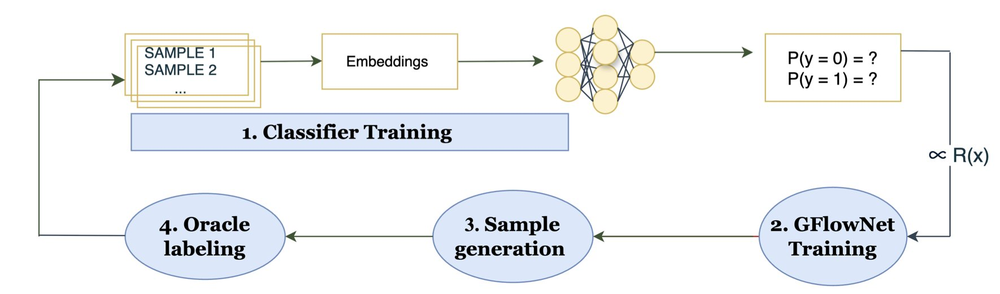
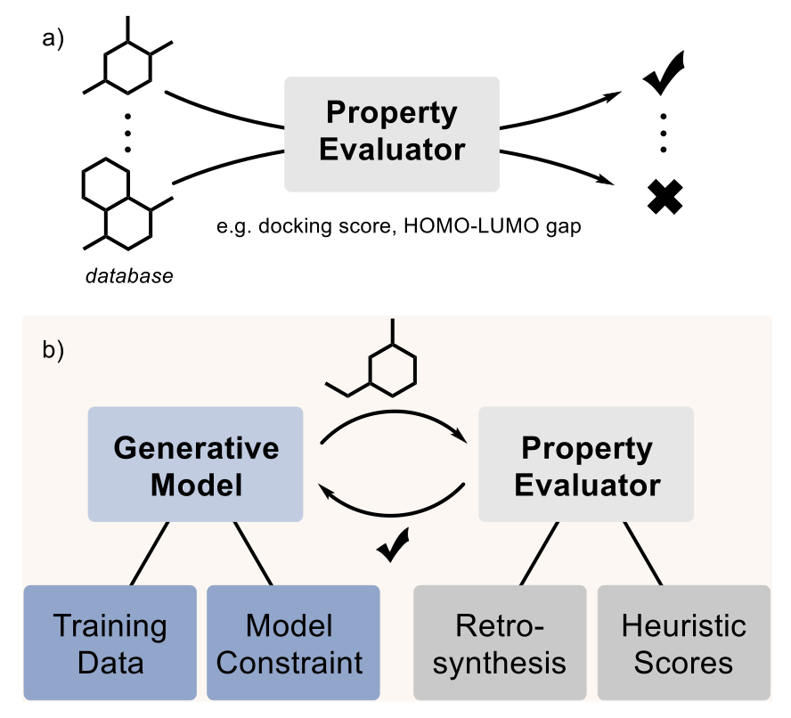
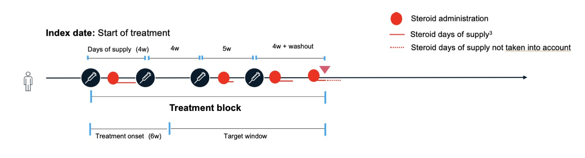

## 目录  
1. BALD-GFlowNet 框架将主动学习从「筛选」模式切换到「生成」模式，摆脱了对候选池大小的依赖，为超大规模分子库的虚拟筛选提供了全新思路。
2. AI 设计分子是第一步，让它学会化学家的合成逻辑，才能真正从虚拟走向现实。
3. 这项研究用机器学习将新药的分子信息与真实世界患者数据结合，试图在临床试验前预测其疗效。

## 1. GFlowNet 赋能主动学习，虚拟筛选提速 2.5 倍  
  
  

CADD 面临的核心挑战之一，就是在浩如烟海的化学空间里高效地找到有潜力的苗头化合物。这个化学空间有多大？10^60 都是个保守的估计。  
  
传统的虚拟筛选，像是大海捞针。为了提高效率，我们引入了主动学习（Active Learning）。它的逻辑很简单：与其随机测试，不如让模型告诉我们，它对哪个分子「最没把握」，我们就去测试那个。这能最大限度地利用每一次昂贵的实验或计算资源。  
  
Bayesian Active Learning by Disagreement（BALD）就是这个领域的经典算法。它的工作方式是，对候选池里的每一个分子都打个分，分数越高代表模型对它的预测分歧越大、越不确定。然后，我们把得分最高的分子挑出来，送去做下一步验证。  
  
这个方法很有效，但有一个致命弱点：它需要给池子里**每一个**分子都打分。当你的分子库从几百万增加到几千万甚至几十亿时，这个打分过程就从一个「特点」变成了「灾难」。计算成本会高到无法承受。这如同你想招一个顶尖程序员，但你的招聘方法是让城里所有人都来做一遍编程测试。效率太低了。  
  
这篇论文提出的 BALD-GFlowNet，就是来解决这个问题的：我们为什么非要在一个固定的池子里「挑」呢？**我们能不能直接「创造」出模型最想看到的那个分子**？  
  
这就是生成流网络（Generative Flow Networks, GFlowNets）登场的时候。你可以把 GFlowNet 理解成一个分子「生成器」。我们不给它一个固定的分子库，而是给它一个奖励函数，这个函数就是 BALD 的不确定性分数。它的任务就变成了：生成一个分子，让这个 BALD 分数尽可能高。  
  
工作流程大概是这样：  
1.  我们先用一小部分已知数据训练一个初始的预测模型。  
2.  然后，我们训练 GFlowNet，让它学习如何「走」一条路径（比如，一步步添加原子和化学键）来构建一个分子，最终的分子能获得很高的 BALD 奖励。  
3.  GFlowNet 直接生成一批高不确定性的分子。我们把这些分子拿去标记（比如，通过实验或高精度计算得到活性数据）。  
4.  再用这些新的、高质量的数据去更新我们的预测模型，让它变得更准。  
如此循环往复。  
  
整个过程中，我们完全绕开了对整个 5000 万分子库的遍历。计算成本只跟生成分子的过程有关，和库有多大没关系了。这就像招聘，你不再搞全民海选，而是直接让一个顶尖猎头给你推荐最合适的人。  
  
研究者们在一个真实的药物发现任务中验证了这个想法：为 Janus 激酶 2（JAK2）靶点寻找抑制剂。结果非常亮眼。在 5000 万规模的分子库上，BALD-GFlowNet 的效率是传统 BALD 的 2.5 倍，并且找到的活性分子的性能不相上下。  
  
这不仅是速度的提升。GFlowNet 在生成分子的过程中，还能保证分子的化学有效性和结构多样性。这对于药物发现至关重要，我们不希望模型生成一堆奇形怪状、根本合成不出来的东西。  
  
这个工作真正的价值在于，它为我们处理超大规模分子库提供了一个可行的、高效的路径。从「在池中筛选」到「按需生成」，这可能是主动学习在药物发现领域向前迈出的一大步。  
  
📜Title: Why Pool When You Can Flow? Active Learning with GFlowNets  
📜Paper: https://arxiv.org/abs/2509.00704  

## 2. AI 制药：分子画得再酷，做不出来都是白搭  
  
  

生成式 AI 制药有一个绕不开的话题，如同实验室里那头谁都看见但假装没看见的大象——你生成的分子，到底能不能合成出来？  
  
很多生成模型像个灵感无限但从不下厨的艺术家。它能「画」出各种新奇的分子结构，但你要是把这些结构丢给合成化学家，他们多半会摇摇头，因为这些东西在现实世界里根本凑不出来。这就是 AI 制药从计算到实验最大的障碍之一。  
  
好在，大家已经开始正视这头「大象」了。这篇论文就梳理了目前行业里应对这个问题的几种主流玩法。  
  
第一种方法最直接：从源头抓起，给模型「喂」一些好东西。你想让它学会做菜，就不能只给它看食材图片，得给它看菜谱。研究者们整理了一些专门的数据集，比如从 ZINC 数据库里筛选出的 MOSES 子集，这里面的分子都是相对容易合成的。用这些数据训练出来的模型，生成分子的可合成性自然会好很多。  
  
第二种思路更像给模型套上一个「紧身衣」，但这件衣服是化学家设计的，有明确的规则。具体来说，就是预先定义好一套可靠的化学反应模板和市面上能买到的原料（building blocks）。模型只能在这个框架内进行创造，它每生成一步，都对应着一个真实的化学反应。这样做的好处是，生成的分子 100% 能合成，甚至连原料供应商都给你找好了。  
  
第三种方法是给模型请个「导航员」。模型在探索化学空间时，每想出一个新的结构片段，「导航员」就会马上给个评分，告诉它这个结构在合成上有多大难度。这个评分就是所谓的「启发式代理」（heuristic proxies），比如常用的 SAscore。它通过分析一个分子可以被拆分成多少常见、已知的化学片段来打分。分数越低，说明它越像那些已经存在于 PubChem 等数据库里的「正常」分子，合成起来可能就越容易。这是一种快速评估的捷径。  
  
当然，这些方法都还不是完美的。现在最大的问题是，大家各玩各的，没有一个公认的「考场」来评判谁的方法更好。A 公司说它的模型生成率高，B 公司说它的分子新颖性好，但标准不统一，很难横向比较。所以作者呼吁，行业需要一个标准化的计算评估流程。比如，大家都用开源的逆合成路线预测工具 AiZynthFinder 来跑一跑，看看谁生成的分子能更快找到靠谱的合成路线。  
  
说一千道一万，计算终究是计算。最终还是要看能不能在通风橱里把东西做出来，测出活性。这方面的工作目前还很少，因为成本太高。但也不是没有成功的例子。论文里就提到了利用生成模型发现新型 KRAS 抑制剂和抗生素的案例，这证明了这条路是走得通的。  
  
未来的方向是什么？研究者们想得更远。比如，让模型直接学习包含多步反应的完整实验路线，而不只是单步反应。或者，干脆打造一个「自动驾驶实验室」（self-driving laboratories），让机器人来搞定合成和测试的脏活累活，彻底打通从模型输出到实验验证的闭环。  
  
📜Title: The elephant in the lab: Synthesizability in generative small-molecule design  
📜Paper: https://doi.org/10.26434/chemrxiv-2025-1lcpq  

## 3. AI 预测新药效果：从分子结构到临床疗效的探索  
  
  

在药物研发中，我们总在寻找能预知成败的模型。每年都有无数候选分子在投入巨额资金和时间后，最终倒在临床试验的终点线前。如果能有一种方法，在分子还在实验室阶段，就大致判断出它对真实患者可能的效果，那将改变游戏规则。这篇论文正是朝此方向的一次尝试。  
  
它的核心思路是我们想绘制一张「药物地图」。这张地图不是根据地理位置，而是根据药物的特性来定位。研究者们尝试了两种绘制地图的方法：  
  
第一种，是基于化学结构的地图。他们使用 SMILES 字符串，这是一种描述分子结构的线性表示法。通过算法分析这些字符串，可以把化学结构相似的分子在地图上放在相近的位置。这如同按照汽车的发动机型号和底盘来分类，结构相似的自然会聚在一起。  
  
第二种，是基于生物功能的地图。这次他们用了 KEGG 数据库，它记录了药物、靶点、蛋白和生物通路之间的复杂关系。这种方法绘制的地图，是把作用机制相似的药物放在一起。这好比按照汽车的用途来分类，跑车归一类，货车归一类，不管它们的发动机具体型号是什么。  
  
地图画好后，接下来是最关键的一步：如何利用它来预测？  
  
研究者们找来了溃疡性结肠炎（ulcerative colitis）患者的真实世界数据。这些数据包含了患者使用了哪些已知药物，以及这些药物的治疗效果。他们把这些信息叠加到「药物地图」上。  
  
现在，当一个全新的、未经测试的药物分子出现时，他们先根据其化学结构或预期的生物功能，在地图上找到它的坐标。然后，模型会查看这个新坐标周围的「邻居」——那些已知的药物。如果邻居们普遍疗效很好，模型就会预测这个新药也可能有效。反之，如果邻居们效果平平，那这个新药的前景可能就不那么乐观。  
  
结果显示，这套方法并非万能。它的预测能力，很大程度上取决于新药和已知药物的相似度。如果一个新药在地图上落在了一片「无人区」，周围没有任何已知药物作为参考，那模型的预测就跟随机猜测差不多。但如果它正好落在一个已知有效的药物集群里，那预测的准确性就会高很多。  
  
这篇工作的价值，不在于它提供了一个能立刻投入使用的预测工具，而在于它建立了一个灵活的框架。你可以把其中的任何一个模块换掉。例如，用更先进的图神经网络来生成分子「指纹」，或者换用更复杂的因果推断模型来分析真实世界数据。  
  
这为我们描绘了一个可能性：未来，在决定将哪个候选分子推向昂贵的临床试验之前，我们可以先用这种方法进行一次「虚拟筛选」，计算出它在真实患者群体中的「预测成功率」。这无法取代临床试验，但它能帮助我们把宝贵的资源集中在最有希望的候选者身上，哪怕只是将我们的成功率提高几个百分点，对于整个行业来说，也是巨大的进步。  
  
📜Title: Predicting Effect of Novel Treatments Using Molecular Pathways and Real--World Data  
📜Paper: <https://arxiv.org/abs/2509.07204v1>
