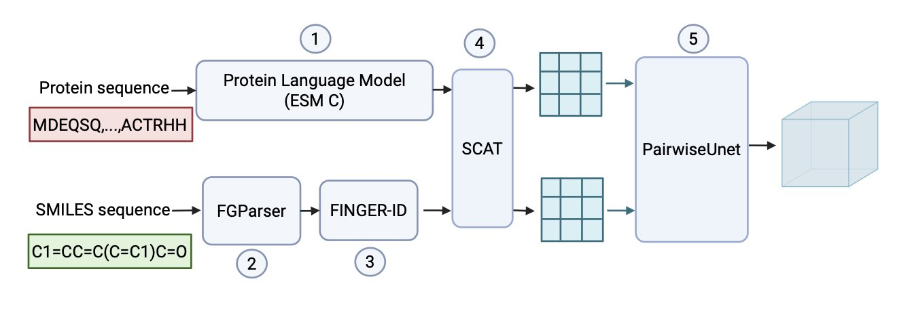
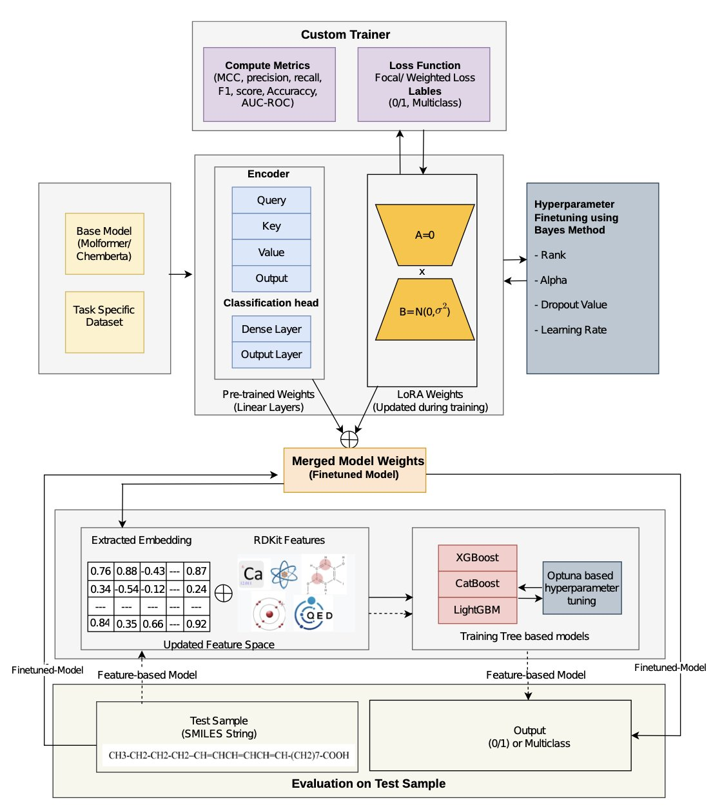
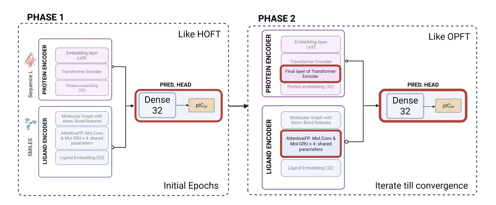

## 目录  
1. LINKER 模型仅用序列即可预测蛋白质与小分子间的具体化学作用类型，为缺乏 3D 结构的药物研发项目提供了关键洞见。
2. EffiChem 使用 LoRA 技术微调化学大语言模型，并结合经典分子描述符，实现了低成本、高性能的分子属性预测。
3. 在抗病毒药物预测中，对于 ADME 属性，精选特征的 XGBoost 模型表现优于 GNN；对于药物效力，迁移学习是更有效的策略。

## 1. LINKER：无需 3D 结构，从序列预测相互作用  
  
  

在药物发现中，我们常面临一个问题：有苗头化合物，也知道它们作用的靶点蛋白，但没有蛋白 - 配体复合物的 3D 结构。没有结构，就像在黑暗中摸索，分子优化无从下手，许多计算工具也因此失灵。  
  
LINKER 模型解决了这个老问题。它仅根据蛋白质的一维氨基酸序列和小分子的 SMILES 式，就能预测它们之间可能发生的具体化学相互作用。  
  
**这是它的工作原理**  
  
这如同让一个学生备考。你先给他一套带答案的练习题（已知的蛋白 - 配体 3D 结构），让他反复学习。在这个过程中，他不仅知道哪道题选 A，还理解了为什么选 A。例如，他看到一个羧基和一个精氨酸残基挨得很近，通过答案（3D 结构）他学到，这两者大概率形成了一个盐桥。他反复学习成千上万个这样的例子，就掌握了规律。  
  
LINKER 的训练过程就类似这种「开卷考试」。研究者利用 PDBBind 数据库里大量已知的 3D 结构作为「答案」，让模型学习哪些氨基酸残基和哪些小分子官能团之间会发生什么样的「化学握手」，比如氢键（hydrogen bonds）、π-π堆积（π-stacking）或盐桥（salt bridges）。这种方法被称为「结构监督」（structure-supervised）。  
  
训练完成后，就到了「闭卷考试」的时候。你给 LINKER 一个全新的蛋白序列和一个新的小分子，它没有 3D 结构可以参考。但凭借之前学到的化学知识，它能直接预测出两者之间最可能发生的相互作用模式。  
  
**这为什么重要**？  
  
以前很多模型也能预测相互作用，但它们通常只输出一张「接触图」，告诉你「这里和那里离得很近」。这有些用处，但不够。作为化学家，我们想知道的是它们为什么离得近：是氢键拉近了它们，还是疏水作用？  
  
LINKER 给出的就是化学家真正关心的信息。它直接告诉你：「这个苯环和那个色氨酸残基正在发生π-π堆积」。这种信息是可操作的。你可以马上想到，如果把苯环换成一个带给电子基团的芳环，这个作用也许会更强。  
  
**它的表现如何**？  
  
研究者在 LP-PDBBind 这个基准数据集上测试了 LINKER。结果显示，它预测相互作用的准确率和召回率都比现有方法更高。  
  
更有说服力的是，LINKER 在预测结合亲和力（binding affinity）方面也表现不错。一个模型如果真正理解了决定结合的关键化学作用力，那么它对这些作用力的综合判断，理应和分子的结合强度有直接关系。LINKER 虽然没有专门针对亲和力预测进行训练，但其预测结果与实验测定的亲和力有很好的相关性。这证明了模型学到的是真实的化学原理。  
  
对于药物研发人员来说，在项目早期，当晶体结构还遥遥无期时，LINKER 这样的工具能提供一个基于化学原理、可解释的分子作用模型，帮助我们更快地设计出更好的分子。  
  
📜Title: Linker: Learning Interactions Between Functional Groups and Residues With Chemical Knowledge-Enhanced Reasoning and Explainability  
📜Paper: https://arxiv.org/abs/2509.03425v1  

## 2. EffiChem：用 LoRA 让化学大模型炼丹更高效  
  
  

大语言模型 (Large Language Model, LLM) 在药物发现领域潜力巨大，但模型体积庞大。例如 Molformer-XL 这类模型，预训练成本高昂。若为预测毒性、血脑屏障 (BBB) 通透性等不同任务，都对整个模型进行微调，成本和时间将难以承受，如同为烤制不同口味的蛋糕而每次都新建一座烤箱。  
  
EffiChem 框架提供了一种解决方案：参数高效微调 (Parameter-Efficient Fine-Tuning, PEFT)，具体采用 LoRA (Low-Rank Adapters) 技术。  
  
其原理是冻结预训练大模型的主体参数，在特定层旁插入小型的可训练「适配器」矩阵。针对新任务微调时，仅训练这些参数量极小的适配器。这好比为一台通用发动机（预训练大模型）加装并调校一个涡轮增压器（LoRA 适配器），而不改动发动机本身。这种方法减少了需训练的参数，降低了计算成本。在毒性预测和 BBB 渗透性等多个公开数据集上，其 AUC 较 Molformer-XL 和 MAMMAL 等现有模型提升了 3-5%。  
  
EffiChem 并未完全抛弃传统方法。  
  
研究者将微调后模型产生的分子嵌入 (embedding)，与 RDKit 计算出的传统分子描述符（如分子量、脂水分配系数）拼接，再将融合后的特征输入 XGBoost 或 LightGBM 等经典机器学习模型进行最终预测。大模型的深度表征能捕捉复杂的构效关系，而传统描述符如同化学家的经验法则，直观有效。两者结合，如同经验丰富的专家与装备先进的年轻人协作。  
  
EffiChem 还考虑了真实数据的挑战。例如，毒性数据集中有毒分子通常是少数，存在类别不平衡。模型容易「躺平」，将所有分子预测为无毒，这样虽然准确率高，但没有实用价值。EffiChem 通过加权损失函数和焦点损失 (focal loss) 函数来处理该问题，引导模型关注少数但重要的样本。  
  
模型还引入了积分梯度 (integrated gradients) 进行可解释性分析。它不仅预测分子是否有毒，还能指出分子上可能导致毒性的原子或官能团。这种信息能直接指导药物化学家优化分子结构，进行药物设计。  
  
EffiChem 提供了一套实用、高效的工作流，而非一个全新的模型。它降低了使用和部署大型化学语言模型的门槛，使小团队和个人研究者也能利用这些前沿工具，有助于加速整个药物发现领域的发展。  
  
📜Title: EffiChem: Efficient Adaptation of Chemical Language Models for Molecular Property Prediction  
📜Paper: https://doi.org/10.26434/chemrxiv-2025-2lljt  
💻Code: https://github.com/kavyagl2/Molformer_git  

## 3. AI 药物预测实战：ADME 任务 XGBoost 胜出，效力预测迁移学习占优  
  
  

ASAP-Polaris-OpenADMET 抗病毒药物挑战赛的一份报告展示了两种不同策略的成功应用。这反映了 CADD  中常见的选择：依赖专家知识，还是利用深度学习。  
  
#### ADME 预测：经验驱动的特征工程  
  
ADME（吸收、分布、代谢、排泄）预测旨在评估一个分子成为药物的基本性质，如水溶性、代谢稳定性等。  
  
研究者首先进行了特征工程，精心挑选了 55 个分子描述符，如分子量、脂水分配系数 (LogP) 和拓扑极性表面积 (Topological Polar Surface Area, TPSA)。这些特征凝聚了数十年的药物化学知识。  
  
然后，他们将这些特征输入 XGBoost 模型，一种在处理表格数据上表现出色的梯度提升树模型。在 5 个 ADME 预测任务中，这种组合在 4 个任务上的表现超过了直接从分子结构中学习的图神经网络 (Graph Neural Network, GNN)。  
  
GNN 能自动从分子图结构中学习特征，但需要大量优质数据来理解化学规律。若数据集规模有限或化学空间较窄，GNN 学到的特征可能不如人类专家总结的描述符直接有效。  
  
#### 药物效力预测：大数据预训练模型  
  
药物效力 (Potency) 预测更为复杂，需要精确理解药物分子与靶点蛋白的相互作用，关键在于「特异性」。  
  
为此，研究者采用了融合模型，结合 AttentiveFP-GNN 和 Transformer。GNN 擅长理解分子局部化学环境，而 Transformer 能捕捉长距离相互作用。  
  
此策略的关键是「迁移学习」 (transfer learning)。模型并未直接在小规模的挑战赛数据集上训练，而是先在 ChEMBL 数据库的海量蛋白 - 配体数据上进行「预训练」。  
  
这个过程如同让学生在考试前通读图书馆的相关书籍，掌握了化学与生物相互作用的通用规律。之后，再针对挑战赛的特定任务进行「微调」 (fine-tuning)，模型学习效率和效果都得到提升。最终，该模型在盲测中取得了约 0.79 的平均绝对误差 (Mean Absolute Error, MAE)，这是一个不错的成绩。  
  
这项工作表明，不存在适用于所有问题的「万能模型」。在 CADD 领域，应根据问题选择工具。对于 ADME 这类规律相对明确的问题，基于专家知识的特征工程结合经典模型可能是一条捷径。而对于靶点特异性结合等复杂问题，利用海量数据预训练复杂的深度学习模型，则是更有效的路径。  
  
📜Title: Experiments with data-augmented modeling of ADME and Potency endpoints in the ASAP-Polaris-OpenADMET Antiviral Challenge  
📜Paper: https://doi.org/10.26434/chemrxiv-2025-1tb2m    
Code: https://github.com/apalania/Polaris_ASAP-Challenge-2025
