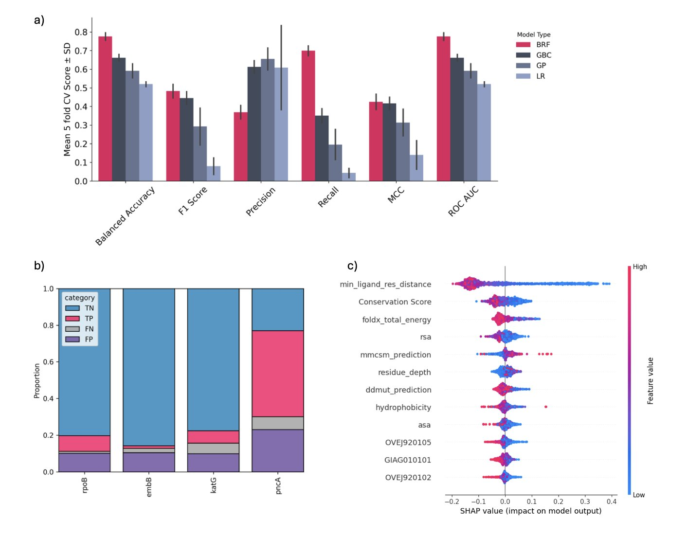
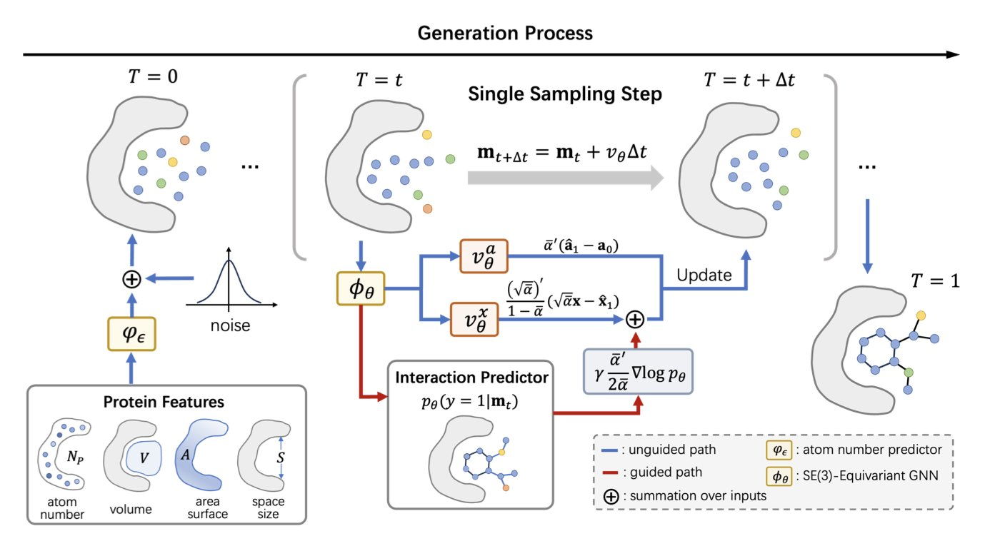
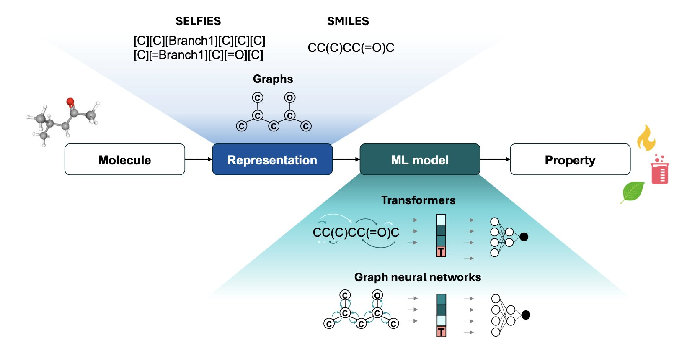

## Table of Contents
1. By fine-tuning a protein language model on resistance data, AMRscope can accurately predict drug resistance risk from single amino acid mutations. This gives us a chance to issue warnings and intervene before new resistant strains become widespread.
2. PAFlow uses a novel flow matching framework, guided by prior knowledge and a learnable atom number predictor, to improve the speed and binding affinity of molecule generation. It sets a new performance benchmark for structure-based drug design.
3. Molecular machine learning is moving from predicting the properties of single molecules to a new phase: integrating physical knowledge to design and optimize entire chemical processes.

## 1. AMRscope: Using AI to Pinpoint Drug-Resistant Mutations in Superbugs Ahead of Time

Antimicrobial Resistance (AMR) is a central problem in drug development and public health. We are always playing catch-up: a new "superbug" appears, and only then do we start studying why it's resistant and developing new drugs. The AMRscope tool tries to change this dynamic, moving us from reactive to predictive.

#### The Core Idea: Teaching a "Protein Expert" to Recognize "Resistance Signals"

Protein Language Models (PLMs) have changed many areas of biology. You can think of a PLM as a Large Language Model that specializes in protein sequences. By learning from massive amounts of protein sequence data, it understands the "grammar" and "semantics" of proteins—how amino acids are arranged to form functional structures.

ESM2 is one of the most powerful PLMs available. But it's a generalist; it understands all proteins but isn't an expert in any specific field. The clever part of this research is that they didn't start from scratch. They took the general ESM2 model and fine-tuned it on a specialized AMR dataset.

This process is like taking a knowledgeable general physician and turning them into a top infectious disease specialist through focused clinical training. After this training, the model, now called AMRscope, becomes highly sensitive to the amino acid mutation signals associated with drug resistance.

#### Not Just a Black Box: Performance and Interpretability

The quality of a predictive model isn't just about accuracy. AMRscope performs well on test sets, with an accuracy of 0.88 and an F1-score of 0.87. More importantly, it maintains good predictive power on bacteria and genes it has never seen before. This shows that the model has learned the general principles of resistance, not just memorized the answers in the training data.

The authors also show why the model is trustworthy. They conducted an in silico deep mutational scanning. In simple terms, they took a protein that interacts with an antibiotic, systematically mutated each of its amino acid sites, and had AMRscope score each mutation to see which ones were most likely to cause resistance.

The results were interesting. When they mapped these predicted high-risk "hotspot" mutations onto the protein's 3D structure, they found that these sites often clustered near the antibiotic's binding pocket. This aligns perfectly with our biological intuition: changing the structure of the drug's binding site is the most direct way to make the drug ineffective. This interpretability gives users more than just a cold "yes/no" answer; it shows *why* a mutation might be dangerous.

#### Practical Value: From Monitoring to Mechanistic Research

AMRscope is designed as a monitoring tool. When a new bacterial strain is isolated in a clinic and sequencing reveals a new mutation on a known target protein, we can use AMRscope to quickly assess its risk. It outputs a probability, like "this mutation has an 85% chance of causing resistance." This quantitative risk assessment is valuable for clinical decisions and public health alerts.

It also outperforms some general-purpose prediction tools, like ESM2-ZeroShot or ProtT5-ZeroShot. This again demonstrates the importance of domain-specific knowledge (in this case, AMR data) for fine-tuning models.

Of course, the tool has its limits. The current model is based mainly on protein sequence information. The authors mention that future work could integrate molecular dynamics simulations to better capture how protein dynamics affect resistance, or add chemical structure information for specific antibiotics to make predictions more targeted.

AMRscope is a well-designed and solidly engineered computational tool. It combines a powerful foundation model with critical domain data to give us a promising "scout" in the tough fight against AMR.

📜Paper: <https://www.biorxiv.org/content/10.1101/2025.09.12.672331v1>

## 2. PAFlow: A New Standard in Structure-Based Drug Design, Faster and More Accurate

In computer-aided drug design (CADD), our core task is to design a molecule that fits perfectly into the active pocket of a specific protein target. It's like designing a unique key for a complexly shaped lock. In recent years, methods based on diffusion models have been popular, but they are like a sculptor who needs to revise a sketch many times. The generation process is slow and sometimes unstable.

A new paper introducing the PAFlow model offers a new approach.

PAFlow's first highlight is its use of a "Flow Matching" framework. You can think of it this way: traditional diffusion models start from a cloud of random noise and gradually "denoise" it over thousands of small steps to "sculpt" a molecule. This process involves many steps and is computationally expensive. Flow matching is different. It defines a clear, continuous path, or "flow," from random noise to the target molecule. Like a navigation route with a set start and end point, the model just needs to learn the direction and speed to travel along this path. This process is more direct and stable. The researchers designed different flow matching strategies for the 3D coordinates of atoms and their discrete types, ensuring the entire generation process is precise.

A generation framework alone isn't enough. How do you ensure the generated molecules are "good"? This leads to PAFlow's second clever design: a built-in protein-ligand interaction predictor. This predictor acts as a "guide." At every step, as the molecule "flows" from a noise state to its final structure, this guide evaluates the current state: "Is this conformation moving in a direction that leads to high-affinity binding with the target?" If the direction is wrong, it immediately adjusts the vector field of the "flow," guiding it back on track. This method integrates biophysical prior knowledge directly into the molecule generation process. The model no longer blindly generates molecules that are chemically possible but biologically ineffective. Instead, it actively searches for those truly effective "keys."

Finally, there's another problem that plagues many generative models: how large should the molecule be? If it's too small, it won't make enough contact with the target, and affinity will be low. If it's too large, it won't fit in the pocket or might introduce undesirable physicochemical properties. Many models rely on a predefined distribution of atom counts, which is like randomly grabbing a key blank and hoping it's the right size. PAFlow makes an improvement here: it includes a learnable atom number predictor. This module first "observes" the geometry of the target protein pocket and then predicts how many atoms the most suitable molecule for this pocket should have. It measures the lock before making the key. This "tailor-made" approach ensures that the generated molecules have the potential to be a good size match for the target right from the start.

So, how effective is this combination? PAFlow set a new record on the industry-standard CrossDocked2020 benchmark. Its average Vina score reached -8.31, which is a strong performance. Even more important is its efficiency. PAFlow needs only 20 sampling steps to produce high-quality molecules, whereas typical diffusion models often require 1000 steps. A 50-fold increase in efficiency means we can explore much more chemical space in the same amount of time, speeding up the discovery of hit compounds in real-world drug discovery projects.

The authors' ablation studies confirmed that each of the three components—the flow matching framework, the prior knowledge guidance, and the atom number predictor—contributes to the model's final performance. This shows that PAFlow's success is not accidental but the result of a well-thought-out, systematic design. For researchers in CADD, a tool that offers both high accuracy and high efficiency is exactly what we have been waiting for.

📜Title: Prior-Guided Flow Matching for Target-Aware Molecule Design with Learnable Atom Number
📜Paper: https://arxiv.org/abs/2509.01486v1

## 3. Molecular Machine Learning: AI Will Design Not Just Molecules, but Chemical Plants

In the last few years, machine learning, especially Graph Neural Networks (GNNs) and Transformer models, has been successful at predicting molecular properties. This is like giving chemists a pair of "X-ray eyes" that can take a molecular structure and quickly estimate its solubility, boiling point, or reactivity. The authors of this review argue that this is just the beginning.

We used to use methods like UNIFAC or COSMO-RS to predict these properties. They are essentially empirical models based on functional group contributions, like a giant look-up table. This approach is practical, but its accuracy often drops when dealing with novel molecular structures. Models like GNNs learn directly from the atomic connectivity of a molecule (its "graph"), allowing them to capture more subtle structural differences and perform better on many tasks.

But there is a key issue here. Purely data-driven models can make predictions that are physically implausible, for example, violating the laws of thermodynamics. This is a fatal flaw for chemical process design, which requires precise calculations and simulations. The authors emphasize an important direction: integrating physical chemistry knowledge into machine learning models.

One way to do this is to add physical constraints during the model's training, for instance, by using a loss function to penalize predictions that do not conform to thermodynamic consistency. The benefit is that the model not only learns patterns from the data but also learns to obey fundamental physical laws. This makes its predictions more reliable and more trustworthy for researchers and engineers.

The biggest highlight of this paper is its shift in perspective from single molecules to entire chemical processes.

In the past, the question we used AI to answer was: "What are the properties of this molecule?" Now, the authors want to answer a more complex question: "To achieve a specific production goal (like lowest cost or least energy consumption), which molecule should we choose, and what kind of process should we use to produce and separate it?"

This is a leap from "analysis" to "design." It means we need to connect molecular property prediction models with chemical process simulation software (like Aspen). AI would be responsible for searching the vast chemical space for candidate molecules, and the process simulator would then evaluate the efficiency and cost of the entire process using those molecules. The two would form a closed loop, iterating and optimizing until a global optimal solution is found. This field is still largely unexplored and has enormous potential.

Of course, challenges remain. A "perfect molecule" designed in a computer might be extremely difficult to synthesize in the real world or have unknown safety risks. Therefore, the authors call for close collaboration between academia and industry.

We need to establish public benchmarks to evaluate the performance of different models. Industry needs to get involved to conduct real experiments to validate the AI-designed candidate molecules. Without feedback from the lab, AI models are just playing a complex simulation game and cannot solve real industrial problems.

📜Title: Molecular Machine Learning in Chemical Process Design
📜Paper: <https://arxiv.org/abs/2508.20527v1>
