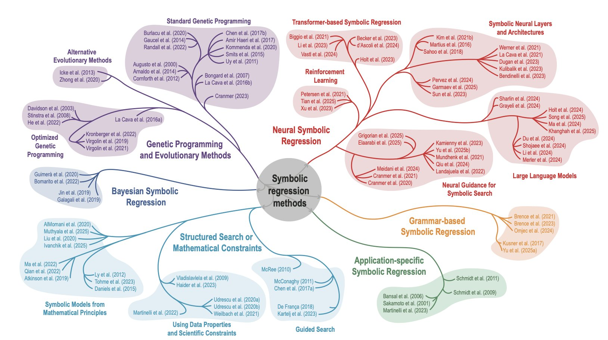
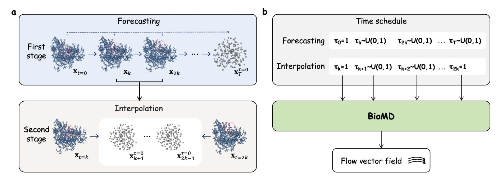
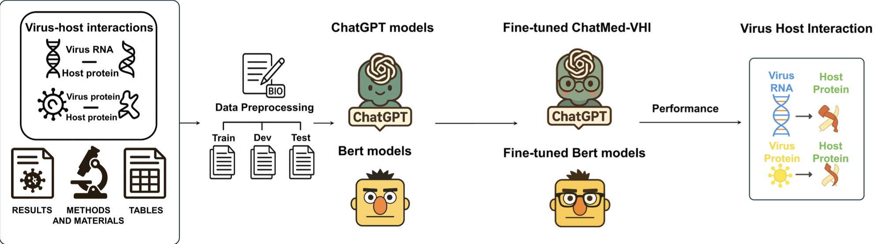

## Table of Contents
1. Building a digital twin of a biological system from data can't be done with just one method. The future lies in hybrid frameworks that merge multiple techniques.
2. BioMD's "coarse-to-fine" hierarchical strategy lowers the cost of long-timescale, all-atom molecular dynamics simulations, showing high efficiency and physical realism in predicting ligand unbinding pathways.
3. With instruction-tuning, Large Language Models can efficiently extract virus-host interaction data from full papers. Even with little training data, they far outperform traditional models.

## 1. Digital Twins in Pharma: The Challenge of Getting from Data to Models

"Digital Twin" is a hot term right now, used in everything from manufacturing to aerospace. In drug discovery, the idea is just as appealing: create a virtual, computable copy of a cell, an organ, or even a patient inside a computer.

The appeal is that we could run all sorts of experiments on this virtual copy. We could test a newly designed molecule to see its effect on a signaling pathway, or predict a patient's response to a specific therapy. All this could happen before synthesizing compounds or running clinical trials, which in theory would save time and money.

But here’s the problem: how do you actually build this "twin"?

We have plenty of data—mountains of it from omics, imaging, and time-series studies. The challenge is to automatically dig through this messy data and find the mathematical models that accurately describe the underlying rules of a biological system. This review paper sorts through the tools we currently have and lays out their pros and cons.

The authors focus on two classic methods: Symbolic Regression and Sparse Regression.

Symbolic Regression is a brute-force approach. You give a computer a set of basic mathematical building blocks—add, subtract, multiply, divide, logarithms, trig functions—and let it assemble them in every possible way until it finds an equation that perfectly fits your data. The upside is flexibility. It doesn’t require many prior assumptions and could potentially uncover biological mechanisms we never expected. But the downside is obvious: the computational load is staggering, like finding a specific needle in the entire galaxy. It also often spits out a monstrously complex and uninterpretable equation that, while fitting the data, doesn't help us understand the mechanism at all.

Sparse Regression takes a different path. It’s more like a disciplined artisan. You start by giving it a huge library of possibilities, like all the potential interactions in a complex network. Then, it uses algorithms (like the classic LASSO) to "prune" this library, keeping only the few essential terms that are most important for explaining the data. The benefit is that the resulting model is clean and easy to interpret. You get the results and can clearly see, "Ah, it's the phosphorylation of protein B by kinase A that's driving this." But the risk is that you might accidentally prune away weak but critical interactions—the classic "throwing the baby out with the bathwater" problem.

So, can the newer tools like deep learning and Large Language Models (LLMs) solve this?

The authors mention that these new tools do have potential, especially for integrating prior knowledge. For instance, an LLM can learn from millions of papers that a certain protein belongs to a specific family or that a known crosstalk exists between two pathways. It can use this information as a "hint" to guide the model-building process.

But we have to be realistic. The reliability of these models is still a huge question mark. They can "hallucinate," confidently stating nonsense as fact. If these hallucinations are treated as scientific truth and used to guide subsequent research, the damage could be disastrous.

The paper points out the elephant in the room for all these methods: **the complexity of biological data itself**.

Real-world biological data is never clean. It’s full of noise, measurement errors, and we can never measure every variable in a system (meaning there are lots of hidden variables). An algorithm that runs beautifully on simulated data often collapses when you feed it real experimental data.

Because of this, the authors call for a standardized Benchmarking Framework, and I completely agree. We need a recognized "testing ground" to evaluate different algorithms on the same set of challenging, realistic datasets. That’s how we’ll separate what works from what doesn’t.

The path forward proposed by the paper also aligns with my own judgment: the future belongs not to any single method, but to Hybrid Frameworks.

We can imagine a workflow like this:
1.  First, use existing biological knowledge to build a basic mechanistic model skeleton.
2.  Then, use deep learning models to fit the complex, non-linear parts that we don’t yet understand.
3.  Finally, place the entire model within a Bayesian Inference framework to get not just a prediction, but also the uncertainty of that prediction.

For drug discovery, knowing "how uncertain the model is" is just as important as knowing "what the model predicts." This helps us make more rational decisions and avoid pouring resources down the wrong path.

This review gives us a clear roadmap. It shows the bright future of automated model discovery but is also honest about the thorns along the way.

📜Title: Data-Driven Discovery of Digital Twins in Biomedical Research
📜Paper: <https://arxiv.org/abs/2508.21484>

## 2. The BioMD Generative Model: Hitting Fast-Forward on Molecular Dynamics

In drug development, we’re always racing against the clock. A molecule’s effectiveness isn't just about how tightly it binds to a target (affinity), but also how long it stays there (residence time). This residence time, defined by the dissociation rate constant k_off, directly determines how long a drug's effect lasts. Predicting it on a computer traditionally requires running Molecular Dynamics (MD) simulations. The problem is, a ligand escaping from a binding pocket can take milliseconds or even seconds. Simulating this step-by-step with traditional MD is a computational black hole; it can easily run for weeks or months.

The BioMD generative model offers a completely new way to solve this. Instead of grinding through every single femtosecond of movement, it takes a "divide and conquer" approach.

It works in two steps. First, it uses a coarse-grained model to sketch out the molecule's general movement over nanoseconds or even longer. You can think of this like planning a long road trip by first deciding which major cities you'll pass through, rather than worrying about every single side street from the start. This is fast and effectively avoids the cumulative errors—"one wrong step leads to a cascade of errors"—that plague traditional long-run MD simulations.

Second, between these key "city" nodes, BioMD switches to a fine-grained, all-atom model to fill in the gaps. This model adds all the details, generating a complete, physically realistic atomic trajectory. It’s like using a high-precision GPS to navigate once your main route is set, ensuring every turn is accurate. This process relies on a velocity network and an SE(3)-equivariant graph transformer. In simple terms, these mathematical tools ensure the model correctly understands 3D rotations and translations, making sure the generated molecular conformations don't violate the laws of physics.

The most impressive part of this model is that it operates directly at the all-atom level. Many models trying to be fast simplify amino acids into a few points, ignoring a lot of side-chain detail. But we all know that drug-protein interactions often depend on subtle hydrogen bonds and hydrophobic effects. BioMD keeps all the atoms, allowing it to capture these make-or-break details.

The researchers tested BioMD on two challenging datasets. The results showed that for a typical long-timescale event like ligand unbinding, BioMD successfully generated a dissociation pathway in 97.1% of attempts within ten tries. This isn't just a number; it means we now have a reliable tool to quickly and systematically explore the potential "escape routes" of a drug molecule. This is immensely valuable for understanding drug resistance or for designing molecules with longer residence times.

BioMD also offers two modes: one focused on accurately reproducing known pathways, and another focused on exploring new possibilities. This flexibility is very useful in R&D. Sometimes we need to confirm a known mechanism, and other times we hope to discover unexpected new conformations or pathways. BioMD can handle both.

📜Paper: https://arxiv.org/abs/2509.02642v1

## 3. A New Way for AI to Read Papers: Small-Sample Fine-Tuning for Full-Text Virus-Host Interaction Extraction

In drug discovery, extracting key information like "how virus protein A interacts with host protein B" from massive amounts of literature is a heavy lift. Most past Natural Language Processing (NLP) tools only analyzed paper abstracts. That's like trying to understand a movie by only watching the trailer over and over, missing all the critical details and evidence.

A new paper demonstrates a more efficient method. Researchers used "Instruction-Tuning" to train a general-purpose LLM into a biomedical expert, which they named ChatMed-VHI.

It works a lot like training an intern. You don't need them to memorize the entire company handbook. You just give them clear instructions: "Go into this paper, find all the protein-protein interactions (PPIs) and RNA-protein interactions (RPIs) between the virus and the host, and tell me if you found this information in the 'Results,' 'Methods,' or 'Tables' section." This approach is highly efficient.

This model has two standout advantages.

First, it can read the entire paper, not just the abstract. An abstract might say, "we discovered an interaction between A and B," but the specific details of how it was discovered, the experimental conditions, and the data's reliability are usually buried in the "Methods" and "Results" sections. Tables also contain a wealth of structured data. ChatMed-VHI can "read section by section," understanding the value and style of information in different parts of a paper.

Second, it requires very little data. Training an NLP model used to require thousands of manually labeled examples, which was time-consuming and expensive. ChatMed-VHI achieved an F1 score of 89.7% with fewer than 500 training samples. This is very valuable in real-world R&D settings where resources are limited. We can quickly customize an efficient model for a new information extraction task at a very low cost.

This makes it possible to rapidly build virus-host interaction knowledge graphs and accelerate the discovery of potential drug targets. For example, when a new virus emerges, we could use this tool to quickly scan all relevant literature and piece together the complete mechanism of viral invasion and replication. This is no longer simple text search; it's a tool that extracts structured knowledge from unstructured text to speed up the drug discovery process.

📜Title: Instruction-tuned extraction of virus-host interactions from integrated scientific evidence
📜Paper: https://www.biorxiv.org/content/10.1101/2025.09.02.673691v1
Code: https://github.com/benkyusimasu/ChatMed-VHI
