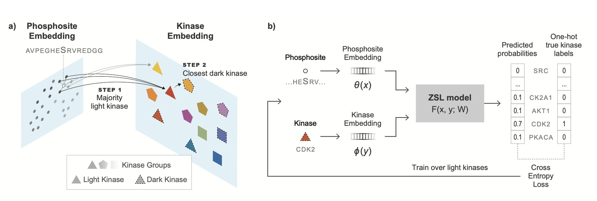
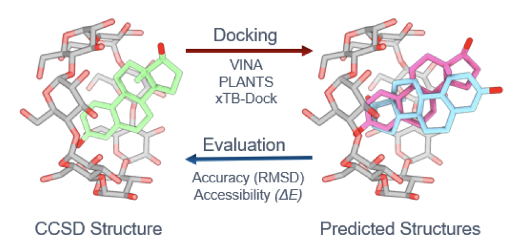
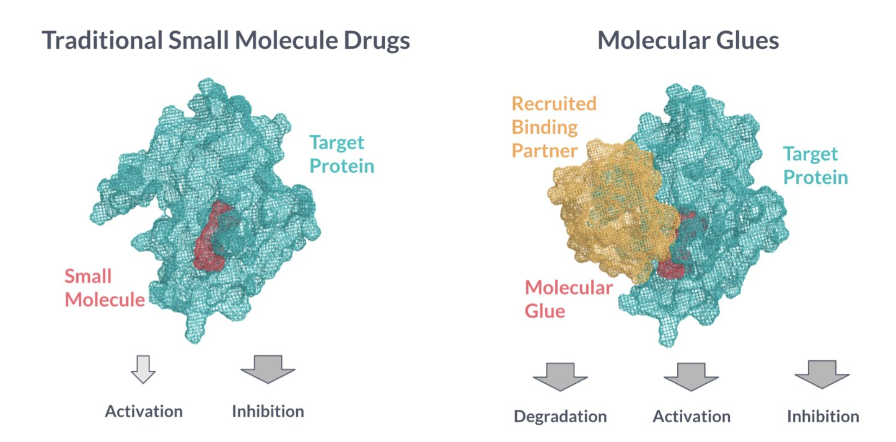

## 目录  
1. 这项工作构建了一个名为 DARKIN 的零样本基准，利用蛋白质语言模型，为功能未知的「黑暗激酶」寻找其对应的磷酸化底物，为发掘新药靶点开辟了新思路。
2. 现有分子对接方法在预测环糊精和葫芦脲这类大环主体 - 客体复合物的结构时表现不佳。解决该问题需要一种分两步走的策略。
3. 对于分子胶优化，自由能微扰（FEP）是目前可靠的计算工具，但其高昂的成本凸显了开发更高效初筛方法的紧迫性。

## 1. AI 照亮「黑暗激酶」，新药靶点浮出水面  
  
  

蛋白激酶 (Kinase) 家族是名副其实的「富矿」。从伊马替尼 (Gleevec) 到各种替尼类药物，靶向激酶的药物已经改变了很多疾病的治疗格局。但这个家族里有个公开的秘密：人类基因组编码了 500 多个激酶，其中大约 100 个的功能至今是个谜。我们称它们为「黑暗激酶」(Dark Kinases)。它们就像宇宙中的暗物质，我们知道它们存在，但不知道它们具体做什么，更别提如何去靶向它们了。  
  
解决这个问题的传统方法是在实验室里用高通量筛选，一个一个地试，费时费力，成本高昂。这篇论文的作者们想了一个更办法：能不能让 AI 来预测这些黑暗激酶到底会磷酸化哪些蛋白底物？  
  
挑战在于，对于黑暗激酶，我们几乎没有任何实验数据。传统的机器学习模型需要大量的「激酶 - 底物」配对数据进行训练，这在这里行不通。这就是所谓的「冷启动」问题。  
  
为解决这个问题，研究者设计了一个名为 DARKIN 的基准测试。它的核心思想是零样本学习 (Zero-Shot Learning)。这个概念：好比你教一个孩子认识了各种猫和狗，然后拿出一张从未见过的动物——比如狐狸——的照片，问他这更像猫还是狗。孩子会根据从猫和狗身上学到的通用特征（尖耳朵、长尾巴、毛茸茸等）做出判断。  
  
DARKIN 基准就是这样做的。它把已知的激酶数据划分成训练集和测试集，但划分方式很讲究：它确保测试集里的激酶及其所属的激酶家族，在训练集中完全没有出现过。这样一来，模型就必须学会从蛋白质序列中提取出决定其功能的普适性规律，而不是简单地记住「激酶 A 喜欢底物 B」。  
  
他们测试了多种蛋白质语言模型 (protein language models, pLMs)，比如我们熟知的 ESM 和 ProtT5。这些模型就像是蛋白质领域的 GPT，通过「阅读」海量的蛋白质序列，学会了蛋白质的「语言」。研究者先用 pLM 把激酶和底物的序列分别转换成一串数字（即嵌入向量），然后用一个简单的分类器来判断这两个向量是否「匹配」。  
  
结果很有意思。ESM、ProtT5-XL 和 SaProt 这几个模型表现最好。这说明，这些大模型确实从海量的序列数据中学到了一些关于激酶如何识别底物的深层生物物理学知识。它们不需要直接的训练数据，就能对一个全新的激酶做出相当不错的预测。  
  
更有趣的是，如果给模型一些「提示」，比如告诉它这个黑暗激酶属于哪个激酶亚家族，或者它的酶学分类号 (EC number)，模型的预测准确率会显著提升。这在现实中完全可行，因为这些信息通常可以从激酶的序列中推断出来。这就像告诉那个孩子：「你看的这个新动物，它属于犬科。」这样一来，他就更容易猜对是狐狸了。  
  
作者们也尝试了对模型进行微调 (fine-tuning)，想让它更专注于这个特定任务，但效果并不稳定。这反倒说明，pLM 强大的预训练能力所赋予的通用知识，在处理这种零样本问题时，可能比在小数据集上进行的专门优化更加稳健。  
  
这项工作真正的价值在于，它为我们系统性地探索「黑暗激酶」这个宝库提供了一套计算路线图。我们可以用这个方法，为上百个黑暗激酶生成一份高可信度的「潜在底物清单」。然后，实验科学家们就可以拿着这份清单，进行有针对性的验证，而不是在大海捞针。一旦我们确定了一个黑暗激酶的功能，它就从「黑暗」变成了「光明」，也就成为了一个潜在的新药靶点。  
  
📜Title: Darkin: A Zero-Shot Benchmark for Phosphosite–Dark Kinase Association Using Protein Language Models  
📜Paper: https://www.biorxiv.org/content/10.1101/2025.08.27.672558v1  

## 2. 分子对接预测大环主体复合物：现有方法靠谱吗？  
  
  

药物研发中，常使用环糊精 (cyclodextrin, CD) 或葫芦脲 (cucurbituril, CB) 等大环分子作为药物载体，以提高药物溶解度或稳定性。要设计这些载体，首先需准确预测药物分子（客体）如何与大环分子（主体）结合。分子对接 (molecular docking) 是常规工具，但它处理这类大环复合物的效果如何？  
  
这篇预印本文章对八种常见对接打分函数进行基准测试，结果并不乐观。  
  
研究者发现了一个「两难困境」。理论上更精确的打分函数计算量大，导致构象搜索阶段「采样不足」。而计算速度快的近似打分函数虽能生成结合构象，但在描述分子间相互作用时过于粗糙。它们可能匹配了形状，却没有正确识别氢键或静电作用等关键信息。  
  
环糊精与葫芦脲给计算带来了不同难题。  
  
葫芦脲 (CB) 的端口通常带负电荷，因此精确处理静电相互作用是预测其结合模式的关键。  
  
环糊精 (CD) 是由葡萄糖单元组成的环，边缘布满相似的羟基，这些羟基都可作为氢键供体或受体。这让对接程序难以在众多相似的氢键位点中，准确找出能量最低的结合模式。  
  
研究者提出了一个工作流程。  
  
第一步，使用计算速度快的近似打分函数进行初步构象筛选，快速生成一批候选构象，排除明显不合理的构象。  
  
第二步，从这些候选项中，采用量子化学计算等高精度方法进行最终评估，筛选出最优解。  
  
研究者还用量子化学计算评估了预测复合物的热力学稳定性。晶体结构是静态快照，而溶液中分子是动态的，可能存在多种能量相近的结合模式。通过计算可以了解哪些结合模式在室温下能稳定存在，这对载体设计更具指导意义。  
  
📜Title: Evaluating Docking Approaches for Prediction of Cyclodextrin and Cucurbituril Host-Guest Complex Structures  
📜Paper: https://doi.org/10.26434/chemrxiv-2025-qgpsj  

## 3. 分子胶优化指南：FEP 精准但昂贵，怎么办？  
  
  

分子胶（Molecular Glues）的研发，常有一种在「虚空」中造物的感觉。传统的药物设计，我们至少有一个明确的靶点口袋。分子胶不同，它的结合位点通常在一个蛋白和另一个蛋白相遇的瞬间才形成。这个动态、不稳定的三元复合物（ternary complex）让理性设计变得棘手。  
  
因此，计算化学在这里就显得格外重要。我们需要工具来预测哪个小分子能更好地把两个目标蛋白「粘」在一起。问题是，用什么工具？  
  
这篇预印版论文系统地评估了两种主流计算方法在分子胶亲和力预测上的表现。你可以把这两种方法看作是两种不同类型的工匠。  
  
第一种是自由能微扰（Free Energy Perturbation, FEP）。这像一位经验丰富、一丝不苟的老工匠。FEP 通过大量精细的分子动力学模拟，计算一个分子「变」成另一个分子时体系能量的细微变化。这个过程耗时，需要大量计算资源。但结果通常很准。  
  
第二种是 Boltz-2。这更像一个追求速度的流水线工人。它基于单个或几个静态结构，用一个打分函数快速估算结合能。速度快，理论上适合从庞大的化合物库里做初步筛选。  
  
研究者们在一个相当大的数据集上对这两种方法进行了「实战演练」。他们测试了 93 个化合物，涉及 6 种不同的蛋白复合物体系，总共得到了 140 个亲和力数据点。这种规模的基准测试在分子胶领域不多见。  
  
结果怎么样？  
  
FEP 这位老工匠没有让人失望。计算出的结合自由能变化（ΔΔG）和实验值的相关性好，均方根误差（Root Mean Square Error, RMSE）控制在 0.3-1.25 kcal/mol。这个精度是什么概念？在药物化学中，1.4 kcal/mol的能量差异就对应着亲和力10倍的变化。所以，FEP的精度足以指导我们对先导化合物进行下一步的结构优化。例如，我们可以判断在一个位置加上一个甲基，是会增强还是减弱结合力。  
  
相比之下，Boltz-2 的表现就差强人意了。它的预测结果和实验数据几乎没有相关性。这意味着它连哪个分子更好、哪个分子更差的相对排序都做不好。对于高通量筛选来说，这是致命的。用它来筛药，基本上和随机挑选没什么区别。  
  
这项工作给我们的启示很直接。  
  
首先，如果你手头已经有几个不错的分子胶候选物，需要精细优化，FEP 是一个值得信赖的工具。它虽然昂贵，但能给出可靠的方向。  
  
其次，不要指望用现有的快速打分函数来做分子胶的大规模虚拟筛选。这条路目前走不通。  
  
这就暴露了一个关键的「方法学缺口」。我们有精准但慢的 FEP，也有快但「不准」的打分函数。中间地带是空白的。我们迫切需要一种「中等通量、中等精度」的方法，来从百万级别的化合物库中，筛选出几百个最有可能成药的分子，然后再交给 FEP 去精雕细琢。  
  
这正是机器学习模型可以大显身手的地方。开发专门针对分子胶三元复合物的、更准确的机器学习打分函数，可能是填补这个缺口最有效的途径。这篇论文没有给出最终答案，但它清晰地指出了问题所在，为后续的方法开发画出了一张明确的路线图。  
  
📜Title: Optimizing Molecular Glues Using Free Energy Perturbation and Cofolding Methods  
📜Paper: https://doi.org/10.26434/chemrxiv-2025-tb29n
