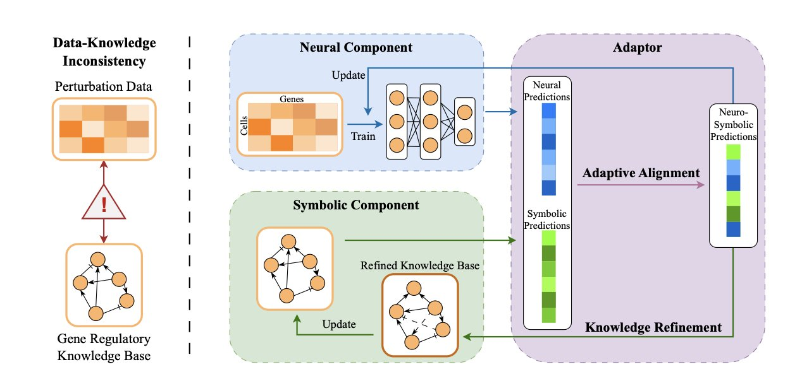
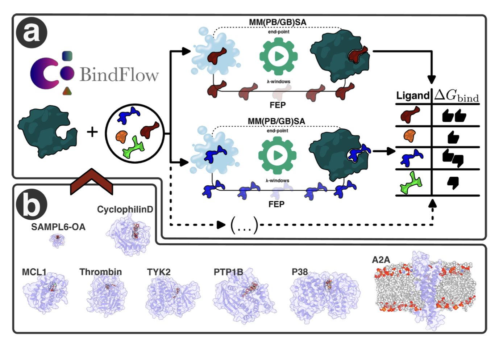
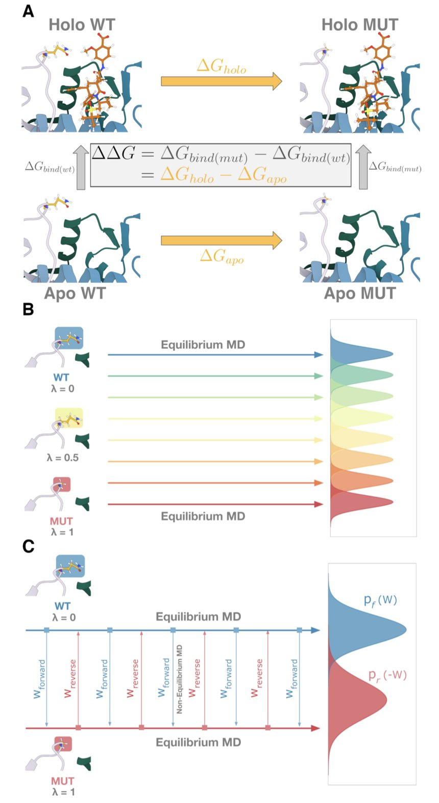

## 目录  
1. ALIGNED 框架对齐实验数据和生物学知识，提升基因扰动预测的准确性，还能反向修正、完善知识库，摆脱纯粹的黑箱模型。
2. BindFlow 将复杂的绝对结合自由能计算流程自动化，免费且易用，为药物研发提供了一种可靠的亲和力预测工具。
3. 研究者用自由能微扰（FEP）方法，成功预测了柔性蛋白区域（IDR）的耐药性突变，为设计更持久的药物提供了新思路。

## 1. ALIGNED：AI 预测基因扰动，让数据与知识握手言和  
  
  

药物研发常面临一个两难的境地。一方面是海量的基因扰动实验数据，如 CRISPR 筛选数据。另一方面是积累数十年的生物学知识库，如 KEGG 和 Reactome 中的信号通路图。理想情况下，两者应能相互印证，但现实是它们经常冲突。  
  
一个纯数据驱动的深度学习模型，可能给出看似准确但在生物学上讲不通的预测。一个纯粹基于知识库的模型，又可能因知识库的不完整或错误，无法解释新的实验现象。此时该信谁？  
  
这篇论文提出的 ALIGNED 框架，就是来调和这种矛盾的。  
  
它的核心思想是神经符号学习（Neuro-Symbolic Learning）。可以想象一个团队里有两种角色：「神经」部分像个直觉敏锐的艺术家，从杂乱数据中发现隐藏模式，由神经网络承担；「符号」部分则像个严谨的工程师，严格遵守已知的生物学规则和通路知识。  
  
过去的方法，要么只听艺术家，要么只听工程师。ALIGNED 建立了一个沟通机制。当数据与知识的观点不一致时，它通过自适应对齐策略来决策，而非简单求取平均。这个过程使用无梯度优化机制，能灵活处理两类信息源。  
  
为了评判决策，研究者设计了「平衡一致性」指标。该指标要求预测结果既要符合实验数据，又不能与生物学知识库有大的矛盾。就好比药物临床试验，既要看疗效（符合数据），也要看作用机制是否符合生理学理解（符合知识），这样结果才更可信。  
  
该框架还能反向更新知识库。如果实验数据多次指向与现有知识库相悖的结论，ALIGNED 会判断知识库可能需要更新。它利用基于梯度的优化和稀疏正则化来修正知识库中的调控关系。因此，这个模型不只是一个预测工具，更是一个知识发现引擎，能从海量数据中挖掘新的生物学通路或分子相互作用，推动知识体系的进化。  
  
在多个大规模数据集上的测试表明，ALIGNED 在预测准确性和知识一致性上优于现有方法，在数据有限时表现突出。这对研究数据稀少的新靶点有重要价值。  
  
ALIGNED 这类工作代表了一个方向：从纯粹的黑箱预测，走向与领域知识对话、可解释、可交互的智能系统。它在利用 AI 能力的同时，也融合了科学家积累的知识。  
  
📜Title: Adaptive Data-Knowledge Alignment in Genetic Perturbation Prediction  
🌐Paper: <https://arxiv.org/abs/2510.00512>  

## 2. BindFlow: 免费自动化 FEP/MMPBSA，药物发现新利器  
  
  

在药物发现中，准确预测小分子与靶蛋白的结合亲和力是一项核心挑战。计算化学家为此开发了两类工具：一类是像自由能微扰（Free Energy Perturbation, FEP）这样的「重炮」，精度高，但计算量巨大，耗时耗力。另一类是像 MM(PB/GB)SA 这样的「轻机枪」，速度快，但其准确性常被认为有所欠缺。  
  
几十年来，操作这些工具需要深厚的理论知识和繁琐的手动设置，高昂的软件费用和复杂的流程也让许多学术实验室望而却步。  
  
BindFlow 工具旨在简化这一过程。它是一个基于 Python 的自动化流程，串联起绝对结合自由能（Absolute Binding Free Energy, ABFE）计算的全部步骤。用户只需准备好输入文件并执行命令，即可等待计算结果。  
  
它免费开源，避免了商业软件包的高昂授权费。同时支持 GAFF、OpenFF 和 Espaloma 等多种力场，为用户提供了选择的灵活性。  
  
为验证工具的性能，研究团队在一个包含 139 个配体 - 靶标复合物的测试集上进行了测试。该测试集覆盖了可溶性蛋白、膜蛋白以及非蛋白的主客体体系。结果表明，BindFlow 的计算结果与行业公认标准相当，证实了其数据的可靠性。  
  
研究中的一个重要发现与 MM(PB/GB)SA 方法有关。传统观念认为，终态方法 MM(PB/GB)SA 在精度上不如路径积分方法 FEP。但该研究的数据表明，在特定体系和力场组合下，MM(PB/GB)SA 预测的亲和力与实验值的相关性可与 FEP 媲美。  
  
这一发现对实际工作流程具有指导价值。例如，在从大型虚拟化合物库中筛选苗头化合物时，可以先用计算成本更低的 MM(PB/GB)SA 进行初步筛选，再将计算资源集中于最有潜力的少数分子，用 FEP 进行精确计算。这种「粗筛 + 精算」的策略，在效率和准确性之间取得了平衡。  
  
BindFlow 将原本专家化的计算过程，转变为标准化的自动化流程。它提高了结合自由能计算的效率和可重复性，有助于加速现代药物的发现进程。  
  
📜Title: BindFlow: A Free, User-Friendly Pipeline for Absolute Binding Free Energy Calculations Using Free Energy Perturbation or MM(PB/GB)SA  
🌐Paper: <https://www.biorxiv.org/content/10.1101/2025.09.25.678545v1>  
💻Code: <https://github.com/ale94mleon/BindFlow>  

## 3. FEP 搞定柔性蛋白：精准预测药物耐药性  
  
  

药物研发中，一些靶点很难处理。本质无序蛋白（Intrinsically Disordered Proteins, IDPs）及其本质无序区域（Intrinsically Disordered Regions, IDRs）就是其中之一。这些区域没有固定三维结构，像面条一样柔软多变，给基于结构的药物设计制造了困难。MDM2 蛋白的 N 端就是典型的 IDR，也是 p53 抑癌通路的关键靶点。  
  
耐药性是另一个棘手问题。药物使用后，靶点上单个氨基酸的突变就可能让药物失效。如果能预知哪些突变会引起耐药，就能在药物设计阶段规避。自由能微扰（FEP）是计算化学中精确计算突变导致结合能变化的方法。但将它用于动态变化的 IDR 一直是公认的难题。  
  
这项工作旨在验证 FEP 能否准确预测 MDM2 这个 IDR 靶点的耐药性突变。  
  
研究者比较了两种 FEP 计算方案：平衡态（Equilibrium, EQ）和非平衡态（Non-equilibrium, NEQ）。EQ-FEP 让系统有充足时间适应突变并达到新平衡。NEQ-FEP 则通过快速改变系统来估算能量变化。  
  
结果显示，EQ-FEP 表现更稳定，精度更高。虽然总计算时间更长，但达到收敛仅需 10% 的采样时间，最终均方根误差（RMSE）为 1.48 kcal/mol。NEQ-FEP 计算速度快，但结果波动大，RMSE 为 1.20 kcal/mol，标准差也更高。一个稳定、可重复的结果比一个偶然准确的快速计算更有价值。  
  
这项工作还优化了力场和水模型。FEP 计算模拟微观分子世界，力场和水模型就是这个世界的物理法则。研究者发现，使用 AMBER FF99SB*-ILDN 力场和 OPC 水模型时，计算结果与实验数据吻合最好。在处理 I19G 突变时，这个组合将 AM-7209 复合物的 RMSE 从 0.79 kcal/mol 降至 0.39 kcal/mol。  
  
这套优化方案成功预测了两种配体（AM-7209 和 Nutlin-3a）与突变 MDM2 的结合力变化，证明了方法的普适性。  
  
这项研究将 FEP 这一预测工具的应用拓展到了 IDR 领域。未来，在开发针对柔性靶点的药物时，可以更早、更准地预测耐药风险，从而设计出不易失效的下一代药物。  
  
📜Title: Accurate Prediction of Drug Resistance for Intrinsically Disordered Protein Regions  
🌐Paper: https://doi.org/10.26434/chemrxiv-2025-brzks
