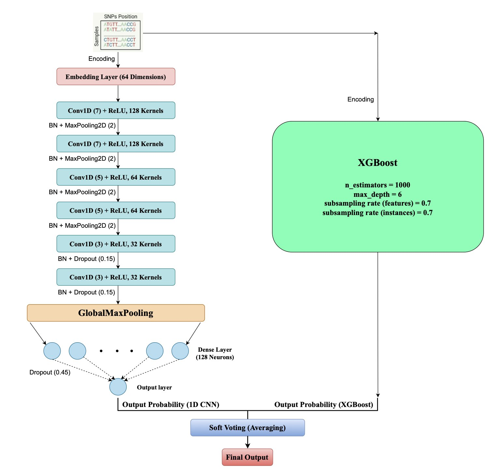
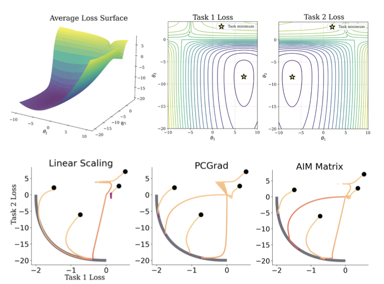
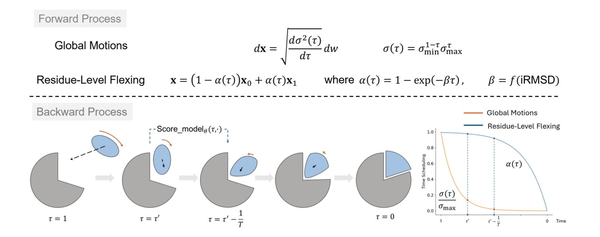

## Table of Contents
1. Researchers developed a lightweight AI model that combines local and global features of gene sequences to predict bacterial drug resistance efficiently and accurately.
2. The AIM framework solves the multi-property optimization problem in drug discovery by learning a dynamic policy to intelligently manage gradient conflicts, proving especially effective with limited data.
3. A new diffusion model solves the challenge of flexible protein docking by hierarchically handling rigid-body motion and local flexibility, and by adaptively timing when to simulate that flexibility.

## 1. AI Predicts Bacterial Drug Resistance: A CNN and XGBoost Hybrid

Predicting when a bacterium will become resistant to a specific antibiotic is a major challenge in microbiology and medicine. Finding resistance information in massive genomic datasets is like searching for a needle in a haystack. A recent paper proposes a new method, AMR-EnsembleNet, to address this.

Drug resistance can sometimes be caused by a single gene mutation (SNP) or by the complex interplay of multiple genes. A single model struggles to handle both scenarios well.

The team assigned different jobs to two models.

First, they used a one-dimensional convolutional neural network (1D CNN). The 1D CNN acts like a sliding "pattern recognizer," moving along a gene sequence to find short, local patterns (motifs) associated with resistance. For instance, a few adjacent base mutations on a specific gene might be a strong resistance signal. The CNN excels at capturing these local features.

Next, they brought in XGBoost, a decision-tree-based algorithm good at handling complex, discrete features. The 1D CNN feeds its discovered local "signals" to XGBoost as features. XGBoost then combines these with other broader genomic information to make a final judgment on what these signals mean together.

The workflow is simple: the CNN extracts key local evidence, and XGBoost makes a global decision based on that evidence. This division of labor allows the model to see both the "trees" and the "forest."

The data shows that this combined model achieved a Matthews Correlation Coefficient (MCC) of 0.926 for Ciprofloxacin. When resistant strains are rare (an imbalanced dataset), the MCC is a better performance metric than accuracy. A value close to +1 means the predictions are very reliable.

The model's interpretability also confirmed its reliability. Using a technique called SHAP, the researchers traced which gene locations (SNPs) were most influential in the model's predictions. They found that the SNPs the model focused on were mostly located in known resistance genes. This suggests the model learned underlying biological rules, not just statistical coincidences.

The work also points to future directions. Currently, the model only performs binary classification ("resistant" or "susceptible"). The next step could be to predict specific values for the Minimum Inhibitory Concentration (MIC), offering more precise guidance for clinical use. Integrating other data, like gene expression profiles, could also improve the model's predictive power.

📜Title: Fusing Sequence Motifs and Pan-Genomic Features: Antimicrobial Resistance Prediction using an Explainable Lightweight 1D CNN - XGBoost Ensemble  
🌐Paper: https://arxiv.org/abs/2509.23552v1

## 2. The AIM Framework: Using AI to Mediate Internal Conflicts in Multi-Objective Drug Optimization

Drug discovery is a juggling act. You want a molecule to have high activity against its target, but you also need it to be soluble, metabolically stable, and non-toxic. These goals often conflict. Improve one property, like activity, and another, like solubility, might get worse.

To handle this, researchers use multi-task learning, training one model to predict all properties simultaneously. But this is like putting a group of people who disagree in a room together. Each task provides gradient updates pointing in its own direction, leaving the model confused by conflicting instructions. This is known as "gradient conflict."

The AIM framework proposed in this paper takes a new approach. Instead of trying to quiet all the conflicting voices, it introduces a "mediator" (Adaptive Intervention Policy) into the room.

This mediator watches the training process. When it sees that the gradients for "activity" and "solubility" are pointing in opposite directions, it steps in. It might decide, "The main problem right now is solubility, so let's focus on that." It then increases the weight of the "solubility" task while temporarily suppressing the "activity" task's conflicting input. This gives the model a clear direction for that update.

The mediator is trained alongside the main model, learning on its own when to support or suppress certain tasks for the most efficient and stable optimization.

The researchers designed two types of mediators, one of which is a "Matrix Policy." This policy assigns a dedicated mediator to every pair of tasks. For example, one mediator handles conflicts between "activity" and "solubility," while another handles "activity" and "toxicity."

The advantage of this design is that the model can learn the nuanced relationships between different tasks. After training, you can examine this mediation matrix. It acts like a relationship map, showing which tasks are natural allies and which are rivals. For medicinal chemists, this interpretability is critical. It can confirm chemical intuition and help them understand the model's decision-making process, increasing trust in the AI.

The authors tested AIM on two datasets. On the standard QM9 dataset, with only 10,000 data points, AIM outperformed all baseline methods. This is valuable in early-stage projects when data is scarce.

Another test was run on a dataset for ADME properties of Targeted Protein Degraders (TPDs). TPD molecules are larger and more complex, and predicting their ADME properties is a known challenge. In this more realistic scenario, AIM's performance was also superior.

The authors note that AIM's advantage diminishes when training data is abundant, as simpler methods can catch up. But this doesn't reduce its value. It shines in the early stages of drug discovery, where data is limited but every decision matters. An AI model that can make smart trade-offs and explain its reasoning is exactly what's needed then.

📜Paper: AIM: Adaptive Intervention for Deep Multi-task Learning of Molecular Properties
🌐Link: <https://arxiv.org/abs/2509.25955>

## 3. A New AI for Protein Docking: Hierarchical Diffusion Solves the Flexibility Problem

In drug discovery, protein docking is a classic problem, like fitting together two complex, constantly wiggling puzzle pieces.

Past computational methods have often gone to one of two extremes. They either assume the proteins are completely rigid to simplify calculations, which isn't biologically realistic, or they try to simulate the flexible movement of all atoms, which is computationally too expensive and inefficient.

A Hierarchical Adaptive Diffusion Model offers a new solution.

**Step 1: A Hierarchical Approach—Global First, Then Local**

The model's core idea is to break the problem down.

First, it treats the proteins as two rigid bodies. Through a diffusion process, it quickly finds a rough pose for how they should approach and orient themselves. This is a global, rigid-body "coarse-tuning" step.

After this initial alignment, the model switches to a local flexibility mode. It fine-tunes the amino acid residues at the binding interface, adjusting their conformations for a better fit.

This "rigid first, flexible later" strategy avoids simulating all atomic motions from the start, making the process much more efficient.

**Step 2: Adaptive Scheduling—Focusing on Complex Cases**

The model's adaptive capability is key.

Before docking begins, the model predicts the degree of conformational change likely to occur. If it predicts both proteins are relatively "stiff" and won't change shape much, it will only introduce local flexibility adjustments late in the diffusion process.

But if it predicts a significant conformational rearrangement—the hardest part of flexible docking—it will start simulating flexibility much earlier in the process. This gives the system more time and freedom to explore the correct flexible shapes.

This adaptive scheduling mechanism directs computational resources to where they are most needed.

**Step 3: Integrating Physics to Make the Model Smarter**

To improve accuracy, the model incorporates a concept from biophysics called Normal Modes.

Normal Modes can be thought of as a protein's inherent, most natural patterns of vibration. By analyzing these modes, the model can understand which parts of a protein are naturally "softer" and more likely to deform.

Integrating these dynamic features helps the AI better understand the protein's internal dynamics, allowing it to guide the docking process more accurately.

**What were the results**?

The researchers built a new dataset, DIPSAF, with nearly 39,000 protein complex pairs for training. They then validated the model on the industry-standard benchmark, DB5.5.

The results showed that the model outperformed existing methods, especially in cases involving medium to high degrees of flexibility. A series of ablation studies also confirmed that the hierarchical design, adaptive scheduling, and normal mode features were all essential to its performance.

📜Paper: A Hierarchical Adaptive Diffusion Model for Flexible Protein–Protein Docking
🌐Paper: <https://arxiv.org/abs/2509.20542v1>
