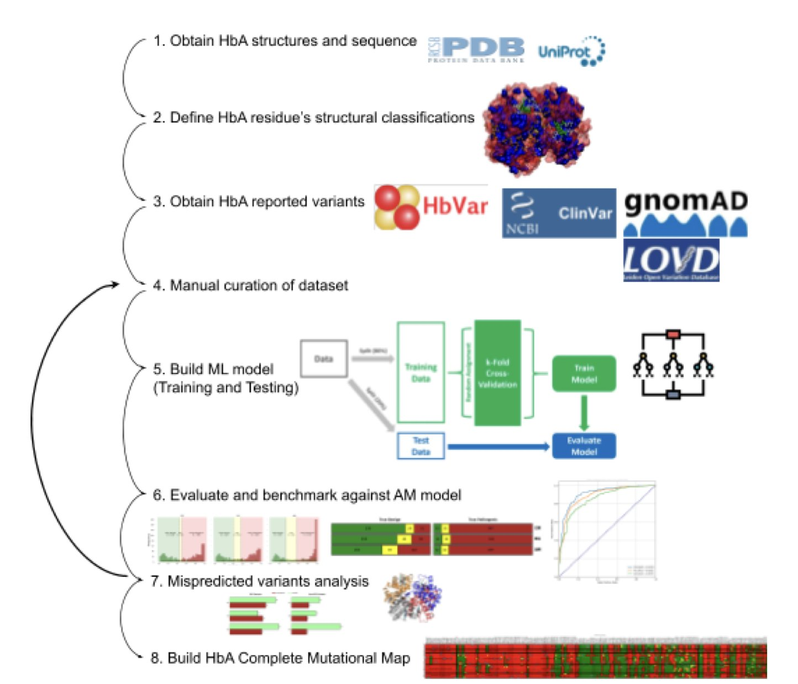
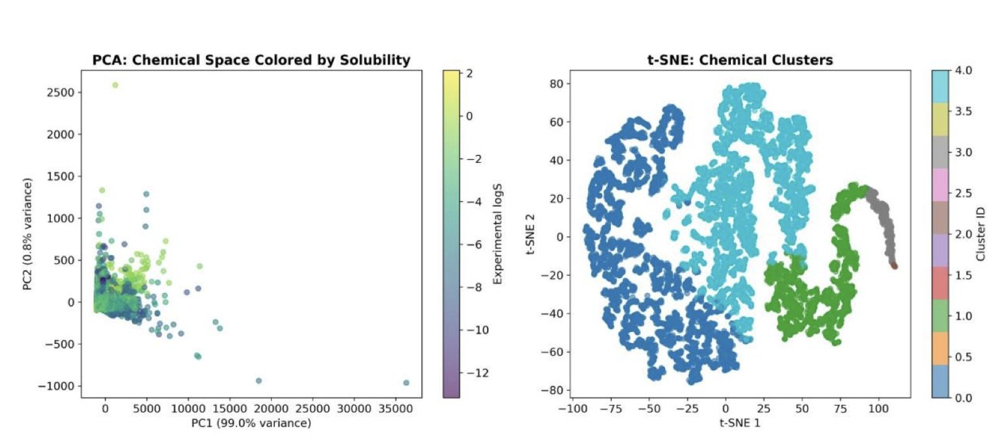
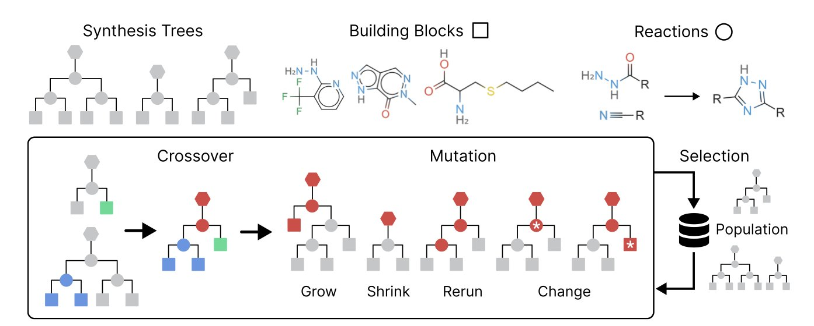

## 目录  
1. 结合蛋白质结构和功能知识，AI 能更准确地预测血红蛋白突变的致病性。
2. 这个可解释 AI 模型精确预测化合物的水溶性，并用数据量化了辛醇 - 水分配系数（LogP）和拓扑极性表面积（TPSA）等经典物化参数的影响，为药物化学家提供了具体的优化方向。
3. SynGA 算法不直接生成分子结构，而是在分子的合成路线上进行遗传操作，保证每个设计出的分子都有明确的合成方法。

## 1. AI 绘制血红蛋白突变图谱，精准预测遗传病  
  
  

基因序列上的单个氨基酸替换 (Single Amino Acid Substitution, SAS) 是无害还是致病，是药物研发和临床诊断中的一个难题。即使对于人类血红蛋白 (Hemoglobin, HbA) 这种研究充分的蛋白，这个问题依然存在。血红蛋白负责在血液中运输氧气，其微小故障可引发镰状细胞病或地中海贫血。  
  
医生在临床上发现新的血红蛋白突变时，常将其归类为「意义不明确的变异」 (Variant of Uncertain Significance, VUS)。这个分类无法确诊，也无法排除风险。一个研究团队尝试用 AI 来解决这个问题。  
  
他们没有直接用 AI 从海量序列数据中学习，而是先整合了几十年来积累的血红蛋白「专家知识」。  
  
第一步，团队建立了一个高质量数据集。其中不仅收录了已知突变的致病性分类，还为每个突变标注了丰富的结构与功能信息，例如突变位点在蛋白内部还是表面、是否影响蛋白稳定性、是否位于与氧气结合的关键功能区等。  
  
第二步，团队构建了预测模型。他们没有完全依赖 AlphaMissense 这种大语言模型。AlphaMissense 能通过比对多物种蛋白质序列，给出突变可能有害的概率，但它像一个知识广博的通才，缺乏对特定蛋白的深入理解。研究者将 AlphaMissense 的预测分数，与他们整理的结构和功能特征相结合，训练了一个新模型。这如同为通才配备了一位领域专家顾问，结合了广度与深度。  
  
这个组合模型的预测准确率更高，并成功将许多「意义不明确的变异」重新分类为可能致病或可能良性，为临床诊断提供了更明确的指导。  
  
最后，团队利用优化后的模型，为血红蛋白所有 5453 个可能的单氨基酸突变进行了预测，绘制出了一张完整的突变功能图谱。  
  
这张图谱如同高精度地图，标示出分子上的「安全区」（可以容忍突变）和「雷区」（突变可能引发功能障碍）。例如，位于蛋白核心、维持结构稳定的区域，以及与血红素结合的口袋区域，对突变极其敏感。这与已有的蛋白质结构功能认知相符。  
  
这项工作证明，经典的结构生物学和生物化学知识与机器学习模型结合，可以提升预测性能。该方法也为预测其他蛋白质的变异效应提供了范例。  
  
📜Title: A Structure and Function-Based Complete Mutational Map of Human Hemoglobin Using AI  
🌐Paper: https://www.biorxiv.org/content/10.1101/2025.09.30.679504v2  

## 2. AI 量化药物溶解度：LogP 是关键，但细节在别处  
  
  

水溶性是药物发现的核心挑战。药物化学家遵循「类药五原则」等经验法则，避免分子疏水性过强。但这些法则是定性的。例如，降低 LogP 能改善溶解度，但具体的阈值和官能团影响大小，往往依赖直觉和反复试错。  
  
Ali Afshari 团队的工作用机器学习量化了这些化学直觉。其亮点在于模型的可解释性，它揭示了影响溶解度的原因。  
  
团队使用一个包含超 9000 种化合物的数据集，训练了一个 LightGBM 模型，这是一种梯度提升决策树。模型预测准确度高，决定系数（R²）达到 0.80。工作的核心价值在于后续的分析。  
  
团队采用 SHAP (SHapley Additive exPlanations) 分析方法。SHAP 是一种归因工具，能为每次预测计算出分子中各特征（如 LogP、TPSA）的具体贡献。  
  
分析结果用具体数值印证了化学直觉：  
1.  **LogP 起主导作用** 。该参数贡献了近 40% 的预测权重。疏水性是决定分子能否溶于水的根本因素。疏水分子溶于水，需要能量来破坏水分子间原有的氢键网络。  
2.  **TPSA 影响次之** 。TPSA 衡量分子表面的极性原子总面积，直接关联分子与水形成氢键的能力。极性表面积越大，分子越容易与水相互作用。  
  
模型还发现了一些更细微的关系：  
  
该模型的实用价值在于能对单个分子进行局部解释。例如，它可以量化分子中某个羧基对溶解度的正向贡献，或某个烷基链的负向影响。这种分析使分子优化目标更明确，从「降低 LogP」的笼统原则，变为「修改特定基团以高效降低 LogP」的具体策略。  
  
这项研究是机器学习与物理化学结合的典范。它超越了黑箱预测，深入模型内部，将决策逻辑翻译成化学家可以理解的语言，使 AI 成为辅助思考和设计的工具。  
  
📜Title: Beyond Prediction: Mechanistic Elucidation of Molecular Drivers for Aqueous Solubility Using Interpretable Machine Learning  
🌐Paper: <https://doi.org/10.26434/chemrxiv-2025-xq8v3>  

## 3. SynGA：从合成路线出发，告别无法合成的分子  
  
  

计算辅助药物发现的一个痛点，是 AI 设计的分子即便理论活性很好，也可能无法在实验室合成。这种设计浪费了计算资源与时间。  
  
SynGA 算法尝试解决这个问题。传统算法先生成分子结构，再反向预测其可合成性。SynGA 的思路相反，它不直接操作分子，而是直接在分子的合成路线上进行操作。  
  
SynGA 将合成路线视为基因，使用遗传算法（Genetic Algorithm）进行演化。算法包含两种基本操作：  
  
1.  **交叉 (Crossover) ** ：随机选择两条有效的合成路线，交换它们的部分片段，生成一条新的有效路线。  
2.  **变异 (Mutation) ** ：随机改变一条路线中的某个步骤，例如替换一个反应砌块（Building Block）或更改反应条件。  
  
通过重复交叉与变异，算法在由已知化学反应和砌块构成的「可合成化学空间」中进行探索。由于每一步操作都基于真实的化学反应，演化出的任何新路线对应的分子都确保可合成。可合成性因此成为算法的内置约束，而非事后检查的属性。  
  
为提高搜索效率，研究者引入了机器学习过滤器。该过滤器预先评估并筛选反应砌块，优先选择那些更可能生成目标分子的原料，提升了算法的搜索效率。  
  
将 SynGA 整合到贝叶斯优化（Bayesian Optimization）框架中，便得到 SynGBO。这个版本专用于目标导向的任务，例如寻找与特定蛋白靶点结合力最强的分子。贝叶斯优化能指导 SynGA 的搜索方向，加速在化学空间中寻找最优解。  
  
论文数据显示，SynGA 和 SynGBO 在多个基准测试中表现出色，包括寻找已知药物的类似物，以及优化分子的二维和三维属性。  
  
该方法的价值在于简洁和实用。它计算开销小，逻辑清晰，从源头解决了分子的可合成性问题。计算化学家设计的分子候选物，可直接交由合成团队验证，缩短了从设计到实验的周期。它既可作为独立的分子生成工具，也可作为模块嵌入现有的药物发现工作流。  
  
📜Title: A Genetic Algorithm for Navigating Synthesizable Molecular Spaces  
🌐Paper: https://arxiv.org/abs/2509.20719v1
