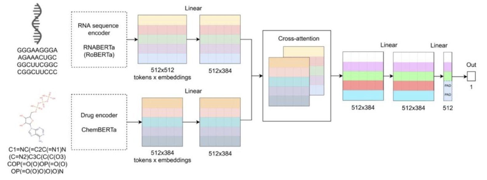
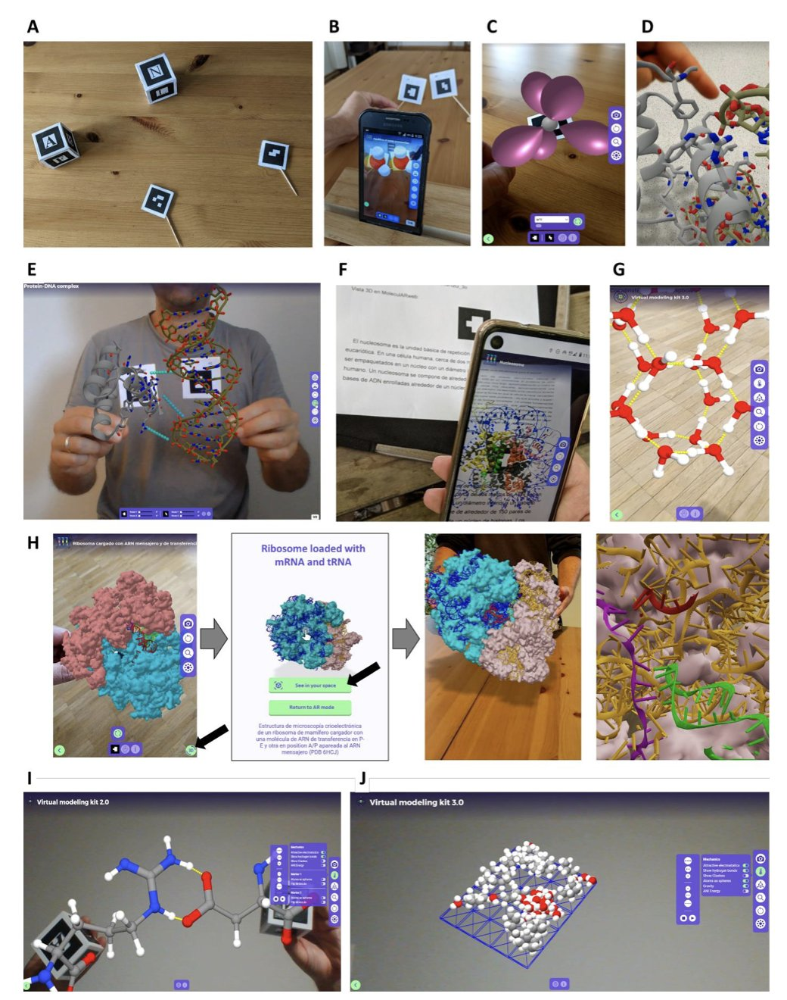
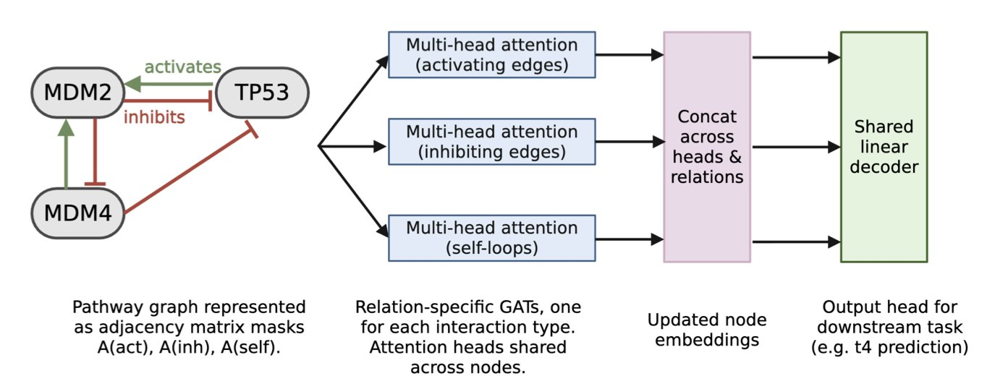

## 目录  
1. DlRNA-BERTa 模型融合了 RNA 和小分子的语言模型，无需 3D 结构就能高精度预测结合亲和力，为靶向 RNA 的药物发现提供了强大的新工具。
2. MolecularWeb 生态系统通过网页端 AR/VR 技术，将分子可视化和建模从复杂的键盘鼠标操作，转变为多人协作的直观「手感」体验。
3. 将已知的生物通路知识整合进图注意力网络，模型不仅能更准确地预测细胞对药物的反应，还能从数据中反向推断出基因间的相互作用。

## 1. AI 无需 3D 结构，精准预测 RNA-药物结合  
  
  

靶向 RNA 一直是个诱人但又极具挑战性的方向。蛋白质通常有清晰的、可供药物结合的口袋，而 RNA 则像一串柔软的面条，形态多变，难以捉摸。这使得基于结构的药物设计 (structure-based drug design) 在 RNA 靶点上举步维艰。如果我们能跳过获取 3D 结构这一步，直接从序列预测一个小分子是否会与某个 RNA 结合，那将彻底改变游戏规则。  
  
这正是 DlRNA-BERTa 这个新模型试图解决的问题。  
  
它的核心思路很巧妙。研究者没有从零开始，而是站在了巨人的肩膀上。他们用了两个已经训练好的「专家」模型：一个叫 RNABERTa，它阅读了近千万条 RNA 序列，精通 RNA 的「语言」；另一个是 ChemBERTa-v2，它学习了大量小分子的化学结构，懂得化学的「语法」。  
  
你可以把 DlRNA-BERTa 想象成一个协调员，它的工作就是让这两位专家对话。具体来说，它通过一个叫作「交叉注意力机制」(cross-attention mechanism) 的模块来实现。这个机制就像在开一个圆桌会议，协调员会不断地问 RNA 专家：「你序列里的哪个片段，对面的化学专家最感兴趣？」同时又问化学专家：「你分子里的哪个基团，对面的 RNA 专家最关注？」通过这种来回的「指认」，模型就能自行发现 RNA 序列和药物分子之间潜在的相互作用位点，并最终给出一个结合亲和力的预测值。  
  
整个过程是端到端的，我们只需要输入 RNA 的碱基序列和药物的 SMILES 字符串，模型就能直接输出结果。这完全绕开了获取 RNA 复杂三维结构的难题。  
  
那么，它的表现如何？在 microRNA (miRNA) 这个类别上，预测值和实验值的皮尔 SON 相关系数 (Pearson correlation coefficient) 达到了 0.98。在生物预测领域，这是一个很高的数字，说明模型确实抓住了结合事件背后的某些关键规律。  
  
更让我信服的是一个具体的例子。研究者用这个模型扫描了三千多种已上市的药物，发现其中 2,859 个可能与 294 个 RNA 靶点结合。其中，模型高分命中了抗癌药博莱霉素 (bleomycin) 与 RNA 的结合。博莱霉素作为一个老药，我们知道它主要通过嵌入 DNA 发挥作用，但已有文献证据表明它同样能与 RNA 结合。模型能在不知道这些先验知识的情况下独立做出这个预测，这就像它「重新发现」了已知的生物学事实。这种验证给了我们信心，相信它也能用来发现全新的、未知的药物-RNA 相互作用。  
  
这个模型的实用价值很高。首先，它对那些缺乏实验数据、难以研究的 RNA 类别，比如核糖开关 (riboswitches)，同样表现不错。这意味着它的应用范围很广，不局限于某类明星 RNA 分子。其次，研究者非常开放，他们不仅发布了论文，还把代码、数据集和在线预测工具全部公开。这意味着，无论是学术界的研究者还是工业界的药物研发团队，都可以立即上手使用这个工具，快速筛选化合物库，为自己的 RNA 靶点寻找潜在的苗头化合物。  
  
这为 RNA 靶向药物的早期发现阶段提供了一个强大的搜索引擎。我们不用再像以前那样大海捞针，而是可以先用这个模型进行大规模的虚拟筛选，锁定一小批高可能性的分子，再投入资源进行实验验证。这提高了研发效率。  
  
📜Title: DlRNA-BERTa: A Transformer Approach for RNA-Drug Binding Affinity Prediction  
📜Paper: https://www.biorxiv.org/content/10.1101/2025.09.05.674445v1  
💻Code: https://github.com/IlPakoZ/rnaberta-dti-prediction  
🌐App: https://huggingface.co/spaces/IlPakoZ/DLRNA-BERTa  

## 2. MolecularWeb：用 AR/VR 徒手抓分子，建模新范式  
  
  

做药物研发的人，大部分时间都在和分子打交道。但我们是怎么做的呢？盯着一个 2D 屏幕，用鼠标费力地旋转、缩放一个本质上是 3D 的物体。这如同通过一堆照片去理解一座雕塑，我们能获取信息，但总感觉隔了一层。我们失去了对分子形状、体积和空间关系的直觉。  
  
一篇预印本论文介绍了一个叫「MolecularWeb Universe」的生态系统，它尝试解决的就是这个问题。这套系统的核心思路很简单：与其在屏幕外看，不如让我们直接「走进去」。  
  
**第一步是把分子带到现实世界**  
  
这个生态系统里有个叫`moleculARweb`的工具。它能让你用手机或平板电脑，把一个蛋白质结构投影到会议室的桌子上。这就是增强现实（Augmented Reality, AR）。想象一下，团队开会讨论一个靶点，所有人都可以围着这个 3D 模型，从各自的角度观察配体是如何嵌在活性口袋里的。这种沟通效率，是任何 2D 截图或屏幕共享都比不了的。  
  
**第二步是让团队在分子世界里开会**  
  
当需要更沉浸的体验时，`MolecularWebXR`就派上用场了。它支持多用户虚拟现实（Virtual Reality, VR）。身处不同城市的团队成员戴上 VR 头显，就能进入同一个虚拟房间。他们可以一起站在一个巨大的、可交互的激酶抑制剂复合物旁边。一个化学家可以伸手指向某个即将进行修饰的苯环，而一个计算科学家则可以实时调出能量计算结果，贴在那个苯环旁边。这才是真正的协同工作。  
  
为了让这一切变得实用，研究者开发了`PDB2AR`工具。它可以快速将任何蛋白质数据库（Protein Data Bank, PDB）里的文件，或者你自己解析的结构，转换成 AR/VR 兼容的模型。这意味着你能马上把这套技术用在自己的项目上，而不是只能玩一些预设的教学案例。  
  
**真正的变革：用手和语言去「创造」分子**  
  
这个生态系统里最亮眼的部分是`HandMol`。它已经超越了「观察」，进入了「建模」的层次。在 VR 环境里，你可以直接用「手」去抓取一个分子，像拧麻 - 花一样扭转它的单键，感受构象变化。在你操作的同时，系统后台会实时进行分子力学计算，告诉你这个新构象的能量是高是低，是否合理。  
  
更重要的是，它还整合了人工智能驱动的自然语言处理（Natural Language Processing, NLP）。你不需要去记那些繁琐的命令行或者点击层层菜单。你可以直接对系统说：「高亮显示 50 到 65 号残基之间的 loop 区」，或者「测量一下这个赖氨酸和那个天冬氨酸之间的距离」。系统能听懂你的指令并立即执行。  
  
这降低了分子建模的门槛。一个对计算化学不太熟悉的结构生物学家或药物化学家，也能快速构建模型、验证自己的想法。这种直觉式的操作，可能会帮助我们更快地发现那些通过传统方法容易忽略的结构特征。这套系统把我们从键盘和鼠标的束缚中解放出来，让我们能用更符合人类本能的方式去探索和创造分子。  
  
📜Title: The MolecularWeb Universe: Web-Based, Immersive, Multiuser Molecular Graphics And Modeling, for Education and Work in Chemistry, Structural Biology, and Materials Sciences  
📜Paper: https://arxiv.org/abs/2509.04056v1  

## 3. 用图网络看懂生物通路，AI 制药新思路  
  
  

在计算生物学领域，我们一直想让机器学习模型更好地理解生物学。通常，我们把数据扔进一个「黑箱」模型，比如多层感知机 (Multi-layer Perceptron, MLP)，然后得到一个预测结果。这种方法有时管用，但模型本身并未学到任何关于生物学机制的知识。它只是在数据中寻找统计规律，这让它的预测能力在面对新情况时打折扣，而且我们也不知道它为什么会做出这样的预测。  
  
这篇论文的工作，是一次有趣的尝试。研究者没有使用通用的「黑箱」，而是选择了一种更架构：图注意力网络 (Graph Attention Networks, GATs)。  
  
这个选择很巧妙。生物信号通路本就是一张由基因（节点）和它们之间的相互作用（边）构成的网络。GATs 的结构天然就能匹配这种网络。研究者直接将已知的生物通路图谱作为模型的骨架。这样做，等于在训练开始前，就先给模型上了一堂生物课，告诉它：「这些基因是这样相互连接和影响的。」  
  
模型的核心是「注意力机制」。它能让模型在训练过程中，动态地学习网络中不同「边」（即基因间的相互作用）的重要性。比如，在某种药物处理下，A 基因对 B 基因的抑制作用可能变得至关重要，而其他相互作用则相对次要。注意力机制就能捕捉到这种动态变化。  
  
结果怎么样？当模型需要预测一个它从未见过的药物处理条件下的基因表达时，这个「懂生物学」的 GATs 模型，其预测误差比传统的 MLP 模型低了 81%。将生物学知识作为先验信息 (mechanistic prior) 整合进模型，确实能让模型变得更强大、更通用。  
  
为进一步验证，研究者还做了一个实验。他们通过「边干预」(edge interventions) 的方式，在模型中模拟药物的作用机制。比如，如果一个药物能阻断 MDM2 对 P53 的抑制，他们就在图上削弱或断开相应的「边」。结果发现，这种操作进一步提升了模型的预测准确性。这说明模型不仅学习到了通路的结构，还能正确理解外部干预对通路的影响。  
  
最让人兴奋的部分是模型的「发现」能力。研究者以经典的 TP53-MDM2-MDM4 调控回路为例，只给模型输入了原始的基因表达时间序列数据，没有告诉它通路结构。结果，模型通过学习，准确地重构出了这五个已知的基因间相互作用。  
  
这展示了潜力。我们可以将这种模型应用到研究较少的信号通路上，用实验数据去「喂」它，让它自己来推断其中可能存在的、未知的调控关系。这样一来，模型就从一个预测工具，变成了一个能产生新生物学假设的发现引擎。  
  
当然，这项工作目前还只是一个概念验证。它只在一个基因数量很少的、简单的通路上进行了测试，数据集也相对有限。真实世界里的生物网络要复杂得多，如何扩展到更大、更复杂的系统，将是下一步的挑战。把数据驱动的机器学习和知识驱动的系统生物学结合在一起，向着构建真正能「理解」生物学的 AI 模型迈出了一步。  
  
📜Paper: https://arxiv.org/abs/2509.00524v1
