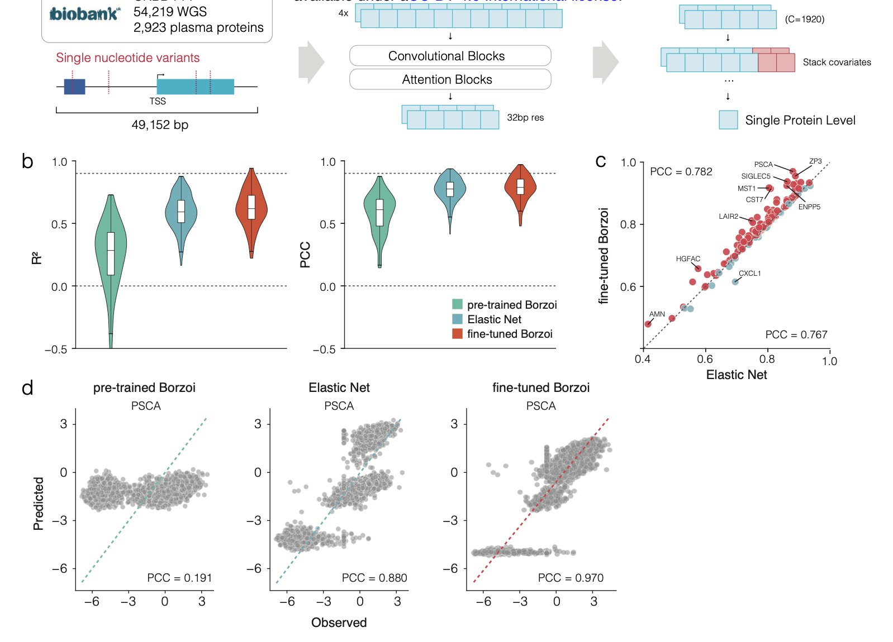
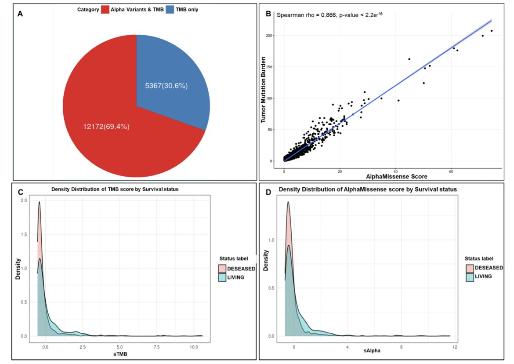
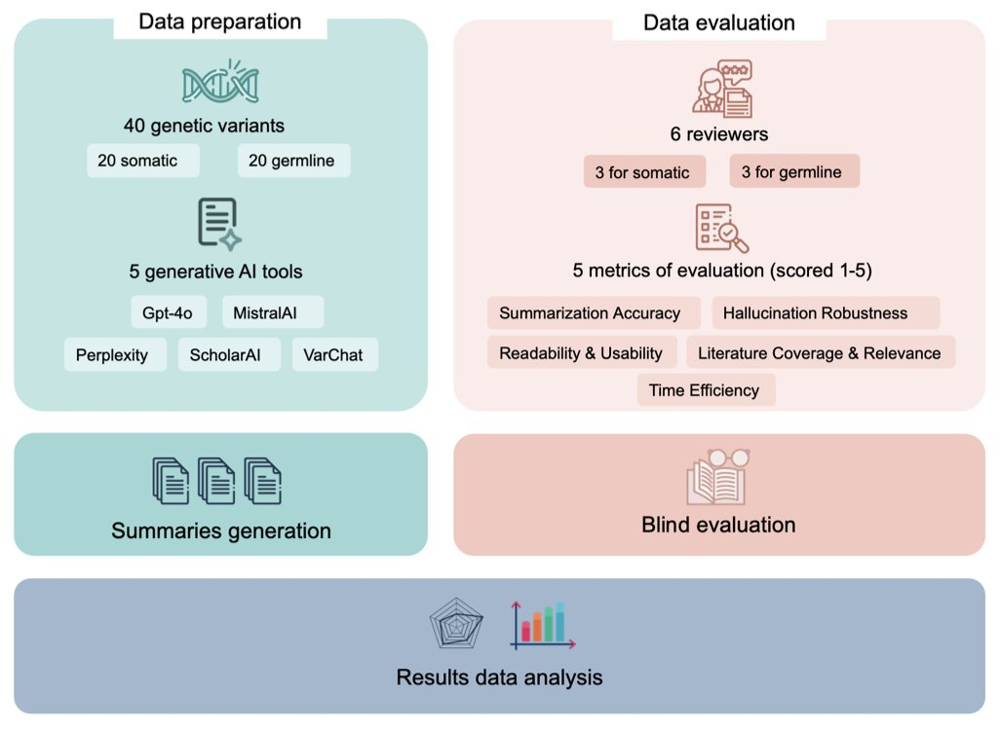

## Table of Contents
1.  Fine-tuning AI models with large-scale proteomics data can more accurately predict how genetic variants affect protein expression, a key step for precision medicine and drug target discovery.
2.  Based on AlphaMissense's assessment of mutation pathogenicity, a new biomarker, AlphaTMB, predicts cancer patient response to immunotherapy more accurately than traditional TMB.
3.  VarChat comes out on top for summarizing literature on genetic variants, but all large language models depend on existing publications and cannot replace the final judgment of human experts.

## 1. AI + Proteomics: Precisely Predicting the Impact of Genetic Variants

Any two people have thousands of differences in their genomes. But which difference, or combination of differences, causes abnormal protein levels that lead to disease? The answer to this question is the foundation of target validation and patient stratification. Traditional statistical methods, like Genome-Wide Association Studies (GWAS), can find some associations but struggle to explain the cause or predict the extent of the impact.

This study offers a new solution.

The researchers used a powerful deep learning model called Borzoi. This model already has a broad understanding of how the human genome sequence is transcribed into RNA, much like a general practitioner with a solid foundation.

The key step in the research was **fine-tuning**.

They used large-scale plasma proteomics data from the UK Biobank to train the Borzoi model. This process is like sending that general practitioner to a specialty clinic. Using the genomes and corresponding protein expression data from nearly 50,000 people, the model learned specialized knowledge. Its goal was upgraded from predicting RNA expression to directly predicting protein expression levels.

The fine-tuned model was more accurate at predicting protein expression levels than traditional linear models. The scale of the data was critical, as it allowed the model to learn from rare genetic variants (Minor Allele Frequency, MAF < 0.01) that are infrequent but may have strong effects. With smaller sample sizes, traditional models tend to ignore these rare variants as noise, but they might be the very factors that determine individual differences.

This model is not a black box. When it makes accurate predictions, the DNA regions it focuses on are known regulatory elements like enhancers, promoters, and transcription factor binding sites. This suggests the model is learning the underlying logic of gene regulation, not just fitting the data. It provides not only predictions but also testable biological hypotheses, which are valuable for understanding disease mechanisms and finding new drug targets.

Challenges still exist.

The model performs well when predicting genes it has "seen" during training, even with data from new patients. But predicting a completely new gene it has never encountered is much harder. It's like an experienced car mechanic who can diagnose a familiar engine by its sound but has to start from scratch with a new hybrid engine. The researchers tried using a multi-gene model to address this issue and saw some promise, but a universal predictor is still a long way off.

This work shows that high-quality, large-scale, real-world data is the fuel for the next generation of precision medicine models. It brings us closer to the goal of predicting a protein expression profile from a genome.

📜Title: Fine-tuning sequence to function deep learning models on large-scale proteomic data improves the accuracy of variant effect prediction
🌐Paper: https://www.biorxiv.org/content/10.1101/2025.09.26.678908v1

## 2. AlphaTMB: An AI-Weighted Mutation Load for Predicting Immunotherapy Response

In immuno-oncology, tumor mutational burden (TMB) is used to predict whether a patient will benefit from Immune Checkpoint Inhibitor (ICI) therapy. The logic is that the more mutations a tumor has, the more neoantigens it produces, making it easier for the immune system to recognize and attack the cancer cells. But this metric is rather crude.

TMB's limitation is that it treats all missense mutations equally. A "passenger" mutation that doesn't affect protein function carries the same weight in a TMB calculation as a "driver" mutation that deactivates a key tumor suppressor protein. It's like judging a military's strength only by its number of soldiers, without considering their weapons or training. This method of calculation overlooks critical information.

A new study proposes an improved approach. The researchers combined TMB with AlphaMissense to create a new biomarker, AlphaTMB. AlphaMissense is an AI model developed by DeepMind that can predict the pathogenic probability of missense mutations.

AlphaTMB works by weighting each mutation instead of just counting them. Mutations classified by AlphaMissense as "likely pathogenic" receive a higher weight, while "benign" mutations get a very low weight. The total score calculated this way better reflects the tumor's immunogenicity.

The researchers validated this method in a large cohort of 1,662 patients receiving ICI therapy. The survival curves showed that patients in the high-AlphaTMB group had a higher survival rate than those in the low-AlphaTMB group, and its predictive power was better than traditional TMB.

AlphaTMB can reclassify patients whose TMB falls into a "gray area." For example, some patients with a low TMB might be identified by AlphaTMB as potential high-responders if their mutations are mostly highly pathogenic, and vice versa. This provides a more reliable basis for clinical decisions.

The study also found that tumors with high AlphaTMB were enriched for mutations in mismatch repair and POLE genes. These types of mutations are known to be associated with hypermutated phenotypes and a good response to immunotherapy. This suggests that AlphaTMB is capturing key biological features related to immunotherapy efficacy.

AlphaTMB provides a more refined tool for measuring a tumor's immunogenic potential, advancing personalized immunotherapy. The method still needs to be validated in more independent cohorts, but it represents a promising direction for research.

📜Title: AlphaMissense pathogenicity scores predict response to immunotherapy and enhances the predictive capability of tumor mutation burden
🌐Paper: https://www.biorxiv.org/content/10.1101/2025.09.28.679078v1

## 3. AI for Interpreting Genetic Variants: VarChat Is Best, But Human Oversight Is Still Key

Every day, we deal with a huge amount of genetic variant data. To quickly understand a variant's function and clinical significance, you have to read through a lot of literature, which is a tedious and time-consuming process. The arrival of AI tools brings hope, but how reliable are they?

A preprint paper benchmarked several mainstream generative AI tools, comparing their ability to summarize literature on genetic variants. The tools tested included general-purpose ones like ChatGPT (GPT-4o) and MistralAI, as well as more specialized ones like VarChat, Perplexity, and ScholarAI.

The results showed that VarChat, designed specifically for genomics, had the highest accuracy and the lowest tendency to "hallucinate" (fabricate information). In scientific research, accuracy is vital; wrong information can send an entire study in the wrong direction.

GPT-4o followed close behind with a stable performance. Even when there was little literature on a variant, it could still provide a decent-quality answer, unlike other tools whose performance dropped sharply. This highlights the foundational capabilities of a general-purpose large model.

However, the study also found a common weakness in all the tools: they are heavily dependent on published literature. As soon as there are few research papers on a genetic variant, the performance of tools that rely on literature retrieval (like VarChat and ScholarAI) plummets. They are like students who can only summarize the textbook but are lost when faced with a question that goes beyond it. Current AI cannot yet reason from scattered information and basic scientific principles like a human expert can.

So, how should we use these tools? They are efficient assistants for filtering and organizing information, but they cannot replace professional judgment. Any result generated by AI, especially if used for clinical decisions or critical research, must be carefully verified by a domain expert. It is best to think of it as a very capable intern who occasionally makes mistakes, not an all-knowing mentor.

📜Title: Benchmarking Generative AI Tools for Literature Retrieval and Summarization in Genomic Variant
🌐Paper: https://www.biorxiv.org/content/10.1101/2025.09.29.679212v1
