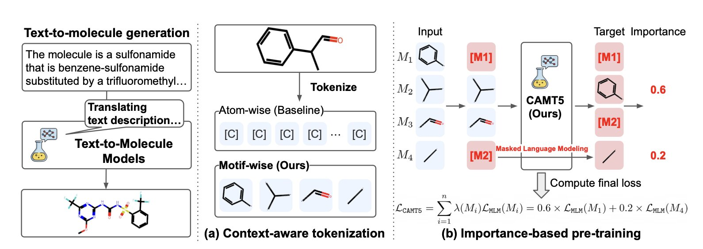
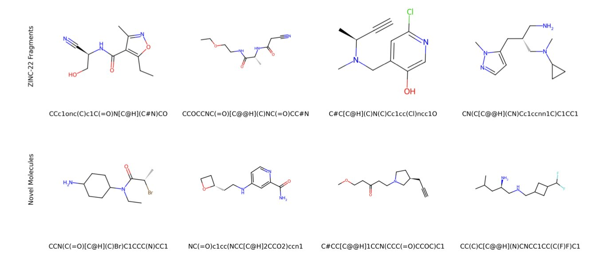
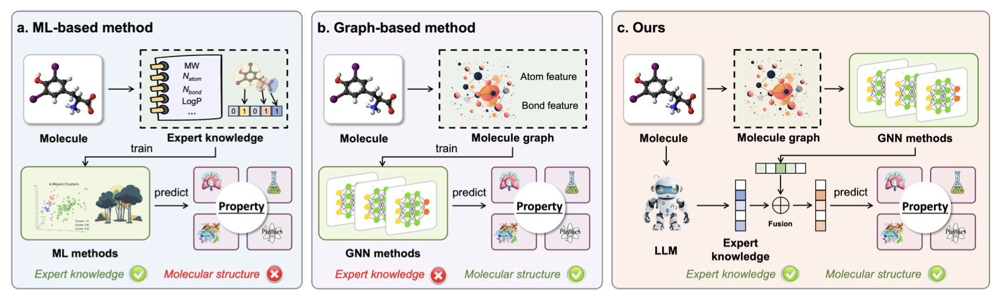
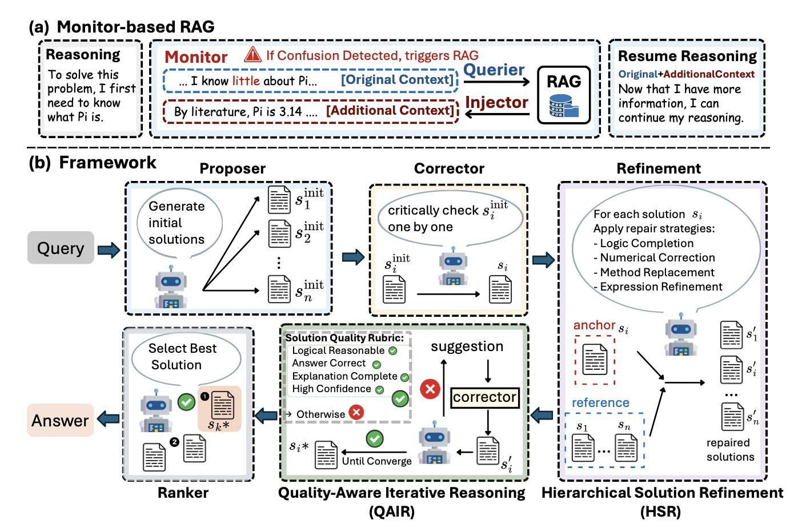
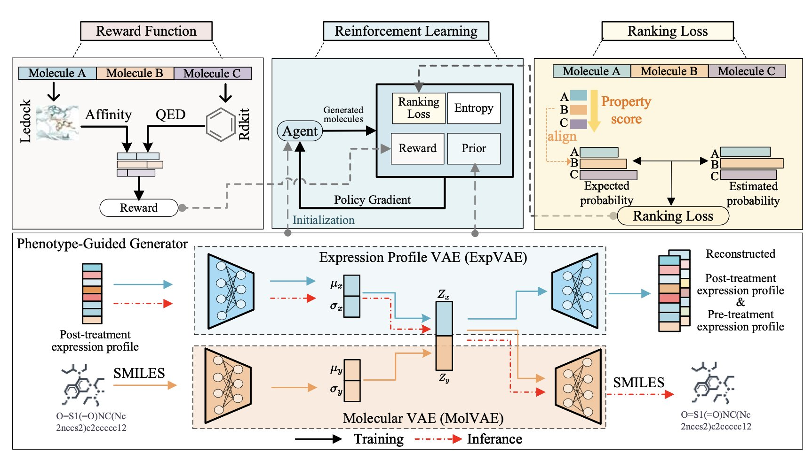

## 目录  
1. CAMT5 模型通过模拟化学家的「基元」思维，用更少的训练数据，更高效地从文本描述生成了更准确的分子结构。
2. FragAtlas-62M 是一个开源的化学语言模型，能生成海量新颖且化学上有效的药物片段，为药物研发提供创意起点。
3. 融合大语言模型的化学知识与分子的结构信息，能提升分子性质预测的准确性。
4. Eigen-1 框架通过无缝的知识检索和分层协作，提升了 AI 在复杂科学问题上的推理准确性和效率，更贴近真实科研的思维方式。
5. ExMolRL 框架通过强化学习，将表型筛选的「结果导向」与靶点设计的「精确打击」结合，生成兼具生物活性与成药性的新分子。

## 1. CAMT5 新方法：用化学家直觉教 AI 造分子  
  
  

在药物发现中，我们经常想，「我需要一个能选择性靶向某蛋白口袋、同时水溶性好的小分子」。把这类自然语言描述直接变成一个具体的分子结构，是 AI 制药领域一个有吸引力的方向。但过去很多模型的工作方式，如同教一个不懂化学的人，通过字母表（C, H, O, N...）来拼凑化学结构。结果往往是，语法（化学键）对了，但句子（整个分子）却没什么化学意义。  
  
这篇论文里的 CAMT5 模型换了个思路，它更像是在教 AI 用化学家的「行话」来思考。  
  
**从「原子」到「基元」的思维跃迁**  
  
药物化学家看到一个分子，脑子里浮现的不是一堆孤立的原子，而是一个个功能基团：一个苯环、一个酰胺键、一个哌啶环。这些「基元」（motifs）才是构成化学功能的最小单位，也是我们交流和思考的基础。  
  
CAMT5 的核心就是把这种思维方式教给 AI。它不再使用原子作为基本单元去构建分子，而是先把分子库里成千上万的分子，拆解成化学家眼中的常用结构片段或功能基团。这样一来，AI 学习的就不是「一个碳连着一个氮」，而是直接学习「这是一个酰胺键，它通常连接着两个片段，性质比较稳定」。  
  
这种基于基元的分词法（tokenization）有一个直接的好处：它自带了化学语境。AI 能更好地理解分子的全局结构和化学性质，而不是在一堆原子里「只见树木，不见森林」。  
  
**让 AI 抓住重点**  
  
CAMT5 还有一个设计，叫做「重要性预训练」（importance-based pre-training）。简单来说，就是在训练时，模型会优先学习那些在分子中起关键作用的基元。比如，一个分子的药效团（pharmacophore）或者核心骨架，显然比一个普通的亚甲基重要得多。  
  
这如同我们培养一个新手化学家，会先让他记住那些最核心、最常见的官能团反应，而不是让他去背诵所有冷僻的反应。这样学习效率高，效果也好。  
  
结果是惊人的。CAMT5 只用了之前最优模型 2% 的训练数据量，就在多个任务上取得了更好的表现。这说明，正确的学习方法远比单纯地堆数据要重要。效率的提升，意味着更低的计算成本和更快的迭代速度，这对实际应用至关重要。  
  
**对药物研发的意义**  
  
这个模型生成的分子，从直觉上看，更有「化学感」。因为它们是用化学家熟悉的「积木块」搭建起来的，所以它们更有可能具备良好的成药性，也更容易被合成出来。  
  
当然，这个方法也有它的局限。比如，它的「词汇库」（基元库）是否足够丰富，能否覆盖足够新颖的化学空间？如果遇到一个全新的、从未见过的骨架，它又该如何处理？这都是下一步需要解决的问题。  
  
不过，CAMT5 提供了一个重要的启示：让 AI 用领域专家的方式去思考，可能是通往更强大、更实用工具的正确路径。它不是凭空创造，而是在学习和组合人类化学家积累了上百年的化学智慧。  
  
📜Title: Training Text-to-Molecule Models with Context-Aware Tokenization  
📜Paper: https://arxiv.org/abs/2509.04476  

## 2. FragAtlas-62M：AI 给化学家的新积木盒，还是空欢喜？  
  
  

基于片段的药物发现 (Fragment-Based Drug Discovery, FBDD) 好比用乐高积木搭建模型。化学家先找到能微弱结合靶点蛋白的小分子「积木」，即片段，再将它们拼接或优化，最终构成一个强效药物。这个策略很成功，但寻找高质量的初始「积木」是第一道难关。化学空间浩瀚，依赖人脑和传统方法搜寻效率低下。  
  
FragAtlas-62M 这个工具，就是为了让寻找「积木」的过程更智能。  
  
它是一个大语言模型 (Large Language Model, LLM)，类似 GPT-4，但学习的不是人类语言，而是化学结构。研究者用 ZINC-22 数据库中超过 6200 万个分子片段训练它，让它掌握「化学语法」。模型学成后，就能「写」出符合化学规则的新分子片段。  
  
**它做得怎么样**？  
  
模型的「语法」学得不错，生成的分子片段 99.9% 在化学上成立，不会凭空捏造违反化学原理的结构。如果一个工具的产出大多是无效信息，它就没有价值。  
  
模型在「复习」和「创新」之间取得了平衡。它生成的片段中，53.55% 是 ZINC 数据库中的已知片段，证明模型掌握了现有的核心化学模式。同时，它还创造了 22.04% 的全新结构。t-SNE 可视化分析（见上图）显示，这些新片段 (Novel) 与已知片段 (Rediscovered) 在化学空间中的分布高度重叠。这表明新片段与已知的优质片段化学性质相似，具备成为先导片段的潜力。它就像一个既能演奏经典，又能即兴创作的音乐家。  
  
**开源的价值**  
  
模型最大的优势在于开源。研究团队公开了模型、代码和数据。无论是在大公司还是高校实验室，只要具备中等计算资源，就能部署和使用。研究人员可以用它快速生成包含数万个新颖片段的虚拟库，用于虚拟筛选或启发合成目标。它像一个不知疲倦、充满创意的助手。  
  
**局限性**  
  
模型也有局限。  
第一，它处理的是 SMILES 字符串，一种一维化学表示法，无法理解分子的三维构象和立体化学。在药物发现中，分子的三维形状决定其能否与靶点结合。模型给出的只是平面「设计图」，三维结构的构建仍需化学家完成。  
第二，模型只生成「积木」，不指导如何「搭建」。它不提供片段连接的策略。从片段到先导化合物的跨越，依然是药物化学的艺术。  
  
总的来说，FragAtlas-62M 的定位是辅助化学家的强大工具，而非替代品。它拓展了寻找药物起始点的视野，揭示了单靠人力难以发现的可能性。模型将化学家从繁琐的「积木」搜寻中解放出来，让他们更专注于如何将优质片段组合成有效的药物。  
  
📜Title: A Foundation Chemical Language Model for Comprehensive Fragment-Based Drug Discovery  
🌐Paper: https://arxiv.org/abs/2509.19586  

## 3. AIDD：大模型知识与分子结构融合  
  
  

在计算机辅助药物发现中，预测分子性质通常有两种方法。第一种是利用图神经网络（Graph Neural Networks, GNNs）等模型直接分析分子的二维或三维结构。这种方法擅长从结构中发现规律，但它像一个只懂几何、不懂化学的数学家，缺乏对化学官能团、反应活性等高阶概念的「化学直觉」。  
  
第二种方法是让大语言模型（Large Language Model, LLM）解读化学文献。它能理解许多化学概念，但有时会产生「幻觉」，凭空捏造事实，并且对具体的分子结构理解不够深入。  
  
这篇论文提出了一种方法，结合了二者的优势。  
  
研究者不直接让大语言模型预测分子性质，而是先让它担任「顾问」。他们向大语言模型（如 GPT-4o）提问，让其生成特定分子的相关化学知识，甚至直接生成用于计算分子描述符的 Python 代码。这好比请一位资深化学家，将他看到一个分子后想到的关键信息写下来，例如「此结构中有一个迈克尔受体，可能有脱靶毒性」或「这个稠环体系平面性好，可能存在 hERG 问题」。  
  
然后，研究者将这些由大语言模型生成的「知识特征」向量，与从分子图结构中提取的传统「结构特征」向量拼接起来，再将融合后的新特征向量输入一个简单的预测模型。  
  
这种思路弥补了两种方法的短板。分子结构信息像一张安全网，为预测提供了坚实的物理基础，可以校正大语言模型的随意想象。大语言模型提供的化学知识，则为冰冷的结构数据注入了丰富的化学内涵，在处理数据稀疏、规律复杂的生物活性或 ADMET（吸收、分布、代谢、排泄和毒性）性质时，效果提升尤其明显。  
  
研究者在多个公开数据集上验证了该方法。结果表明，这种「知识 + 结构」双重信息源的方法，性能稳定地超过了仅使用单一信息源的方法。他们还对比了不同大语言模型（GPT-4o、GPT-4.1 和 DeepSeek-R1）生成的知识质量。  
  
这个框架为利用大语言模型赋能药物研发，提供了一个务实的范例。它让 AI 成为一个能将海量文献知识转化为可用计算特征的助手，而非替代科学家。  
  
📜Title: Enhancing Molecular Property Prediction with Knowledge from Large Language Models  
🌐Paper: https://arxiv.org/abs/2509.20664  

## 4. AI 多智能体新玩法 Eigen-1，让科学推理更精准高效  
  
  

大语言模型 (Large Language Models, LLM) 在处理通用问题时表现不错，但面对复杂的生物化学等科学推理任务时，常因缺乏特定领域知识或在多步推理中迷失方向而受挫。一篇新论文提出的 Eigen-1 框架，为此提供了一个新解法。  
  
#### 让 AI 像专家一样「无意识」调取知识  
  
科研工作中，知识内化于大脑。思考问题时，相关知识点会自然浮现，无需每一步都停下翻阅资料。传统的检索增强生成 (Retrieval-Augmented Generation, RAG) 就像后者，它要求 AI 明确调用工具查找资料，这个过程会打断思考的连贯性。  
  
Eigen-1 的设计思路不同，它引入了「基于监视器的 RAG」 (Monitor-based RAG) 机制。该系统在 token 层面工作，像一个时刻在线的监视器，持续检测 AI 推理过程中的「知识缺口」。一旦发现，它会立即无缝地补充外部知识，整个过程对 AI 的主推理流程没有干扰。  
  
这好比一位经验丰富的科学家解题，相关信息会自然地在他脑海中涌现，支撑他完成下一步推导，而无需停下自问需要查什么资料。这种方式让 AI 的推理过程更加流畅深入。  
  
#### 从「民主投票」到「同行评审」  
  
面对复杂问题时，人们通常会想出几种可能的解决方案。传统的多智能体系统会让每个智能体生成一个方案，再通过投票选出最佳方案。这种方式简单，但常会选出一个「最平庸」而非「最正确」的答案。  
  
Eigen-1 采用了一种更接近科研合作的模式，即「分层方案优化」 (Hierarchical Solution Refinement, HSR)。它的工作流程如下：  
1.  系统生成多个候选解决方案。  
2.  将每个方案轮流作为「锚点」 (anchor)。  
3.  其他方案则作为「同行」，审阅并修正这个「锚点」方案。  
  
这个过程类似论文的同行评审。每个审稿人（其他解决方案）从自身角度指出当前论文（锚点方案）的优缺点，并提出修改建议。通过这种结构化的交叉评审和修复，每个方案的质量都得到系统性提升，最终产出一个经过多轮打磨、更严谨可靠的解决方案。  
  
#### 知道何时「收手」：高效的智能迭代  
  
研究工作需要避免在已足够好的问题上投入过多资源。Eigen-1 通过「质量感知迭代推理」 (Quality-Aware Iterative Reasoning, QAIR) 机制解决了这个问题。  
  
每一轮方案优化后，QAIR 会评估结果质量。如果方案已足够好，或继续优化的边际效益很低，系统就会停止迭代。这种自适应方法确保了计算资源用在关键之处。  
  
在 HLE 生物/化学黄金基准测试上，Eigen-1 的准确率达到 48.3%，超越了之前的模型。同时，它的 token 使用量减少了 53.5%，智能体执行步骤减少了 43.7%。它不仅更准，也更快、更节省成本。  
  
对于药物研发这类需要大量计算和推理的领域，这种效率提升意义重大，可以用更低的成本在更短的时间内探索更多可能。Eigen-1 模仿人类专家无缝调用知识和同行协作评审的思路，为 AI 解决前沿科学问题提供了有潜力的方向。  
  
📜**Title**: Eigen-1: Adaptive Multi-Agent Refinement with Monitor-Based RAG for Scientific Reasoning  
🌐**Paper**: https://arxiv.org/abs/2509.21193  

## 5. AI 新药发现：ExMolRL 整合表型与靶点，双管齐下  
  
  

在药物发现领域，寻找新药通常有两条长期分离的路径。  
  
第一条路是「表型筛选」。它如同神农尝百草，将大量化合物作用于细胞，观察哪个能产生预期效果，比如杀死癌细胞。这种方法的优点在于结果导向，即使靶点未知也可能找到有效分子。缺点是其「黑盒」特性，给后续的机理研究和分子优化带来困难。  
  
第二条路是「基于靶点的药物设计」。它好比精确制导，先锁定一个与疾病相关的关键蛋白（靶点），再设计或筛选能与之结合的分子，就像为锁配钥匙。这种方法目标明确，但风险在于，一旦选错靶点，或单一靶点不足以治疗复杂疾病，后续所有工作都可能徒劳无功。  
  
理想的药物发现，需要结合两种策略的优点：既有表型筛选的结果保障，又有靶点设计的精确性。ExMolRL 框架就是为此设计的。  
  
它的设计分为两步。  
  
第一步，训练一个分子生成器，学习海量的「药物 - 转录组」数据。AI 从中学习不同药物如何引起细胞基因表达的变化，相当于掌握了一本「药效指纹图谱」。通过学习，AI 能预测特定分子结构可能对应的细胞表型。例如，它能学会识别出可能杀死 A549 肺癌细胞的分子特征。  
  
第二步，引入多目标强化学习 (Multi-Objective Reinforcement Learning) 进行微调。强化学习好比训练 AI 玩游戏：设定规则，根据表现给予奖励。在这里，游戏目标是生成理想的药物分子，奖励规则由一个复合函数决定，综合了多个关键指标：  
  
1.  **靶点结合力 (Docking Affinity**)：分子需与指定靶点蛋白紧密结合，实现「精确打击」。  
2.  **表型匹配度 (Ranking Loss**)：分子预测的基因表达谱，需与期望的「抗癌」表型谱高度一致，确保「结果导向」。  
3.  **类药性 (Drug-likeness**)：分子的物理化学性质（如溶解度、稳定性）需符合成药标准。  
4.  **可合成性 (Synthetic Accessibility**)：分子在化学上必须可以合成，避免纸上谈兵。  
5.  **多样性 (Entropy Maximization**)：鼓励生成结构多样的分子，以提高发现成功率。  
  
这套奖励机制引导 ExMolRL 寻找最佳平衡点。它生成的分子不再是单项冠军，而是综合性能优异的候选药物。  
  
结果表明，ExMolRL 生成的分子在靶点结合能力、类药性和可合成性等指标上，优于仅关注靶点或表型的传统方法。并且，计算设计的分子在细胞实验中也展现出更强的抗癌活性。这证实了「表型 + 靶点」双重策略在发现潜力药物分子上的有效性。  
  
ExMolRL 这类工具为药物研发提供了探索化学空间的新范式。它设计的分子从源头就兼顾了靶点精确性（打得准）与生物有效性（打得狠），有望提升早期药物发现的成功率。  
  
📜Title: ExMolRL: Phenotype–Target Joint Generation of De Novo Molecules via Multi-Objective Reinforcement Learning  
🌐Paper: https://arxiv.org/abs/2509.21010v1
