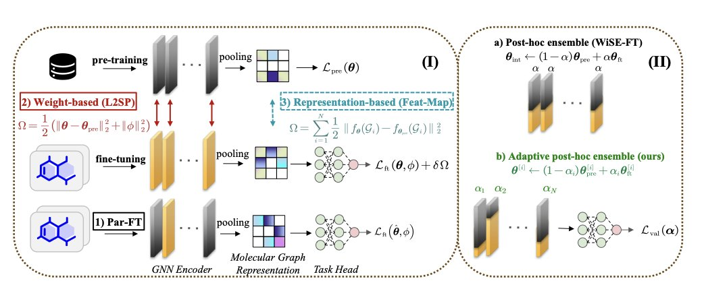
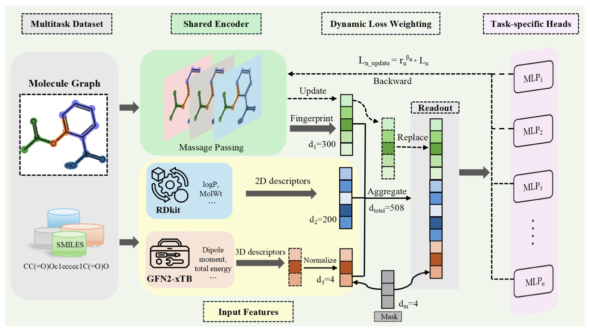
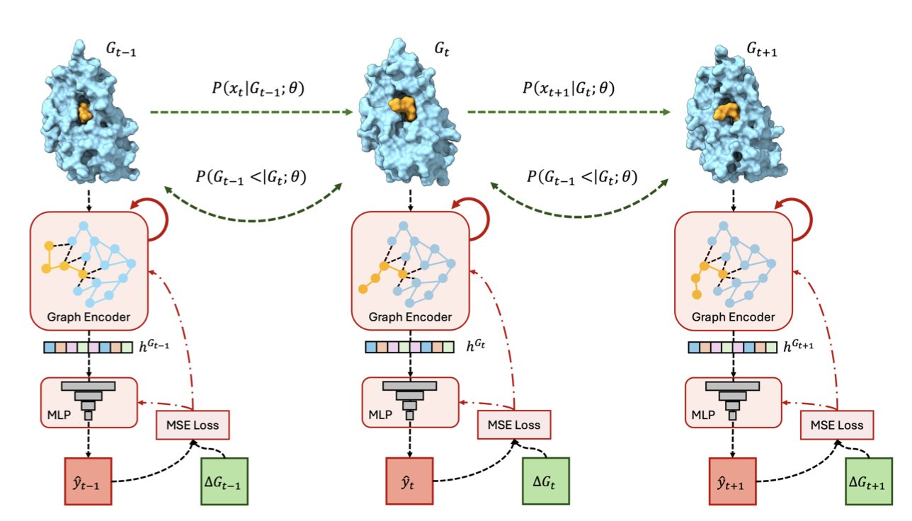
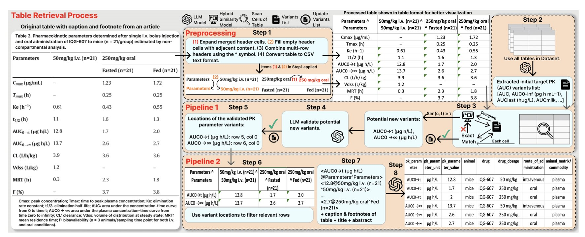
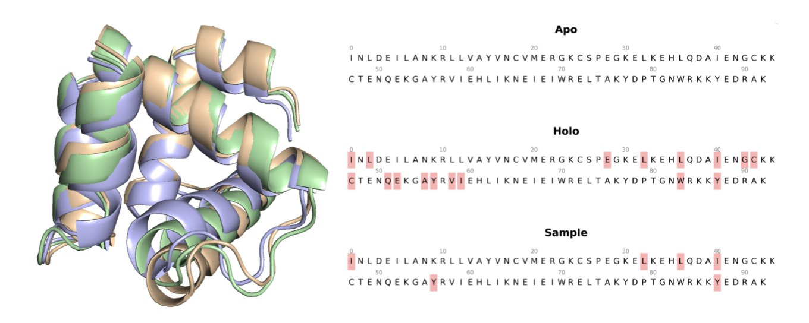

## 目录  
1. RoFt-Mol 基准测试揭示，AI 分子模型微调没有万能钥匙，任务类型和数据量决定了最佳策略，而新提出的 DWiSE-FT 方法在自监督预训练下表现出色。
2. QW-MTL 框架通过融合量子化学描述符和可学习的任务权重，为药物 ADMET 属性预测提供了一个更精准、更高效的多任务学习方案。
3. 研究者们用海量分子动力学模拟数据训练了一个 AI 模型 SurGBSA，它能以近 6500 倍的速度高精度预测结合能，让高通量筛选中的物理计算变得可行。
4. 从纷繁复杂的表格中处理药代动力学（PK）数据向来棘手。AutoPK 这套新方法，为大语言模型设计了一套规范化流程，显著提升了数据提取的准确性和可靠性，让小型开源模型也能媲美商业闭源模型。
5. SESAME 是一种生成式 AI 模型，能高效预测蛋白质从无配体（apo）到结合配体（holo）的构象变化，为虚拟筛选和发现隐蔽口袋提供了高质量的结构。

## 1. RoFt-Mol 基准：AI 药物模型微调，哪种方法最靠谱？  
  
  

我们在药物研发中都用过大模型，特别是分子图基础模型（Molecular Graph Foundation Models, MGFMs）。这些模型如同刚从顶尖学府毕业的天才，知识储备丰富，但还没接触过我们手头具体的项目。我们的任务，就是通过「微调」（Fine-Tuning）让他快速上手，解决特定的问题，比如预测一个分子的活性或者毒性。  
  
但这里有个大坑：怎么微调？如果方法不对，这个「天才」要么会过度拟合我们给的小数据，在新数据上一塌糊涂；要么就是「忘了」自己之前学到的广博知识，变得短视。这如同你教一个米其林大厨做一道家乡菜，你既希望他学会，又不希望他把之前学的所有烹饪技巧都给忘了。  
  
一篇新论文提出的 RoFt-Mol 基准，就是为了解决这个头疼的问题。研究者们搭建了一个标准的「考场」，系统地评估了八种主流的微调方法，告诉我们什么情况下该用哪种方法。  
  
#### 先看模型的「出身」：监督还是自监督？  
  
模型的「出身」，即预训练方式，直接影响了后续微调的效果。  
  
监督预训练，好比这个模型上的是「专科学校」，针对特定领域的知识（如预测分子性质）做了强化训练。自监督预训练，则更像是「通识教育」，模型通过学习分子结构本身的规律来构建知识体系。  
  
研究发现，在「少样本」（Few-shot）场景下，也就是我们只有少量标注数据时，监督预训练的模型表现更好。这很好理解，「专科生」上手快，能直接套用学过的知识。  
  
但如果数据量充足，情况就变了。只有当预训练任务和我们下游的微调任务高度相关时，「专科生」的优势才能体现出来。否则，接受「通识教育」的自监督模型，因为基础更扎实，反而可能表现得更好。  
  
#### 再看任务类型：分类还是回归？  
  
我们交给模型的任务，通常分为两类：  
  
1.  **分类任务**：回答「是」或「否」。比如，这个分子是「有活性」还是「无活性」？  
2.  **回归任务**：给出一个具体的数值。比如，这个分子的溶解度具体是多少？  
  
这篇论文有个发现：在微调时，模型更容易在分类任务上过拟合，尤其是在数据量少的时候。因为它只需要记住几个样本的标签就行了，有点像「背答案」。而回归任务要求模型理解输入和输出之间的精确关系，才能预测出准确的数值，这迫使模型去学习「解题思路」，而不是死记硬背。  
  
这对我们日常工作是个提醒：当处理小样本的分类问题时，要对过拟合保持高度警惕。  
  
#### 各种微调方法，谁是王者？  
  
RoFt-Mol 基准测试了三类八种微调方法，我们挑重点的说。  
  
**权重微调（Weight-based**）：这类方法会直接调整预训练模型的参数。  
  
这两种方法特别适合与自监督预训练的模型搭配使用。  
  
**表征微调（Representation-based**）：这类方法会冻结预训练模型的大部分参数，只训练一小部分新添加的层。  
  
#### DWiSE-FT：一个更强的「多面手」  
  
最后，研究者们基于以上发现，提出了一个新方法 DWiSE-FT。它融合了 WiSE-FT 和 L2-SP 的优点，既能像 WiSE-FT 那样平衡新旧知识，又能像 L2-SP 那样防止模型跑偏。  
  
结果显示，DWiSE-FT 在自监督预训练的模型上表现出色，无论面对的是分类任务还是回归任务，都能拿出稳健的性能。这对于研发人员来说是个好消息。因为在实际工作中，我们经常需要一个可靠的、适用性广的工具来处理各种不同的项目。  
  
RoFt-Mol 这个基准，给了我们一份实用的微调「说明书」。下次为新项目选择微调策略时，我们不再是凭感觉摸索，而是可以根据模型的出身、任务的类型和数据量，做出更科学的选择。  
  
📜Title: RoFt-Mol: Benchmarking Robust Fine-Tuning with Molecular Graph Foundation Models  
📜Paper: <https://arxiv.org/abs/2509.00614>  

## 2. 量子增强 ADMET 预测：一个更准更快的 AI 框架  
  
  

在药物发现的早期阶段，如何快速、准确地预测候选分子的 ADMET（吸收、分布、代谢、排泄和毒性）属性，是一个核心难题。预测失败是导致后期临床试验失败的主要原因。多任务学习（Multi-Task Learning, MTL）是一个很自然的想法，让一个模型同时学习多个相关属性，比如同时预测溶解度和肝毒性，这样模型能学到更通用的分子特征。但它有一个问题：数据不平衡。溶解度的数据可能有几十万个，而某个特定毒性的数据可能只有几千个。模型训练时，自然会偏向数据量大的任务，导致在小样本任务上表现很差。  
  
这篇论文提出的 QW-MTL 框架，试图解决这个问题。  
  
首先，它在分子表征上下了功夫。传统的分子指纹（如 ECFP）主要描述分子的**拓扑结构**，但很多 ADMET 属性，比如代谢稳定性和膜渗透性，和分子的**电子性质**息息相关。作者将量子化学计算得出的描述符（如分子的前线轨道能量、偶极矩等）与传统描述符结合起来。这好比，以前我们只给模型看分子的「骨架图」，现在我们还给了它一张分子的「电子云分布图」。有了这些物理意义更强的特征，模型对分子的理解就更深刻了，预测自然更准。  
  
其次，也是这个框架最核心的创新，是它的「可学习任务加权」机制。作者设计了一个策略，让模型在训练过程中根据每个任务的样本规模，动态调整它们的权重。样本量少的任务会被赋予更高的权重，迫使模型投入更多精力去学习它们。这如同一个经验丰富的导师带学生，他会花更多时间在学生的薄弱环节上，而不是一遍又一遍地重复已经掌握的知识点。这个机制简单直接，却有效地解决了多任务学习中的「偏科」问题。  
  
从结果来看，这个方法是有效的。研究者在 Therapeutics Data Commons（TDC）的 13 个公开基 - 准数据集上进行了测试，QW-MTL 的性能超过了传统的单任务学习模型，并在多个任务上达到了当前最优水平。  
  
它的实用性也很高。在增加量子特征和动态权重这些模块后，模型的参数量并没有显著增加，推理速度反而更快了。这让它可以无缝对接到现有的高通量虚拟筛选流程中。对于一个药物研发团队来说，一个既准又快的模型，意味着能以更低的成本、在更短的时间内筛选数百万甚至上千万个分子，从而提高找到优质候选分子的概率。  
  
📜Title: Quantum-Enhanced Multi-Task Learning with Learnable Weighting for Pharmacokinetic and Toxicity Prediction  
📜Paper: https://arxiv.org/abs/2509.04601  

## 3. SurGBSA: AI 让结合能预测提速近 6500 倍  
  
  

在药物发现领域，我们总是在速度和精度之间做权衡。分子对接（docking）很快，但结果常不准；而像 MM/GBSA 这样的方法，通过分子动力学（Molecular Dynamics, MD）模拟来计算结合自由能，结果更可靠，但慢得让人无法忍受。你很难把它用在需要筛选数百万个分子的虚拟筛选上。这如同你想用高精度显微镜去大海捞针，理论上可行，但等你找到的时候，项目早就结束了。  
  
这篇工作提出的 SurGBSA，就是来解决这个问题的：既然 MM/GBSA 那么慢，我们能否训练一个 AI 模型，让它学会 MM/GBSA 的「品味」，然后用 AI 的速度来做预测？  
  
**成功的关键：用「电影」而不是「照片」训练 AI**  
  
传统的机器学习模型通常使用静态的 3D 结构（如晶体结构）作为输入。这如同给 AI 看一张化合物和靶点结合的「照片」，信息是有限的。因为在真实世界里，分子和蛋白质都在不停地运动、振动，构象一直在变化。  
  
SurGBSA 的研究者换了个思路。他们先进行了大量的 MD 模拟，获得了超过 140 万条分子 - 蛋白复合物的动态「电影片段」（3D 轨迹）。然后，他们用这些包含丰富动态信息的「电影」来训练模型。这样做的好处是，模型不再只学习一个静止的构象，而是学会了分子在相互作用过程中的各种构象和能量变化。这使得模型的泛化能力和鲁棒性都更强。  
  
**一个快了近 6500 倍的「代理**」  
  
SurGBSA 的核心是一个代理模型（surrogate model）。这意味着研究者们已经替我们完成了最耗时的工作——生成海量 MD 数据并训练好模型。  
  
现在我们的工作流程就变了。当拿到一个对接后的构象时，我们不再需要为它单独跑一遍漫长的 MD 模拟。我们直接把这个构象扔给 SurGBSA 模型，它能在瞬间给出一个预测的 MM/GBSA 能量值。根据论文数据，这个过程比传统的计算快了 6497 倍。一个原本需要几小时甚至一天的计算，现在几秒钟就完成了。  
  
同时，这种速度并没有以牺牲过多精度为代价。在对结合构象（pose）的排序任务中，SurGBSA 的预测结果与传统 MM/GBSA 计算结果的相关性很高（Pearson 相关系数达到 0.702）。这意味着它能很好地分辨出哪些是「好」的结合模式，哪些是「坏」的。  
  
**对行业意味着什么**？  
  
SurGBSA 的出现，让在高通量筛选的早期阶段就引入更可靠的物理化学计算成为可能。我们可以在筛选数百万分子时，就用上接近 MM/GBSA 精度的打分函数，这会提高筛选的命中率，减少后续实验的成本。  
  
研究者还对比了不同的图神经网络架构（GNN、EGNN、EGMN），发现预训练的 EGMN 效果最好。这说明，利用已有的知识（预训练）能进一步提升模型的性能。他们把代码和数据都公开了。这不仅展示了他们的自信，也为开发下一代基于 MD 的基础模型铺平了道路。  
  
📜Title: SurGBSA: Learning Representations From Molecular Dynamics Simulations  
📜Paper: https://arxiv.org/abs/2509.03084v1  

## 4. AutoPK：大模型精准提取药代动力学数据  
  
  

药物研发人员常需从海量文献中提取药代动力学（PK）数据。这些数据深藏于 PDF 表格，格式和术语缺乏统一标准。例如，「半衰期」可能被记为 `Half-life`、`T1/2` 或 `t_half`。手动整理这类数据耗时且容易出错。  
  
直接让大语言模型（Large Language Models, LLM）处理这些复杂表格，效果并不理想，模型时常出现误读或凭空编造，即「幻觉」现象。  
  
AutoPK 采用了一套巧妙的两阶段策略来解决这个问题。  
  
第一步是**识别与标准化**。AutoPK 扫描表格，找出所有潜在的 PK 参数术语。它运用一种混合相似度指标，结合词形（如 `CL` 与 `Clearance`）与语义（两者均指「清除率」），将不同写法统一为标准术语。例如，`T1/2` 和 `t_half` 都会被标记为标准的 `Half-life`。  
  
第二步是**提取与重建**。术语标准化后，AutoPK 将表格转换为简洁的「键 - 值」文本格式，如 `{'Half-life': '2.5 h', 'Species': 'Rat'}`。最后，大语言模型读取这份干净、规范的文本，生成结构化的机器可读表格。  
  
这个过程好比为大模型配备了一位专业的预处理助手，先将原始杂乱的食材（原始表格）清洗切配（标准化），再交由大厨（LLM）烹饪（生成结果），从而降低了出错的概率。  
  
在包含 605 个真实世界 PK 表格的数据集上，LLaMA 3.1-70B 模型在 AutoPK 的辅助下，半衰期和清除率参数的 F1-score（综合衡量精确率和召回率的指标）分别提升了 0.10 和 0.21，最终达到 0.9 以上。  
  
AutoPK 对小型模型的性能提升效果尤其突出。Gemma 3-27B 和 Phi 3-12B 等模型直接处理数据时，幻觉率高达 60-95%。经过 AutoPK 流程处理后，它们的幻觉率降至 8-14%，F1-score 提升了 2 到 7 倍。  
  
这意味着，在 AutoPK 的帮助下，开源小模型 Gemma 3-27B 提取某些 PK 参数的性能，甚至超过了商业模型 GPT-4o Mini。这为药物研发机构提供了一个低成本、高效率、高可靠性的数据提取方案。  
  
AutoPK 的价值在于展示了如何更巧妙地使用现有工具，而非一味追求更大的模型。它解决了一个具体而普遍的行业痛点，推动了药物数据分析的自动化与规模化进程。  
  
📜Title: AutoPK: Leveraging LLMs and a Hybrid Similarity Metric for Advanced Retrieval of Pharmacokinetic Data from Complex Tables and Documents  
🌐Paper: https://arxiv.org/abs/2510.00039v1  

## 5. SESAME 模型：AI 预测蛋白构象，打开隐蔽药物口袋  
  
  

在药物发现中，蛋白质并非静态的积木，而是一直在运动的机器。我们从晶体结构数据库（PDB）中得到的，通常是蛋白质的 apo 构象，即其「空闲」时的样子。但药物分子要结合的，是其处于「工作」状态的 holo 构象，这两者常有巨大差别，尤其是在结合口袋区域。  
  
传统上，模拟这种构象变化需使用分子动力学（Molecular Dynamics, MD）模拟。该方法强大，但速度慢、计算成本高。一次 MD 模拟常需数天甚至数周，对于需要快速筛选上百万个化合物的早期研发来说，并不现实。  
  
SESAME 这个模型提供了一个替代方案。它是一个生成式 AI，专门学习蛋白质如何从 apo 状态「变形」到 holo 状态。  
  
它的工作原理是流匹配（flow matching）。可以把它想象成学习一个变形规则。模型输入一个 apo 构象，然后像水流一样，引导这个结构逐渐变化，最终「流向」一个更可能结合配体的 holo 构象。这个过程在数学上于 SE(3) 空间（处理分子的旋转和平移）和 R³空间（处理原子坐标）中进行，确保生成的构象在物理上合理。  
  
研究者在 D3PM-Large 数据集上测试了它。结果显示，在 38% 的预测中，生成的结构与真实的 holo 结构之间的均方根偏差（Root Mean Square Deviation, RMSD）小于 2.0 Å。在结构生物学领域，2 Å是衡量预测准确度的重要门槛，小于此值通常意味着预测的骨架结构接近真实情况。  
  
这模型最令人兴奋的一点，是它能帮助我们找到「隐蔽口袋」（cryptic pockets）。这些口袋平时是关闭或不存在的，只有在蛋白质运动时才偶尔暴露出来。它们往往是极佳的药物靶点，因为选择性可能更高，但用传统的静态结构很难发现。研究者将 SESAME 和另一个口袋发现工具 PocketMiner 结合使用，发现用 SESAME 生成的动态构象，能提升发现隐蔽口袋的成功率。  
  
生成的结构最终要为药物设计服务。研究者用这些结构做了分子对接（molecular docking）测试。结果很明确：使用 SESAME 生成的 holo 构象，对接的打分和成功率都比直接用 apo 结构要好。这意味着，我们可以把它整合到虚拟筛选流程中，先用 SESAME 快速生成一批高质量的蛋白构象，再进行大规模的化合物筛选，从而提高命中率。  
  
当然，这个模型也还有改进空间。目前它主要关注蛋白质主链骨架的变化，下一步需要把侧链的精细构象也整合进来，毕竟药物分子和氨基酸侧链的相互作用是结合的关键。  
  
📜Title: SESAME: OPENING THE DOOR TO PROTEIN POCKETS  
📜Paper: https://arxiv.org/abs/2509.05302
