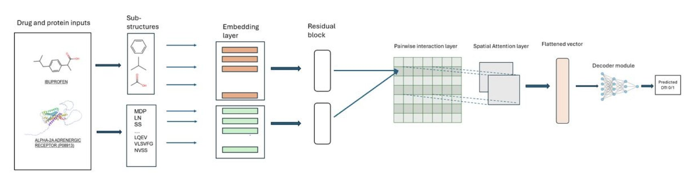
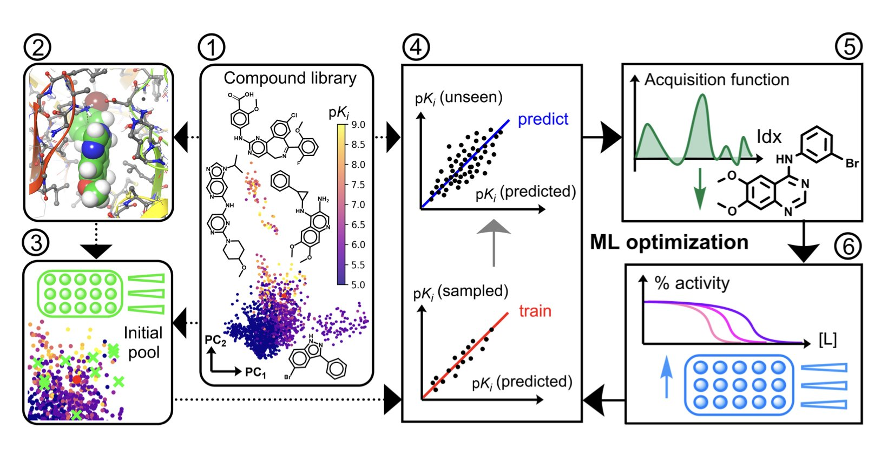
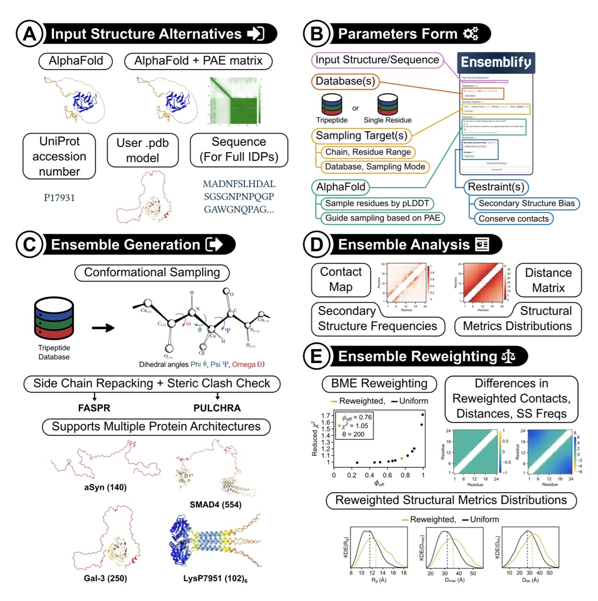
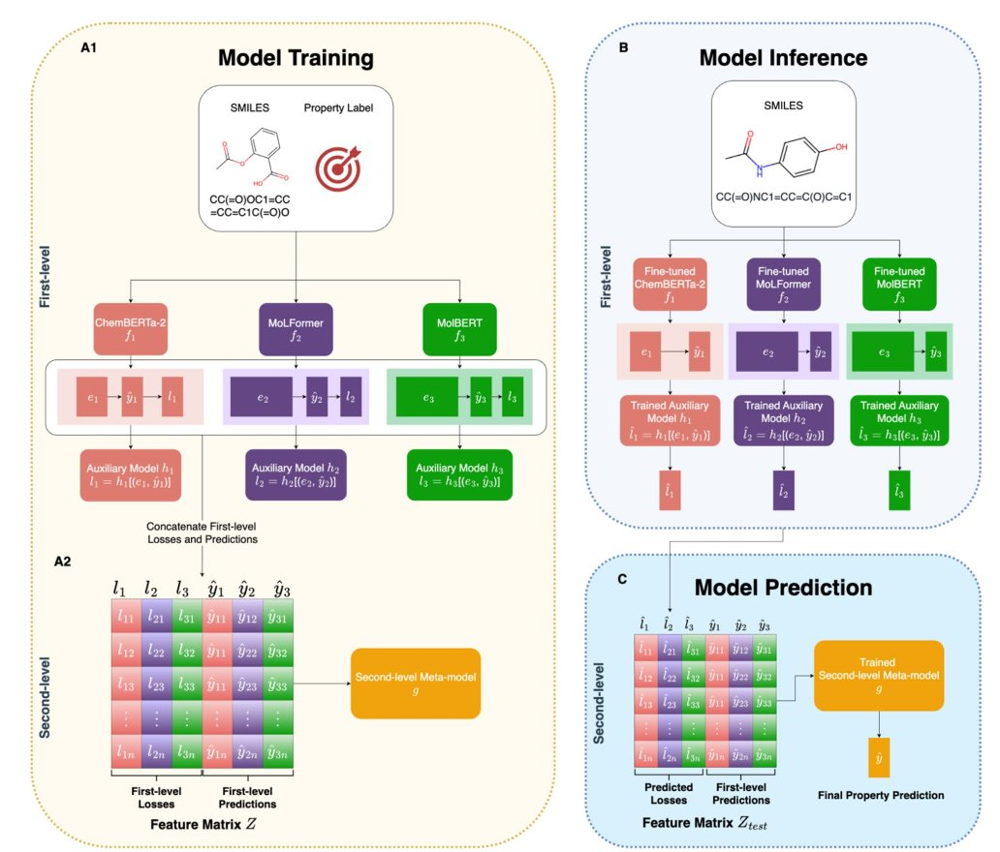
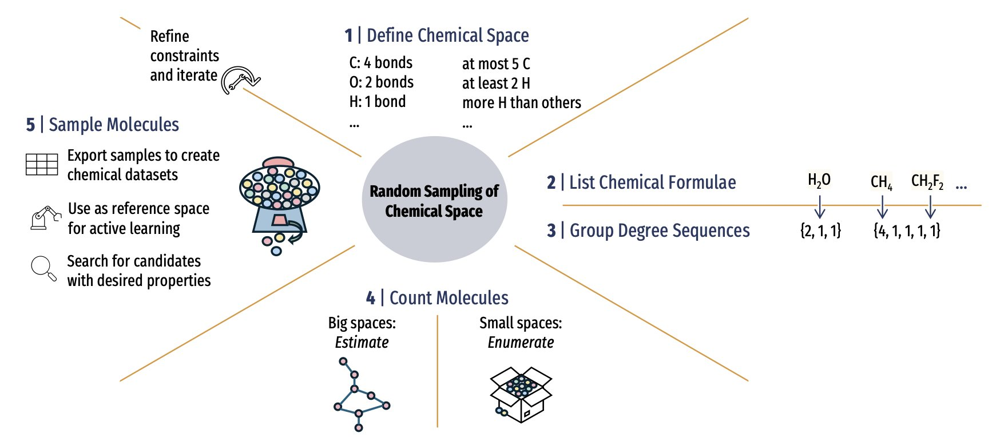

## 目录  
1. SAM-DTI 模型通过预先构建药物 - 蛋白亚结构二维互作图谱，再利用空间注意力机制聚焦关键区域，实现了更精准且更符合化学直 rzeb 的药物 - 靶点相互作用预测。
2. 将分子对接分数作为特征，可以提升机器学习在药物优化中的数据效率和命中率。
3. Ensemblify 是一款计算工具，它利用 AlphaFold 的低置信度分数作为指导，高效生成蛋白质无序区 (IDR) 的动态构象系综，解决了结构生物学的一个难题。
4. FusionCLM 通过一种堆叠集成学习策略，融合多个化学语言模型的优势，为分子属性预测提供了更准确的解决方案。
5. 这项新方法通过无偏随机采样，让我们能生成真正代表性的分子数据集，从根本上解决当前 AI 制药模型训练数据的偏差问题。

## 1. AI 新模型 SAM-DTI，革新药物靶点预测  
  
  

药物 - 靶点相互作用（Drug-Target Interaction, DTI）预测的 AI 模型有很多，但大多数模型的工作方式总感觉有点「绕」。它们通常先把药物分子（如用 SMILES 字符串）和蛋白质序列（用 FASTA 序列）各自扔进一个编码器，分别提取特征，直到最后一步才把这两个信息流汇合起来，判断它们是否结合。  
  
这如同你想知道一把钥匙能否开一把锁，却只分别研究钥匙的材质和锁的品牌，而不是直接看看它们的齿形和锁芯是否匹配。这种「后期融合」的策略，在信息处理的早期就丢失了两者之间最关键的空间对应关系。  
  
SAM-DTI 这个模型换了个更直接的思路。  
  
研究者们没有让药物和蛋白质的信息各走各的路，而是在一开始就将它们「撮合」在一起。具体来说，他们先将药物分子和蛋白质都拆解成有化学或生物学意义的「亚结构」单元。然后，他们构建了一个二维的互作矩阵。你可以把这个矩阵想象成一张棋盘，棋盘的横轴代表药物的各个亚结构，纵轴代表蛋白质的各个亚结构。棋盘上的每一个格子，都代表着一对特定亚结构之间潜在的相互作用。  
  
这样，一个复杂的 DTI 预测问题，就变成了一个更直观的图像识别问题。  
  
接下来是这个模型最核心的部分：空间注意力机制（spatial attention mechanism）。有了这张「互作棋盘」之后，模型会像一个经验丰富的化学家一样，用「目光」扫描整张图。它的注意力会自然地聚焦在那些决定结合与否的关键「热点区域」上。比如，药物的某个氢键供体和蛋白口袋里的某个氢键受体形成的那个「格子」，就会被赋予更高的权重。  
  
这种方法的好处是显而 - 见的。它不仅更符合我们对分子识别过程的化学直觉，而且因为模型「看」到了全局的互作模式，预测的准确性也更高。从数据上看，SAM-DTI 在多个公开数据集上的表现（如 ROC-AUC 和 PR-AUC 指标）都超过了现有的一些基线模型。这意味着它在筛选真实阳性结果时，表现得更可靠。  
  
模型的价值最终要看它能否解决实际问题。研究者们用 SAM-DTI 来进行药物重定位（drug repurposing）的虚拟筛选，发现了一些有趣的结果。例如，模型预测天然产物姜黄素（curcumin）、EGCG 和褪黑激素（melatonin）可能作用于一些新的靶点。这些都是可以被后续实验验证的、有价值的科学假说。  
  
论文中的消融研究（ablation study）也确认了模型设计的合理性。结果显示，空间注意力机制是提升模型性能的核心驱动力，而残差连接（residual connections）等其他组件则起到了锦上添花的作用，帮助模型进一步优化。  
  
总的来说，SAM-DTI 的设计思路从「序列处理」转向了「空间关系建模」，这让 AI 在理解分子间相互作用时，离化学家的思维方式又近了一步。  
  
📜Title: SAM-DTI: A Spatial Attention Model for Drug-Target Interaction Prediction  
📜Paper: https://www.biorxiv.org/content/10.1101/2025.08.31.673317v1  

## 2. AI 制药新思路：对接分数赋能机器学习  
  
  

在药物发现的早期阶段，我们总是在玩一个概率游戏。化学空间的规模是天文数字，而我们的时间和预算有限。我们有两个主要的分子筛选工具：基于结构的虚拟筛选（Structure-Based Virtual Screening, SBVS）和基于配体的虚拟筛选（Ligand-Based Virtual Screening, LBVS）。  
  
SBVS 如同拿着一把钥匙（小分子）去试一把锁（靶点蛋白）。分子对接（Docking）是其核心技术，通过物理模型预测分子与靶点的结合模式和亲和力。这个方法很直观，但对接分数的准确性有时不尽人人意。  
  
LBVS 则不同，它不看「锁」的形状，而是分析所有能打开这把锁的「钥匙」。通过机器学习，模型可以从已知的活性分子中学习化学规律，然后预测新分子的活性。这个方法在有足够数据时很强大，但如果一开始数据很少，模型就无从学起。  
  
这篇论文的研究者尝试将两者的优点结合起来。  
  
他们的想法是：让物理模型给机器学习模型一些「初始提示」。具体来说，他们先把分子库里的分子都和靶点做一遍对接，得到一个对接分数。然后，他们将这个分数作为一个额外的特征，喂给机器学习模型。  
  
这个过程使用的是贝叶斯优化（Bayesian optimization）框架。贝叶斯优化如同一个寻宝机器人，它每挖一处，都会根据挖到的东西更新自己的藏宝图，然后决定下一步该挖哪里。传统的做法是让机器人随机开挖。  
  
研究者的改进在于，他们先用对接分数给了机器人一张「粗略的藏宝图」。他们用对接分数最高的那些分子作为初始点，让机器人从这些最可能埋着宝藏的地方开始挖。  
  
结果显示，在 14 个 ChEMBL 数据集和 4 个有挑战性的 LIT-PCBA 数据集上，这种「对接告知」的方法表现出色。相比传统的随机或多样性初始化，它找到最优活性分子所需测试的化合物数量平均减少了 24%。在虚拟筛选中，它找到高活性分子的能力（富集因子）提升了 32%。  
  
更少的实验意味着更低的成本。在药物研发中，每少合成和测试一个化合物，都是在节省宝贵的时间和金钱。  
  
这个策略的价值在于其实用性。它没有发明全新的复杂算法，而是聪明地将两个成熟的工具捏合在一起，实现了 1+1>2 的效果。  
  
尤其对于那些刚启动、缺乏活性数据的新靶点项目，这个方法提供了一个很好的起点。它利用了靶点结构这一物理信息，为数据驱动的机器学习模型指明了方向，避免了模型在早期「盲人摸象」。  
  
📜Title: Optimizing Drug Activity Using Docking-Informed Machine Learning  
📜Paper: https://chemrxiv.org/engage/api-gateway/chemrxiv/assets/orp/resource/item/68b6f727a94eede1541ec4da/original/optimizing-drug-activity-using-docking-informed-machine-learning.pdf  

## 3. Ensemblify：将 AlphaFold 的不确定性转化为 IDP 构象采样的宝藏  
  
  

本质无序蛋白 (Intrinsically Disordered Proteins, IDP) 是药物研发中的一个难题。它们没有固定的三维结构，却在信号转导、细胞周期调控等关键生命活动中发挥作用，是许多疾病的潜在靶点。由于结构高度动态，传统药物发现方法难以应对。  
  
AlphaFold 擅长预测稳定折叠的结构域，但遇到 IDP 或连接结构域的柔性 linker 时，会给出低 pLDDT 置信度分数。以往，研究者通常会忽略这些低分区域。  
  
Ensemblify 工具提供了一种新思路：将 AlphaFold 的不确定性作为一种信息来利用。  
  
它的工作原理如下：  
  
首先，获取蛋白质的 AlphaFold 预测模型。对于 pLDDT 分数高的稳定区域，它会锁定其结构。  
  
然后，针对 pLDDT 分数低的无序区 (Intrinsically Disordered Regions, IDR)，它采用蒙特卡洛 (Monte Carlo) 算法进行大量构象采样，快速尝试其可能呈现的各种形态。  
  
最关键的一步是，Ensemblify 将 AlphaFold 的 pLDDT 和 PAE 分数作为「柔性约束」，整合进 PyRosetta 能量函数。AlphaFold 预测置信度低的区域，程序允许更大的构象自由度；置信度稍高的区域，则施加更强约束。它将 AlphaFold 的「不确定性」解读为「物理上的灵活性」。  
  
通过这种方式，Ensemblify 能高效生成一个包含成千上万种构象的「系综」 (ensemble)。这个系综比单一静态结构更能真实反映 IDP 在生理条件下的动态特性。  
  
药物分子可能只与 IDP 的某个特定构象结合。若只有静态结构，可能会错过能成药的「瞬间形态」。有了构象系综，研究者便有机会筛选出关键构象，并以此为基础设计药物。  
  
研究者用 10 个不同蛋白测试了 Ensemblify。结果显示，其生成的构象系综与小角 X 射线散射 (Small-Angle X-ray Scattering, SAXS) 等实验数据吻合良好，证明了该工具的实用性。  
  
Ensemblify 提供命令行界面和简单的 HTML 参数表单，易于使用。计算化学背景不强的生物学家也能快速上手，这将加速对 IDP 功能和成药性的研究。  
  
Ensemblify 将一个模型的「缺点」转变为解决问题的有效输入，为探索 IDP 这个充满挑战的领域提供了一把新钥匙。  
  
📜Title: Ensemblify: a user-friendly tool for generating ensembles of intrinsically disordered regions of AlphaFold and user-defined models  
📜Paper: https://www.biorxiv.org/content/10.1101/2025.08.26.672300v1  

## 4. FusionCLM：融合语言模型的 AI 制药新范式  
  
  

在药物发现领域，我们总在寻找更优的计算模型来预测分子属性。目前已有多种化学语言模型（Chemical Language Models, CLMs），它们将分子结构（通常是 SMILES 字符串）当作语言处理。例如 ChemBERTa、MolT5 等，每个模型都像各有专长的专家。当面对一个新分子时，该听取哪个「专家」的意见便成了一个挑战。  
  
传统做法是选择表现最好的模型，或简单地将所有专家的意见平均。但这种方法忽略了每个专家在不同问题上的「自信程度」。论文提出的 FusionCLM 提供了一个更精细的方案，它如同组建一个高效的专家委员会，而非简单投票。  
  
**这是它的工作原理**。  
  
整个过程分两步。第一步，将一个分子交给委员会里所有的「专家」（即各个独立的 CLM）。每个专家会提供三样东西：  
1.  **预测结果**：例如，该分子的溶解度。  
2.  **SMILES 嵌入**：专家对分子的「理解」，一个包含化学信息的数字向量。  
3.  **预测损失**：可视为专家对自己预测的「不自信程度」。  
  
这里的关键是第三点。研究者设计了一个辅助模型，专门用来「估计」每个专家在面对新任务时可能犯的错误（即**测试损失**）。这如同让每位专家在给出意见的同时，附上一份自我评估：「对于这类分子，我的判断准确率约为 80%。」  
  
接下来是第二步。FusionCLM 将所有专家的「预测结果」、「不自信程度」（估计的损失）以及他们的「理解」（SMILES 嵌入）打包在一起，形成一个信息更全面的特征矩阵。  
  
然后，这个增强后的特征矩阵被提交给一个「委员会主席」（一个元模型，如 XGBoost）。「主席」的任务是学习如何根据每个专家的意见及其自信程度，做出最终、最可靠的裁决。如果「主席」发现专家 A 在处理大环分子时总是不太自信（预测损失高），那么在最终决策时，它就会相应地降低专家 A 的话语权。  
  
此方法有效，因为它不只是做简单的加权平均，而是动态地学习在何种情况下应相信哪个模型。加入 SMILES 嵌入，相当于让「主席」不仅听取了结论，还了解了每个专家得出结论的「思考过程」，为最终决策提供了更丰富的上下文。  
  
研究者在 MoleculeNet 的五个标准数据集上测试了 FusionCLM。结果显示，这个「专家委员会」的表现超过了任何一个单独的专家，也优于其他一些先进的多模态深度学习框架。  
  
FusionCLM 的吸引力在于其实用性。我们无需从头训练一个全新的大模型，而是可以利用现有的、已训练好的 CLMs，通过这种集成方式，进一步挖掘它们的潜力。当然，这个流程目前还较复杂，未来若能简化并增加可解释性，例如让我们能理解「委员会主席」的决策过程，其价值会更大。  
  
📜Title: FusionCLM: enhanced molecular property prediction via knowledge fusion of chemical language models  
📜Paper: https://jcheminf.biomedcentral.com/articles/10.1186/s13321-025-01073-6    
code: https://github.com/Yutong-Lu/FusionCLM  

## 5. 化学空间新采样法：AI 制药告别数据偏见？  
  
  

在计算化学和药物发现领域，我们几乎所有人都依赖现有的化学数据库，如 QM9 或 GDB 系列。我们用这些数据来训练机器学习模型，期望它们能预测新分子的性质。但这些数据库是有偏见的。它们如同地图，只画出了我们已走过的路，而广阔的未知领域则是一片空白。我们训练的模型，更像熟悉特定城市路线的司机，而不是能探索未知大陆的探险家。  
  
一篇新论文提出了一个解决方案，让我们有机会绘制一张更完整的化学空间地图。  
  
#### 摆脱「路灯效应」  
  
化学空间的规模超乎想象。即使限制在少数几种元素、几十个原子内，可能的分子结构数量也堪称天文数字。我们现有的数据库，无论是来自实验合成还是理论计算，都只是这个浩瀚宇宙中的一小部分。这种偏差，我们称之为「路灯效应」——我们总是在路灯下（已知的、易于合成的化学空间里）寻找我们的钥匙（有用的分子），因为那里最亮。  
  
这篇论文的工作，是开发一种方法，可以对任何自定义的化学空间进行无偏见的随机采样。这意味着，我们终于可以知道，我们手头的数据库（如 GDB-13）到底代表了其声称覆盖的化学空间的百分之多少，以及偏差有多大。从他们的分析结果看，现有数据库的代表性并不理想。  
  
#### 它是如何工作的？  
  
这个方法的核心分两步。  
  
第一步，它使用一种叫做「整数分区」（integer partitioning）的数学技巧。假设你要用碳、氢、氧、氮四种原子构建一个分子，总原子数不超过 30。整数分区会帮你列出所有可能的原子组合方式，即所有可能的分子式。这就把一个复杂的问题，拆解成一个个定义清晰的小问题。  
  
第二步，针对每一个确定的分子式，它采用马尔可夫链蒙特卡洛（Markov Chain Monte Carlo, MCMC）抽样。你可以把 MCMC 想象成一个「随机漫步者」。你把它放到某个分子式对应的所有同分异构体构成的空间里，它会四处走动，每一步都遵循特定概率规则。走足够长的时间后，它采集到的样本就能很好地代表这个空间的整体分布。这个过程不需要我们预先列出所有可能的异构体，极大地提高了效率。  
  
通过这种方式，我们能从整个化学空间中，公平地、无偏见地「钓」出分子样本。  
  
#### 这对 AI 制 - 药意味着什么？  
  
这对我们训练机器学习模型至关重要。一个在有偏见的数据集上训练出来的模型，其泛化能力必然受限。当它遇到一个来自「未知化学空间」的新分子时，预测结果很可能不准确。  
  
有了这种无偏采样方法，我们就能构建出更多样化、更具代表性的训练集。用这样的数据训练出的模型，才能真正学会底层的化学和物理规律，而不是仅仅记住了一些特定分子的模式。这意味着模型的预测会更稳健，也更能胜任发现全新骨架药物分子的任务。  
  
当然，目前这个方法主要验证在 30 个原子以内的小分子上。如何将其扩展到更大的药物分子，同时控制计算成本，是下一步需要解决的挑战。但这无疑是朝着正确方向迈出的关键一步。  
  
📜Title: Representative Random Sampling of Chemical Space  
📜Paper: <https://arxiv.org/abs/2508.20609v1>
