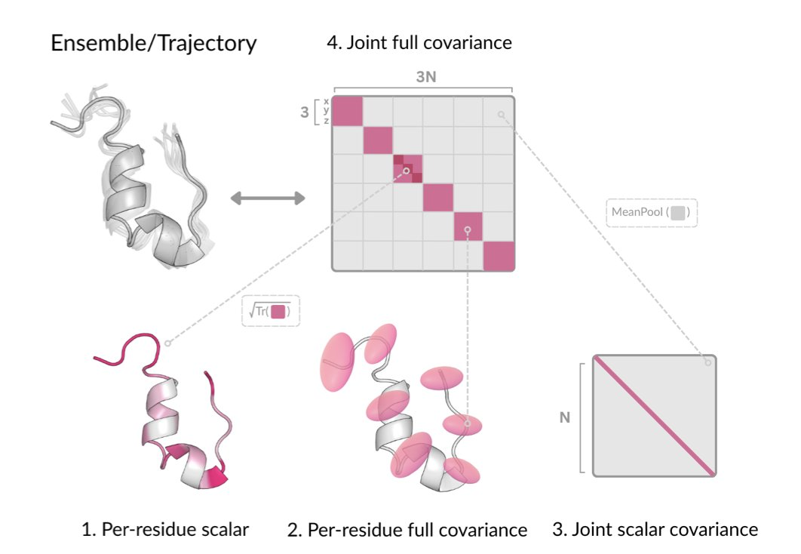
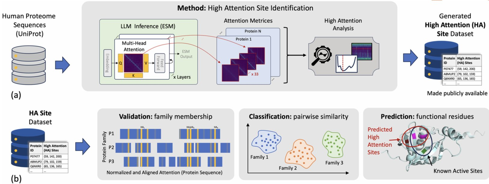
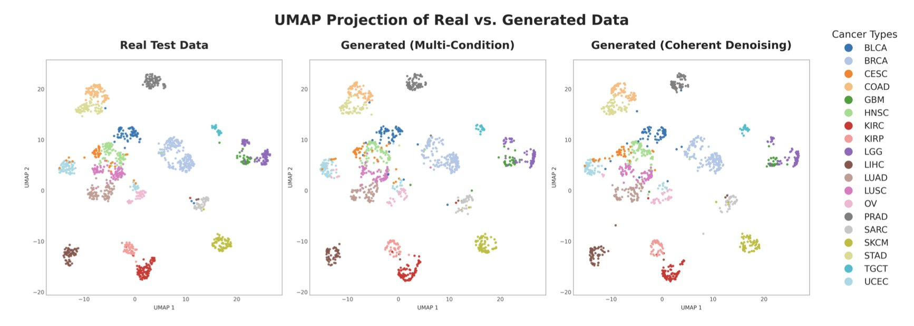
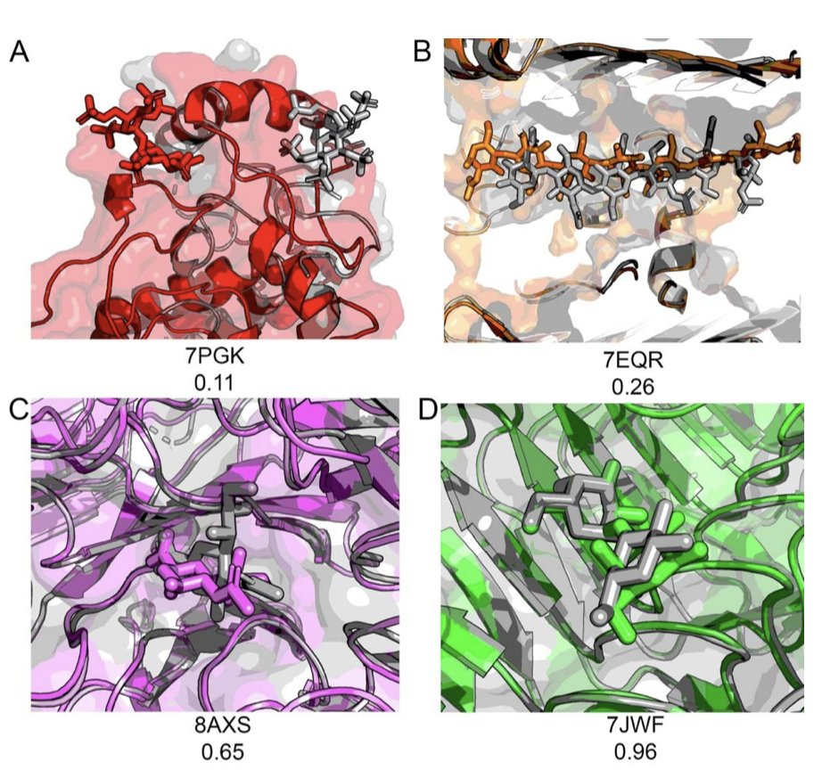
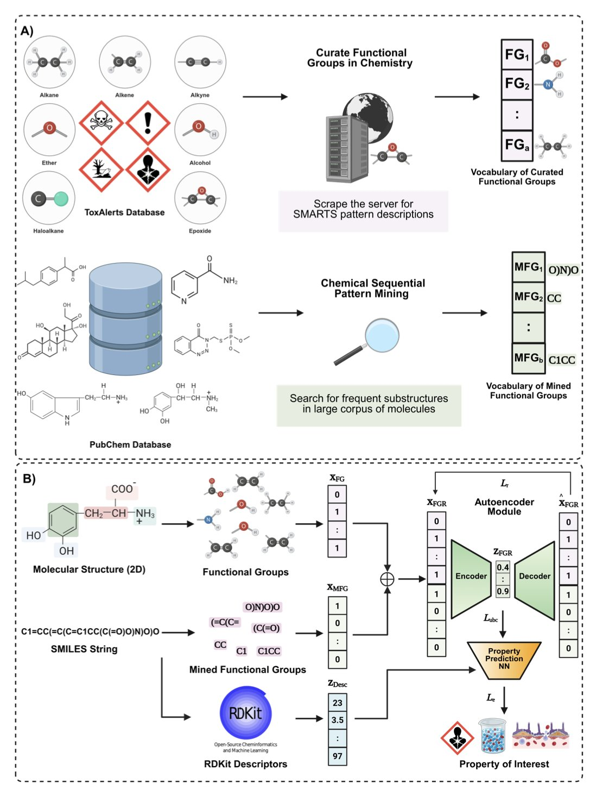

## Table of Contents
1. The DynaProt framework uses a lightweight AI model to predict protein dynamics from a single static structure with high accuracy and efficiency, offering a new alternative to MD simulations for fields like drug discovery.
2. By analyzing the "attention" focus of protein language models, we can directly locate the key amino acids that determine their family and function, making the AI's "thought process" less of a black box.
3. Researchers developed a generative AI framework called "Coherent Denoising" that uses multiple models to "vote" on how to fill in missing clinical data, improving the predictive power and diagnostic efficiency of precision medicine.
4. The latest AI models perform reasonably well at predicting simple protein-sugar binding, but they still struggle with complex glycans, showing we have a long way to go to crack the glyco-interactome.
5. AI for predicting molecular properties is returning to chemical fundamentals, using the familiar language of functional groups to build models that are both accurate and easy to understand.

## 1. DynaProt: Predicting Protein Dynamics from Static Structures, a Lightweight Alternative to MD Simulations

Molecular Dynamics (MD) simulations are powerful. They can reveal how proteins move, change shape, and interact with drug molecules. But they are slow and computationally expensive. A simulation for a complex system can take days or even weeks. This is a huge bottleneck for projects that need to quickly screen large numbers of molecules or analyze entire proteomes.

The DynaProt framework offers a solution. It skips the simulation process and directly predicts a protein's dynamic properties from a single static structure from the Protein Data Bank (PDB).

Here's how DynaProt works. It doesn't simulate the trajectory of every atom over time.

First, it defines a 3D Gaussian distribution for each amino acid residue. You can imagine each residue not as a fixed point but as a "probability cloud." The shape and size of this cloud describe the direction and magnitude of the residue's likely movements, capturing the protein's local flexibility.

But protein movements are coordinated. Motion in one region can affect a distant region—this is known as allostery. DynaProt captures this long-range coupling by predicting the "joint scalar covariance" between residues, a value that reflects the correlation strength between the movements of any two residues.

With data on both local flexibility and global correlations, the model can piece together a complete picture of the protein's dynamic behavior. This method compresses the massive amount of complex information from an MD simulation into a lightweight, predictable mathematical model.

This approach is highly practical.

First, it's efficient. The authors trained the model using MD simulation data from only about 1,000 proteins. Compared to models like AlphaFold, which require pre-training on the entire PDB database, its data requirement is several orders of magnitude smaller. This lowers the barrier to building and training such models. In application, its speed advantage is even more apparent: generating a dynamic conformational ensemble from a single static structure takes just a few seconds. This makes proteome-scale dynamic analysis possible.

Second, it's accurate. The model's predictions of residue flexibility (RMSF values) are highly correlated with the "ground truth" from MD simulations. It surpasses Normal Mode Analysis (NMA) in both precision and efficiency. NMA has been a primary tool for analyzing low-frequency protein motions for decades, and the fact that a lightweight model can outperform it speaks to the method's effectiveness.

For drug development, its potential lies in identifying "allosteric pockets" or "cryptic pockets." The active sites of many proteins are closed or non-existent in their static crystal structures and only appear when the protein moves into a specific conformation. Finding these pockets with traditional methods is time-consuming. DynaProt can quickly generate a large number of different conformations, increasing the chances of discovering these hidden targets.

DynaProt isn't a replacement for MD simulations in scenarios that require precise modeling of chemical reactions or calculating binding free energies. But for tasks like large-scale screening, understanding protein functional mechanisms, and discovering druggable targets, it provides a powerful new tool that combines speed and accuracy.

📜Title: Learning Residue Level Protein Dynamics with Multiscale Gaussians  
📜Paper: https://arxiv.org/abs/2509.01038  

## 2. A New Way to Use AI: Decoding Protein Function with Attention

We've been using all sorts of AI models to predict protein function—AlphaFold for structure, ESM for properties. They work well, but there's always been a nagging question: how does this thing actually think? And how much should we trust its answers? Using a tool we don't understand can feel a bit unsettling. A paper in *PLOS Computational Biology* offers a clever way to peek inside the model's "brain."

The researchers used the large protein language model ESM (Evolutionary Scale Modelling). Instead of just looking at the final output, they went into the model's intermediate layers to observe a mechanism called "attention." You can think of the process like this: we ask the model, "When you decide which family this protein belongs to, which amino acids in the sequence are you focusing on the most?" The amino acids that the model "pays attention" to are what the researchers defined as "High Attention" (HA) sites.

The results are interesting. The model doesn't read the entire sequence with equal focus. It quickly concentrates its attention on a few key amino acid residues. More importantly, these HA sites aren't randomly distributed; they often correspond to what biologists already know are active sites, catalytic residues, or other sites critical for protein function.

It’s like an experienced doctor looking at a CT scan. They don't scan it evenly from top to bottom; they immediately lock onto a few suspicious areas. This finding provides strong biological support for the model's predictive ability. It tells us that the AI has indeed learned some fundamental biological principles, not just statistical patterns.

One thing I find exciting is that HA sites are not identical to highly conserved sites in a sequence. In the past, a classic way to find functional sites was to perform a multiple sequence alignment and see which residues almost never change during evolution. This method is effective but has its limits. Some of the HA sites identified by the ESM model are in regions of the sequence with high variability.

This suggests the model has learned something more complex, like the co-evolutionary relationships between amino acids. A particular site might not be conserved, but it could form a functional "duo" with another distant site, and this combination is what defines the protein's function. This is something traditional sequence alignment methods would struggle to find.

So, how is this useful for people developing drugs? Very.

First, it can help us quickly annotate proteins of unknown function. When you get a new target sequence, you can run it through this method to get a "suspect list" of functional sites, significantly narrowing the scope for experimental validation.

Second, it provides new clues for drug design. These HA sites are likely potential drug-binding pockets or allosteric sites. The AI is essentially highlighting the key areas we need to study.

Third, it's helpful for understanding drug resistance mutations. We can check if known resistance mutation sites also fall within these HA regions, giving us a deeper understanding of how mutations affect function.

This work transforms protein language models from a prediction tool into a "research partner" that can help us explore and understand biological mechanisms. It allows us to move from "knowing what" (the model's prediction) to "knowing why" (why the model made that prediction). This shift from a "black box" to a "glass box" is incredibly valuable for the entire field of computer-aided drug discovery.

📜**Paper**: Paying attention to attention: High attention sites as indicators of protein family and function in language models  
📜**Link**: https://journals.plos.org/ploscompbiol/article?id=10.1371/journal.pcbi.1013424  

## 3. Generative AI Fills in Clinical Data, a New Approach for Precision Medicine

In drug development and clinical diagnostics, we always want a complete data puzzle for each patient. For example, having genomics, transcriptomics, proteomics, and medical imaging data all at once. But in reality, the data we have is often incomplete, like a puzzle with key pieces missing. This makes implementing precision medicine difficult.

The researchers in this paper proposed a clever solution to fill these gaps.

They developed a generative framework called "Coherent Denoising." The best way to understand this framework is to think of it as an expert committee. Imagine a committee with three experts: one specializes in MRI imaging, another is an expert in gene expression data, and a third is a pathology expert. Now, we have a patient's MRI and pathology report but are missing the gene expression data.

A traditional approach might be to use a single "all-knowing" model to guess the missing part based on the available information. But a single model can easily make mistakes, like a person who knows a little about everything but is an expert in nothing. "Coherent Denoising" works differently. It gives the task to this expert committee. The MRI expert says, "Based on this image, I infer the gene expression data should look like this." The pathology expert says, "From the cell morphology, I predict a different gene expression pattern." The core mechanism of this framework forces these experts from different fields (i.e., multiple single-condition models) to reach a consensus. They must generate a coherent set of gene expression data that all experts agree on, through "negotiation" and "voting."

This consensus-based generation method is much more robust than a single model. It ensures the generated data is not only statistically plausible but also biologically consistent with the existing multi-modal data.

To prove this method isn't just theory, the researchers tested it directly on The Cancer Genome Atlas (TCGA), a large, complex, and messy real-world dataset. The results showed that the synthetic data generated by the framework performed excellently in downstream tasks. For instance, in classification tasks involving 20 different tumor types and in predicting patient survival, the completed dataset performed nearly as well as the original, complete dataset. This shows that the generated data retains key biological signals, not just meaningless noise.

The really exciting part of this technology is its potential for clinical application.

First, it enables counterfactual analysis, helping doctors optimize diagnostic workflows. For a patient with incomplete data, a doctor could ask the model: "To get a diagnosis fastest, should I order a proteomics test or methylation sequencing next?" The model can simulate adding different types of data to predict which test would provide the biggest boost to diagnostic accuracy. This could help avoid unnecessary tests, saving resources for both the patient and the healthcare system.

Second, the framework has a natural advantage in data privacy. A large, monolithic model can sometimes be vulnerable to "reverse engineering" attacks, potentially leaking private patient data from the training set. "Coherent Denoising" distributes knowledge across multiple smaller, specialized models. Piecing together complete, specific patient data from these distributed model parameters is extremely difficult. It's like trying to reconstruct a whole secret by interrogating a group of witnesses who each only know a small part of the story—nearly impossible.

📜Paper: <https://www.biorxiv.org/content/10.1101/2025.08.22.671728v2>  
💻Code: <https://github.com/r-marchesi/coherent-genAI>  

## 4. AI Prediction of Protein-Sugar Interactions: How Are Models Like AlphaFold3 Doing?

In drug discovery, protein-sugar interactions are a classic problem. Sugars (glycans) are everywhere, from recognition sites on the cell surface to the "door knockers" used by viruses to gain entry. But predicting how they bind to proteins has always been a challenge.

Most small-molecule drugs are like rigid keys fitting into a protein's lock. Glycan molecules are more like a string of wet spaghetti—flexible, variable, with countless possible shapes. This poses a huge challenge for computational models. So, when next-generation AI models like AlphaFold3 appeared, researchers wanted to know: can they handle the "spaghetti"?

A recent preprint paper conducted a solid "final exam" to find out.

**First, no cheating on the test**.
The worst way to evaluate a model is to test it on its own training data. To ensure a fair assessment, the researchers created a new, high-quality benchmark dataset called BCAPIN. The protein-glycan complex structures in it were all experimentally determined and were confirmed to be absent from the training sets of models like AlphaFold3 and DiffDock. This was a completely new exam.

They also designed a more comprehensive scoring metric, DockQC. Traditional evaluation methods like Root Mean Square Deviation (RMSD) can sometimes be misleading. For a flexible molecule like a glycan, even if the overall backbone position is close (low RMSD), the key interacting groups that determine binding could be pointing in the wrong direction. DockQC provides a more realistic assessment by considering ligand position, key amino acid contacts, and sugar ring conformation. It's like judging a basketball player not just by how high they jump, but also by how accurately they shoot.

**The results were mixed**.
For the binding of single sugar molecules (monosaccharides) to proteins, all the tested AI models performed reasonably well, with success rates generally above 85%. This indicates that AI has mastered the basic rules of placing relatively rigid small molecules into protein pockets, like a robot identifying and picking up a standard Lego brick.

But when the sugar chains got longer, becoming disaccharides, trisaccharides, or longer oligosaccharides, the performance of all models started to drop. The longer the chain, the more flexible it is, and the number of possible conformations grows exponentially. The AI models clearly struggled to determine the correct conformation, like asking a robot to pick up a cooked noodle.

At this stage, relying entirely on tools like AlphaFold3 for high-throughput screening of glycan-based drugs is not yet practical. You can use it to form an initial hypothesis, like whether a certain monosaccharide might bind in a specific pocket. But you can't fully trust the results, especially when it presents a good-looking binding mode for a complex glycan.

This paper points out two core bottlenecks:
1.  **Data**: We need more high-quality, experimentally determined structures of protein-glycan complexes. AI learns from data; without enough good "textbooks," it can't master more complex rules.
2.  **Confidence**: Models need a more reliable self-assessment system. They shouldn't just give a prediction but also accurately assess its confidence, like "90% certain" or "20% certain." Without a reliable confidence score, sifting through massive numbers of results is like panning for gold in a desert.

This work provides a comprehensive stress test of existing tools, marking out their scope of application and current limitations. It points the entire field toward the next steps.

📜Title: Evaluation of De Novo Deep Learning Models on the Protein-Sugar Interactome  
📜Paper: https://www.biorxiv.org/content/10.1101/2025.09.02.673778v1  

## 5. AI for Molecular Property Prediction: Getting Back to the Language of Chemists—Functional Groups

  

An AI model often gives you a prediction, telling you a molecule is highly active. But if you ask why, it can't answer. It's like talking to a fortune teller who can make predictions but can't explain them, leaving you uneasy. R&D investments can't be based on an unexplainable "black box."

This paper proposes the Functional Group Representation (FGR) framework. Its core idea is to make AI understand and analyze molecules **through functional groups**, just like a chemist.

**Here's how the method works**:

First, the model builds a huge "dictionary" of functional groups. Some come from classic textbook examples like hydroxyl, carboxyl, and phenyl groups. Others are chemical substructures that the model automatically "mines" from massive molecular databases like ZINC. These newly discovered "quasi-functional groups" enrich the model's chemical vocabulary.

With this dictionary, any molecule fed into the model is quickly broken down into a combination of functional groups.

Next, the model uses an autoencoder to process this functional group information, compressing the high-dimensional combination into a low-dimensional mathematical vector. This acts like a "translator," converting the language of chemistry into the language of math that machines can efficiently understand. By pre-training on a vast amount of unlabeled molecular data, the model learns the "grammar rules" and combination patterns of functional groups on its own.

**So, how well does it work**?

In terms of predictive performance, FGR performed on par with top-tier Graph Neural Networks (GNNs) on benchmarks across biophysics, quantum chemistry, and pharmacokinetics, even outperforming them on some tasks. This result is noteworthy because FGR's starting point is simpler than that of graph models, which learn the complex connections between atoms and bonds.

FGR's advantage is its interpretability. When the model predicts a molecule has a certain property, it's possible to trace back and determine which functional groups contributed the most. The attribution analysis maps in the paper show that the model can accurately pinpoint the key structures determining molecular activity—what we often call the pharmacophore.

This changes everything. The model no longer just gives a number; it provides a judgment with chemical logic, such as: "This molecule is predicted to be highly active, mainly due to the combined effect of its pyridine ring and amide bond." This kind of information can directly guide medicinal chemists in designing the next round of molecular optimizations.

The researchers also tested FGR's strength on more challenging tasks, like predicting peptide cleavage sites and screening for antibacterial molecules. In these scenarios, which involve larger datasets and more complex structures, FGR performed exceptionally well, proving its scalability and robustness.

This shows that AI in drug discovery is shifting from a pursuit of model complexity to solving practical problems, building models using the language chemists are most familiar with: functional groups. This not only makes predictions more reliable but also allows researchers to trust and use AI tools.

📜Title: Functional Groups are All you Need for Chemically Interpretable Molecular Property Prediction  
📜Paper: https://arxiv.org/abs/2509.09619v1    
code: https://github.com/bisect-group/fgmolprop
