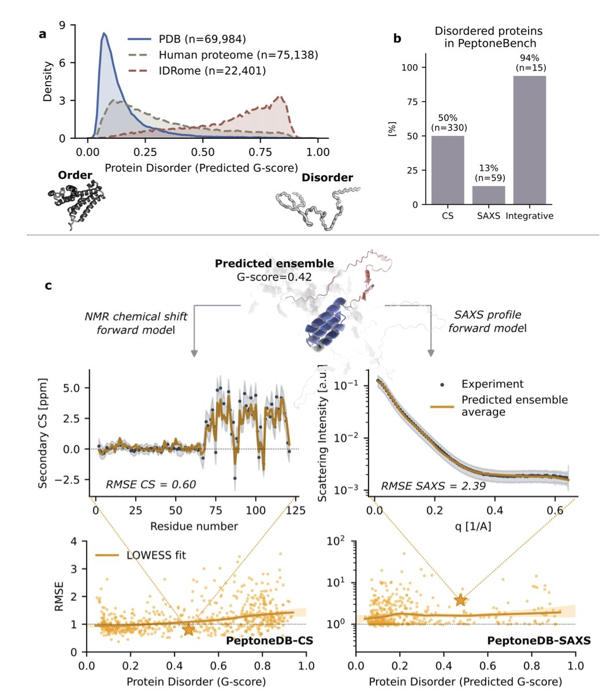
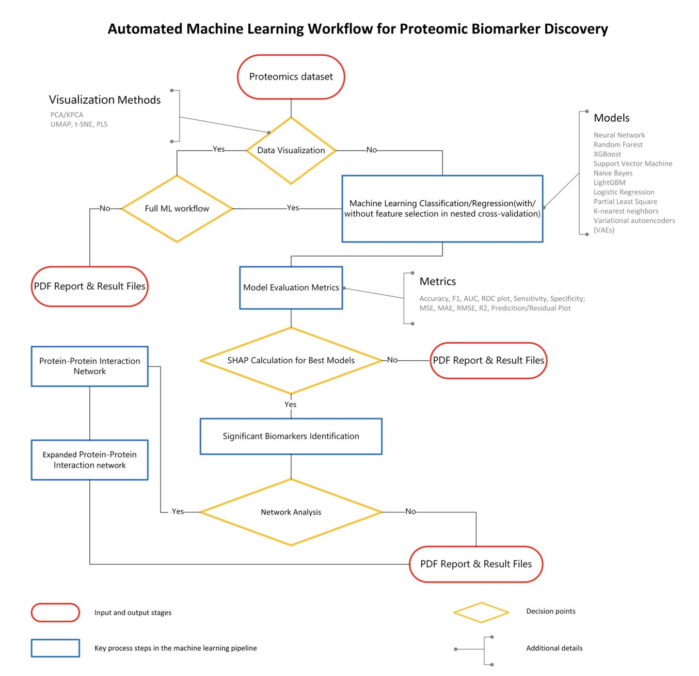
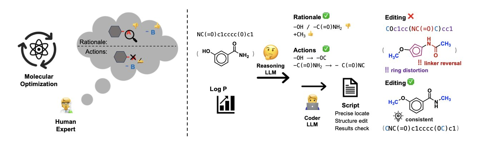
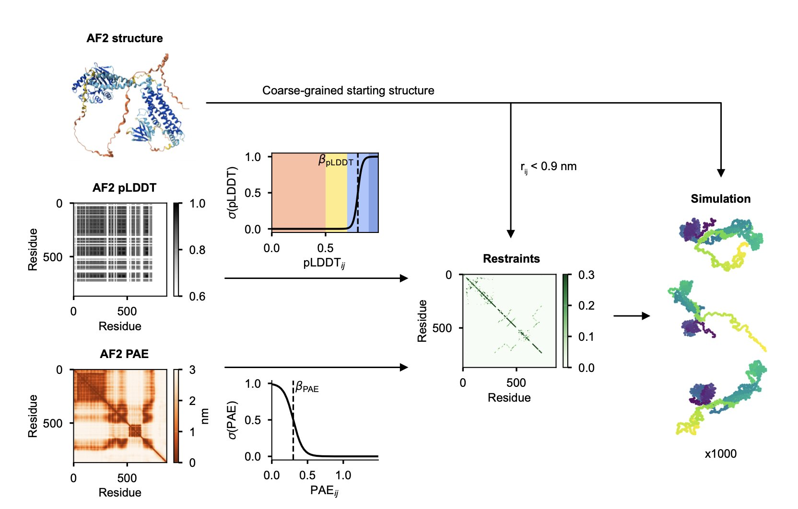
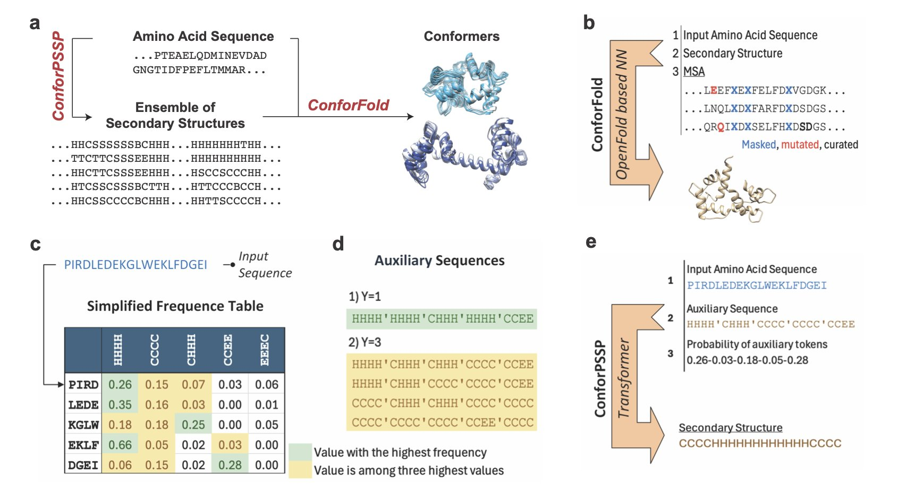

## Table of Contents
1. PeptoneBench, a new benchmark, and PepTron, a data-augmented model, achieve the first accurate predictions of disordered protein ensembles, solving a major challenge in AI structure prediction.
2. BiomarkerML packages complex proteomics machine learning workflows, enabling biologists without programming expertise to discover disease biomarkers themselves.
3. The MECo framework separates molecular optimization into "idea" and "execution," using code to precisely implement a chemist's design intent, making AI drug design more reliable and controllable.
4. Researchers developed AF-CALVADOS, a model that combines AlphaFold's structure predictions with coarse-grained simulations to simulate the dynamic conformations of tens of thousands of human proteins for the first time.
5. ConforFold effectively predicts multiple protein conformations by actively sampling secondary structures to guide folding, offering a new tool for understanding dynamic drug targets.

## 1. New AI Model PepTron Predicts Disordered Proteins, Opening New Paths for Drug Discovery

AlphaFold2 changed structural biology, but it has an Achilles' heel: Intrinsically Disordered Proteins (IDPs).

These proteins lack a fixed 3D structure and instead exist as a dynamic ensemble of conformations, like molecules constantly changing shape. IDPs make up about 30% of the eukaryotic proteome and are linked to diseases like cancer and neurodegeneration. They are attractive drug targets, but their shape-shifting nature makes them difficult to study.

Models like AlphaFold2 are primarily trained on the Protein Data Bank (PDB), which is full of structurally stable proteins. A model trained on data containing only stable structures will naturally struggle with dynamic IDPs. When AlphaFold2 predicts an IDP, it produces a low-confidence, spaghetti-like structure. While this identifies the disordered region, drug development needs to know all possible conformations of that "spaghetti" and the probability of each one appearing.

**Step 1: Establishing an evaluation standard (PeptoneBench**)

To solve a problem, you first need a way to measure success. This research established the PeptoneBench benchmark for that purpose.

It integrates real experimental data, such as NMR chemical shifts and small-angle X-ray scattering (SAXS), to test a model's performance in realistic scenarios. It's like testing a race car on a real track.

The performance comparison chart shows that as protein disorder increases, the performance of models like AlphaFold2 and Boltz2 drops sharply. But the new PepTron model and the computationally expensive BioEmu remain robust. This benchmark reveals which models are true all-rounders.

**Step 2: Training a new model with synthetic data (PepTron**)

High-quality, real-world data on IDP structures is scarce. The research team's solution was to create data.

They developed a fragment generator called IDP-o to create a massive synthetic dataset, IDRome-o, containing various conformations of disordered proteins. They then trained their new model, PepTron, on this synthetic dataset combined with the ordered protein structures from the PDB.

This data augmentation strategy is an effective application in protein structure prediction, especially for IDPs. It provides the AI model with a lot of knowledge about the "disordered world," so it's no longer one-sided.

PepTron uses a generative model architecture called "flow-matching." You can think of it as a master sculptor learning the entire path of creation. It learns not just to create from scratch, but the complete generative path from a random block of stone (random noise) to the final product (the real protein conformation ensemble). By training on both ordered and disordered data, PepTron learns to accurately predict structures across the entire spectrum, from ordered to disordered.

**The value of PepTron for drug discovery**

IDPs often act as critical hubs in cellular signaling networks, their flexibility allowing them to bind to multiple protein partners. Traditional drug design looks for stable "pockets" on a protein for small molecules to fit into. This approach doesn't work for IDPs.

Newer technologies like PROTACs or molecular glues don't entirely depend on fixed pockets, but they still require an understanding of the target protein's dynamic conformations. PepTron provides a high-resolution map of these dynamic conformations, offering a new starting point for computer-aided drug discovery (CADD).

Of course, this work still has room for improvement. The realism of the synthetic data could be enhanced, and the influence of the cellular environment on IDP conformations needs more accurate modeling. But it's a step toward solving the IDP prediction problem and opens a new direction for developing drugs against these targets.

📜 Title: Advancing Protein Ensemble Predictions Across the Order–Disorder Continuum  
🌐 Paper: https://doi.org/10.1101/2025.10.18.680935  
💻 Code: https://www.biorxiv.org/content/10.1101/2025.10.18.680935v2

## 2. BiomarkerML: AI for Proteomics, Letting Anyone Find Targets

Drug discovery generates massive amounts of proteomics data every day. Instruments run at high speed, and data piles up. But there's a shortage of people who can effectively analyze it and extract value. Many wet-lab biologists find themselves with a treasure map they can't decipher.

A new tool called BiomarkerML aims to solve this problem. It's a "proteomics analysis pipeline" that packages complex machine learning operations into a semi-automated workflow.

How does it work?

First, it includes several machine learning models, including a Variational Autoencoder (VAE) from deep learning. Proteomics data is noisy and full of non-linear relationships, which limits traditional statistical methods. These models are better suited for such data. The tool also automates tedious steps like hyperparameter tuning and cross-validation to prevent model overfitting and ensure reliable results.

A key feature of BiomarkerML is how it explains the model's predictions. It uses SHAP (SHapley Additive exPlanations) technology, which works like a detective analyzing clues. SHAP values identify which "protein witness" provided the key information for a final judgment, like diagnosing a disease. This makes the identified biomarker candidates explainable.

Focusing only on the most important witnesses isn't enough. BiomarkerML also analyzes their "social network"—the protein-protein interaction network. Proteins rarely act alone; they usually work with others. By analyzing this network, proteins with low SHAP values that are closely connected to key proteins are also identified. The final list of candidate biomarkers thus tells a complete biological story.

The tool is built with Python, R, and Workflow Description Language (WDL). WDL is key for creating reproducible and portable analysis workflows. With WDL, the same analysis will produce identical results in different computing environments, like AWS or a company's internal cluster, as long as it's configured correctly. In drug discovery, reproducibility is a lifeline.

The team tested the tool on urine proteomics data from hepatitis B-related liver disease. They achieved high AUC scores and found several promising candidate molecules, validating the workflow's effectiveness.

The value of BiomarkerML lies in lowering the barrier to bioinformatics analysis. It allows scientists in the lab who understand biology to use advanced AI methods to mine data without learning complex parameter tuning or scripting. This could speed up many early-stage projects and help valuable biomarkers be discovered faster.

📜 Paper: BiomarkerML: A cloud-based proteomics ML workflow for biomarker discovery  
🌐 Link: <https://www.biorxiv.org/content/10.1101/2025.10.16.682839v1>

## 3. MECo: Editing Molecules with Code, Making AI Think Like a Chemist

A major challenge in drug discovery is getting AI to optimize molecules with the same systematic logic as a chemist. Many AI models operate directly on SMILES strings, a simplified molecular representation. This is like editing the raw pixels of an image—a small mistake can create a chemically invalid "monster molecule."

The MECo framework takes a different approach, one that more closely resembles how chemists work. It splits the molecular optimization process into two steps.

First, the AI acts as an "editor." It analyzes the starting molecule and the optimization goal (like increasing activity or reducing toxicity) and then proposes a human-readable modification plan. This plan is like what a chemist might say in a meeting: "Let's replace the methyl group on this phenyl ring with a trifluoromethyl group to see if we can improve lipophilicity."

Second, the AI switches to a "programmer" role and translates this "editing intent" into executable Python code. This code uses cheminformatics toolkits (like RDKit) to perform precise, atom-level operations on the molecular structure, such as locating specific atoms, breaking old bonds, and attaching new functional groups.

This method solves the problem of generating valid molecules. The code is rigorous. It either executes successfully to produce a chemically valid molecule or it throws an error. It won't create structures with nonsensical chemical bonds. The reported accuracy is over 98%, a level difficult to achieve with SMILES-based methods. Traditional methods are like someone trying to edit a sentence without knowing grammar, often producing gibberish. MECo first understands the sentence's meaning and then uses grammatical tools to modify it.

The optimization process also becomes transparent and controllable. The AI no longer just provides a final result; it shows its entire "thought process"—its editing intent and the code that executed it. Medicinal chemists can review every decision the AI makes and even modify the code before running it. The AI transforms from a "black box" into a collaborative and debuggable tool.

To train the model, the researchers used a mixed-data strategy, combining theoretical chemical edit operations (synthetic data) with data from real chemical reactions and drug optimization case studies. This allowed the model to learn not just the rules of chemistry but also the practical "feel" and "techniques" of working chemists.

MECo's "code as editor" model enables AI to "speak human, act machine" in molecular design. It turns a vague generative task into a clear, verifiable engineering problem, potentially moving AI-assisted drug design toward a more practical and reliable stage.

📜 Title: Coder as Editor: Code-Driven Interpretable Molecular Optimization  
🌐 Paper: https://arxiv.org/abs/2510.14455v1

## 4. A New Way to Use AlphaFold: Simulating the Dynamics of Tens of Thousands of Proteins

Proteins are not rigid rocks; they breathe, wiggle, and change shape. AlphaFold2 gives us high-definition "snapshots" of protein structures, but that's not enough. We want to see the "movie" to understand how proteins move. This is especially true for multi-domain proteins with Intrinsically Disordered Regions (IDRs). These are like devices made of several solid modules connected by flexible ropes, and simulating their overall motion has always been a challenge.

The problem was how to tell a computer which parts are "solid modules" and which are "flexible ropes." In the past, this required researchers to define them manually, a slow and laborious process that couldn't be done at scale.

The AF-CALVADOS model offers a solution.

Here’s how it works: first, it uses AlphaFold2 to predict the structure of the entire protein. Then, the model looks at AlphaFold's own confidence scores—the pLDDT and PAE. If a region has a high pLDDT score and the PAE shows it's a stable, independent unit, the model classifies it as a well-folded domain. In the subsequent simulation, this "module" is treated as a single rigid body. Conversely, if a region has a low pLDDT score, it's a "flexible rope," and the model lets it move freely during the simulation.

This automated process is the core of the work, and it makes large-scale simulation possible. Using this method, the researchers simulated the dynamic conformations of 12,483 human cytoplasmic proteins in one go.

Of course, a new method needs to be validated. The researchers compared their simulation results with existing experimental data (like the protein's radius of gyration, Rg) and found a good match. This indicates that the dynamics simulated by AF-CALVADOS are largely consistent with physical reality.

With this tool and this massive dataset, some patterns have started to emerge.

One important finding is that context changes the behavior of IDRs. An isolated IDR in solution might act like a loose, extended string. But when it's sandwiched between two well-folded domains, things change. The coordinated movement of these two "heavyweights" restricts its space, "squeezing" it into a more compact shape. It's like an earphone cord—if the two earbuds are close together, the wire between them can't stretch out very far.

The researchers also found that even within the complex environment of a full protein, the intrinsic chemical properties of the IDR sequence itself, like its charge distribution (NCPR) and hydrophobicity pattern (SHD), still subtly influence its conformation. A protein's dynamic behavior is the result of both its own sequence properties and the physical constraints imposed by surrounding domains.

This work provides a massive, public database of protein dynamic conformations. Computational scientists can use it to train new machine learning models to predict protein dynamics. And those of us in drug discovery can mine this database to study specific target families, like transcription factors. Their IDR regions often play a key role in binding to DNA or other proteins. Understanding their dynamic changes could provide inspiration for designing new regulatory drugs.

📜 Title: AF-CALVADOS: AlphaFold-guided simulations of multi-domain proteins at the proteome level  
🌐 Paper: https://www.biorxiv.org/content/10.1101/2025.10.19.683306v1

## 5. ConforFold: Unlocking Protein Dynamics with Secondary Structures

Proteins are not static building blocks; they are constantly moving and changing shape. For example, the DFG-in and DFG-out conformations of a kinase activation loop determine whether an inhibitor is Type I or Type II. AlphaFold is great at predicting a protein's static structure, but capturing these dynamic changes is difficult.

In the past, a common way to get different conformations was to manipulate the multiple sequence alignment (MSA), for example, by subsampling. This is like showing a painter many photos of the same person in hopes of getting drawings with different expressions. This method sometimes works, but the model often defaults to generating the most "standard" structure, failing to capture subtle conformational shifts.

ConforFold changes the approach by directly controlling the protein's folding "blueprint"—its secondary structure.

It works in two steps. First, it trains a model called ConforPSSP to predict multiple possible secondary structures for a protein. For instance, the model might predict that a certain sequence has a 60% chance of being an α-helix and a 30% chance of being a coil.

Second, it feeds these different secondary structure "instructions" into a retrained OpenFold model. This is like directly telling the painter, "This time, draw the corner of the mouth turned up." By providing explicit local structure commands, the model is forced to explore different folding pathways and generate a variety of 3D conformations.

This method actively guides the conformational search, rather than passively relying on weak signals in the MSA data.

On a test set of proteins with two known conformations, ConforFold successfully recovered both conformations 84% of the time (TM-score ≥0.8), outperforming standard AlphaFold and other methods that rely on MSA sampling.

This tool has two practical benefits:

1.  **Solves the problem of insufficient MSA information**: For evolutionarily conserved targets with poor MSAs, MSA-dependent methods usually fail. ConforFold is less reliant on the MSA, offering a solution for these targets.
2.  **Complements other methods**: ConforFold can be used alongside methods like AlphaFlow. We can build a toolbox and, for different targets, select or combine the most suitable tools to paint a complete picture of a protein's conformational landscape.

The project's code is open source, so computational teams can download it and test it on their own targets. This idea of intervening in the prediction process at a more fundamental level is worth noting.

📜 Title: ConforFold Recovers Alternative Protein Conformations Beyond MSA Subsampling  
🌐 Paper: https://www.biorxiv.org/content/10.1101/2025.10.14.682366v1  
💻 Code: https://github.com/strauchlab/Confor-PSSP
