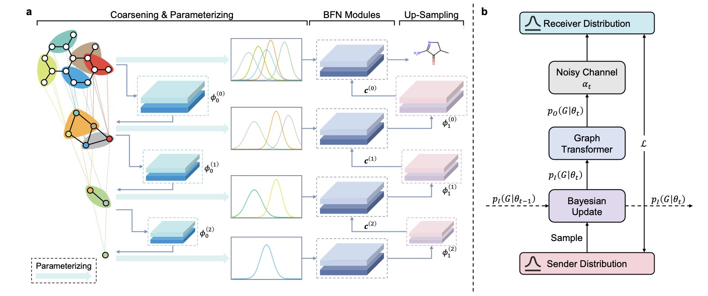
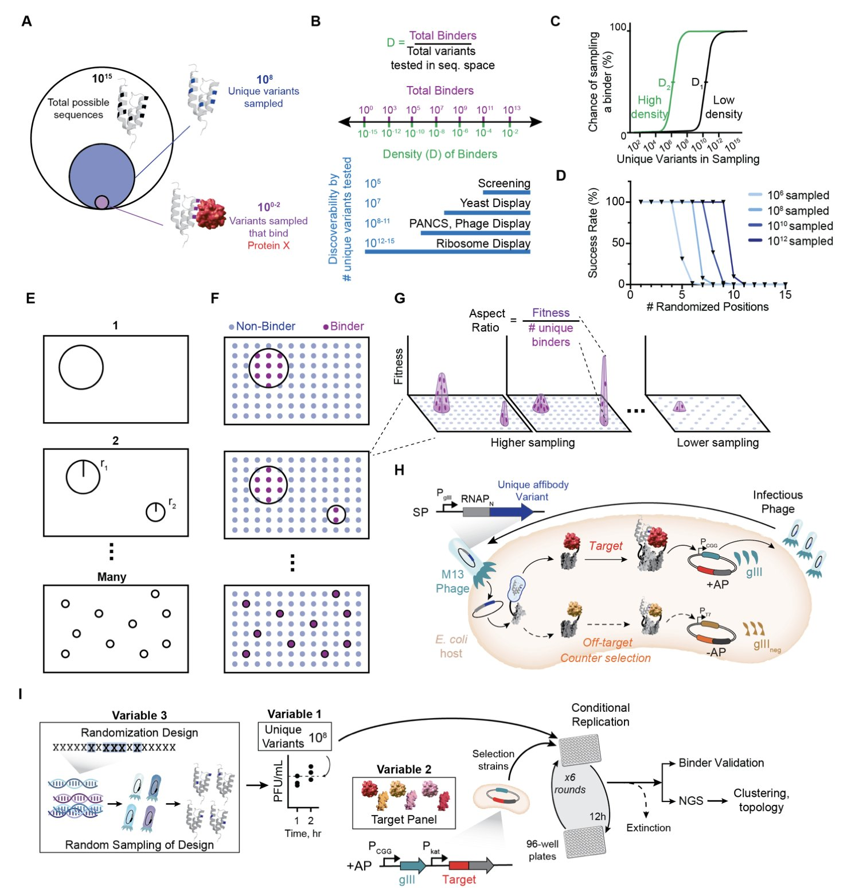
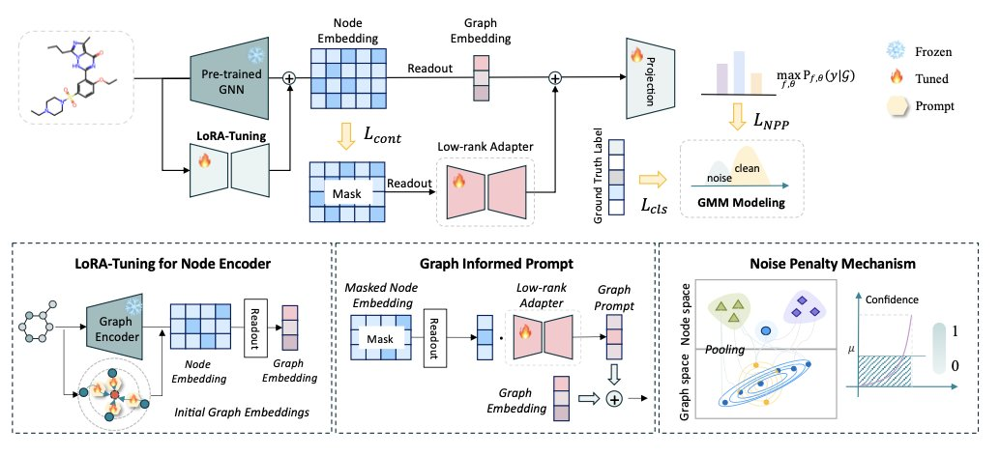

## 目录  
1. GraphBFN 框架结合层级建模和贝叶斯流网络，为分子图生成中离散数据的处理提供了新方法，能设计出质量更高、速度更快的分子。
2. 一项大规模实验揭示，能否找到蛋白结合物主要取决于靶点自身特性，而非筛选方法，这为药物设计提供了新思路。
3. MIPT 框架运用一套轻量级的多级提示，让预训练的图神经网络能精准、高效地适应特定的分子属性预测任务。

## 1. GraphBFN: AI 造分子新范式，更快更准  
  
  

用计算机设计新分子是药物发现的目标。近年，图像生成领域的扩散模型（Diffusion Model）备受关注，许多人尝试将其用于分子生成。但分子是由离散的原子和化学键构成的图结构，图像则是连续的像素网格。直接套用图像生成模型，就像用处理水彩的方式去堆叠乐高积木，难以匹配。  
  
多数扩散模型在生成分子时，将离散的原子和化学键类型当作连续变量处理，最后再强制取整。这种做法在数学上不严谨，也常导致生成的分子化学结构不合理，或需要多步「去噪」才能得到可用结果，效率低下。  
  
GraphBFN 提供了新思路。  
  
它采用贝叶斯流网络（Bayesian Flow Networks, BFN）。BFN 的核心是学习一个从简单噪声到复杂分子结构的映射。它的理论框架能自然地处理离散数据，统一了训练目标和采样过程。因此，模型是在一个概率框架下推断原子类型。  
  
模型还引入了「从粗到细」的层级生成方案。一个经验丰富的化学家设计分子时，会先构思核心骨架，再添加取代基等细节。  
  
GraphBFN 的做法类似。它通过图粗化（Graph Coarsening）技术，将复杂分子图简化为几个「超级节点」，以此捕捉分子的整体拓扑。模型先生成这种粗粒度框架，再逐步细化，填充具体的原子和化学键。这种从全局到局部的生成方式，确保了分子骨架的合理性，降低了生成化学上不合理结构（如高张力小环）的概率。  
  
为提升效率和准确性，模型使用累积分布函数（Cumulative Distribution Function, CDF）计算原子类型的概率。与直接拟合每个原子类型概率值的方法不同，CDF 拟合的是累积概率。在处理分类数据时，这种方式更稳定，也让模型收敛更快。  
  
在 QM9 和 ZINC250k 这两个标准数据集上，GraphBFN 的表现优异。它生成的分子在有效性、新颖性和独特性等指标上达到顶尖水平，且达到同样质量所需的采样步数更少。在药物发现中，这能让研究人员用更少的计算资源、在更短的时间里探索更广阔的化学空间，为高通量虚拟筛选带来优势。  
  
挑战依然存在。目前的工作主要集中在小分子上，下一步需要验证该框架能否扩展到大环、多肽和蛋白质等更复杂的生物大分子。此外，引入条件生成（如要求分子具备特定药代动力学属性或靶点亲和力）是其走向应用的关键。  
  
📜Title: Hierarchical Bayesian Flow Networks for Molecular Graph Generation  
🌐Paper: https://arxiv.org/abs/2510.10211v1  

## 2. 揭秘蛋白结合：为何有些靶点更难成药？  
  
  

新药研发，尤其是在开发抗体或多肽这类生物药时，常会遇到一个难题：为什么有些靶点反复筛选都找不到合适的苗头分子，而另一些靶点却成果颇丰？我们过去常归因于运气或筛选文库 (library) 的设计。但问题的根源或许在靶点本身。  
  
最近 *bioRxiv* 的一篇预印本，系统地回答了这个问题。研究者使用一种名为 PANCS-Binder 的高通量技术，一次性筛选了 96 个不同的蛋白靶点，试图找到能与它们结合的全新蛋白序列。  
  
研究最引人注目的发现是，不同靶点找到结合物的难度差异悬殊。  
  
这好比在沙滩上淘金。有些靶点如同富矿，每 10 万个随机序列里就有一个能结合；而另一些靶点则像在整个沙漠里寻觅一粒金沙，每 100 亿个序列里才可能找到一个。两者难度相差上亿倍。  
  
这种差异主要由靶点蛋白的自身特性决定，而筛选文库的设计方法影响不大。有些靶点天生就是「困难模式」，无论文库设计得多精妙，成功率都很低。  
  
利用这些高质量的正负样本数据（几千个结合序列与几十万个不结合序列），研究者训练了一个机器学习模型，用于判断新序列能否结合目标靶点。该模型在未见过的数据集上表现出良好的泛化能力，能准确找出结合物。  
  
这为计算辅助药物设计 (Computer-Aided Drug Design, CADD) 提供了新工具。我们可以用基于真实实验数据训练的模型，评估虚拟设计的成功率，甚至在实验开始前预测新靶点的开发难度。  
  
研究者提出了「最小结合基序 (minimal binding motifs)」的概念，可以类比为开锁所需的关键齿。如果一把锁只需两三个关键齿，许多钥匙都能打开；若需要七八个齿精确对应，能打开的钥匙就屈指可数。关键齿的数量，与结合物的密度成反比，从而量化了靶点的开发难度。  
  
这项工作用大规模、系统性的实验数据，揭示了发现蛋白结合物的底层规律。在项目立项时，除了生物学意义，也应评估靶点本身的「结合友好度」。同时，这个高质量的数据集本身也是宝贵资源，可用于训练更强的 AI 设计模型，让新药发现过程减少盲目猜测，增加科学指导。  
  
📜Title: Mapping the Diverse Topologies of Protein-Protein Interaction Fitness Landscapes  
🌐Paper: https://www.biorxiv.org/content/10.1101/2025.10.14.682342v2  
💻Code: <无>  

## 3. MIPT 框架：为 GNN 分子预测装上精准导航  
  
  

在药物研发中，使用计算模型快速准确地预测分子的溶解度、毒性或靶点活性，可以节省大量的实验时间和经费。目前，我们已经拥有不少预训练好的图神经网络（Graph Neural Networks, GNNs），这些模型如同化学界的通才，对化学语言有广泛的理解。  
  
但这些「通才」模型直接用于具体任务时，效果往往不理想。预测分子的心脏毒性（hERG a liability）和预测其水溶性，需要关注的化学特征完全不同。传统方法是「微调」（Fine-tuning），即用特定任务的数据去重新训练整个模型或大部分参数。这个过程耗时费力，还可能破坏模型学到的通用知识，引发「灾难性遗忘」。  
  
MIPT 框架提供了一个更高效的方案：为通用模型配备「任务提示」（Prompt），而不是进行大规模的再训练。  
  
MIPT 的工作原理，好比与一位经验丰富的化学家合作。当请他评估新分子的溶解度时，你不会让他重读一遍有机化学，而是会递上一张便签，写明：「请注意分子中的极性基团，如羟基和氨基，并评估整体分子的大小和形状。」  
  
MIPT 创建的「便签」是双层的：  
  
1.  **原子层面的提示（Node-level Prompt**）：告诉模型，对于当前任务，哪些原子或官能团是关键。例如，在预测溶解度时，模型会被引导去关注能形成氢键的原子。  
2.  **分子层面的提示（Graph-level Prompt**）：引导模型关注分子的整体属性，如分子量、拓扑结构或与脂水分配系数（logP）相关的整体特征。  
  
这两层提示结合，就像给模型戴上了一副「任务专用眼镜」，能自动放大关键信息，过滤掉无关背景。  
  
MIPT 还加入了一个「噪声惩罚」机制。分子包含的信息虽多，但对特定任务而言，大部分是噪音。这个机制就像便签上的附言：「忽略那些对溶解度影响不大的长链非极性烷基」，确保模型不被无关特征带偏，让预测结果更稳定。  
  
整个提示生成网络的设计很轻量，只需训练少量参数。这意味着我们不需要大量数据和算力，就能让一个强大的通用 GNN 快速适应全新的具体任务。这好比为一辆高性能赛车更换特定赛道的轮胎，而不是重新设计发动机。  
  
实验结果证实了 MIPT 的有效性。在多种数据集和预训练策略下，其表现均优于基准方法。消融实验也表明，原子和分子两个层面的提示对于达到最佳效果缺一不可。  
  
这让药物研发的 AI 工具变得更灵活高效。未来，我们可以为药物的吸收、分布、代谢、排泄和毒性（ADMET）等各项预测任务快速定制「提示」，让同一个基础模型在不同场景下都能发挥专家级水准，从而加速从海量化合物中筛选和优化先导物的过程。  
  
📜Title: MIPT: Multilevel Informed Prompt Tuning for Robust Molecular Property Prediction  
🌐Paper: https://raw.githubusercontent.com/mlresearch/v267/main/assets/chen25cu/chen25cu.pdf
