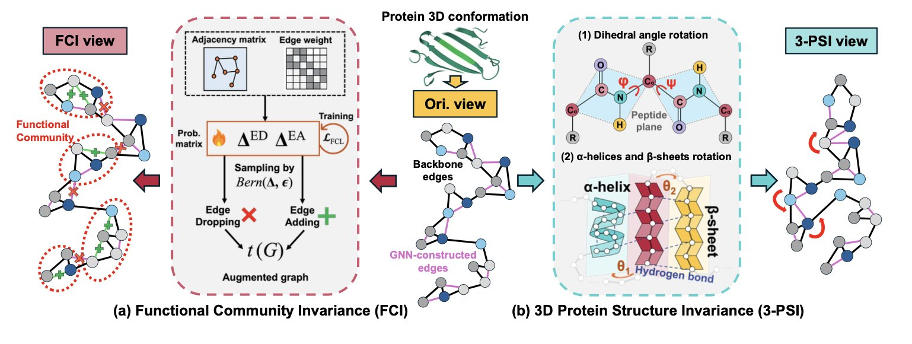
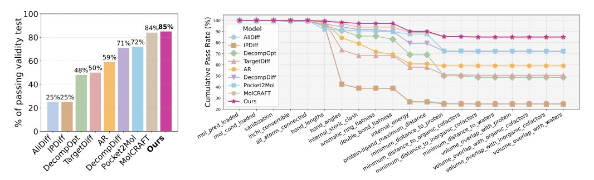
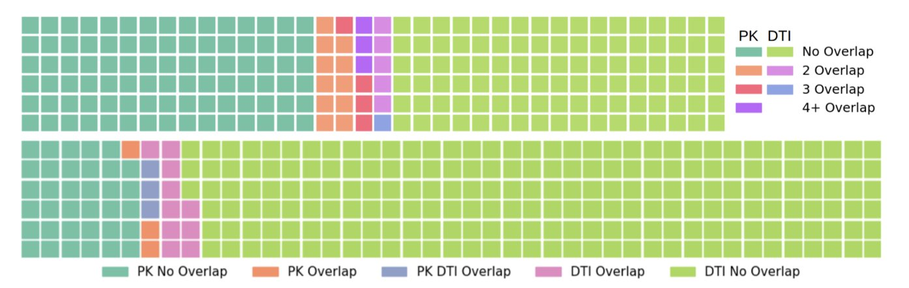

## Table of Contents
1. This study gives an AI model a dose of common sense from biology—the functional partitioning and 3D structural constraints of proteins—allowing it to generate more accurate and robust protein representations.
2. A new multi-reward optimization framework teaches AI to balance effectiveness, drug-likeness, and stability when designing molecules, producing molecules that are closer to real drugs.
3. Researchers developed a diffusion model that incorporates knowledge from chemistry and biology to generate high-quality pharmacokinetics (PK) and drug-target interaction (DTI) data, addressing the challenge of sparse data in drug discovery.

## 1. Teaching AI to Understand Proteins Better with a New Graph Learning Method
  
  

Training an AI model to recognize proteins is like teaching a child to recognize an object. You don't just show them one perfect picture. You show them the object from different angles, in different lighting, and maybe even a little blurry. This helps them learn the object's true essence. The process is called Data Augmentation.
  
In protein research, a common method is Graph Contrastive Learning. It works like this: you take one protein (which is treated as a graph), change it slightly to create two similar "views," and then tell the model that both views represent the "same thing." Then you show it a completely different protein and tell the model this is "something else." After enough practice, the model learns to identify a protein's core features.
  
But how do you "change it slightly"? Older methods often randomly deleted nodes (amino acids) or edges (atomic bonds) in the graph. This is like teaching a kid to recognize a car by randomly photoshopping out the hood or a wheel. It breaks the car's functional logic. Proteins are precise machines, refined over billions of years of evolution. Specific regions, like the active site of an enzyme, have critical functions. Randomly deleting parts could destroy the most important information.
  
To solve this, researchers proposed their first strategy: **Functional Community Invariance (FCI**). During data augmentation, it intentionally protects the small, functionally important groups within a protein. The algorithm first identifies amino acid residues that are functionally close and defines them as a "community." Then, the augmentation process prioritizes disturbing the connections *between* communities while keeping the internal structure of each community intact. Think of it like a team photo. You can move people around, but you wouldn't break up a core project team. This way, the model learns that these functional communities are key to the protein's identity.
  
That handles the 2D graph, but proteins exist in 3D. The researchers' second strategy is **3D Protein Structure Invariance (3-PSI**). A protein's peptide chain is always twisting and folding inside the body; it's not static. Traditional augmentation methods might crudely move atomic coordinates, creating physically impossible shapes or even breaking peptide bonds. 3-PSI, however, simulates the protein's real conformational changes, like slightly twisting dihedral angles, while keeping rigid structural units like *α-helices* and *β-sheets* whole. It's like posing a 3D model without ripping its arm off at the shoulder. The 3D views it generates are both diverse and biophysically sound.
  
By combining these two strategies, the researchers built a graph contrastive learning framework that better reflects biological reality. The model is no longer trained on randomly mangled "wreckage" but on protein forms that preserve key functional areas and show realistic 3D movement. Tests on four tasks, including protein fold classification and enzyme function prediction, showed that this biology-informed augmentation method outperformed previous approaches.
  
This work shows again that progress in AI for Science can't rely only on computing power and general algorithms. It must incorporate the domain knowledge that chemists and biologists have accumulated over decades. AI shouldn't learn in a pure mathematical space; it should stand on the shoulders of existing scientific knowledge. This approach is critical for future tasks like drug target discovery and molecular design.
  
📜Title: Enhancing Graph Contrastive Learning for Protein Graphs from Perspective of Invariance  
🌐Paper: https://raw.githubusercontent.com/mlresearch/v267/main/assets/wang25cv/wang25cv.pdf  

## 2. AI Drug Design: Multi-Reward Optimization for More Realistic Molecules
  
  

In Structure-Based Drug Design, there's a common problem: an AI model might generate a molecule with extremely high binding affinity on paper, but a chemist finds it's either impossible to synthesize or its real shape doesn't match the prediction and is too high in energy.
  
The reason is that the model was trained on a single goal. It learned to optimize binding affinity but ignored other drug-like properties like synthesizability, solubility, and metabolic stability.
  
This work proposes a multi-reward optimization framework. The core idea is to give the model multiple goals and let it learn to balance them on its own.
  
The researchers used a Bayesian Flow Network (BFN) as the base generative model. You can think of this model as a molecular "artist" that can generate 3D molecular structures inside a protein's binding pocket.
  
Next, they brought in Direct Preference Optimization (DPO), a technique first used to train large language models to align with human preferences. Here, "human preferences" were replaced with "medicinal chemist preferences"—key metrics like binding affinity, chemical validity, and drug-likeness.
  
One challenge is that these metrics have different value ranges and units. For instance, binding affinity can be a negative number, while a synthetic complexity score might be between 1 and 10. If fed directly to the model, it would struggle to process them.
  
The authors solved this with a Softmax-based normalization strategy. This method acts like a translator, converting reward scores from different units and ranges into a single, comparable scale. The model can then evaluate whether it's "worth it" to sacrifice some ease of synthesis to gain a bit more binding affinity.
  
They also added an "uncertainty regularization" mechanism. If the model's predictions for a molecule's multiple rewards have a high variance, it means the model itself is unsure. The system penalizes this, encouraging the model to generate molecules with stable, good all-around performance, and to avoid those that are extreme on one metric but poor overall.
  
Tests on the CrossDocked benchmark dataset showed that, compared to models optimizing only a single reward, the new method generated molecules with better binding affinity, validity, and conformational stability. The molecules it produced look more like actual drug candidates, not just theoretical structures that exist only in a computer. This shift from a theoretical "optimal solution" to a feasible "candidate" is exactly what drug developers are looking for.
  
📜Title: Enhancing Ligand Validity and Affinity in Structure-Based Drug Design with Multi-Reward Optimization  
🌐Paper: https://raw.githubusercontent.com/mlresearch/v267/main/assets/lee25k/lee25k.pdf  

## 3. xImagand-DKI: Using AI to Generate Data and Fill Gaps in Drug Discovery
  
  

Drug discovery is a constant fight against "sparse data." You might have a lead compound with good activity, but what about its solubility or metabolic stability? You have to test it. You find a new target, but which molecules might work against it? You have to screen for them. These experiments are time-consuming and expensive, and project resources are always tight.
  
The xImagand-DKI model offers a new approach: use AI to generate realistic experimental data to fill in the gaps.
  
The model is built on a diffusion model. You can understand the process like this: first, you take real data and keep adding noise to it until it becomes a random pattern. Then, you train a neural network to learn how to reverse the process—how to "de-noise" the pattern and restore the original data. Once the model masters this reverse process, it can start with random noise and create brand new, realistic-looking data.
  
In drug discovery, the model's inputs are SMILES strings, which represent molecules, and protein sequences, which represent targets. The researchers used two pre-trained models, ChemBERTa and ProtBERT, to encode them, which is like giving the machine expert translators for chemistry and biology.
  
The key to the model is **infusing domain knowledge**.
  
With only the raw SMILES strings and protein sequences, the model's information is limited. An experienced chemist sees a molecular structure and thinks about hydrogen bond donors or potential toxic groups. A biologist sees a protein sequence and thinks about its biological function, like whether it's a kinase or which signaling pathway it's in.
  
xImagand-DKI teaches this "expert intuition" to the machine. It incorporates two types of information:
1.  **Molecular Fingerprints**: These are compact descriptions of a molecule's structural features, telling the model about key chemical groups and topology.
2.  **Gene Ontology (GO**): This is a standardized vocabulary for describing the functions of genes and proteins. Adding GO information is like telling the model: "This target isn't just a string of amino acids; it's a protease involved in apoptosis."
  
This extra knowledge allows the model to generate PK and Drug-Target Interaction (DTI) data that is more than just a mathematical fit. It's an inference grounded in chemical and biological reality.
  
The results show that the method works. The researchers used the Hellinger distance to measure how similar the distribution of the synthetic data was to the real data and found they were close. If you were to plot both datasets as distribution curves, they would almost overlap, making it hard to tell which was generated by AI.
  
This synthetic data also has practical uses. In one experiment, researchers augmented a real training set with AI-generated data. The DTI prediction model trained on this combined set performed nearly as well as a model trained on a larger set of real data. This is called Machine Learning Efficiency.
  
This suggests that in the future, we might be able to run fewer *in vitro* experiments and put more resources into more critical animal studies or preclinical research.
  
Right now, the model mainly handles *in vitro* data. The next challenge is to extend it to more complex *in vivo* pharmacokinetics and pharmacodynamics. But this work provides a data augmentation tool that offers a new way to deal with the problem of insufficient data.
  
📜Title: Domain Knowledge Infused Generative Models for Drug Discovery Synthetic Data  
🌐Paper: https://arxiv.org/abs/2510.09837
