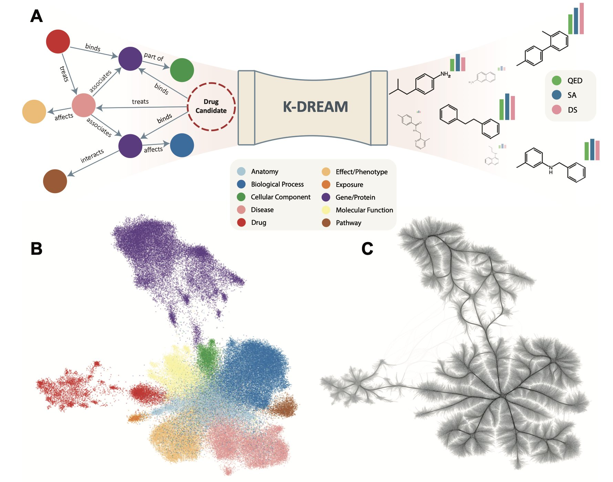
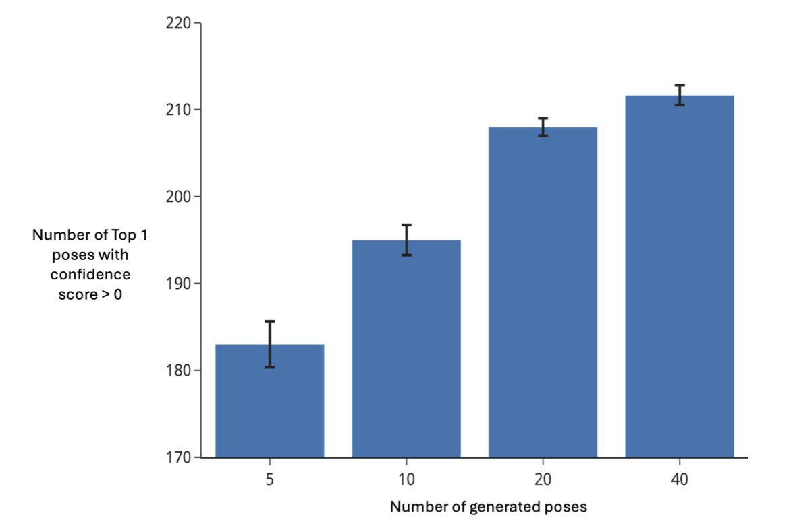
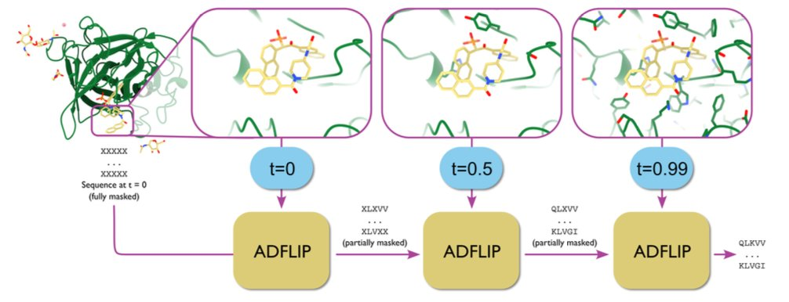

## Contents
1. K-DREAM integrates biomedical knowledge graphs into generative models, allowing AI to design drug molecules with purpose, like an experienced chemist, instead of searching blindly.
2. The combination of generative AI and rapid scoring breaks through the efficiency bottleneck of blind docking, making large-scale, unbiased virtual screening possible.
3. The ADFLIP model, based on all-atom discrete flow matching, can design protein sequences that interact precisely with specific ligands, nucleic acids, or metal ions, and it can also handle dynamic conformations.

## 1. K-DREAM: Teaching AI Biology to Design Molecules

Drug discovery has to contend with a vast chemical space. Generative models can produce huge numbers of molecular structures, but they don't understand biology. They just randomly combine numbers and vectors, so most of their output is useless.

The K-DREAM framework gives generative models a mentor: biomedical knowledge graphs.

**How K-DREAM works**

The core idea is to give the model biological context directly, so it doesn't have to guess.

K-DREAM uses a diffusion model as its molecule-generating engine. This engine can start from noise and progressively build a chemical structure. The key is how to guide this process.

This is where the knowledge graph comes in. A knowledge graph contains a complex network of relationships between genes, proteins, diseases, and drugs—the accumulation of decades of biomedical research. K-DREAM compresses this information into mathematically manageable embeddings. Each target protein gets a unique "coordinate" in the knowledge graph.

A module in the framework called the Context Regressor Network (CRN) acts as a translator. The CRN connects "chemical language" (molecular structures) with "biological language" (knowledge graph embeddings). It learns through graph attention layers and can locate a molecule's corresponding biological "coordinate" in the knowledge graph.

This brings the whole generation process to life. Once a biological goal is set (like a specific kinase target), K-DREAM uses its "coordinate" in the knowledge graph to guide the diffusion model. This way, the generated molecules account for both the target's biological function and its corresponding chemical structure. The whole process becomes a guided, precise strike.

**Solving the multi-target design problem**

For many complex diseases, like cancer and autoimmune disorders, inhibiting a single target has limited effect. We need molecules that can regulate multiple targets at once.

Traditional methods struggle with this challenge. K-DREAM offers a solution through vector interpolation.

Each target has a vector "coordinate" in the knowledge graph. To design a molecule that acts on both target A and target B, you just find a midpoint between their vector coordinates and set this new "virtual coordinate" as the generation goal. The model will then generate a molecule with properties of both. This method makes it possible to design drugs with specific multi-target profiles, and it's easy to do.

**Avoiding the "docking score" trap**

Many generative models fall into a trap: they over-optimize for docking scores. A docking score is a computational simulation value and doesn't perfectly correlate with real biological activity. Over-optimizing it is like cramming for an exam—you get a high score but can't solve real problems. The generated molecules might look perfect on paper but have poor activity when synthesized.

K-DREAM avoids this trap by using the broad, rich biological context from the knowledge graph instead of treating the docking score as the only standard. It guides the model to find molecules in "biologically meaningful" regions, not just ones that score high on a single metric. This strategy is closer to the intuition of a medicinal chemist and is more likely to find valuable drug candidates.

The framework still has room for improvement. Future versions could integrate more dimensions of knowledge, like pharmacokinetics (PK) or absorption, distribution, metabolism, excretion, and toxicity (ADMET) data. This would allow the model to design not just "effective" molecules, but "druggable" ones. K-DREAM shows a path forward: teaching AI to learn and use the biological knowledge humans have accumulated, helping it evolve from a "molecule generator" into a "drug design partner."

📜Title: Augmenting generative models with biomedical knowledge graphs improves targeted drug discovery
🌐Paper: https://arxiv.org/abs/2510.09914

## 2. DiffDock+UniDock: Industrial-Scale Blind Docking Virtual Screening

In the early stages of drug discovery, you often face a problem: you know the 3D structure of a new target, but not where a small molecule might bind. Traditional Structure-Based Drug Design (SBDD) requires you to specify a binding pocket first, and then the software tries to fit compounds from a library into it. It's like looking for a keyhole in a dark room; if you guess the wrong spot, all your subsequent work is wasted.

A new pipeline achieves "blind docking." Without any hints, the model can automatically identify the most likely binding sites and poses for a small molecule on a protein.

**Here's how it works**:

The process has two steps, combining the strengths of two different technologies.

First, **DiffDock** generates possible binding poses. DiffDock is a diffusion-based generative model, based on the same technology as AI art tools like Midjourney. It treats the small molecule as "noise" randomly distributed around the protein and then "denoises" it, gradually guiding the molecule into an energetically favorable, stable pose. This process doesn't rely on prior pocket information; it's data-driven and produces a few of the most likely binding modes.

Second, **UniDock Vina** quickly scores and ranks the poses. DiffDock generates high-quality poses but is too slow for large-scale screening on its own. So, the pipeline first has DiffDock generate a few (e.g., 3) of the most likely poses for each compound. Then, a speed-optimized scoring function, UniDock Vina, quickly evaluates and ranks them. It’s like an expert (DiffDock) proposes a few good solutions, and a fast assistant (UniDock Vina) evaluates them to pick the best one.

**How well does it perform**?

On the well-known DUD-E benchmark, even when generating only three poses per molecule, the pipeline enriched 86.78% of the active molecules within the top 1% of ranked compounds. This shows the method can effectively distinguish active from inactive molecules, allowing researchers to get a high-quality list of hit compounds with less computational cost.

Speed is another key factor. Running in parallel on 8 A100 GPUs, processing a single protein-ligand pair (generating 40 poses) took an average of 0.76 seconds. This speed gives it the potential for industrial application, making it possible to screen a library of ten million compounds in a few days.

The study also found that ranking by the **median** score of multiple generated poses works better than using the top score. The top score might come from a local high-scoring "outlier" in an otherwise unreasonable pose. The median, however, better reflects the overall binding tendency of the compound and produces more robust results.

This work provides a reliable, scalable computational tool for new targets with limited information. It enables unbiased, whole-protein hit finding and could change the strategies used in early drug discovery.

📜Title: Blind Virtual Screening at Scale: A Scalable End-to-End Pipeline for Blind Docking and Affinity Prediction
🌐Paper: https://www.biorxiv.org/content/10.1101/2025.10.10.681617v1

## 3. ADFLIP: All-Atom Protein Design for Ligands and Dynamic Structures

Traditional methods for inverse folding in protein design often have limitations. Most of them only look at the protein's C-alpha backbone to predict the amino acid sequence, ignoring the key details that determine its function. This is like designing a room's interior based only on the building frame, without considering the furniture (ligands) or utilities (cofactors). The result is often pretty but not functional.

A protein's function depends on its fine-tuned interactions with other molecules. For example, an enzyme's active site needs to bind a substrate precisely, and an antibody's CDR region must recognize an antigen. These interactions happen at the atomic level, determined by amino acid side chains, small molecule ligands, and metal ions. Design models that ignore these critical parts are missing the full picture.

The ADFLIP model, developed by Yi et al., addresses this problem. It is an "all-atom" model.

ADFLIP uses a Discrete Flow Matching generation strategy. You can think of it like a sculptor who starts with a random pile of amino acid "clay" and a complete 3D blueprint that includes every atom (including ligands and ions). The sculptor gradually replaces the "clay" with the correct amino acids, with each decision based on the precise position and chemical properties of the surrounding atoms. During this process, the amino acid side chains also take shape, providing more detailed structural information for subsequent steps.

When designing the binding pocket for a drug target, ADFLIP can "see" every atom of the small molecule drug. This allows it to design an amino acid sequence that forms the best hydrogen bonds, hydrophobic interactions, or salt bridges, making it possible to "design proteins for ligands."

ADFLIP can also handle protein dynamics. Many proteins aren't rigid; they function by moving between different conformational states. Traditional methods, based on a single crystal structure, struggle with this dynamic nature. ADFLIP, however, can learn from an ensemble of conformations, like those determined by Nuclear Magnetic Resonance (NMR), and design a sequence that can accommodate all of them. This makes the designed protein more functionally stable in a real physiological environment.

ADFLIP also has a practical feature called "training-free classifier guidance sampling." This is like adding a navigation system to the design process. Without retraining the main model, you can connect a small, pre-trained predictive model, like the affinity predictor DSMBind. At each step of sequence generation, this "navigator" guides the main model toward a specific goal, such as "improving binding affinity to the ligand." This approach allows us to "customize" protein sequences for specific needs, like high affinity or high stability.

ADFLIP elevates protein design from backbone-level "sketching" to all-atom "precision engineering," enabling us to better design functional proteins that can perform specific tasks in complex biological environments.

📜Title: All-atom inverse protein folding through discrete flow matching
🌐Paper: <https://raw.githubusercontent.com/mlresearch/v267/main/assets/yi25a/yi25a.pdf>
