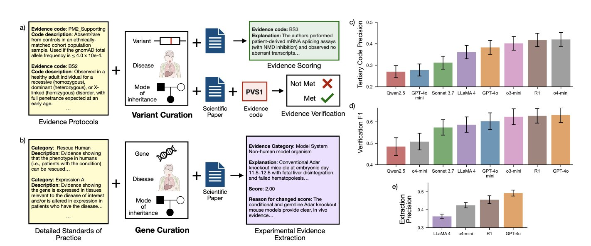
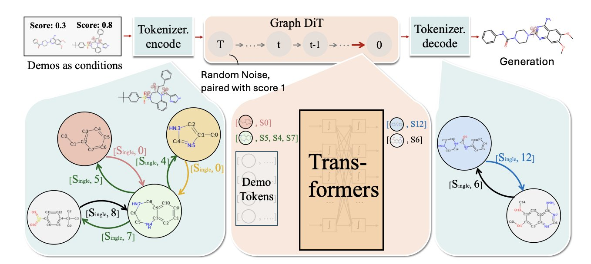
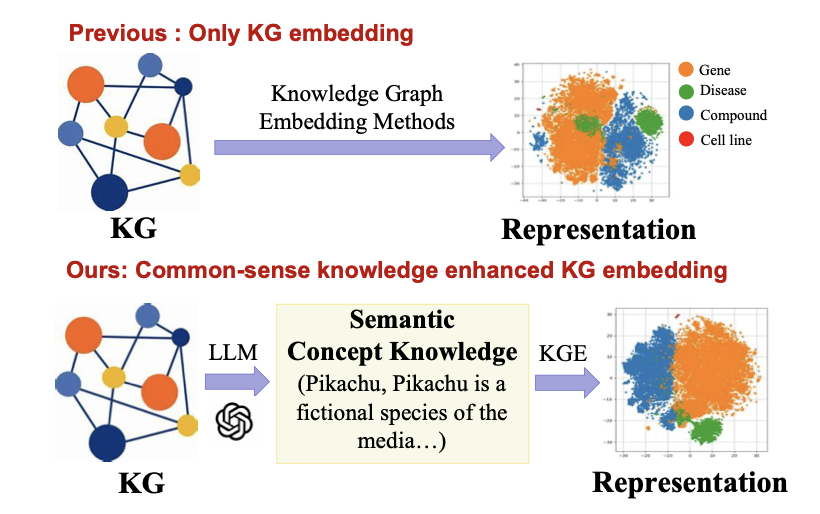

## 目录  
1. CGBENCH 基准测试表明，当前大语言模型在解读临床遗传学文献上仍不可靠，尤其在区分证据强度和产生幻觉方面存在严重问题。
2. DemoDiff 模型以「功能基团」为单位理解分子，实现了高效的小样本学习。它仅需几个范例就能执行复杂的分子设计，性能超越了规模大上千倍的通用模型。
3. LLaDR 框架结合了大语言模型的语义理解能力与生物医学知识图谱，提升了药物重用预测的准确性和鲁棒性。

## 1. AI 解读基因文献：新基准 CGBENCH 揭示致命缺陷  
  
  

解读新发现的基因突变，是遗传学研究和临床诊断的核心环节，既耗时又耗力。研究人员必须在海量文献中寻找实验证据，再将零散线索拼凑起来，判断突变是良性还是致病。这个过程依赖专家经验，速度很慢。  
  
因此，人们寄望于大语言模型（Large Language Model, LLM）来承担这项工作。  
  
新发布的 CGBENCH 基准测试，正是为了评估 LLM 在这项任务中的能力。它专为临床遗传学文献解读这一场景设计，不同于通用问答评测。这相当于在专业且事关性命的领域，对 AI 的科学推理能力进行了一次大考。  
  
该基准的数据源自 ClinGen，一个由专家手动整理和判读的遗传学文献数据库。测试围绕专家的工作流程，设计了三个核心任务：  
  
1.  **证据提取**：从论文里准确找出相关的实验结果。  
2.  **证据验证**：给定一个结论，让模型判断论文中是否有证据支持或反对。  
3.  **证据打分**：最难也最关键的一步。模型需要判断一个实验证据的「强度」，是强有力的证明，还是微弱的相关性。  
  
研究团队测试了 8 个主流的大语言模型。结果显示，模型在提取信息这类直接任务上表现尚可，但在需要深度理解和判断的「证据打分」任务上，几乎全军覆没。它们难以区分强弱证据。  
  
这一点在临床上是致命的。如果模型将一个微弱的体外实验证据误判为疾病关联的铁证，就可能导致严重误诊。  
  
CGBENCH 的评测方法揭示了更深层的问题。研究团队采用「模型即评委」（LM-as-a-judge）的策略，比对模型生成的解释与专家解释。结果发现，模型即使给出了正确的分类（如「支持」或「反对」），其解释也常常是编造的，即「幻觉」。  
  
这好比学生蒙对了答案，解题过程却一塌糊涂。在要求严谨的科学研究和临床应用中，过程不可靠的工具无法使用。  
  
CGBENCH 的出现是一次冷静的提醒，也为未来指明了方向。它表明，当前的大语言模型距离成为可靠的科研助理还有很长的路要走。模型需要提升的，是严谨、细致、可信的科学推理能力，而不只是信息检索能力。这个基准为未来的模型改进提供了明确的靶点。  
  
📜Title: CGBENCH: Benchmarking Language Model Scientific Reasoning for Clinical Genetics Research  
🌐Paper: https://arxiv.org/abs/2510.11985  

## 2. DemoDiff：用几个例子教会 AI 设计分子  
  
  

药物发现常会遇到一个难题：手头有几个活性不错的分子，但溶解度或代谢稳定性欠佳。任务是优化其结构，可用的数据点却寥寥无几，多数机器学习模型对此束手无策。  
  
DemoDiff 模型正是为解决这类问题而设计的。  
  
它的核心方法是「在上下文中学习」 (in-context learning)。你可以给模型展示几个例子，比如一个高活性分子（正例）和一个低活性分子（反例），然后让它设计一个更好的。这种交互方式更接近化学家的工作流，无需依赖成千上万的标注数据。  
  
要实现这一点，关键在于模型如何「阅读」分子。  
  
DemoDiff 采用了一种新的节点对编码 (Node Pair Encoding, NPE) 方法，将分子拆解为有化学意义的「基序」或「功能基团」，如苯环、羧基。  
  
这就像让机器从「读字母」升级到「读单词」，也更贴近化学家基于功能基团的推理方式。这种方法将分子表示的节点数减少了 5.5 倍，大幅提升了计算效率，使得在海量分子数据上预训练成为可能。  
  
模型先在包含数百万分子的数据集上预训练，学习通用的化学规律。之后，面对具体任务时，我们提供的几个范例就成为上下文，引导模型理解特定的设计要求。  
  
研究者在 6 大类、33 项分子设计任务上测试了 DemoDiff。它的表现不仅优于其他为特定领域设计的模型，甚至超过了参数量大 100 到 1000 倍的大语言模型。这说明，一个为化学领域量身定制的精巧架构，比单纯堆砌算力的通用模型更有效。  
  
生成模型有时会产出看似合理但实际无效的分子。为解决这个问题，研究者引入了「一致性评分」。这个分数能衡量模型对生成结果的「信心」，帮助我们筛掉可能是假阳性的分子，这对实际应用至关重要。  
  
DemoDiff 展示了一种新的分子设计范式。它让 AI 像经验丰富的化学家一样，通过几个案例快速学习和推理，摆脱了对海量标注数据的依赖。这种方法性能强大，也让 AI 工具更实用、更可靠。  
  
📜Title: Graph Diffusion Transformers Are In-Context Molecular Designers  
🌐Paper: https://arxiv.org/abs/2510.08744  

## 3. 大模型 + 知识图谱：LLaDR 框架重塑药物重用  
  
  

在药物研发中，药物重用（Drug Repurposing）是一个策略，旨在将已上市的药物用于治疗新的疾病，以节省时间和成本。传统方法常使用生物医学知识图谱（Knowledge Graphs, KGs），它像一张巨大的关系网，连接着药物、基因和疾病。但这张网只知道实体间的连接关系，却不理解关系背后的原因。它知道药物 A 和蛋白 B 相关，但不知道 A 是抑制还是激活 B，更不了解其中的生物学机制。  
  
LLaDR 框架的思路：既然知识图谱缺乏生物学「常识」，就让「懂行」的老师来教它。这个老师就是大语言模型（Large Language Model, LLM）。大语言模型阅读了海量科学文献，对生物医学概念的理解比知识图谱中一个简单的节点要深刻得多。  
  
**这是它的工作原理**：  
  
研究者首先从知识图谱中提取实体，如药物、靶点或疾病。然后，他们让大语言模型为每个实体生成一段描述，其中包含其功能、作用机制和相关背景。这好比是为知识图谱里只有名字的节点，配上了一份详细的个人档案。  
  
获得这份「档案」后，关键一步是用这些富含语义的文本信息，去微调知识图谱中对应节点的数学表示，即嵌入（Embeddings）。知识图谱的原始嵌入像一幅粗糙的简笔画，经过大语言模型知识微调后，就变成了一张信息丰富的彩色照片。这张「照片」不仅描绘了节点本身，还包含了它在整个生物网络中的角色和行为模式。  
  
这种做法的好处体现在，经过「补课」的知识图谱在预测药物新用途时，能够基于生物学逻辑进行推理，而不仅仅是匹配图的结构。论文数据显示，LLaDR 在标准测试集上的表现超过了现有方法，并且在面对数据噪音或信息不全时表现更稳定。这在实际应用中很有价值，因为生物数据往往不完美。  
  
**一个能说明问题的例子：阿尔茨海默病**  
  
研究者将 LLaDR 应用于阿尔茨海默病的药物发现。模型在没有预设偏好的情况下，筛选出一些潜力候选药物，其中包括达沙替尼（Dasatinib）和槲皮素（Quercetin）。  
  
对于相关领域的研究者，这两个名字并不陌生。达沙替尼是一款已上市的抗癌药，近年研究发现它能清除衰老细胞，这被视为治疗神经退行性疾病的新策略。槲皮素是一种天然黄酮类化合物，其神经保护作用也有大量文献支持。模型能独立发现这些科学界正在探索的方向，证明了其有效性。这说明 LLaDR 找到了具有真实生物学依据的信号。  
  
**作为一线研发人员，我们怎么看**？  
  
这个方法前景广阔，但也面临挑战。  
首先，它依赖于大语言模型的知识质量。如果大语言模型的训练数据有偏见或更新不及时，教给知识图谱的就可能是错误或过时的信息。  
其次是算力问题。对包含数百万甚至数十亿连接的大规模知识图谱进行微调，计算成本高昂，工程化落地是一个挑战。  
最后是可解释性。模型推荐了达沙替尼，它能告诉我们「为什么」吗？它能输出一条完整的、可供实验验证的生物学通路假说吗？这是所有 AI 药物发现工具面临的核心问题。LLaDR 让我们离答案更近了一步，但路还没走完。  
  
总的来说，LLaDR 的工作指明了一个方向：将大语言模型的非结构化知识与知识图谱的结构化数据结合，能创造出更强大的药物发现引擎。它让机器在「思考」生物学问题时，更接近人类科学家的思维方式。  
  
📜Title: From Knowledge to Treatment: Large Language Model Assisted Biomedical Concept Representation for Drug Repurposing  
🌐Paper: https://arxiv.org/abs/2510.12181
