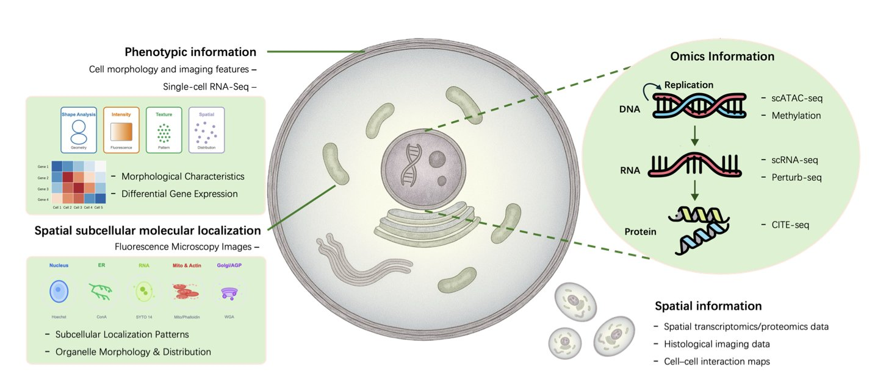
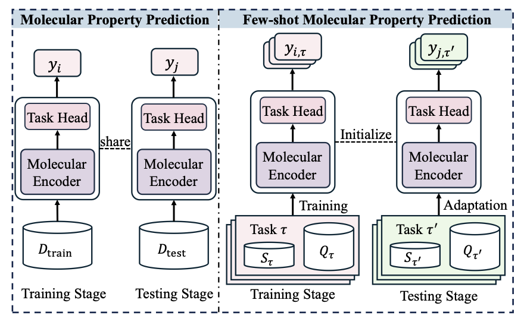
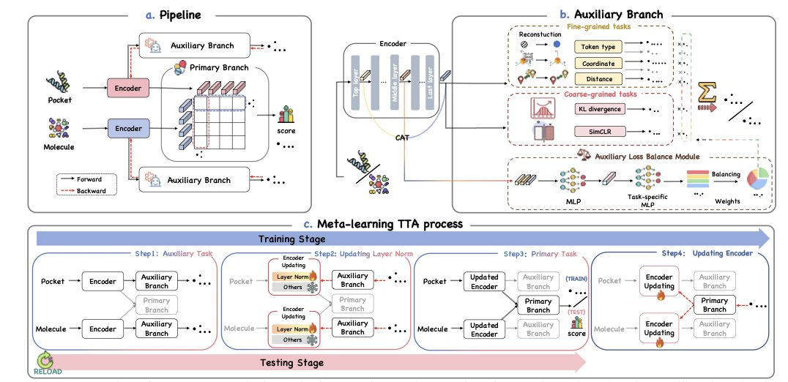

## Table of Contents
1. Large Language Models are reshaping cell biology, acting as "oracles" to predict cell states and "agents" to automate research tasks.
2. This review provides a roadmap for early-stage drug discovery where data is scarce. It categorizes existing few-shot learning methods into three levels—data, model, and learning strategy—to tackle generalization challenges across different chemical properties and molecular structures.
3. Drug-TTA enables AI models to fine-tune themselves in real-time for each new molecule, solving the problem of "face blindness" that traditional models have when encountering diverse real-world molecules.

## 1. Large Language Models Building Virtual Cells: From Oracles to Agents

### Core Idea:

Drug discovery has long aimed to build a "virtual cell"—a computer simulation to test new molecules before committing expensive lab resources. A new review paper suggests that Large Language Models (LLMs) are helping to achieve this goal in unexpected ways.

The paper classifies current methods into two roles: **Oracles and Agents**.

These roles have a clear division of labor. An "oracle" is like a top-tier platform scientist who can tell which transcription factor will bind to a DNA sequence. An "agent" is like the project lead who takes the oracle's report, consults the literature, and designs the next key validation experiment.

#### "Oracles": Decoding the Language of Life from Data

"Oracle" models are designed to predict cellular states and behaviors from massive biological datasets.

#### "Agents": Automating the Cycle of Scientific Discovery

Oracles interpret, and agents act.

`BioRAG` and `CellVoyager` demonstrate this potential. They act like research assistants, breaking down complex biological questions and autonomously querying databases, reading papers, and synthesizing answers. `CellVoyager` can even automate parts of the microscopy workflow.

The goal is to create a closed loop: form a hypothesis, design an experiment, analyze the data, and then form a new hypothesis. AI drives this cycle.

#### How Far Are We from a True "Virtual Cell"?

The review also points out current challenges:

The review lays out a roadmap: AI is moving from pattern recognition toward building integrated systems that can understand and reason about biology. The goal of a virtual cell is still distant, but the path to get there is becoming clearer.

📜Title: Large Language Models Meet Virtual Cell: A Survey
🌐Paper: https://arxiv.org/abs/2510.07706v1

## 2. A Guide to Few-Shot Learning for AI Drug Discovery

In early-stage drug discovery, researchers often face a shortage of data for new targets or projects. When you only have a dozen active molecules, using a deep learning model to predict the properties of a new one is nearly impossible. The model can't be trained properly, so it can't make reliable predictions.

This review paper breaks down the problem into two core challenges:

1.  **Cross-property generalization**: You train a model on a dataset to predict the activity of kinase inhibitors, then ask it to predict the activity of GPCR agonists. The model will likely fail because the underlying biochemistry of the two tasks is different.
2.  **Cross-molecule generalization**: You find effective molecules with similar structural scaffolds in one chemical series. But when you switch to a completely new scaffold, the model's performance can drop sharply, even if the target is the same.

It's like teaching an AI to recognize Formula 1 cars after it has only seen sedans and SUVs. They are all cars, but their design principles and how they work are vastly different.

To solve this, researchers have proposed many methods. This review offers a framework that organizes these methods into three levels, like a map showing where improvements can be made.

**Level 1: Start with the Data (Data-level**)

The idea is simple: if you don't have enough data, create more.

**Level 2: Build a Better Model (Model-level**)

If data-level methods are not enough, you can improve the model itself so it can learn more from limited information.

**Level 3: Improve the Learning Paradigm (Learning paradigm**)

The highest-level approach is to directly optimize the training and learning process itself.

The authors emphasize that future work should focus on integrating chemists' domain knowledge (like pharmacophores or functional group interaction rules) into models and improving model interpretability. When an AI predicts a molecule will be effective, it must explain why. Is it because of a key hydrogen bond or a specific hydrophobic interaction? If the AI's explanation doesn't align with chemical intuition, it won't be trusted.

📜Title: Few-shot Molecular Property Prediction: A Survey
🌐Paper: https://arxiv.org/abs/2510.08900v1
💻Code: https://github.com/Vencent-Won/Awesome-Literature-on-Few-shot-Molecular-Property-Prediction

## 3. Drug-TTA: A New Paradigm for Virtual Screening with Real-Time Adaptation

Virtual screening faces a common problem: a model performs well on the training and test sets but poorly on real-world compound libraries.

The root cause is the training data, especially the negative samples (decoys). These decoys are often computationally generated and have physicochemical properties that are too different from known active molecules. The model learns to distinguish them easily. This is like teaching a child to tell the difference between an apple and a rock, then asking them to distinguish an orange from a tangerine. The model learns simple discrimination rules, not true molecular recognition.

The idea behind Drug-TTA is to **let the model learn and adapt at the moment of testing**.

When a new molecule is presented to the model, it first performs a series of self-supervised auxiliary tasks to fine-tune itself before giving a prediction score. These tasks don't require extra labels; the answers are hidden in the molecular structure itself. For example, the model might predict atom types, inter-atomic distances, or reconstruct a masked part of the molecule.

Completing these tasks serves as a one-shot fine-tuning session for the model on the current molecule. By solving problems closely related to the molecule's structure, the model gains a deeper understanding of its 3D shape and chemical features. This is like an experienced chemist who, before evaluating a new molecule, carefully examines its structural details instead of making a snap judgment.

The use of meta-learning is key. During its initial training, the model not only learns the main virtual screening task but also learns *how* to use auxiliary tasks to improve its performance on the main task. This "meta-skill" ensures that at test time, the auxiliary tasks provide helpful guidance without misleading the model's judgment. The model knows what information to extract from the auxiliary tasks and how much that information should contribute to the final binding prediction.

The researchers also designed an Auxiliary Loss Balance Module (ALBM). This module acts as a dynamic task-weight allocator. It determines which auxiliary tasks are more important for the current molecule and gives them higher weights.

On five virtual screening benchmark datasets, the Drug-TTA method improved the average AUROC by 9.86%, a solid advance for the field. Visualizations (see image above) also show that after Drug-TTA processing, active molecules cluster more tightly in the feature space, with a clearer boundary separating them from inactive molecules. This indicates the model has learned more discriminative molecular representations.

The value of Drug-TTA is that it transforms an AI model from a static tool into a dynamic "thinker" that can adapt to new situations. By optimizing itself for each specific problem, the model makes AI a more robust and reliable tool for drug discovery.

📜Title: Drug-TTA: Test-Time Adaptation for Drug Virtual Screening via Multi-task Meta-Auxiliary Learning
🌐Paper: https://raw.githubusercontent.com/mlresearch/v267/main/assets/shen25n/shen25n.pdf
