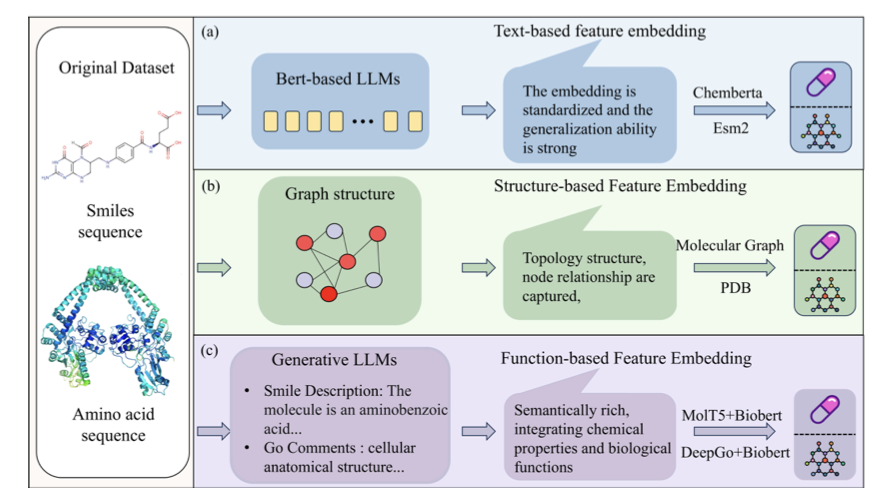
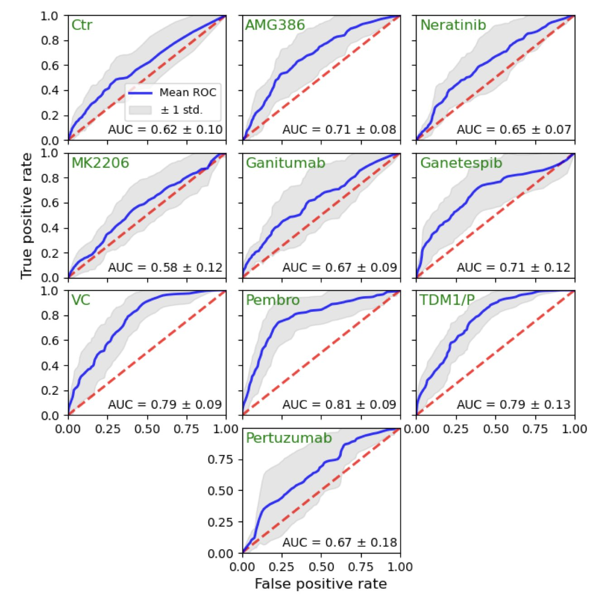
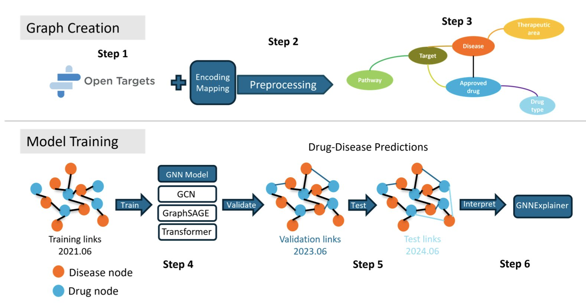

## 目录  
1. M3ST-DTI 模型通过「先粗后精」的两步融合策略，整合文本、结构和功能数据，提高了药物 - 靶点相互作用（DTI）的预测准确性。
2. 这项研究使用 XGBoost 模型分析基因表达数据，精准预测乳腺癌患者对新辅助治疗的反应，并为每位患者匹配最有效的药物。
3. KG-Bench 为药物重定位的图神经网络算法提供了一个标准化评估框架，解决了数据泄漏和模型比较不公的难题。

## 1. M3ST-DTI 模型：多模态分步融合提升药物靶点预测  
  
  

预测药物分子与靶蛋白能否结合，是药物发现的核心。过去的计算模型试图加速这一过程，但效果有限，因为它们通常只依赖单一信息，如分子结构或蛋白序列。这种方法就像看照片识人，得到的信息不够全面。  
  
M3ST-DTI 模型换了一个思路，它认为要准确预测药物和靶点的相互作用，必须聪明地利用所有可用信息。  
  
#### 多模态：三个专家一台戏  
  
这个模型同时从三个维度描述药物和靶点：  
  
1.  **文本特征 (Textual features**)：将药物的 SMILES 序列和蛋白质的氨基酸序列视为一种特殊「语言」。模型利用自注意力机制（Self-attention mechanisms）理解这些序列，捕捉关键信息，如药物的官能团或蛋白的关键结构域。  
2.  **结构特征 (Structural features**)：关注分子和蛋白的拓扑结构，即原子的连接方式。模型使用图注意力模块（Graph attention module），将分子看作原子和化学键组成的网络，从中提取空间关系。  
3.  **功能特征 (Functional features**)：描述蛋白质在细胞中的角色、参与的生物学通路等宏观信息，为相互作用提供生物学背景。  
  
结合这三种信息源，如同邀请化学家、结构生物学家和细胞生物学家共同会诊，结果比单一视角更完整。  
  
#### 两步走融合：先对齐，再精炼  
  
如何有效整合格式与尺度都不同的三类数据，是最大的挑战。  
  
M3ST-DTI 设计了一个两阶段融合策略：  
  
**第一步：早期融合，拉齐认知 (Early Fusion**)  
在这一步，模型的目标是让来自文本、结构和功能三个模态的特征向量在数学空间里「对齐」。模型使用格拉姆损失（Gram loss）作为约束，它像一个协调员，强制不同特征向量的内部结构关系保持一致。例如，结构相似的两种药物，其文本和功能特征也应体现出相似性。经过这一步，三种特征被置于一个共同语境，为后续精确融合奠定基础。  
  
**第二步：后期融合，精细打磨 (Late Fusion**)  
特征对齐后，模型开始进行精细化处理。  
  
#### 效果怎么样？  
  
UMAP 可视化图直观展示了模型的效果。输入原始特征时（图左），代表结合（正样本）和不结合（负样本）的数据点混杂难分。随着模型逐步融合与优化，这些数据点逐渐分离，最终形成两个清晰的簇（图右）。这说明模型学会了有效区分两种情况。  
  
在公开的 BindingDB 数据集上，M3ST-DTI 的准确率、F1 分数、AUROC 和 AUPRC 等性能指标，均超过了当前最优方法。这证明「多模态输入 + 分步融合」的架构是有效的。它依靠更特征整合流程，解决了 DTI 预测的一个关键难题。  
  
📜Title: M 3ST-DTI: A Multi-Task Learning Model for Drug-Target Interactions Based on Multi-Modal Features and Multi-Stage Alignment  
🌐Paper: https://arxiv.org/abs/2510.12445  

## 2. AI 精准预测乳腺癌疗效，优化个性化治疗  
  
  

在肿瘤治疗中，关键是为患者匹配最有效的药物。对于乳腺癌的新辅助治疗（Neoadjuvant Therapy, NAT），如果能在手术前用药让肿瘤完全消失，即达到病理学完全缓解（pathological Complete Response, pCR），患者的长期生存希望将大为改善。但目前，用药选择常依赖试错。  
  
研究者使用 XGBoost 机器学习算法来解决这个问题。XGBoost 擅长从复杂数据中识别规律。  
  
模型的工作流程如下：  
  
首先，研究者使用了 I-SPY2 临床试验的高质量数据。这是一个设计精良的大型临床研究，包含了多种新药治疗方案及对应的患者基因表达数据。数据质量决定了模型的性能上限。  
  
然后，模型开始学习。它分析了上千个基因的表达水平，寻找基因表达高低与患者是否达到 pCR 之间的关联。它能同时审视成百上千个基因间的复杂关系。  
  
结果显示，模型表现出色。在部分治疗方案中，其预测准确性（以 AUC 指标衡量）达到 0.814。在生物医学领域，AUC 超过 0.8 就属于可靠的预测。这说明模型能有效区分出哪些患者可能对特定药物反应良好。  
  
模型还找到了一些生物学线索。例如，ABDH1 基因低表达或 DENND1C 基因高表达的患者，似乎更容易从治疗中获益。这些发现为药物研发提供了新思路，有助于研究耐药机制，甚至可能发现潜在的新靶点。  
  
最后，这项工作展示了模型的临床应用潜力。研究者设定了一个概率阈值，例如，只为预测 pCR 概率超过 50% 的患者使用特定药物。模拟计算表明，通过这种策略，TDM1/P、Pembrolizumab 等药物的 pCR 率可以得到提升。这是一种精确的用药指导，将合适的药物用于最需要的患者。  
  
当然，研究的局限性在于样本量。所有机器学习模型都必须在更大、更多样化的人群中验证其稳健性。但它指明了方向：利用 AI 解读肿瘤的基因信息，能推动个性化癌症治疗的发展。  
  
📜Title: Machine Learning for Predicting and Maximizing the Response of Breast Cancer Patients to Neoadjuvant Therapy  
🌐Paper: <https://doi.org/10.1101/2025.10.11.25337587>  

## 3. KG-Bench：药物重定位 GNN 模型的公平竞技场  
  
  

在 AI 药物发现领域，一个头疼的问题是：如何判断哪个模型更好？每个团队都声称自己的算法最优，但使用的数据集和评估方法各不相同，如同在不同的场地上用不同的尺子量身高，无法公平比较。  
  
KG-Bench 就是为此搭建的一个公开「擂台」，它为药物重定位的图神经网络（Graph Neural Network, GNN）模型提供了一个公平、标准的竞技环境。  
  
一个公平的竞技环境，始于一个标准的比赛场地。KG-Bench 选用了业内公认的 Open Targets 数据集，从中提取药物、疾病、靶点、生物通路等信息，构建了一张巨大的知识图谱（Knowledge Graph, KG）。这张图谱成为所有模型的统一「考卷」，确保了数据源的一致性。  
  
接下来是解决关键的「作弊」问题——数据泄漏。药物重定位任务中，一个常见陷阱是用未来的知识预测过去，这会高估模型性能。KG-Bench 通过严格的时间划分进行回溯性验证（retrospective validation），确保模型在预测时，接触不到「答案」之后的信息。这样，所有模型都在同一起跑线上，成绩才真实可信。  
  
在这个公平的擂台上，多种 GNN 架构接受了测试。结果显示，TransformerConv 模型表现最佳，其平均精确率（Average Precision, APR）达到 0.87。Transformer 的核心是注意力机制（attention mechanism），擅长在复杂的关系网络中捕捉关键信息，而生物系统正是一个复杂的网络，这解释了其优异表现。  
  
KG-Bench 的价值超越了单纯的性能评分。  
  
它还深入分析了模型的潜在偏见。研究发现，在训练数据中连接更多的「明星」药物或疾病，更容易获得模型的高分推荐。这表明模型可能倾向于推荐研究充分的「老面孔」，而忽略有潜力的冷门选项。在实际应用中，这种偏见需要被识别和校正。  
  
此外，框架还使用 GNNExplainer 工具来解释算法的「黑箱」。当模型预测一个药物可能治疗某个疾病时，该工具能揭示模型是基于哪些关键靶点或通路做出的判断。这让一个预测分数变得有生物学逻辑支撑，使研发人员用起来更踏实。  
  
KG-Bench 做的是一件「铺路」的工作。它提供了一个开源、模块化的框架，任何人都可以将自己的新模型放上来，与现有最好的模型一较高下。这为计算辅助药物研发领域提供了一个能够推动其健康发展的基础设施。  
  
📜Title: KG-Bench: Benchmarking Graph Neural Network Algorithms for Drug Repurposing  
🌐Paper: <https://www.biorxiv.org/content/10.1101/2025.10.13.682003v1>
