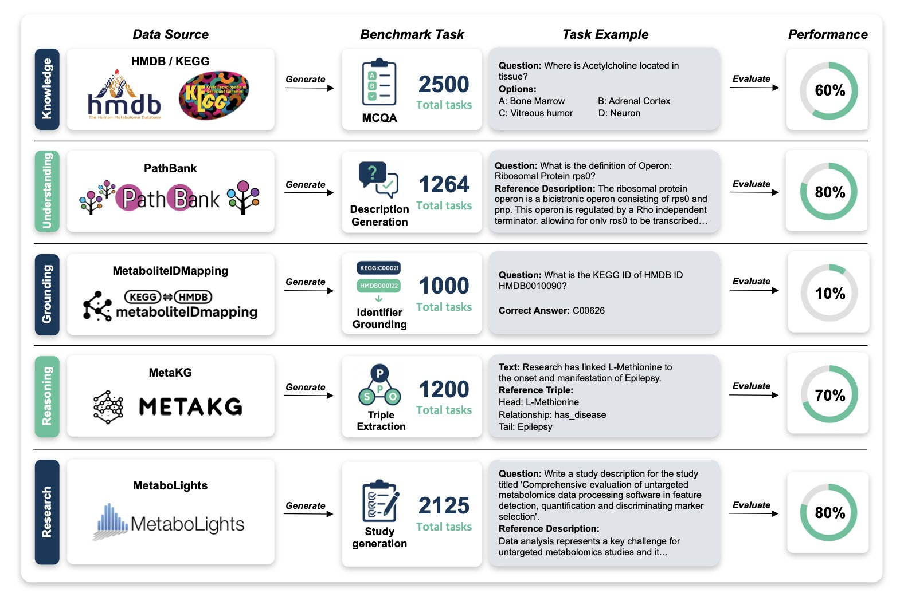
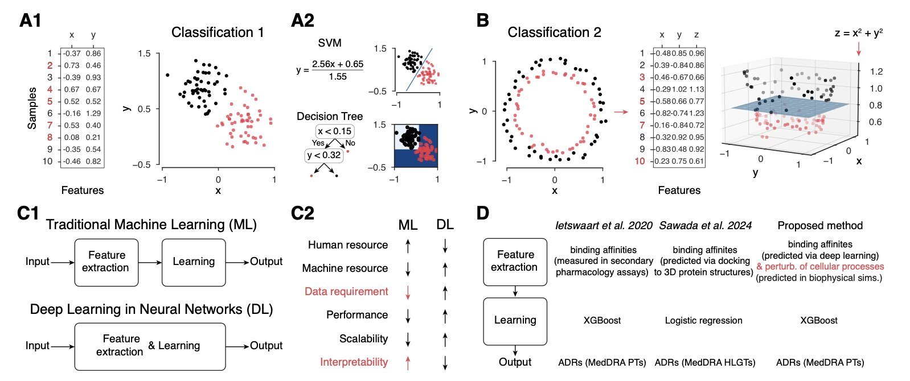
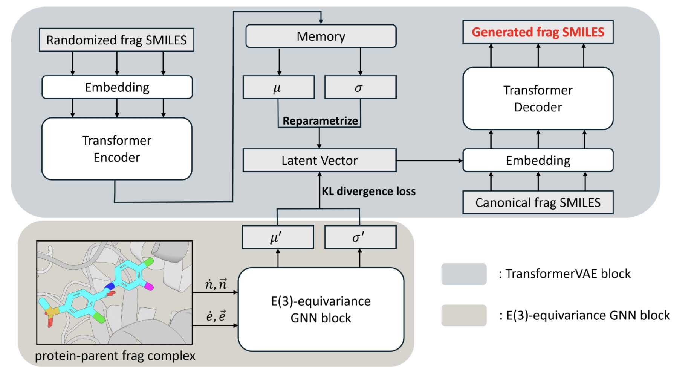
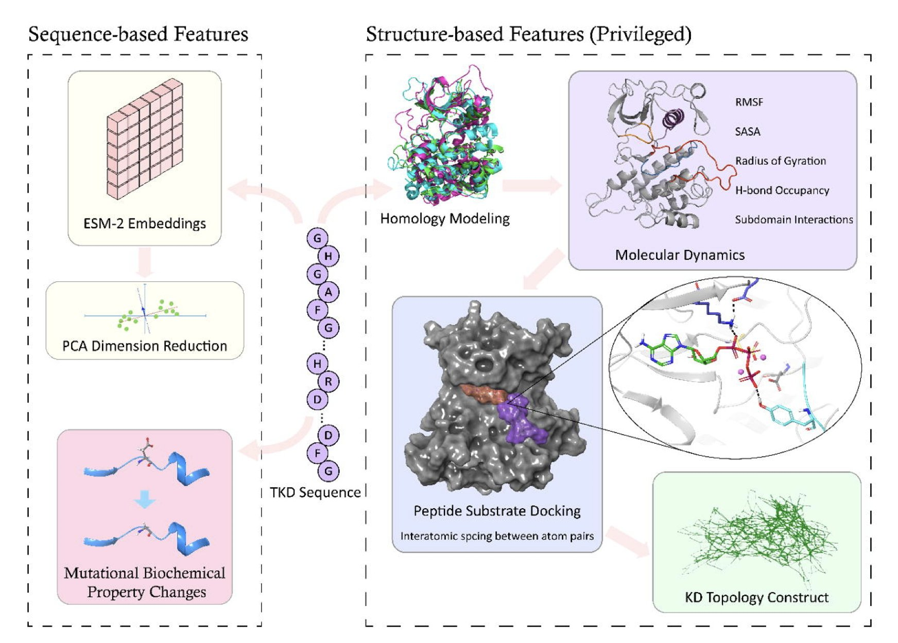
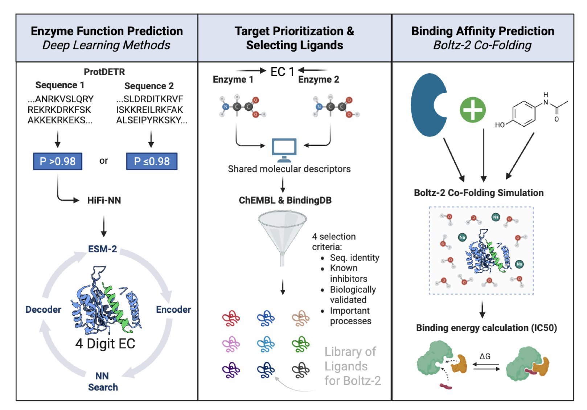

## Table of Contents
1. The new MetaBench benchmark shows that current Large Language Models are not ready for serious metabolomics research, failing almost completely at the key task of linking different databases.
2. A new model based on digital twins can predict and explain side effects by simulating a drug's impact on off-target proteins, solving the black-box problem of traditional AI models.
3. Slogen combines the generation and screening of molecular fragments into a single model, offering an efficient new tool for structure-based lead optimization.
4. Kinome-AI, a new model that integrates sequence and structural information, can accurately determine if a kinase mutation activates the protein, providing a new tool for precision cancer therapy.
5. Researchers used a deep learning pipeline to map out the functions of the "dark proteome" in *Wuchereria bancrofti* (a parasitic worm), quickly identifying several promising new drug targets and screening for initial hit compounds.

## 1. MetaBench: Large Language Models Take a Big Test in Metabolomics, and the Results Aren't Great

There's a lot of talk about how Large Language Models (LLMs) could change drug development. But can they handle a field as specialized and data-heavy as metabolomics? A paper on a benchmark called MetaBench suggests the answer is no, at least for now.

MetaBench put 25 leading models through a comprehensive test of their abilities in metabolomics, evaluating their knowledge, understanding, and reasoning. The models could generate fluent text, but they failed almost completely at a task that is essential for scientists.

That task is "grounding"—identifying the same substance across different databases. Metabolomics research relies on multiple databases like HMDB, KEGG, and PubChem. A single metabolite, like glucose, has completely different IDs in each one. A reliable AI assistant must be able to connect these IDs and know that "HMDB0000122" and "C00031" are both glucose. Without that, any further analysis is built on a shaky foundation.

The MetaBench test showed that even the best-performing LLMs had an accuracy of less than 1% on this task without the help of external tools (i.e., without retrieval augmentation). This result means the models don't truly understand what these metabolites are. They just remember bits of text, like a student who can recite a textbook but can't solve a problem. For scientific research that demands precision, such tools are not reliable.

Another key weakness is the "long-tail effect." LLMs' knowledge is heavily skewed. They can talk confidently about well-studied "star molecules" like ATP or citric acid, which have plenty of literature. But most molecules in metabolomics are data-sparse, and these "unknown" molecules could hide new biological mechanisms or drug targets. The test found that the models were useless when faced with these molecules. It's like a detective who only recognizes the most famous people in town and is therefore unable to solve a case.

But this doesn't mean AI has no future in metabolomics. The value of MetaBench is that it provides a standard ruler for the first time. It uses authoritative public data sources, ensuring the tests are realistic and relevant. With this ruler, we can objectively assess the strengths of different models and the real-world effectiveness of new techniques like Retrieval-Augmented Generation (RAG).

The paper's conclusion is that we shouldn't have unrealistic expectations for general-purpose LLMs. To make AI a useful assistant for metabolomics research, we need to build specialized tools and workflows that address the critical problems of grounding and long-tail knowledge. MetaBench is the first step toward that goal. It has drawn a starting line and given us a clear standard for future development.

📜Title: MetaBench: A Multi-task Benchmark for Assessing LLMs in Metabolomics  
🌐Paper: https://arxiv.org/abs/2405.14944

## 2. Predicting Drug Side Effects with a Digital Twin: Moving Beyond Black-Box Models

Drug development often hits a wall: a molecule fails late in clinical trials due to unexpected side effects, wasting huge amounts of time and money. Predicting these side effects is therefore crucial.

Traditional prediction methods have limitations. Some require data that is only available late in development, like Anatomical Therapeutic Chemical (ATC) codes. Others act like black boxes, where you feed a molecule's structure into a neural network and get a vague answer like "likely toxic" without any explanation why.

A new study takes a different approach by going back to biology itself to build a "Digital Twin" of a cell.

It works by using an agent-based simulator called CYTOCAST to mimic the environment inside a cell. This virtual petri dish is filled with proteins that follow specific rules of behavior, simulating how they move and bind to each other.

When a drug molecule is "dropped" into this virtual cell, the model calculates which off-target proteins it might accidentally bind to, in addition to its intended target. These off-target effects can disrupt the normal network of protein interactions, like throwing a wrench into a finely tuned machine. The model predicts side effects by analyzing these disruptions.

The key advantage of this method is its explainability. When the model predicts a side effect, it can point to the specific off-target proteins the drug affected.

Take Pirfenidone, a drug for idiopathic pulmonary fibrosis that has a rare but severe side effect—Stevens-Johnson syndrome. The model successfully predicted this risk and traced the cause to the drug's effect on an off-target protein, Carbonic anhydrase 9.

This kind of information is very valuable to medicinal chemists. It gives them a clear direction for optimization: redesign the molecule to avoid binding to Carbonic anhydrase 9 while maintaining its activity at the intended target. This turns a difficult safety problem into a solvable chemistry optimization problem.

The researchers also used Large Language Models to extract the latest side effect data from scientific literature, overcoming the problem of outdated and limited public datasets.

The method is still in its early stages and needs more data to validate its generalizability and accuracy. But it offers a new way of thinking: moving from just predicting side effects to understanding the biological mechanisms behind them, which could allow us to design safer molecules from the very beginning of drug discovery.

📜Title: Digital Twin Approaches for Interpretable Side Effect Prediction in Drug Discovery  
🌐Paper: https://www.biorxiv.org/content/10.1101/2025.10.14.682276v1

## 3. The Slogen Model: Unifying Molecule Generation and Screening to Speed Up Drug Optimization

Lead Optimization in drug discovery is like playing with a complex LEGO set. A researcher has a core structure and needs to keep adding new building blocks (molecular fragments) to make it bind more tightly to a target protein. This process has two challenges: creating new blocks (generation) or picking them from a huge warehouse (screening). Traditional methods handle these two tasks separately, which is inefficient.

The Slogen model addresses both problems by unifying generation and screening in a single framework.

The model combines two tools: a Transformer-based Variational Autoencoder (VAE) and an E(3) equivariant Graph Neural Network (GNN).

The VAE handles the "creative" part. It is pretrained on a massive dataset of molecular fragments, so it can both generate new fragments and quickly pick suitable ones from a virtual fragment library based on similarity.

The GNN handles the "physics" part, capturing the 3D spatial interactions between the protein and the molecular fragment. This allows the model to determine the best orientation and conformation for a new fragment to achieve a tight bind with the target.

The researchers compared Slogen with models like Delete and DeepFrag. In fragment growth tasks, Slogen had a higher hit rate and generated molecules with better binding affinity to the target. It could also think outside the box, designing more diverse and drug-like molecular structures.

In screening tasks, Slogen outperformed traditional docking software like AutoDock Vina on the Delete test set, showing its potential for practical use.

In two case studies involving the SMO and D1DR receptors, Slogen designed molecules with high affinity and good drug-like properties, proving it is a practical tool.

Slogen has its limitations. For example, it didn't perform as expected when generating some common ring structures (BM scaffolds). The authors suspect this might be due to a lack of diversity in the fragment library used for pretraining. Future improvements could involve pretraining with more diverse fragment sets or incorporating more advanced GNN architectures.

This work shows that unifying generation and screening is a viable path forward for computer-aided drug design, pushing it toward greater automation and intelligence.

📜Paper: Slogen: A Structure-based Lead Optimization Model Unifying Fragment Generation and Screening  
🌐Paper: <https://www.biorxiv.org/content/10.1101/2025.10.14.682343v1>

## 4. Kinome-AI: Accurately Predicting Activating Kinase Mutations

A common problem in targeted cancer therapy is figuring out whether a newly discovered kinase mutation is driving the cancer or is just a harmless bystander. The answer determines if a patient can benefit from a targeted drug. Traditional methods rely on known mutation hotspots or time-consuming cell-based experiments.

The Kinome-AI model aims to solve this problem.

It integrates information from multiple sources, including basic biochemical properties like changes in amino acid size and charge. At its core are sequence embeddings from the protein Large Language Model ESM-2. Think of ESM-2 as a scholar that has read billions of protein sequences and deeply understands the "language" of proteins—their amino acid sequences. When one amino acid mutates, ESM-2 can judge from the context (the surrounding sequence) how much that one "word" change affects the meaning of the whole "sentence" (the protein's function).

The model's approach to structural information is clever. A protein's 3D structure is critical to its function, but getting a crystal structure for every mutant is nearly impossible. So, during training, the model uses structural data for only 21% of the mutants in its database as "privileged information." This way, the model learns to infer key structural information from more accessible sequence and biochemical features. Once trained, the model no longer needs 3D structure as an input when it encounters a new mutation without structural data. It's like an experienced detective who, after studying a few crime scenes, learns to deduce the criminal's methods from just the basic clues.

The model performed well on a dataset of 1,003 mutations across 110 different kinases (AUROC 0.85). A feature analysis found that the sequence embeddings from ESM-2 were the most important feature. This suggests that evolution has encoded a vast amount of functional and structural information into protein sequences, and LLMs are good at extracting it.

To test its practical use, the model was evaluated on real cancer mutations from the COSMIC database. Kinome-AI successfully identified many known key activating mutations, such as BRAF V600E and EGFR L858R, proving its value. For clinicians and drug developers faced with a mutation of unknown significance (VUS), Kinome-AI can provide valuable guidance to help find the right treatment for a patient more quickly.

📜Paper: Integrative machine learning predicts activating kinase mutations for precision oncology  
🌐Paper: https://www.biorxiv.org/content/10.1101/2025.10.14.682355v1  
💻Code: https://github.com/wyiming0318/CancerAI

## 5. AI Shines a Light on a Parasite's Dark Proteome to Find New Drug Targets for a Neglected Disease

Finding a new drug target is like searching for a switch you've never seen before in a dark room. This work is especially hard in the field of neglected tropical diseases, where funding and resources are limited. Lymphatic filariasis, caused by the parasite *Wuchereria bancrofti*, is one such problem. Even though we have its genome, the functions of most of its proteins—its "dark proteome"—remain unknown.

This study developed a computational pipeline specifically to decode these functionally unknown proteins.

The pipeline starts by reading a protein's amino acid sequence. It then uses a model called a DEtection TRansformer (DETR) and other algorithms to assign an Enzyme Commission (EC) number to each protein.

An EC number is like a precise ID card that details the chemical reaction a protein catalyzes inside a cell. Once we know the reaction it drives, we can figure out how to inhibit it and kill the parasite. This pipeline assigned functions to thousands of unknown proteins in *Wuchereria bancrofti*, expanding our knowledge of the organism.

With this functional map, the next step was to identify the most valuable targets to attack. The researchers developed a clear screening strategy and selected six key enzyme targets:

1.  **Anti-Wolbachia**: *Wuchereria bancrofti* relies on a symbiotic bacterium, *Wolbachia*, to survive. Attacking targets unique to these bacteria is like cutting off the parasite's life support.
2.  **Proteolysis Blockade**: The parasite needs to digest host proteins for nutrients. Inhibiting its proteolytic enzymes can block this nutrient supply.
3.  **Immune Interference**: Some enzymes help the parasite disguise itself to hide from the human immune system. Inhibiting these enzymes can expose the parasite to immune cells, allowing them to be cleared.

After locking in on the targets, the researchers needed to confirm they were "druggable"—meaning a small molecule could be found to bind to them.

They used another AI tool, Boltz-2, to perform structure-based virtual screening. For each new target, Boltz-2 ran computational simulations on a vast library of compounds to find molecules that could bind to and inhibit the target's function. In the end, they found several hit compounds with nanomolar-level activity.

Finding a nanomolar hit compound directly from computation for a brand-new target is a clear signal in early drug discovery. It shows that the target is not only biologically important but also chemically tractable. This gives medicinal chemists a concrete molecular scaffold to start with for subsequent optimization and development of a drug candidate.

This work shows how AI can speed up drug discovery for neglected diseases. It provides a roadmap from an unknown gene sequence to functional annotation, target selection, and hit compound discovery. The method can also be applied to study the "dark proteomes" of other pathogens.

📜Title: Decoding the dark proteome: Deep learning-enabled discovery of druggable enzymes in Wuchereria bancrofti  
🌐Paper: https://arxiv.org/abs/2510.07337v1
