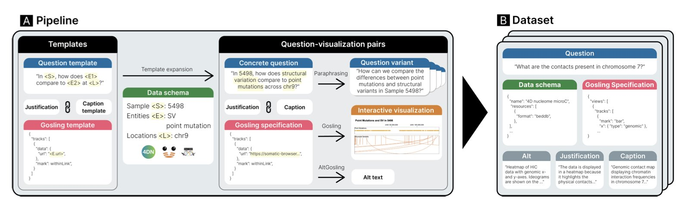
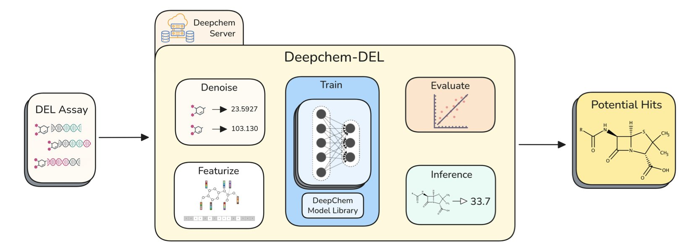
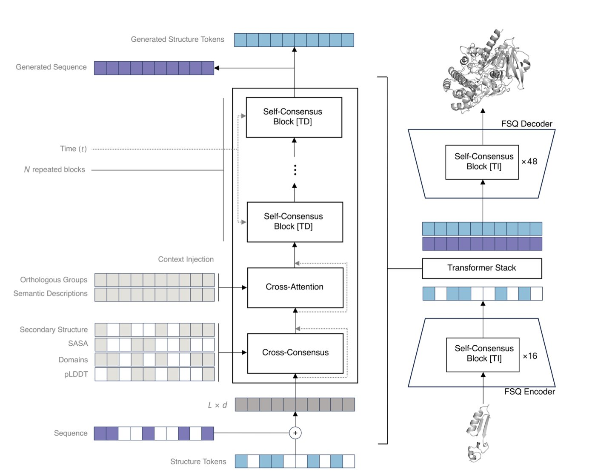

## 目录  
1. GQVis 是一个为基因组学量身打造的大规模数据集，用于训练 AI 模型将自然语言指令直接转化为专业、复杂的可视化图表。
2. DeepChem-DEL 是一个标准化的开源工具包，它解决了 DNA 编码化合物库（DEL）数据分析中流程零散、结果难以复现的难题，让机器学习在 DEL 领域的应用变得简单可靠。
3. Odyssey 用一种模拟进化的「共识」机制取代传统注意力，构建出百亿参数级的蛋白质语言模型，能高效生成兼具序列与结构信息的功能性蛋白。

## 1. GQVis: 用自然语言生成基因组学可视化图谱  
  
  

在基因组学研究中，如何看懂海量数据是一大挑战。研究者想把数据变成一张有意义的图，通常需要编写 R 或 Python 代码，并清楚知道何时该用哪种图。这个过程繁琐，为探索性数据分析设下了门槛。  
  
现在，你或许只需告诉电脑：「展示基因 A 在两种细胞系里的剪接情况，并标注外显子。」一张 Sashimi 图 (Sashimi plot) 就能自动生成。这正是 GQVis 数据集希望实现的未来。  
  
**为什么基因组学需要专属的数据集**？  
  
通用的大语言模型 (Large Language Models, LLM) 无法满足基因组学可视化的专业需求。基因组学数据有自己独特的「可视化语言」。  
  
例如，展示基因组区域间的远距离相互作用，研究者会用环形布局图 (circular layout)；观察 RNA 测序数据的可变剪接，Sashimi 图最为直观。通用模型没有学习过这些领域专用的图表，因此无法生成。  
  
GQVis 的构建者将 4DN、ENCODE 和 Chromoscope 等大型公共数据库的真实数据，与这些专业图表类型相对应，构建了一个包含超过 220 万个数据点的数据集。这套方法旨在教会 AI 模型基因组学领域的「行话」。  
  
**理解图，而不只是画图**  
  
这个项目的一个核心是教 AI 理解「为什么」要这样可视化。  
  
数据集里的每个样本，除了自然语言指令和最终图表，还附带了「设计理由」的解释。例如，「因用户想比较不同样本的剪接模式，故选择 Sashimi 图」。这如同资深科学家在指导新手，解释操作背后的思考过程。AI 学习这些理由后，在面对新问题时，更有可能做出符合科学逻辑的判断。  
  
**让数据分析成为一场对话**  
  
科学发现是一个不断深入的探索过程。研究者通常会先看总览，发现现象，再放大看细节，最后叠加其他数据验证。  
  
GQVis 在数据集中加入了大量的「多步查询链」来模拟这个过程。例如：  
1.  「显示某条染色体的整体结构。」  
2.  「放大到 15 号染色体的 p13 区域。」  
3.  「在此区域上，叠加某个蛋白质的 ChIP-seq 信号。」  
  
用这类数据训练后，未来的 AI 模型能更好地支持探索式分析。你可以与它连续对话，动态调整可视化结果，使数据分析体验更贴近真实的研究习惯。  
  
GQVis 目前是一个高质量的「教材」，用于训练模型。接下来的工作是用这个数据集去微调 (fine-tune) 大语言模型，并建立评估标准，判断 AI 生成的图表是否科学准确。这是让 AI 成为基因组学研究者得力助手的一步。  
  
📜Title: GQVis: A Dataset of Genomics Data Questions and Visualizations for Generative AI  
🌐Paper: https://arxiv.org/abs/2405.13816  

## 2. DeepChem-DEL：开源框架统一 DEL 数据建模  
  
  

### 统一工作流，模块化设计  
  
DNA 编码化合物库（DNA-Encoded Library, DEL）筛选，好比在泥沙俱下的河里淘金。你能在数亿甚至数十亿分子中寻找，但绝大部分都是无用的泥沙，真正的「金子」——有活性的苗头化合物——就藏在海量测序数据里。目前的挑战在于，每个实验室的「淘金」方法各不相同，使用的软件和算法五花八门，导致结果难以相互比较和验证。一个方法在一个项目中有效，换个项目可能就失效了。  
  
为了解决这个混乱的局面，斯坦福 Pande Lab 与 X-Chem 联手推出了 DeepChem-DEL。它提供了一套标准化的数据分析工具与流程，整合了从数据去噪到模型预测的全流程，并且设计灵活，能与 DeepChem Server 无缝集成，支持云端大规模并行计算。  
  
#### 第一步：清洗数据，分离噪音与信号  
  
DEL 筛选首先要处理原始测序数据，关键在于「去噪」。原始数据里充满了测序过程产生的随机噪音，若处理不当，噪音会淹没真正有价值的信号。  
  
DeepChem-DEL 提供了一套清晰的去噪流程，内置两种核心方法：  
  
1.  **Unify Signal**：利用泊松富集分数校准信号，如同为所有「石头」设定一个基础亮度，只有远超标准的才被视为潜在的金子。  
2.  **Amplify Signal**：通过聚合相似结构片段（disynthons）的计数值来增强信噪比。这就像发现多处小金沙聚集，预示着附近可能有大金矿一样，利用「聚集」效应放大微弱信号。  
  
#### 第二步：关注分子整体，而非局部  
  
DEL 分子由几个化学片段（synthons）拼接而成。过去许多模型只分析两个片段（disynthon）的组合，但分子的整体性质并非局部片段的简单叠加。  
  
实验数据证明，使用三个片段（trisynthon）表征分子，模型的预测性能几乎总是优于只用两个片段。这就像通过车轮、门把手和发动机零件来识别一辆车，比只看车轮和门把手能获得更多信息。  
  
#### 第三步：具体问题具体分析，没有万能药  
  
研究还发现，不存在一种通用的「最优」数据处理方法。  
  
在激酶靶点 DDR1 和 MAPK14 上的测试显示：对于 DDR1，未经信号统一处理的三片段模型分类效果最好；而对于 MAPK14，经过信号统一处理的三片段模型表现更佳。  
  
这个结论对研发人员很重要，它说明不同靶点的性质和分子偏好不同，用固定流程处理所有项目并不可行。DeepChem-DEL 的价值在于提供了一个灵活的平台，方便研究者测试不同策略，为特定靶点找到最优解。  
  
#### 开放平台加速新药发现  
  
DeepChem-DEL 的核心贡献在于其开放性与标准化。过去，许多公司将 DEL 数据分析流程视为商业机密，这阻碍了整个领域的进步。  
  
现在，这个开源、可复现的基准框架为所有人提供了统一的起点。学术界研究者可以更容易地进入该领域，初创公司能快速搭建分析平台，大公司也能用它来验证和比较内部方法。这种开放性将促进新算法的开发和应用，最终加速基于 DEL 的新药发现。  
  
📜**Title**: DeepChem-DEL: An Open Source Framework for Reproducible DEL Modeling and Benchmarking  
🌐**Paper**: <https://doi.org/10.26434/chemrxiv-2025-f11mk>  

## 3. Odyssey 模型：用「共识」机制替代注意力，重构蛋白质进化  
  
  

蛋白质语言模型越大，Transformer 架构的注意力（Attention）机制就越是瓶颈，因为它的计算成本呈二次方增长。所以，一个 1020 亿参数的蛋白质模型，必然绕开了注意力机制。  
  
Odyssey 的答案是「共识」（Consensus）机制。传统注意力机制中，每个氨基酸要和所有其他氨基酸通信，计算量巨大。在共识机制里，一个氨基酸只先与邻居达成局部共识，这些局部共识再逐层传递，形成全局理解。这种方式计算效率高，让千亿级参数模型成为可能。它也更贴近蛋白质折叠的物理过程：先形成局部二级结构，再组装成完整的三维构象。  
  
解决了计算架构，下一个问题是如何让模型同时理解序列和三维结构。蛋白质的原子坐标是连续值，语言模型则处理离散的词元。Odyssey 使用了一种叫「有限标量量化器」（Finite Scalar Quantizer, FSQ）的技术。它相当于在三维空间上覆盖一张精细的网格，将每个原子的精确坐标近似到最近的网格点上。这样，连续的坐标就转换成了一系列离散的「代码」，模型便能像处理文本一样处理结构。论文数据显示，该方法的效果优于现有其他方法。  
  
训练方式也不同。许多模型采用「完形填空」（Masked Language Modeling），即遮蔽部分氨基酸让模型预测。Odyssey 则使用离散扩散（Discrete Diffusion）。这个过程模拟进化：先随机「破坏」一个正常的蛋白质序列，再让模型学习如何「修复」它。通过反复的「破坏 - 修复」循环，模型被迫学习蛋白质序列与结构背后的深层规则。结果显示，在同时预测序列和结构的任务上，离散扩散方法的困惑度（Perplexity）更低，证明模型学得更好。  
  
只生成漂亮的结构还不够，蛋白质需要有生物功能。最后一步，研究者使用 D2-DPO 对齐技术微调模型。他们给模型展示成对的样本，告诉它哪个蛋白质活性好，哪个活性差。通过这种方式，模型学会了区分优劣，理解了序列、结构与生物功能间的内在联系。这样，当设计全新蛋白质时，模型就能生成那些更可能具备所需功能的分子。  
  
Odyssey 的思路为构建更大、更懂生物学的蛋白质设计模型提供了一条路径。一个能掌握「序列 - 结构 - 功能」密码的模型，是从头设计新型抗体、酶或其他蛋白药物的关键工具。  
  
📜Title: Odyssey: Reconstructing Evolution Through Emergent Consensus in the Global Proteome  
🌐Paper: https://www.biorxiv.org/content/10.1101/2025.10.15.682677v1
