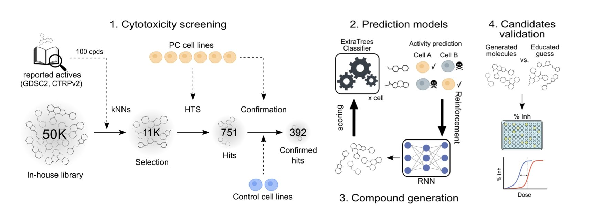
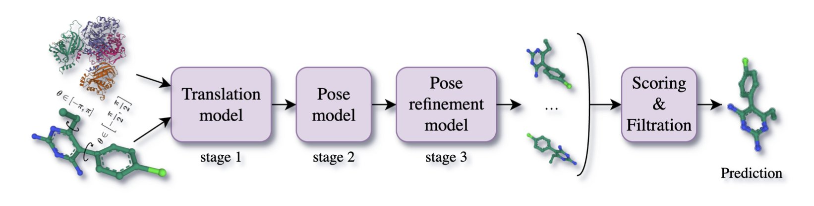
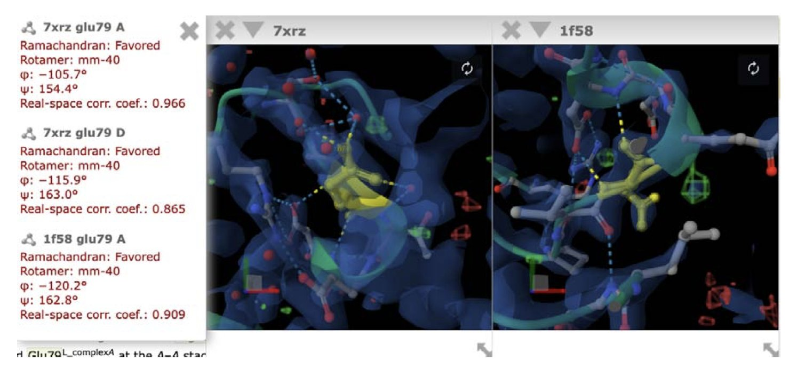

## 目录  
1. 研究人员结合预测式与生成式 AI，设计出能精准靶向特定癌细胞的小分子，为表型药物发现开辟了新路。
2. MATCHA 模型采用多阶段流匹配（multi-stage flow matching），在分子对接任务中兼顾了速度、准确性与物理真实性，在药物发现中具备实用价值。
3. 新工具用 AI 自动连接论文中提到的氨基酸残基和其 3D 结构，还附带了局部结构质量评估数据。

## 1. AI 设计抗癌新药：精准狙击特定癌细胞  
  
  

药物发现通常有两种思路。一种是基于靶点，如同用特定钥匙开特定锁。另一种是表型筛选（phenotypic screening），不管锁是什么，直接用大量化合物去试，看哪个能「杀死癌细胞」。表型筛选能发现全新的作用机制，但后续优化就像在黑箱中摸索。  
  
这项新研究为这个「黑箱」装上了一个智能导航系统。  
  
它的思路分为三步：  
  
第一步是数据积累。研究团队用超过 11,000 种化合物处理 6 种胰腺癌细胞系和 2 种正常细胞系，获得了海量的原始数据，揭示了不同化合物对不同细胞的杀伤效果。  
  
第二步是训练一个机器学习模型，学会识别化合物作用于不同细胞系后产生的独特模式，即「生物活性指纹」。模型的目标是找出那些「只杀死 A 癌细胞，但对 B 癌细胞和正常细胞无害」的分子。结果表明，这个基于生物活性的模型，预测准确性超过了仅分析化学结构的传统模型，证明 AI 掌握了生物效应的深层规律。  
  
第三步是让 AI 创造新分子。研究人员将训练好的模型嵌入生成式 AI 平台 REINVENT。REINVENT 如同一个化学家，不断生成新分子结构；而鉴别器模型则立刻评判其选择性，例如指出它会误伤正常细胞，或肯定其潜力并引导设计方向。通过这种强化学习（Reinforcement Learning）循环，AI 不再是随机筛选，而是进行有目标的智能设计。它甚至能为分子背景相似的癌细胞系，设计出具有差异性杀伤效果的分子。  
  
AI 设计的分子通过了实验验证。研究团队合成了 45 个新分子进行测试，其中 20 个展现出预期的细胞特异性杀伤效果。接近 45% 的命中率，远高于传统高通量筛选不到 1% 的水平，证明了 AI 设计的有效性。  
  
这项工作将表型筛选的无偏见优势与生成式 AI 的设计能力结合，展示了一种新的药物发现范式。未来，我们或许能针对纤维化、神经退行性病变等复杂疾病表型，直接设计能够逆转表型的药物，而无需预先确定靶点。对于胰腺癌这类棘手的疾病，这种方法提供了一种富有潜力的新策略。  
  
📜Title: Phenotypic AI-based design of cell-specific small molecule cytotoxics  
🌐Paper: https://www.biorxiv.org/content/10.1101/2025.10.15.682546v1  

## 2. MATCHA：AI 分子对接新突破，速度与精度兼得  
  
  

分子对接长期面临速度与精度的权衡。传统方法速度快但准确性不足，而 AlphaFold 3 等共折叠模型虽准，计算耗时却过长，不适用于大规模虚拟筛选。新模型 MATCHA 旨在解决这一难题。  
  
其核心是一个「从粗到精」的多阶段流程：  
  
1.  **第一步，全局定位**。模型先在三维空间（R³）里，为配体分子寻找一个大致的落脚点，目标是快速将分子置于靶点蛋白附近。  
2.  **第二步，调整构象**。确定大致位置后，模型在 SO(3) 空间里精调分子的整体朝向，如同将钥匙对准锁孔。  
3.  **第三步，微调可旋转键**。最后，模型在 SO(2) 空间里细致调整分子内部可自由旋转的化学键，确保分子构象与口袋完美匹配。  
  
这种分而治之的策略很有效，它将复杂的对接问题分解为几个更简单的子问题来处理。  
  
在 ASTEX 测试集上，MATCHA 的成功率（RMSD ≤2Å）达到 66%。该模型还强调了结果的物理有效性（PB-valid）。许多对接程序会生成 RMSD 值很低，但原子间距不合理或存在空间碰撞的无效构象。MATCHA 内置的无监督物理有效性过滤器能筛除这类结果，这对于药物研发项目很有价值，可以节省大量人工筛选时间。  
  
在速度方面，MATCHA 比 AlphaFold 3 等大型共折叠模型快约 25 倍。这一提升使其能够用于更大规模的化合物库筛选。同时，模型的训练成本更低，仅需单台 H100 GPU 运行 38 天，更容易被不同实验室复现和改进。  
  
MATCHA 的模型架构融合了扩散模型（Diffusion Transformer）和类 Uni-Mol 空间编码器的优点。它能同时处理盲对接和已知口袋的对接任务，适用范围广。模型仍有改进空间，例如处理受体柔性这一长期挑战。MATCHA 在保证高精度的同时提升了计算效率，并能生成化学上更合理的结果，是一个有潜力在药物发现一线发挥作用的实用工具。  
  
📜Title: MATCHA: Multi-Stage Riemannian Flow Matching for Accurate and Physically Valid Molecular Docking  
🌐Paper: https://arxiv.org/abs/2510.14586  

## 3. AI 读懂论文，一键链接文本与 3D 蛋白结构  
  
  

我们都遇到过这种事。  
  
你正在读一篇关于新药靶点的文章，作者提到一个关键相互作用，比如某个化合物与蛋白的「精氨酸 254」结合。接下来你怎么办？打开 PyMOL，下载 PDB 文件，找到对应的链，再找到那个残基编号……一套操作下来，十几分钟过去了，阅读思路也断了。  
  
有团队开发了一个工具，解决了这个麻烦。  
  
他们训练了一个 Transformer 模型，这是一种大语言模型（Large Language Model, LLM），专门阅读生物化学文献。这个 AI 的任务是在句子里认出像「Arg254」或「A254K 突变」这类表述。  
  
识别只是第一步。工具会自动将文本信息映射到 UniProt 数据库的序列，再链接到其在蛋白质数据库（Protein Data Bank, PDB）中的三维坐标。你只需点击链接，就能在 3D 视图里看到那个关键的精氨酸残基。  
  
这个工具还有一个亮点：在显示结构的同时，它会一并提供该残基*局部*的实验数据质量指标。  
  
做结构生物学的人都知道，一个蛋白质晶体结构模型里，不同区域的可靠性天差地别。比如一个灵活的 loop 区域，电子云图可能很模糊。这个工具会直接告诉你：「你看的这个 Arg254，数据质量很好」，或者「小心，这块区域的模型是推测出来的，不太可靠」。这为评估论文结论的可靠性提供了直接依据。  
  
这就像导航软件，既标出目的地，也提示沿途的路况和风险。  
  
可以想见，如果这个工具整合到期刊的审稿系统，审稿人就能即时验证作者的结构分析。对药物设计而言，这将缩短靶点验证和结构分析的时间。研究团队还计划扩展功能，以识别蛋白质名称、功能状态等更多信息，这将使系统更加完善。  
  
📜Paper: Linking Protein Residues in Literature and Structure  
🌐Paper: https://www.biorxiv.org/content/10.1101/2025.10.17.683004v1
