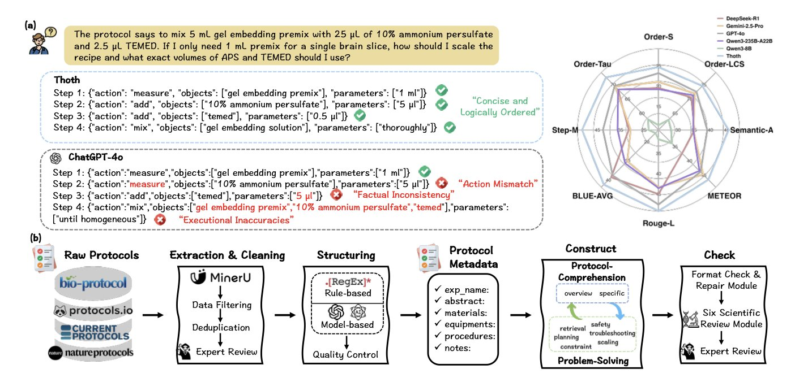
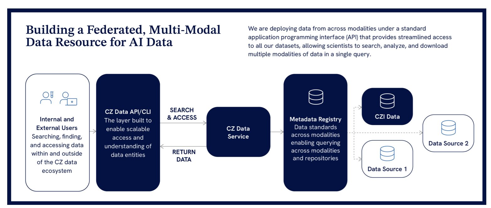
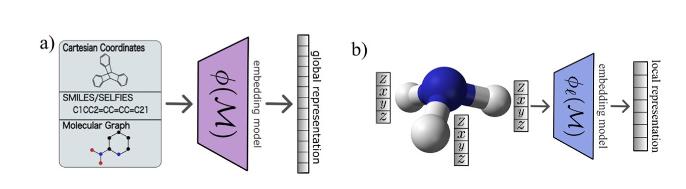

## Table of Contents
1. The Thoth framework simulates a scientist's design process, using a structured reward mechanism to generate precise, executable biology experiment protocols.
2. CZI is building an open, federated data ecosystem to address the core problem of biological data being plentiful but disconnected, paving the way for AI-driven cell biology research.
3. When predicting molecular properties, richer features—such as those from Transformers or 3D descriptors—don't always improve performance and can sometimes be counterproductive.

## 1. AI Generates Biology Experiment Protocols, and the Thoth Framework Makes It Work

Experimental protocols are a daily reality in scientific research. A clear protocol can guide an experiment to be reproduced smoothly. A bad one wastes time, reagents, and can even cause the experiment to fail.

A preprint paper introduces a framework called Thoth, designed specifically to generate biology experiment protocols. What makes it different is that it "designs" experiments like a scientist, not just "writes" text.

Thoth uses a "Sketch-and-Fill" paradigm, which mimics how a scientist thinks when designing an experiment:
1.  **Analysis**: Clarify the experimental goal, identify key techniques and reagents, and form an initial concept.
2.  **Structuring**: Organize the concept into a logical framework, determining the sequence and connections between steps.
3.  **Expression**: Fill in the framework with standard, unambiguous language to create the complete experimental steps.

This step-by-step method ensures the generation process is controllable and verifiable. It prevents the model from producing text that looks correct but is impossible to perform.

To assess protocol quality, Thoth introduces SCORE (Structured Component-Based Reward), a mechanism that acts like a strict peer reviewer, checking three core dimensions:

This structured reward guides the model to generate protocols that can actually be used in a lab.

Test results show that Thoth is better than general **Large Language Models (LLMs**) in several areas. General models have broad knowledge but lack specialization. Thoth, on the other hand, is like a lab technician trained for a specific job, understanding the meaning and logic of each step.

The core idea of this framework—breaking down complex scientific reasoning into manageable modules and setting clear evaluation criteria for each—can also be applied to other areas, like planning chemical synthesis routes or designing clinical trials.

There's still a long way to go from a model to a reliable tool. Experiments have many variables. Cell conditions, reagent batches, and equipment models can all affect the results. AI-generated protocols need review and validation from experienced scientists before use. But this is the right direction: teaching AI to learn how humans think, not just to imitate language.

If you're interested in the details, you can read the original paper.

📜**Paper**: Unleashing Scientific Reasoning for Bioexperimental Protocol Generation via Structured Component-Based Reward Mechanism
🌐**URL**: https://arxiv.org/abs/2510.15600v1

## 2. Breaking Down Data Silos: CZI Lays the Foundation for AI in Biology

The field of biology is drowning in data. Genomics, transcriptomics, proteomics, metabolomics, plus all kinds of high-resolution imaging data, are being generated in massive amounts every day. But this data is like Lego bricks from different manufacturers. The sizes, specs, and colors don't match, so they can't be put together. We have huge amounts of data, but we can't piece together a full picture of how a complex system like a cell works.

The Chan Zuckerberg Initiative's (CZI) new blueprint aims to solve this data interoperability problem at its root. They want to create a universal standard for biological data, something like a USB-C for biology.

#### From "Lots of Data" to "Usable Data"

To make AI models understand cell biology, we must provide "good" data. "Good" data is multi-modal, interconnected, and has uniform annotation.

For example, to study a new drug target, you need to know:
1.  In which cell types is this protein expressed? (Cell diversity and evolution)
2.  What happens to the cell after you knock it out with a small molecule inhibitor or CRISPR? (Genetic and chemical perturbations)
3.  How do these changes look at the ultrastructural level inside the cell? (Multi-scale imaging and dynamics)

These three points correspond to the three pillars of CZI's data strategy. CZI's goal is to systematically generate data covering these three dimensions to build a comprehensive reference map of cell biology. This is a large-scale, standardized data production project, like creating a set of high-precision maps for the cellular world that includes topography, transportation, and building functions.

#### Federated Data Architecture: A Solution

Storing data from labs all over the world in one central place isn't practical. The cost of data transfer is high, storage needs are huge, and there are issues with data ownership and privacy.

CZI proposes a federated data service architecture.

Here's how it works: Data stays at its original university or research institute. CZI builds a central metadata catalog and a set of standard application programming interfaces (APIs). This is like a global library consortium. You don't need to move all the world's books to one warehouse. You just need a union catalog that tells you which book is in which library, and then you can use a universal library card to borrow it according to a standard procedure.

This model lowers the cost and complexity of data management while allowing data owners to retain control. Researchers on the front lines can access high-quality, standardized data from around the world through a single entry point. This was unimaginable before.

#### The Power of Standards: Why OME-Zarr Is So Important

Technical standards like OME-Zarr and TileDB-SOMA are the foundation of this entire vision.

Take OME-Zarr, for example. It's a cloud-optimized storage format designed for large-scale microscopy imaging data. In the past, different microscope manufacturers used their own proprietary formats, making it extremely difficult to integrate and analyze image data from different sources. OME-Zarr is like the PDF for images, providing an open, universal standard. This way, whether the data comes from a Zeiss or a Leica, it can be stored, accessed, and analyzed in the same way.

When all data follows a uniform standard, AI models can read and understand it. This paves the way for training large models that integrate multi-modal information, such as images, gene expression, and protein profiles.

CZI's work has major implications for drug discovery. It is building an open public infrastructure. With this platform, small academic labs and startup AI pharma companies can leverage unprecedented high-quality integrated data to accelerate new target discovery and drug design. This is a grand project that pushes the entire field forward.

📜Title: A Path Towards AI-Scale, Interoperable Biological Data
🌐Paper: https://arxiv.org/abs/2510.09757

## 3. A New Insight for AI Drug Discovery: More Features Aren't Always Better

There's a common belief in drug discovery that the more information you give a model and the more complex the features, the more accurate the predictions will be. It's like cooking: adding more spices seems like it should always make the dish taste better. However, a paper using spectral analysis of molecular kernels finds that when predicting molecular properties, more features are not always better.

A molecular kernel can be thought of as a "molecular similarity matrix." After molecules are converted into numbers using methods like ECFP fingerprints, Transformers, or 3D descriptors, the kernel function calculates the similarity between any two molecules in the dataset. A machine learning model then learns the pattern that "similar molecules have similar properties" based on this similarity matrix.

The researchers performed a spectral analysis on this similarity matrix, a process similar to splitting white light with a prism. After decomposition, they could see the contribution of different "spectral components" (eigenvalues) to the model. Large eigenvalues represent the main patterns in the data, while small eigenvalues correspond to detailed information, or even noise.

The results were surprising.

For traditional molecular fingerprints like ECFP, a richer feature spectrum led to better model generalization. This makes sense.

But for richer features like those from Transformers or 3D descriptors, the conclusion was the opposite: a richer feature spectrum resulted in worse model performance. This suggests that while complex models capture more molecular information, they also introduce a lot of noise irrelevant to the prediction task. The model learns this noise, which leads to overfitting on new data.

To test this idea, the researchers ran an experiment. They removed the 98% of spectral components that contributed the least to the similarity matrix, keeping only the top 2%. The result was that the model's prediction performance barely changed. It's like preparing a massive feast, but the guest only truly enjoys one dish. The rest of the food becomes a burden.

This finding offers a few key takeaways:

First, when selecting or designing molecular representations, we should focus on extracting information relevant to a specific task (like predicting ADMET or activity), rather than blindly pursuing complexity. The spectral analysis method proposed in the paper can serve as a diagnostic tool to evaluate the signal-to-noise ratio of a feature representation.

Second, this provides a new way to evaluate self-supervised learning models. Many teams pre-train large models on massive molecular datasets. To assess whether the chemical knowledge the model has learned is useful, one can analyze the kernel matrix spectrum corresponding to the molecular embeddings it generates. A good representation should have a more concentrated spectrum.

In the quest for AI-driven drug discovery, we need a deep understanding of how models work internally. Understanding the principles and limitations of our tools is more important than simply chasing more powerful ones.

📜Title: Spectral Analysis of Molecular Kernels: When Richer Features Do Not Guarantee Better Generalization
🌐Paper: <https://arxiv.org/abs/2510.14217>
