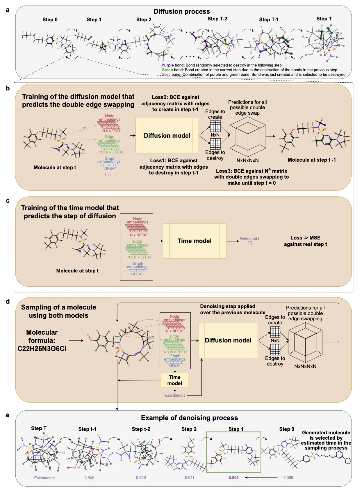
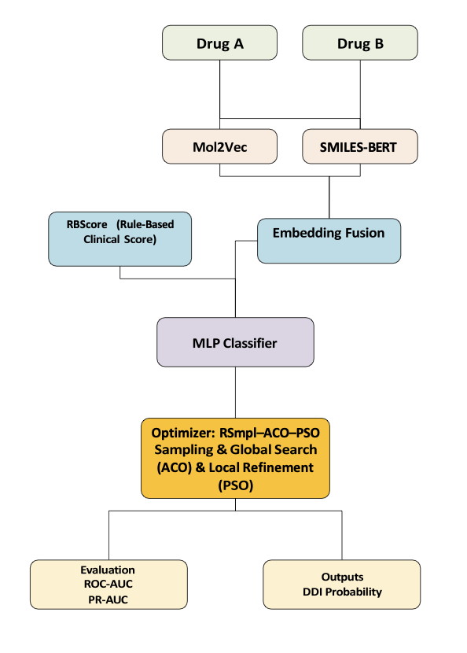
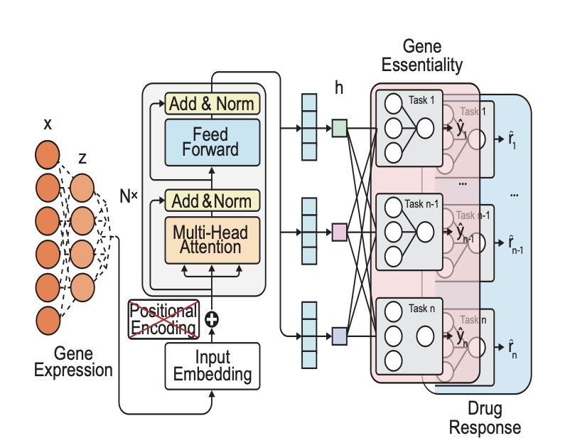

## 目录  
1. CoCoGraph 模型设计独特，能高效生成化学有效且新颖的分子，是分子生成领域的一大进步。
2. 一个混合计算框架，融合了两种分子表示方法与无标签泄露的临床评分，实现了高精度、可解释的药物相互作用预测。
3. DeepVul 模型利用转录组数据预测基因必要性和药物反应，为超越基因突变局限的精准医疗提供了新工具。

## 1. CoCoGraph：AI 造分子新标杆  
  
  

设计新药或新材料，常常需要创造全新的分子。过去，生成的分子常存在化学结构无效或缺乏新颖性的问题。  
  
研究者开发了 CoCoGraph，一个用于生成分子的协作式图扩散模型。其设计确保了生成的分子 100% 化学有效。模型采用「双边交换」方法，在整个生成过程中持续监控原子价态、分子式和化学键类型。这些化学规则被直接整合进模型，无需模型自行学习。CoCoGraph 由两个模型协作：一个扩散模型预测化学键的交换方式，一个时间模型评估生成图与真实分子的差距。两者配合，提升了生成结果的稳定性和可靠性。  
  
CoCoGraph 基础版的模型参数仅 53.4 万，比 DiGress 或 JTVAE 小一个数量级。尽管参数少，其性能表现优异。在 GuacaMol 基准测试中，CoCoGraph 的分子有效性为 100%，独特性为 99.9%，新颖性达 98.6%。它在分子特性分布的 KL 散度（Kullback-Leibler divergence）上，比 DiGress 低近一半，比 JTVAE 低九成以上，表明其生成的分子特性更接近真实分子。在 36 种分子特性的对比中，CoCoGraph FPS 版本在 23 个特性上优于 DiGress，在 33 个特性上优于 JTVAE。它在拓扑结构、电子特性和药物相似性等药物化学关键指标上表现出色。  
  
为检验生成分子的真实性，研究者进行了一项测试，邀请 102 位专家分辨真实分子和 CoCoGraph 生成的分子。专家的平均准确率仅为 62%，略高于随机猜测，表明 CoCoGraph 生成的分子真实度高，难以分辨。该模型还能在普通设备上高效生成数百万个分子。研究者已利用 CoCoGraph 构建了一个包含 820 万个新分子的公开数据集，其新颖度达 98.5%，冗余度仅为 7.1%。此外，CoCoGraph 对不同类型的分子适应性强。专家评估发现，它生成的无环或脂肪族分子与真实分子的分布几乎没有区别，证明了模型探索不同化学结构空间的能力。  
  
CoCoGraph 的优势在于，它将复杂的化学规则直接整合到生成过程中，而非让模型从数据中学习。这种内置化学约束的协作式扩散方法，能够快速、大规模地探索分子空间，同时确保每一步都符合化学原理，为分子生成领域开辟了新途径。  
  
💻Code: <http://cocograph.seeslab.net>  
📜Paper: <https://arxiv.org/abs/2505.16365>  

## 2. DDI 预测新范式：融合领域知识与 AI  
  
  

预测药物 - 药物相互作用（Drug-Drug Interaction, DDI）是药物研发和临床应用的难题。传统计算方法中，数据驱动模型如同黑箱，而基于规则的系统覆盖范围有限。一个新框架尝试融合两者优点，寻求平衡。  
  
首先，模型通过两种分子嵌入技术理解药物的化学结构：**Mol2Vec**和 **SMILES-BERT**。  
  
**Mol2Vec**将分子拆解为化学亚结构「片段」，并学习这些片段间的关系，擅长捕捉局部的结构信息。这好比通过识别乐高积木的种类和组合方式来理解一个模型。  
  
**SMILES-BERT**则将分子的 SMILES 字符串视为一种语言，利用大语言模型（Large Language Model）学习其「语法」和上下文，从而捕捉分子的全局特征。两者结合，让模型既能看到「树木」，也能看到「森林」，对药物分子的理解更加立体。  
  
框架的一个核心是名为 **RBScore**的临床评分机制。DDI 预测的一大陷阱是「标签泄露」：模型在训练时接触到不应获知的信息，导致测试表现虚高，实战失灵。  
  
为避免此问题，**RBScore**完全基于药理学知识构建，不依赖任何已知的 DDI 标签。该分数依据药物的药代动力学（PK）和药效学（PD）特性计算，例如药物是否为特定 CYP 酶的抑制剂或底物。这相当于为模型内置了一位药理学家的经验，模型在预测前会参考这份无偏见的「专家意见」，从而提升泛化能力。同时，这也增强了可解释性：当模型预测出相互作用时，可以追溯到 **RBScore**，明确是哪条药理学规则在起作用。  
  
在分类器和优化上，框架选择了轻量级分类器，而非复杂的神经网络，降低了计算成本，利于实际部署。  
  
为高效寻找最优超参数，框架采用了一个三阶段元启发式优化策略（RSmpl–ACO–PSO）。第一阶段，通过随机采样（RSmpl）在参数空间中初步筛选出潜力区域。第二阶段，利用蚁群优化（ACO）在这些区域内精细探索。第三阶段，通过粒子群优化（PSO）在最佳点附近进行最终的局部寻优。这种从全局探索到局部优化的策略，兼顾了效率与稳定性。  
  
模型在 DrugBank 数据集上取得了 0.911 的 ROC-AUC，并在一个真实的 2 型糖尿病患者队列数据中表现良好，验证了其临床应用潜力。  
  
该框架巧妙地将机器学习与领域知识结合，解决了 DDI 预测的关键痛点。其模块化设计也为未来迭代提供了空间，例如接入更先进的分子表示方法或整合电子病历数据，以实现个性化的 DDI 预测。  
  
📜Title: A Hybrid Computational Intelligence Framework with Metaheuristic Optimization for Drug–Drug Interaction Prediction  
🌐Paper: https://arxiv.org/abs/2510.09668  

## 3. DeepVul：用 Transformer 预测药物反应，精准医疗新思路  
  
  

目前的精准医疗主要依赖寻找特定的靶向基因突变，但这只对少数携带此类突变的癌症患者有效。DeepVul 旨在突破这一局限，为更广泛的患者群体寻找治疗方案。  
  
DeepVul 的思路是分析细胞的「实时工作日志」——转录组 (transcriptome)，即细胞在特定时间点所有基因的活跃程度。作者认为，这份日志比静态的基因突变更能揭示细胞的弱点。  
  
**它的工作原理是这样的**  
  
模型采用多任务 Transformer 架构，可以理解为一个能同时学习三种信息的智能系统：  
1.  **基因表达谱**：一个癌细胞系里成千上万个基因的活性水平。  
2.  **基因扰动**：当某个特定基因被「敲除」（如使用 CRISPR 技术）后，细胞发生的变化。  
3.  **药物扰动**：当细胞接触某种药物后，其状态的改变。  
  
DeepVul 的核心设计，是将这三种信息映射到统一的数学空间，即「潜在空间」 (latent space)。这迫使模型去寻找三者共通的底层生物学逻辑。例如，如果细胞系 A 的基因表达谱，与敲除基因 X 后的细胞系 B 相似，模型就会推断基因 X 可能是细胞系 A 的「阿喀琉斯之踵」。  
  
**一个出乎意料的发现**  
  
为测试模型的泛化能力，研究者进行了一项迁移学习 (transfer learning) 实验。他们先用 DepMap 项目的海量基因必要性数据训练模型，使其学习癌细胞的基本生存逻辑，然后让模型执行新任务：预测细胞对不同药物的反应。  
  
测试包含两种策略：一是微调整个模型来适应新任务；二是「冻结」负责理解基因表达谱的编码器，只训练负责预测的最后部分。  
  
结果出人意料，「冻结」编码器的策略效果更好。  
  
这一结果暗示，从基因必要性数据中学到的模式，比从药物反应数据中学到的更基础、更普适。基因必要性反映了细胞生存依赖的核心系统，是一个更纯粹、更全局的信号；而药物反应数据可能包含脱靶效应等「噪音」。这好比学习一门语言，掌握底层语法（基因必要性）比只会背诵几句日常对话（药物反应）更有效。  
  
**模型的价值**  
  
DeepVul 能为更多患者找到潜在治疗靶点。测试表明，它预测数百个基因靶点敏感性的准确度，可与现有的基于突变的方法媲美，从而扩大了潜在受益人群。  
  
模型具备可解释性。研究者能用 SHAP 等工具探究其决策依据。例如，在预测细胞对 BRAF 抑制剂的敏感性时，模型能指出是哪些基因的表达水平影响了预测结果。这对理解药物作用和耐药机制有重要价值。  
  
模型的泛化能力也得到验证。在 Broad 研究所数据上训练的模型，无需重新训练，就能直接在 Sanger 研究所的数据上取得稳健表现。这证明模型学到的是普适的生物学规律，而非特定数据集的巧合。  
  
📜**Paper**: DeepVul: A Multi-Task Transformer Model for Joint Prediction of Gene Essentiality and Drug Response  
🌐**Preprint**: https://www.biorxiv.org/content/10.1101/2024.10.17.618944v2  
💻**Code**: https://github.com/alaaj27/DeepVul.git
