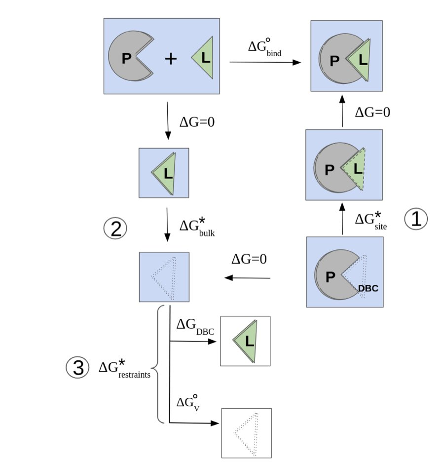
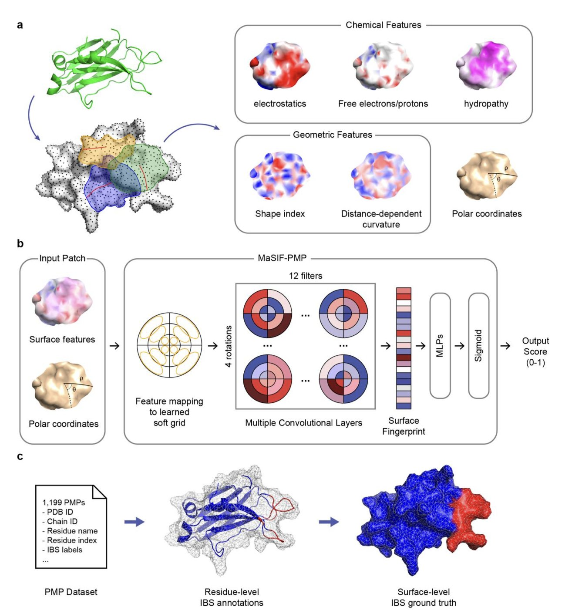
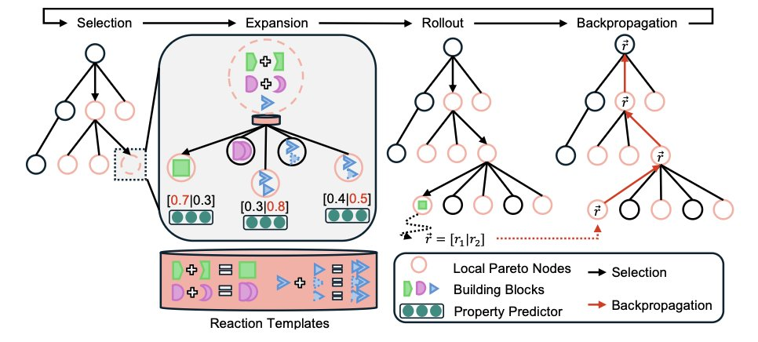

## 目录  
1. 新方法结合了极化力场和高级采样技术，能真实模拟结合口袋中水分子的动态，提升了蛋白 - 配体结合自由能的预测准确性。
2. MaSIF-PMP 模型运用几何深度学习，揭示了蛋白与膜结合的关键是其表面「形状」，为靶向外周膜蛋白的药物设计提供了新视角。
3. CombiMOTS 结合多目标优化与片段化药物设计，能够生成兼具活性和可合成性的双靶点分子。

## 1. 算准结合自由能？先搞定蛋白口袋里的「水」  
  
  

在药物发现中，预测一个小分子和靶点蛋白的结合紧密程度——即结合自由能——是决定其成药潜力的关键。但用计算机准确预测它，一直是个难题。问题的根源，往往在「水」上。  
  
蛋白的结合口袋里充满了水分子，它们是活跃的参与者。当药物分子进入，一些水分子被置换，剩下的会重新排列，形成新的氢键网络。这个过程的能量变化，是总结合自由能的重要组成部分。  
  
常用的经典力场（如 AMBER 或 CHARMM）将水分子视为带固定电荷的刚性小球，这种简化模型难以准确描述结合口袋里精细的水网络。为此，研究使用了 **AMOEBA 极化力场**（Polarizable Force Field）。可以想象，它给水分子装上了「传感器」：周围电场变化时，水分子的电子云和电荷分布也随之改变。这种模型更接近物理真实，能准确刻画水分子、蛋白和配体之间的静电相互作用。  
  
有了更准的力场，下一个挑战是如何高效探索所有可能的水分子构象。这是一个巨大的采样空间，直接用分子动力学模拟（Molecular Dynamics, MD）如同大海捞针。研究者采用了一套组合方法：**Lambda-ABF-OPES**。  
  
它的工作原理如下：  
1.  首先，用 lambda-dynamics 这种炼金术自由能计算方法，平滑地「开启」或「关闭」配体与环境的相互作用。  
2.  然后，引入**自适应偏置力**（Adaptive Biasing Force, ABF）和**概率增强采样**（On-the-fly Probability Enhanced Sampling, OPES）这两种增强采样技术。它们像向导，引导模拟去探索能量较高但重要的区域，比如水分子重排的过渡态。  
  
这套方法不需要定义水分子本身的**集合变量**（Collective Variables），省去了实际操作中的麻烦，使其更具普适性。  
  
研究者在一系列蛋白 - 配体复合物上验证了该方法，包括配体深埋口袋的复杂体系。计算出的结合自由能与实验值吻合良好。以 **TAF1(2) 布罗莫结构域**（bromodomain）为例，该方法算准了亲和力，并揭示了口袋中关键水分子如何通过动态行为影响配体结合。这表明该方法能给出准确的数值，并提供机理层面的洞见。  
  
这项工作针对计算药物化学的核心难题——溶剂化效应，结合了精确的物理模型（AMOEBA）和高效的采样算法（Lambda-ABF-OPES），提供了一个可靠的工具。在药物研发早期，准确预测分子结合亲和力，可以加速先导化合物的筛选和优化，减少试错成本。  
  
📜**Title**: From Water Networks to Binding Affinities: Resolving Solvation Dynamics for Accurate Protein-Ligand Predictions  
🌐**Paper**: <https://www.biorxiv.org/content/10.1101/2025.10.17.683050v1>  

## 2. AI 新模型 MaSIF-PMP：精准预测蛋白 - 膜相互作用  
  
  

在药物研发中，外周膜蛋白 (Peripheral Membrane Proteins, PMPs) 是一类棘手的靶点。它们缺乏固定的结合口袋，直接与动态变化的细胞膜相互作用。要预测这种结合界面，如同精确描述一艘船在波涛海面上的摇晃轨迹。  
  
一个名为 MaSIF-PMP 的几何深度学习模型为此提供了新思路。我们可以把这个模型的工作方式，想象成训练一个 AI 去识别蛋白质表面的 3D 地形图。模型重点关注蛋白质表面的几何特征，如凹凸、沟壑和曲率。  
  
这项研究发现，外周膜蛋白与细胞膜的结合，主要由几何形状决定。研究者通过特征消融实验验证了这一点：从 MaSIF-PMP 模型中移除化学特征，预测准确率下降有限；但移除几何特征后，预测结果显著变差。这证明，蛋白质能否结合细胞膜，主要取决于其表面形状是否匹配，就像钥匙的形状必须先对上锁孔，材质是次要的。  
  
静态的蛋白质晶体结构不足以做出准确预测，因为蛋白质和细胞膜都在不断运动。为了验证和优化预测，研究者引入了分子动力学 (Molecular Dynamics, MD) 模拟。  
  
他们使用 HMMM (highly mobile membrane-mimetic) 简化膜模型进行模拟。这个模型能模拟出细胞膜流动性的核心特性，计算成本却远低于完整的细胞膜模拟。MD 模拟让研究者得以观察蛋白质接近并结合细胞膜的动态过程。这些动态信息验证了 MaSIF-PMP 的预测，还帮助修正了训练数据中的不准确标注，从而提升了模型性能。  
  
对于药物研发人员，这个工具的价值在于其直观的预测方式。MaSIF-PMP 直接输出一张蛋白质表面「热力图」，标示出最可能的结合区域。这张图让我们能识别出潜在的药物结合位点，为设计调控蛋白 - 膜相互作用的小分子药物提供了具体指导，帮助药物研发从「猜测」走向「精确定位」。  
  
📜Title: Decoding protein–membrane binding interfaces from surface-fingerprint-based geometric deep learning and molecular dynamics simulations  
🌐Paper: https://www.biorxiv.org/content/10.1101/2025.10.14.682447v1  

## 3. AI 生成双靶点分子，还保证能合成  
  
  

双靶点药物的发现如同走钢丝。分子需要同时与两个靶点结合，还要满足溶解度、渗透性等多种成药性（drug-likeness）要求，并且最终必须能够被合成。许多计算模型设计的分子看似完美，却常因无法合成而被化学家放弃。  
  
CombiMOTS 方法旨在解决这一核心痛点，在分子设计的起点就融入了「可合成性」这一关键考量。  
  
它的工作原理如下。  
  
首先，该方法的核心是帕累托蒙特卡洛树搜索（Pareto Monte Carlo Tree Search, PMCTS）框架。在分子设计中，提升对靶点的亲和力可能会降低溶解度，这类多目标冲突是常态。PMCTS 会同时探索多种分子构建路径，并保留所有「非劣」解。「非劣」解是指不存在任何其他方案在所有评价指标上都优于它的方案。最终，算法会提供一组位于「帕累托前沿」的分子，它们代表了不同目标间的最佳权衡（trade-off），供研发团队选择。  
  
该方法通过基于片段的方式来保证可合成性。它构建分子所用的化学片段，都直接映射到 Enamine REAL Space 数据库。这个数据库包含了数十亿种能通过成熟化学反应快速合成的虚拟化合物。因此，CombiMOTS 拼接出的每个分子，其合成路线从设计之初就基本明确，连接了计算设计与实验室合成，避免了「纸上谈兵」的困境。  
  
研究人员在 GSK3β-JNK3、EGFR-MET 和 PIK3CA-mTOR 等双靶点组合上验证了该方法。结果表明，与现有方法相比，CombiMOTS 生成的分子在新颖性、多样性和药理特性均衡方面表现更优。  
  
这个框架具有良好的扩展性，可以加入选择性、毒性等更多可量化的优化目标。这种从源头整合多目标优化与可合成性的思路，使 AI 辅助药物设计成为帮助化学家解决实际问题的有效工具。  
  
📜Title: CombiMOTS: Combinatorial Multi-Objective Tree Search for Dual-Target Molecule Generation  
🌐Paper: https://raw.githubusercontent.com/mlresearch/v267/main/assets/southiratn25a/southiratn25a.pdf
