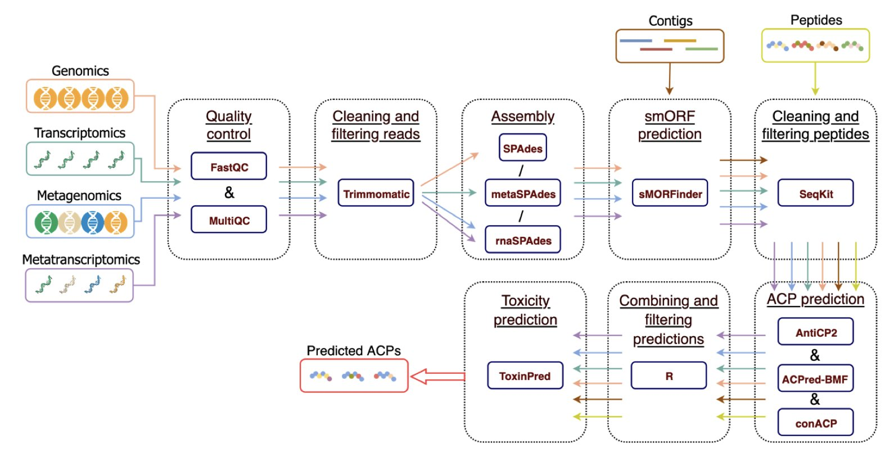
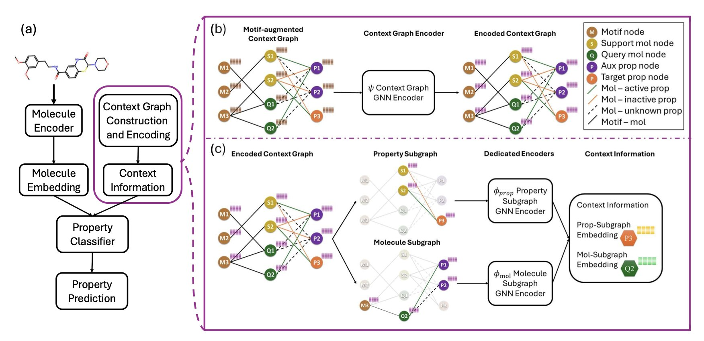
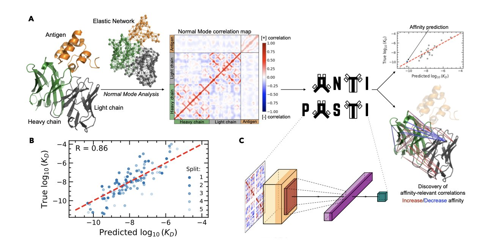

## 目录  
1. MetaPepticon 是一套全自动生物信息学流程，能从海量微生物基因组数据中，高效筛选出新型抗癌肽（Anticancer Peptides, ACPs）。它整合了多种预测算法，提高了发现效率。
2. M-GLC 通过融合全局化学基元知识和局部近邻分子信息，提升了少样本场景下的分子属性预测能力。
3. 可解释的机器学习模型，通过整合抗体结构信息，能精确预测其关键性质并揭示作用机理。

## 1. 微生物组淘金：MetaPepticon 自动发现抗癌肽  
  
  

微生物组是生物活性肽的宝库，但从中筛选目标分子如同大海捞针。传统的生物信息学方法需要手动组合多个工具，流程繁琐、效率低且易出错。  
  
MetaPepticon 将发现抗癌肽的全过程整合成一条自动化流水线。  
  
它的工作原理如下：  
  
首先，用户只需输入原始测序数据，无论是基因组、宏基因组还是转录组，流程会自动完成数据质量控制等预处理工作。  
  
核心环节是预测。MetaPepticon 同时调用 AntiCP2.0、ACPred-BMF 和 ConACP 三个独立的预测工具，如同专家会诊。只有当多个工具（数量阈值可调）一致认为某个肽有抗癌潜力时，它才会被选为候选物。这种共识策略能降低假阳性，使筛选结果更可靠。  
  
最后，流程还会进行毒性预测，自动剔除对人体细胞有潜在毒性的分子，确保候选药物的临床应用价值。  
  
研究团队使用该流程分析了 41,171 个微生物基因组和超过 400 万个肽序列。他们发现了 79,587 个新的候选抗癌肽，其中 13,149 个是经过严格筛选、无已知毒性的高置信度候选物。  
  
这组数据证明 MetaPepticon 是一个可规模化的发现引擎。药物研发人员可以利用它从海量微生物数据中快速获得高质量的先导化合物，缩短早期探索周期。  
  
该工具开源，每个模块都封装在独立的 Conda 环境中，保证了研究结果的可复现性，为探索微生物肽库提供了新的可能。  
  
📜Title: MetaPepticon: automated prediction of anticancer peptides from microbial genomes and metagenomes  
🌐Paper: https://www.biorxiv.org/content/10.1101/2025.10.28.685052v1  

## 2. M-GLC: 用化学基元破解少样本预测难题  
  
  

在药物发现的早期阶段，数据总是很稀少。针对一个新靶点，可能只测试了几十个化合物的活性，就需要决定下一步的优化方向。这种「少样本」困境，是计算模型预测分子属性的一大挑战。爱荷华州立大学的研究者提出了 M-GLC 方法来应对此问题。  
  
M-GLC 的核心思路是把化学家的「化学直觉」教给模型，也就是识别官能团和骨架的能力。化学家看到新分子时，会将其拆解成熟悉的片段（基元，motifs），并根据这些片段的已知性质来推断整个分子的性质。M-GLC 模仿了这个过程。  
  
研究者构建了一个三方异构图 (tri-partite heterogeneous context graph)。这个图可以理解为一个关系网络，包含三种节点：分子、化学基元和属性。例如，一个激酶抑制剂分子，会被连接到其核心骨架「喹唑啉」基元，同时也被连接到「高活性」属性上。通过这张关系网，模型能学到「喹唑啉」骨架与「高活性」之间的关联。当遇到一个全新的含「喹唑啉」骨架的分子时，模型也能据此做出预测。这实现了知识迁移。  
  
M-GLC 结合了全局和局部两种视角。全局视角从所有分子和基元的关系中学习普适的化学规律，就像通读一本化学教科书。为了捕捉构效关系 (SAR) 的局部特性——即特定骨架的规律可能不适用于其他骨架——M-GLC 引入了局部视角。它构建一个「局部专注子图」 (local-focus subgraph)，只关注与目标分子最相似的邻居分子及它们共享的基元。这好比优化某个化学系列时，只分析该系列化合物的 SAR 数据。这种全局与局部结合的设计，让模型既能掌握普适规律，又不忽略局部细节。  
  
在技术实现上，由于图中的基元节点数量远超分子节点，信息传递时会产生信号不平衡。为此，模型采用了一种「结构感知的边加权聚合」 (structure-aware edge-weighted aggregation) 机制来平衡来自不同节点的信息，避免基元和分子的信号相互影响。  
  
在五个标准的少样本预测基准数据集上，M-GLC 的表现超过了现有最优方法。在数据稀疏的场景下，将化学基元这类先验知识显式地编码到模型架构中，是一条有效的技术路径。  
  
📜Title: M-GLC: Motif-Driven Global-Local Context Graphs for Few-shot Molecular Property Prediction  
🌐Paper: https://arxiv.org/abs/2510.21088  

## 3. AI 预测抗体：从黑箱到可解释的结构洞见  
  
  

抗体药物研发需要知道一个抗体为何能结合。传统的机器学习（Machine Learning, ML）模型通常是黑箱，只给出结果，不解释原因，这无法满足科研和药物开发的需求。一项新研究介绍了两种机器学习框架，旨在打开这个黑箱。  
  
研究人员开发了 ANTIPASTI 和 INFUSSE 两个模型，它们的目标不同，但都将抗体的三维结构信息融入预测过程。  
  
ANTIPASTI 模型预测抗体与抗原的整体结合亲和力。它将抗体 - 抗原复合物视为一个由氨基酸（节点）和相互作用（弹簧）组成的弹性网络模型（Elastic Network Models），再用一个卷积神经网络（Convolutional Neural Network, CNN）学习该网络的动态特性，理解复合物结合时的动态变化。该模型预测的亲和力与实验数据的皮尔逊相关系数达到 0.86。  
  
INFUSSE 模型关注单个氨基酸残基的灵活性，即 B-factor。它结合了序列信息和基于三维结构的几何图谱，通过图卷积网络（Graph Convolutional Network, GCN）处理。模型不仅考虑氨基酸本身，也分析它在空间中的邻居及其距离。该方法预测 B-factor 的相关系数为 0.71。  
  
这两个模型的核心优势是可解释性，它们提供的不仅仅是预测数值。  
  
ANTIPASTI 能够反向分析，指出复合物中对结合贡献最大的区域。分析结果不仅指向了已知的互补决定区（CDR）环，也发现了一些框架区的重要作用。这为蛋白工程改造提供了直接线索。  
  
INFUSSE 通过消融分析证明了结构信息的重要性。当研究人员从模型中移除结构信息（图谱），只使用序列进行预测时，模型性能大幅下降。这说明氨基酸的行为在很大程度上由其三维空间环境决定。  
  
这项工作推动了抗体发现的计算方法。未来的工具需要能解释其预测逻辑，才能被整合进药物设计流程。下一步是将这类可解释的预测模型嵌入更大规模的抗体设计自动化流程，让计算机在生成新分子的同时，也能解释其设计原理。  
  
📜Title: Machine learning approaches for interpretable antibody property prediction using structural data  
🌐Paper: https://arxiv.org/abs/2510.23975
