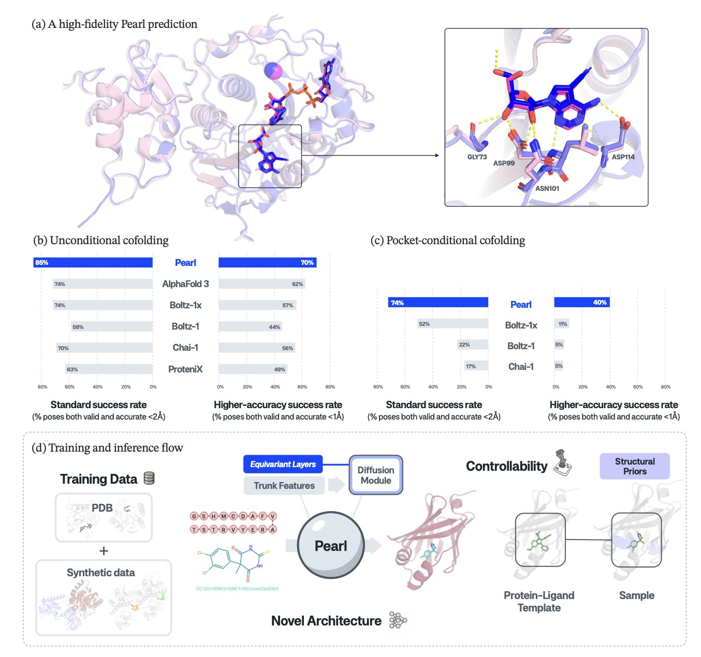
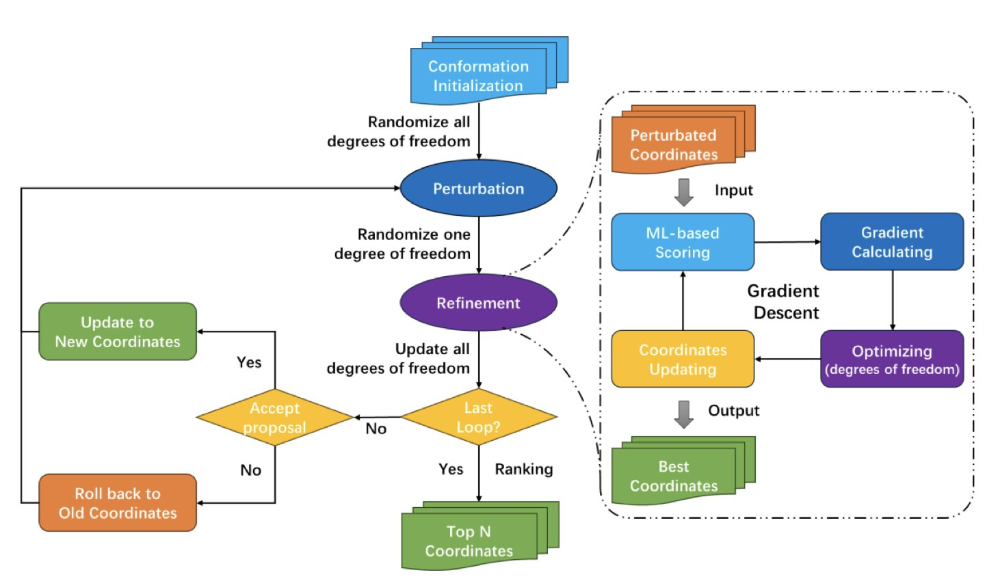
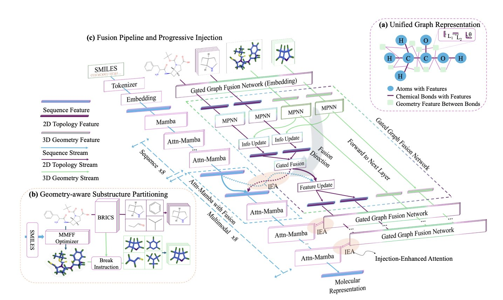

## 目录  
1. Pearl 通过海量合成数据训练和感知物理对称性的架构，实现了对蛋白质 - 配体复合物结构的高精度预测，在药物化学家最关心的亚埃级精度上远超现有模型。
2. TriDS 将口袋识别、构象搜索和打分功能整合进一个 AI 原生流程，解决了传统分子对接效率低、物理真实性差的问题。
3. MuMo 融合了不稳定的 3D 构象与可靠的 2D 拓扑结构，为分子表征学习提供了更稳定、强大的基础。

## 1. Pearl AI：精准定位每个原子，超越 AlphaFold 3  
  
  

药物发现离不开蛋白质 - 小分子对接（Docking），但这几十年来一直是个难题。现有软件的核心思路陈旧，预测结果常常不准确，浪费了大量时间和计算资源。  
  
Genesis Molecular AI 团队推出的 Pearl 模型，正致力于解决这个问题。  
  
首先，Pearl 解决了数据稀缺的痛点。模型训练通常依赖 PDB 数据库的实验数据，但其数量有限且存在偏好，多集中于热门靶点。Pearl 采用了一个直接的策略：用海量**合成数据**进行训练。这让模型能够学习底层的物理化学规律，而不只是记忆已知的结合模式。因此，当面对新靶点或新化学骨架时，它的预测能力理论上更强。  
  
其次，是模型的架构设计。Pearl 的架构包含一个 SO(3) 等变扩散模块，这个模块内置了三维空间的物理规则。分子在空间中任意旋转，其本身性质不变。许多旧模型需要从数据中艰难学习这一基本事实，而 Pearl 的架构将「旋转不变性」直接写入代码。这让模型可以将计算资源集中于捕捉决定结合模式的精细相互作用，生成的构象也更符合物理规律，避免了原子位置冲突等低级错误。  
  
研究者在多个公开基准测试集上，将 Pearl 与 AlphaFold 3 等顶尖模型进行了比较。在强调物理合理性的 PoseBusters 测试中，Pearl 的成功率达到 84.7%。  
  
对于药物化学家而言，最关键的数据是：在 RMSD 小于 1Å 的高精度标准下，Pearl 的性能是其他模型的近 **4 倍**。  
  
在药物设计中，RMSD 小于 1Å 的精度至关重要。它能精确揭示一个氢键的有无，或一个苯环的朝向。相比之下，2Å RMSD 的构象只能提供模糊的方向，而小于 1Å 的构象则能直接指导化学家优化哪个基团、填充哪个空腔。这种精度的提升是药物设计能力的一次飞跃。  
  
最后，Pearl 支持「模板」功能。如果缺少目标蛋白与配体的复合物结构，但拥有该蛋白与类似配体的结构，或同源蛋白的结构，Pearl 可以将这些信息作为模板，提高预测的准确性。这个功能贴合了药物研发的实际工作流程。  
  
Pearl 的设计从数据源、模型架构到应用场景都经过了精心考量，旨在解决药物对接领域的根本难题。它在真实工业项目中的表现，尤其是在处理复杂数据和非理想情况时的稳定性，将是接下来的看点。  
  
📜Paper: A Foundation Model for Placing Every Atom in the Right Location  
🌐Paper: https://arxiv.org/abs/2405.18973  

## 2. TriDS：AI 原生分子对接，统一高效  
  
  

传统的分子对接（Molecular Docking）流程繁琐，需要分步进行：先用一个程序预测蛋白上的结合口袋，再用另一个程序尝试放入小分子的各种构象（构象采样），最后可能还要换个打分函数重新评估最佳构象。这个过程环环相扣，一步出错就可能影响全局，如同一个多级火箭，任何一级故障都会导致任务失败。  
  
TriDS 的目标就是将这个多级流程，整合成一个单一、高效的 AI 原生框架。  
  
**工作原理是这样的**  
  
TriDS 的核心是一个基于机器学习的可微打分函数（differentiable scoring function）。它就像一个智能导航系统。传统对接方法如同在黑暗中摸索，随机尝试分子的各种构象再评估好坏。TriDS 的导航系统则能根据打分函数实时反馈的「梯度」信息，直接引导分子朝能量更低、结合更稳定的方向移动和旋转。这种目标导向的搜索方式，大幅提升了构象采样的效率。  
  
**解决了 AI 对接的老大难问题**  
  
单纯的机器学习对接模型，有时会生成一些分数很高但在物理上不可能的构象，比如原子间距过近，发生「冲突」。这是模拟中需要绝对避免的。  
  
TriDS 的巧妙之处在于，它在机器学习的打分函数中，加入了专门惩罚原子冲突的解析式打分项（analytic scoring function terms）。这相当于给智能导航系统下达了一条「禁止碰撞」的指令，保证了生成构象的物理真实性，让 AI 结果更可靠。  
  
**对大分子尤其友好**  
  
近年来，PROTAC、大环分子等大分子药物越来越多。传统对接工具因其巨大的构象空间而难以处理。测试表明，TriDS 在处理这类柔性大分子时，其对接准确率和生成构象的物理合理性，都优于其他非重打分方法。这对新一代药物的发现是个好消息。  
  
从实用性看，TriDS 的计算效率高，GPU 内存占用低，运行速度快。它还支持多种文件格式，解析成功率高。这些特点使它成为一个能在日常研发中应用的实用工具，而非仅仅用于发表论文。  
  
📜Title: TriDS: AI-native molecular docking framework unified with binding site identification, conformational sampling and scoring  
🌐Paper: https://arxiv.org/abs/2510.24186v1  

## 3. MuMo: 融合 2D/3D 分子结构，解决 AI 药物发现核心难题  
  
  

分子的 3D 构象包含决定其功能的空间信息。但分子本身具有柔性，单一的低能构象快照无法代表全部。模型若依赖单一、可能不可靠的 3D 结构进行训练，风险很高。MuMo 框架正是为解决这个问题而设计。  
  
它的核心思路是，将不可靠的 3D 信息与可靠的 2D 拓扑结构（分子连接图）结合，创建一个更稳健的「结构先验」。  
  
**第一步：打造更可靠的分子「蓝图**」  
  
研究者设计了「结构化融合管道」（Structured Fusion Pipeline, SFP）模块。它的工作原理如下：  
1.  接收分子的 2D 连接图和一组 3D 坐标。  
2.  通过一个两步消息传递机制，同时在 2D 图和 3D 空间中传播信息。这如同你不仅掌握了一张城市路网图（化学键），还知道了每个路口（原子）的精确 GPS 坐标（3D 位置）和彼此间的距离。  
3.  SFP 融合这两种信息，生成一个统一、稳定的结构表征。这个表征既包含原子连接关系，也包含空间排布，但不过度依赖某个特定 3D 构象，从而得到一份比单独使用 2D 或 3D 更可靠的分子「蓝图」。  
  
**第二步：将结构信息渐进注入模型**  
  
有了高质量的蓝图，如何有效利用它是个问题。如果一开始就将所有结构信息灌输给序列模型（如处理 SMILES 字符串的模型），可能会干扰模型对序列本身的学习，导致「模态坍塌」——即模型过度依赖某一信息源。  
  
MuMo 采用「渐进式注入」（Progressive Injection, PI）机制。  
这是一个非对称过程：先让序列模型学习几层，掌握 SMILES 字符串的基本语法和上下文，如同学生先掌握单词句型。  
然后，再将 SFP 生成的结构蓝图逐层注入序列模型。结构信息因此成为高阶指导信号，用于丰富和修正序列模型已有的知识，而不是从一开始就主导学习过程。  
  
**效果怎么样**？  
  
MuMo 在横跨 TDC 和 MoleculeNet 的 29 个基准任务上，平均性能提升 2.7%，并在其中 22 个任务上排名第一。  
  
模型在 LD50（半数致死剂量）预测任务上表现最突出，性能提升了 27%。LD50 是衡量毒性的经典指标，预测难度大，且对分子 3D 形状敏感。在这一任务上的显著进步，说明 MuMo 的融合策略抓住了关键，让模型对分子结构的理解更深刻、更鲁棒。  
  
MuMo 的设计思路清晰。它通过融合 2D 和 3D 信息，创造了一个对 3D 构象噪声不敏感的稳定表征。这种思路对开发更可靠的 ADMET 预测模型和其他构效关系模型有重要参考价值。  
  
📜Title: Structure-Aware Fusion with Progressive Injection for Multimodal Molecular Representation Learning  
🌐Paper: https://arxiv.org/abs/2510.23640v1
