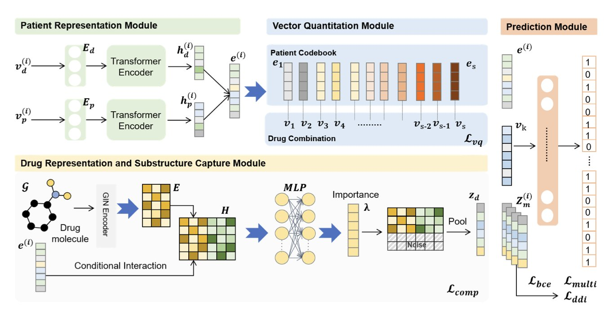
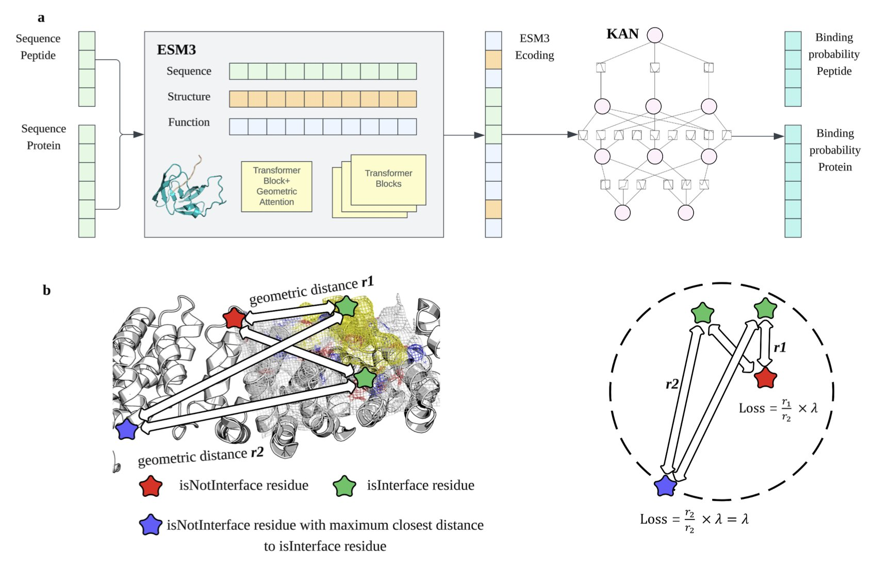
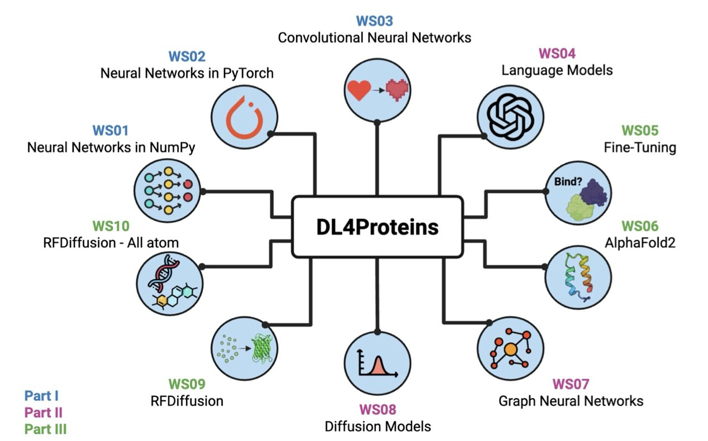

## 目录  
1. SubRec 结合药物的化学亚结构与患者的电子病历，提供更精准、安全的个性化用药推荐。
2. GeoPep 利用 ESM3 模型的迁移学习能力，并结合 Kolmogorov-Arnold 网络，实现了在缺乏结构数据情况下对蛋白 - 多肽结合位点的高效精准预测。
3. 约翰霍普金斯大学的研究者开发了一套名为 DL4Proteins 的交互式 Jupyter Notebook 教程。该教程依托 Google Colab 平台，让全球学生和研究者都能免费使用前沿 AI 工具，学习和实践蛋白质结构预测与设计。

## 1. SubRec：融合药物亚结构与病历，实现个性化用药  
  
  

个性化用药推荐需要平衡患者复杂的病史和药物的安全性与有效性。现有推荐系统大多只关注病历数据，忽略了药物自身的化学性质。  
  
为应对这一挑战，研究者开发了 SubRec 模型。其核心思路是关联药物的化学亚结构与患者的电子病历（Electronic Health Records, EHRs）。药物的疗效源于其分子结构中的特定功能片段，SubRec 旨在发现这些关键片段与特定病情之间的关系。  
  
SubRec 采用条件信息瓶颈（conditional information bottleneck）技术，从繁杂的药物化学结构信息中，筛选出对当前患者病情最关键的亚结构。这让推荐的药物不仅数据匹配，作用机理也更易于医生理解，避免了推荐过程的「黑箱」化。  
  
模型还应用了自适应矢量量化机制。该技术将海量的「患者 - 药物」配对数据，聚合成少数有代表性的「原型」，如同将众多治疗方案归纳为几种经典模式。此举减少了模型训练的计算量，并增强了推荐过程的可控性。  
  
在 MIMIC III 和 IV 大型医疗数据集上的测试表明，SubRec 推荐的药物与医生处方高度一致，且引发潜在药物相互作用（drug-drug interaction）的风险更低，提升了用药安全性。即使在患者历史数据有限的情况下，模型依然表现稳定。  
  
SubRec 为个性化用药推荐提供了新思路：将药物的化学本质与患者的临床数据结合，才能实现智能且负责任的推荐，推动精准医疗的发展。  
  
📜Title: Integrating Drug Substructures and Longitudinal Electronic Health Records for Personalized Drug Recommendation  
🌐Paper: https://openreview.net/pdf/cfeb68d239f6c491e79abd9c1456eb7a7a3cd836.pdf  

## 2. GeoPep：用几何感知模型预测蛋白 - 多肽结合位点  
  
  

在药物研发中，当高质量的结构数据有限时，寻找蛋白质上的多肽结合位点十分困难。由于通常只有蛋白质的一级序列而缺乏精确的三维结构，计算预测面临挑战。一个名为 GeoPep 的新工具试图解决这个问题。  
  
GeoPep 的核心思路是利用 ESM3 的能力。ESM3 是一个多模态蛋白质基础模型，已学习了海量蛋白质序列和结构信息，对蛋白质语言有深刻理解。GeoPep 借用 ESM3 强大的预训练表示能力，针对预测蛋白 - 多肽结合位点这个特定任务进行微调。  
  
为了让模型更高效地从有限数据中学习复杂结合模式，研究者采用了 Kolmogorov-Arnold 网络 (Kolmogorov-Arnold Networks, KANs)。KANs 的参数效率更高，能用更少参数捕捉更复杂的关系。在数据稀疏的情况下，这一点能有效避免模型过拟合，提升预测准确性。  
  
预测结合位点不仅需要确定参与结合的氨基酸，还要明确它们在三维空间中的位置关系。可靠的结合位点通常由空间上邻近的氨基酸残基组成连续表面。为保证预测结果的几何合理性，GeoPep 在训练中加入一个基于距离的损失函数。该函数会惩罚那些空间距离很远但被预测为结合位点的氨基酸组合，从而确保最终预测的结合位点在三维结构上连续且真实。  
  
评估指标显示，GeoPep 的表现超越了现有方法。它能在没有明确结构输入的情况下，准确圈定蛋白质上的多肽结合区域，这对设计新的多肽药物或抑制剂具有潜力。  
  
📜Paper: GeoPep: A geometry-aware masked language model for protein-peptide binding site prediction  
🌐Paper: https://arxiv.org/abs/2510.27040v1  

## 3. AI 赋能蛋白质设计：免费交互式教程 DL4Proteins  
  
  

### 核心观点：  

人工智能（AI）在蛋白质结构预测和设计领域日益重要。然而，AlphaFold2 等先进 AI 模型通常需要图形处理器（GPU, Graphics Processing Unit）等强大的计算资源，这对许多学生和实验室构成了障碍。  
  
为应对此问题，约翰霍普金斯大学的研究者开发了在线教程 DL4Proteins。他们将复杂的 AI 模型和代码封装在交互式 Jupyter Notebook 中，并托管于 Google Colab。用户只需一个浏览器，便可利用 Google Colab 提供的免费 GPU 云资源，运行这些先进模型，亲自实践蛋白质结构预测和全新蛋白质的从头设计。  
  
教程内容设计系统，如同精心安排的课程。它从神经网络等基础概念入手，帮助学习者理解机器学习原理，随后深入介绍 AlphaFold2 和各类扩散模型等深度学习架构。这条学习路径对不同背景的学习者都适用，无论是编程新手还是希望应用 AI 技术的化学家，都能顺利开始。  
  
每个 Notebook 都包含提问、可视化图表和实际案例，引导学习者在动手操作中理解模型设计背后的原理。这种实践与学习结合的方式，比单纯阅读更有效。在约翰霍普金斯大学的试点教学中，编程经验较少的学生也能快速上手，并利用这些工具完成项目。  
  
该项目会持续更新，随着 AI 领域新模型的出现，DL4Proteins 也会加入相应的新教程，确保内容紧随领域前沿。  
  
📜论文标题：DL4Proteins Jupyter Notebooks Teach how to Use Artificial Intelligence for Biomolecular Structure Prediction and Design  
🌐论文地址：https://arxiv.org/abs/2511.02128v1
