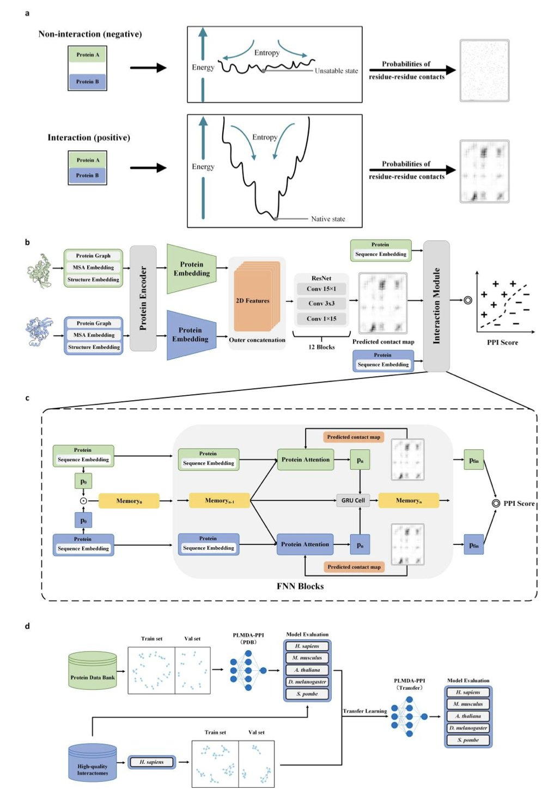
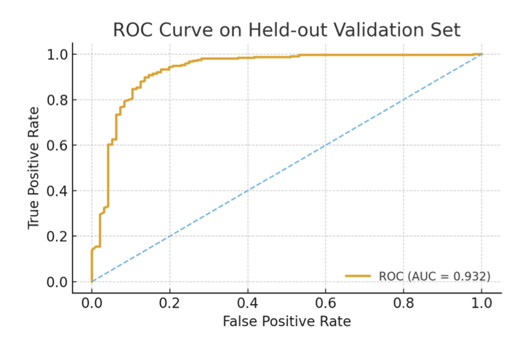
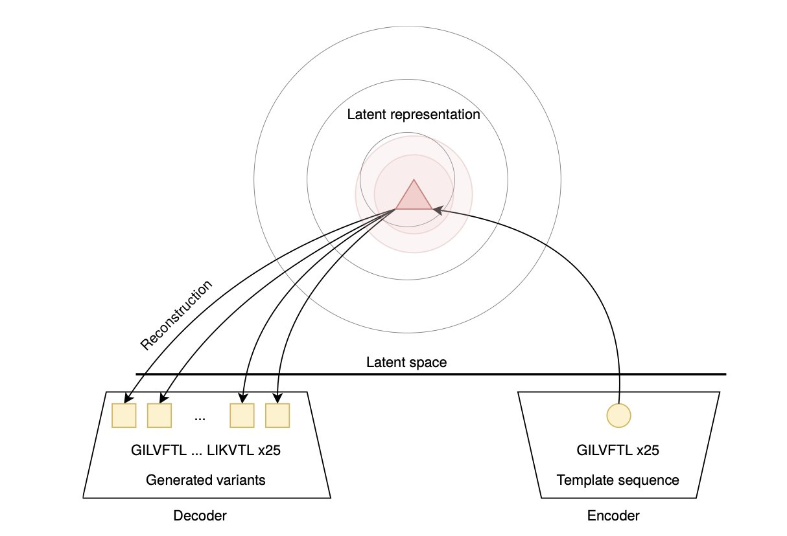

## 目录  
1. PLMDA-PPI 模型引入残基接触预测，提升了蛋白互作预测的准确性，并揭示了互作的物理机制，在预测全新蛋白时展现出很强的泛化能力。
2. 这个新模型仅用分子指纹就能准确预测血脑屏障通透性，为中枢神经系统（CNS）药物筛选提供了简单、可解释的实用工具。
3. 深度学习模型，特别是 Wasserstein 自编码器 (WAE)，在生成多样且有效的新型抗菌肽 (AMP) 序列方面表现出色，为应对耐药菌挑战提供了新工具。

## 1. AI 预测蛋白互作：双重注意力机制带来新突破  
  
  

预测蛋白质之间的相互作用 (Protein-Protein Interactions, PPIs) 是药物发现的基础。通常，我们只有蛋白质的氨基酸序列。传统方法依赖序列比对，一旦遇到序列新颖的蛋白质，效果就会大打折扣。这好比仅凭简历判断两个人能否成为朋友，忽略了他们具体的性格和兴趣是否匹配。  
  
PLMDA-PPI 模型提供了一个新思路。它不仅判断「两个蛋白质会不会相互作用」，还进一步预测「它们通过哪些具体的氨基酸残基接触来相互作用」。这就如同不仅判断两人能否交朋友，还要找出他们能聊到一起的共同话题。  
  
为实现这一目标，研究者设计了一个精巧的模型架构。他们从蛋白质数据库 (Protein Data Bank, PDB) 中提取已有三维结构、接触位点明确的蛋白质对，作为训练模型的「标准答案」。  
  
模型的核心是一个双重注意力 (Dual Attention) 模块，其工作流程如下：  
  
1.  **残基接触预测**：模型首先预测两个蛋白质序列之间，哪些氨基酸残基对最可能在空间上紧密接触。  
2.  **互作判断**：模型再将这些预测出的「接触点」作为关键线索，判断这两个蛋白质整体上是否发生相互作用。  
  
这种设计迫使模型学习蛋白质相互作用的物理基础，即残基层面的接触模式。它不再是简单记忆序列相似的蛋白质会结合，而是学会了识别促成结合的关键结构特征。  
  
实验结果证明了该方法的优势。在处理与训练集序列差异巨大的新蛋白质时，PLMDA-PPI 的表现远超 D-SCRIPT 和 Topsy-Turvy 等依赖序列信息的方法。它的性能甚至优于 AlphaFold2-Complex 这类需要大量计算资源进行结构预测的方法，且速度快得多。  
  
研究者还进行了一项微调 (fine-tuning) 实验，用人类的 PPI 数据训练模型后，发现其预测其他物种（如酵母、果蝇）PPI 的准确率也随之提高。这表明模型学到的是跨物种的普适生物物理原理，而非特定物种的规则。  
  
这个工具对药物研发很有价值。它能筛选可能相互作用的蛋白质靶点，并直接指出潜在的结合界面。这为设计小分子或多肽药物来调控这些相互作用提供了具体指导，如同获得了一张精确的「藏宝图」。  
  
📜Title: Mechanism-Aware Protein-Protein Interaction Prediction via Contact-Guided Dual Attention on Protein Language Models  
🌐Paper: https://www.biorxiv.org/content/10.1101/2025.07.04.663157v4  

## 2. AI 新模型预测血脑屏障，分子指纹破解入脑难题  
  
  

中枢神经系统（CNS）药物研发，总要和血脑屏障（Blood-Brain Barrier, BBB）这个「守门员」打交道。一个分子想进入大脑发挥作用，首先得过它这一关。几十年来，我们依赖经验法则和理化性质描述符（如脂溶性、极性表面积）来预测分子能否「通关」，但这些方法总感觉隔了一层。  
  
一项新研究提供了更直接的思路。研究者建立了一个机器学习模型，直接使用分子的「指纹」（molecular fingerprints）作为输入。  
  
分子指纹可以想象成一个分子结构的清单，上面列出了分子包含的所有微小化学碎片，比如有没有苯环、有没有羧基。模型直接分析这些原始结构信息。这种方法的优势在于，模型直接从分子结构本身学习规律，无需预先判断哪些理化性质重要。  
  
研究者使用了 XGBoost（Extreme Gradient Boosting）算法，并采用 SMOTE 技术处理数据不平衡问题。由于药物库中能穿过血脑屏障的分子是少数，SMOTE 确保了模型不会因负样本过多而产生偏见。  
  
模型的交叉验证 ROC-AUC 值达到 0.897，在独立验证集上为 0.932。  
  
除了准确度，模型的验证过程和可解释性更有价值。研究者用一些我们熟悉的分子测试了模型。例如，咖啡因和地西泮（安定）是典型的 CNS 药物，模型准确预测它们可以通过血脑屏障。对于多巴胺和左旋多巴，模型则判定它们无法通过被动扩散穿过。  
  
这个结果符合化学直觉。左旋多巴无法直接进入大脑，需要转运蛋白协助，这也是帕金森病的治疗策略之一。模型能做出这种区分，表明它学到了关于被动扩散的底层化学逻辑。  
  
模型的价值还在于其可解释性。它能明确指出哪些分子「指纹」，即具体的化学子结构，对血脑屏障的通透性影响最大。这为药物化学家提供了具体的设计思路。如果模型指出某个基团是「入脑」的障碍，就可以在下一轮分子设计中尝试修饰或替换它。  
  
模型目前主要针对被动扩散，即分子自身穿过细胞膜的能力，尚不能处理需要主动转运蛋白的分子。未来的研究方向是整合转运蛋白数据或分子的三维构象信息。  
  
这项工作提供了一个高效、可复现且可解释的基线模型，能直接应用于早期虚拟筛选流程，加速从海量分子中发现有潜力的 CNS 药物候选者。  
  
📜Title: Fingerprint-Based Explainable Machine Learning for Predicting Blood–Brain Barrier Permeability  
🌐Paper: https://www.biorxiv.org/content/10.1101/2025.10.25.684495v1  

## 3. AI 设计抗菌肽：WAE 模型脱颖而出  
  
  

抗生素耐药性日益严峻，亟需新的应对手段。抗菌肽（Antimicrobial Peptides, AMPs）是一种很有前景的方案，它们是天然存在的小段蛋白质，能有效对抗病原体。传统上，发现和优化这些肽链的过程耗时费力，而深度学习，特别是生成模型，正在加速这一进程。  
  
这个过程好比训练一个 AI 写诗。我们先用大量已知的活性抗菌肽序列训练它，让它学习这些序列的「语法」和「风格」。然后，再让它「创作」全新的肽序列，以期找到比现有药物更好的候选分子。  
  
这项研究比较了多种主流生成模型：  
  
结果显示，WAE 模型表现最为突出。  
  
可以把这些模型的任务想象成在巨大的「肽序列空间」中寻宝。VAE 模型倾向于在已知的宝藏点（训练数据）附近进行小范围、高精度的挖掘。它生成的新序列与已知序列高度相似，虽然可能有效，但创新性不足。  
  
WAE 模型的探索范围更广。它不局限于已知区域，而是敢于探索更远、更未知的区域。这样做能生成更多样化、结构更新颖的肽序列。尽管风险更高，有些序列可能无效，但这种探索特性使其更有可能发现具有突破性潜力的全新候选药物。数据证实，WAE 在保持天然活性肽关键特性的同时，引入了恰到好处的序列多样性。  
  
RNN 和大语言模型采用另一种思路，它们逐个氨基酸地「续写」肽链，如同文本生成器。这种方法也能产出有效的序列，但在全局结构和多样性控制上不如 WAE 灵活。  
  
这项工作表明，在用 AI 设计多肽时，没有万能的模型。如果目标是微调一个已知的有效多肽，VAE 这种保守策略可能更合适。如果想从头寻找全新的作用机制或化学骨架，WAE 这种更具探索性的模型则是更好的选择。  
  
AI 正在成为多肽药物发现的得力助手。WAE 模型的成功，展示了其在平衡创新与实用性方面的潜力，为我们对抗超级细菌的战斗增添了希望。  
  
📜Title: Generative models for antimicrobial peptide design: auto-encoders and beyond  
🌐Paper: https://www.biorxiv.org/content/10.1101/2025.10.29.685317v1
