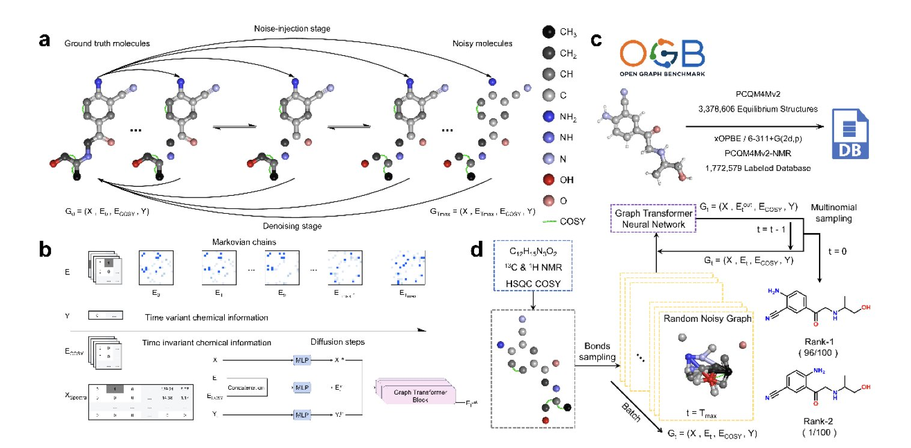
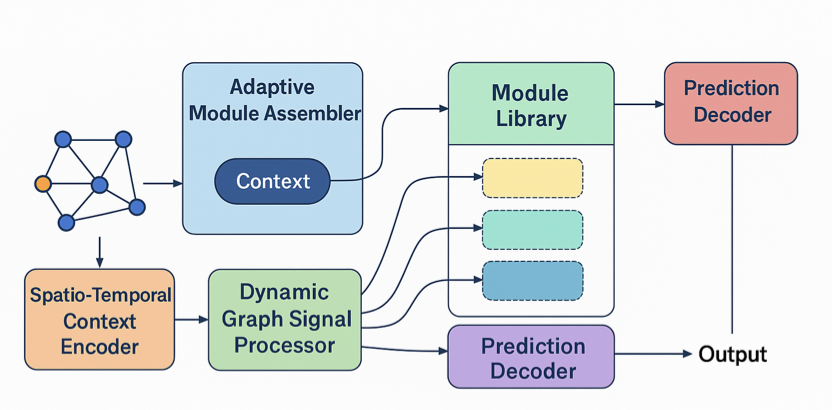
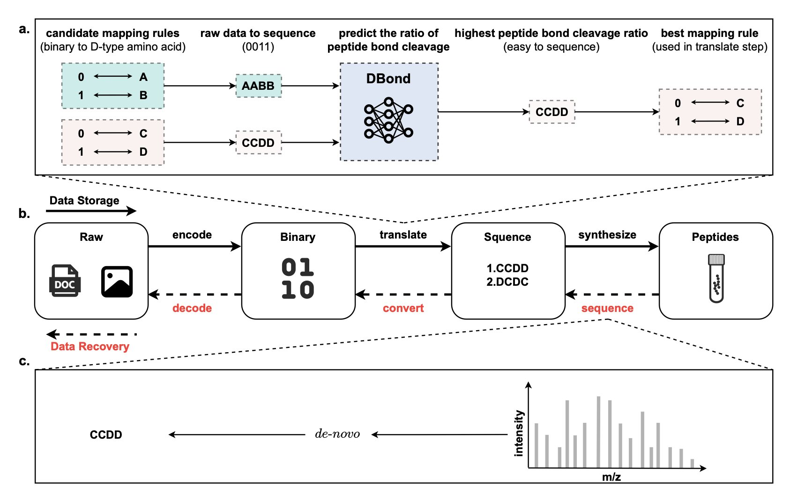

## 目录  
1. DiSE 模型融合多种核磁共振（Nuclear Magnetic Resonance, NMR）谱图数据，模拟化学家的推理过程，实现了有机化合物结构的自动化精准解析。
2. Bio-AMLM 通过动态组装预训练的生物学模块，像搭乐高一样构建分析流程，解决了传统 AI 模型在面对未知生物学问题时泛化能力差的核心痛点。
3. 预测肽键的断裂位点，可以设计出更易精确测序的镜像肽序列，提升数据存储的可靠性。

## 1. DiSE：AI 解码分子结构，像化学家一样思考  
  
  

解析未知化合物的结构是一项复杂的分子侦探工作。传统方法依赖化学家的经验解读质谱和核磁共振谱图，过程耗时且容易出错。DiSE 模型让机器能够胜任这项任务。  
  
DiSE 的核心是扩散模型，一种生成式人工智能（AI）技术。该过程好比将一幅打乱的拼图恢复原状。模型从随机的「噪声」出发，参考化合物的多种谱图数据——质谱（MS）提供分子量，一维核磁共振谱（¹H NMR、¹³C NMR）揭示原子核的化学环境，二维谱（HSQC、COSY）则明确原子间的连接关系——逐步构建出分子结构。  
  
这种工作方式模拟了人类化学家的思维。化学家拿到谱图后，会先从关键信息入手，例如某个信号峰对应一个甲基，再根据其他谱图的关联信号，逐步搭建完整的分子骨架。DiSE 的迭代去噪过程就复现了这种分步推理。研究者可以观察模型从无到有构建最终结构的全过程，使 AI 的决策不再是黑箱。  
  
此前的方法通常直接生成 SMILES 字符串（一种分子的文本表示法）。SMILES 语法严格，微小的错误就可能导致整个分子结构无效。DiSE 直接在分子图上进行操作，更符合化学直觉，也更容易捕捉原子间的复杂关系。它能有效利用 HSQC 和 COSY 这类二维谱图信息，这对确定复杂分子的结构至关重要，是许多传统方法难以做到的。  
  
研究者在多个数据集上测试了 DiSE 的性能，结果显示其 Top-K 准确率很高。模型使用模拟计算的谱图数据进行训练，在处理含有噪声的真实实验数据时依然表现稳健，证明了其在真实实验室解决问题的潜力。  
  
未来，DiSE 有望成为自动化实验室的核心模块，实现从样品分析到结构解析的全流程自动化，从而加速天然产物发现和新药研发。模型仍有提升空间，例如支持更多种类的元素和谱图技术，但它为 AI 如何赋能化学研究指明了方向。  
  
📜Title: DiSE: A diffusion probabilistic model for automatic structure elucidation of organic compounds  
🌐Paper: https://arxiv.org/abs/2510.26231  

## 2. Bio-AMLM：模块化 AI 攻克生物学预测难题  
  
  

在计算辅助药物发现中，一个常见的难题是模型在训练数据上表现良好，但一遇到真实世界的未知情况，预测结果便失准。这就是「分布外泛化」（OOD Generalization）问题，是阻碍 AI 在生物学领域应用的核心障碍。生物系统过于复杂，用一个「大一统」模型来覆盖所有情况几乎不可能。  
  
最近一篇预印本论文介绍的 Bio-AMLM 框架，提供了一个巧妙的解决方案。其核心思想是建立一个由各种专用功能模块组成的模块化系统。  
  
该系统的工作方式类似一个项目经理。首先，它有一个「工具箱」，装满了各种预训练好的、功能专一的生物学模块。例如，一个模块专门分析基因编辑后的转录组变化，另一个模块精通药物分子与蛋白靶点的相互作用。这些模块都是各自领域的「专家」。  
  
其次，系统里有一个「自适应推理规划器」（Adaptive Inference Planner）。当遇到新的生物学问题，例如「某种新化合物对特定癌细胞的毒性如何？」，规划器会分析问题上下文，然后像搭乐高积木一样，从工具箱中挑选合适的模块，并按逻辑顺序串联，形成一条为该问题定制的分析流水线。  
  
例如，它可能先调用「药物吸收」模块，再连接「代谢通路」模块，最后接入「细胞凋亡」模块，得出一个完整的预测。整个过程是动态的，针对不同问题，组装的流水线也不同。  
  
这种设计的优势在于，模型不再是僵化的黑箱，而是一个灵活、可适配的分析系统。论文数据显示，在基因编辑、药物反应和毒性预测等基准测试中，Bio-AMLM 的表现稳定超过了目前最先进的单一模型。  
  
该框架的可解释性是一大亮点。由于整个分析流程可视化，我们可以看到模型为回答特定问题调用了哪些生物学模块及其顺序。这对实验科学家很有价值，因为它展示了一条「推理路径」，而不仅是一个「有效」或「无效」的结论。科学家可以沿着这条路径设计下一步的验证实验，提高研发效率。  
  
该框架尚处早期阶段。研究者计划扩充模块库，加入免疫学、单细胞转录组学等更多领域的「专家模块」，并利用强化学习训练「规划器」，使其更智能。最终，他们会通过前瞻性的湿实验来验证模型的预测。  
  
Bio-AMLM 代表了一种思路转变：从追求更大、更全的单一模型，转向构建一个可动态协同、逻辑清晰的智能系统。这种方式更接近人类科学家解决问题的思维模式。  
  
📜Title: Dynamically Assembling Biological Intelligence to Predict Novel Cellular Phenotypes  
🌐Paper: https://www.biorxiv.org/content/10.1101/2025.10.28.685160v1  

## 3. 镜像肽数据存储：预测肽键断裂，优化序列设计  
  
  

科学家在寻找比硬盘更耐用、密度更高的数据存储方式，镜像肽 (mirror-image peptides) 是一种有前景的选择。肽链由不同氨基酸串联而成，其序列可以编码信息。但准确读出信息，即测序，并不容易。测序时，质谱仪会打断肽链，通过分析碎片反推原始序列。如果肽链在某些位置容易断裂，而在另一些位置又异常稳定，测序就会很困难。  
  
为解决此问题，研究者开始设计「好读」的肽链。  
  
首先，他们需要弄清肽键在何种情况下容易断裂。团队构建了数据集 `MiPD513`，包含 513 种镜像肽和超过 47.7 万张串联质谱图，建立了一个肽键断裂行为数据库。接着，他们开发了算法 `PBCLA`，从质谱图中自动提取了约 1250 万个关于肽键断裂与否的标记实例，为机器学习提供了数据。  
  
然后，研究者训练了深度神经网络模型 `DBond`。该模型综合考虑肽链序列、物理化学性质以及质谱分析时的环境参数，来预测肽链中每个化学键被打断的概率。  
  
结果显示，`DBond` 预测准确。其中，「单标签分类」策略效果最好，它将每个肽键的断裂视为独立事件进行预测。利用 `DBond` 的预测结果，人们可以在设计肽链序列时，避开导致测序模糊的结构，优先选择断裂模式清晰、易于识别的序列。这保障了数据读出的准确性和效率，使镜像肽作为长期、高密度的数据存储介质更接近现实。  
  
📜Title: Optimizing Mirror-Image Peptide Sequence Design for Data Storage via Peptide Bond Cleavage Prediction  
🌐Paper: https://arxiv.org/abs/2510.25814v1
