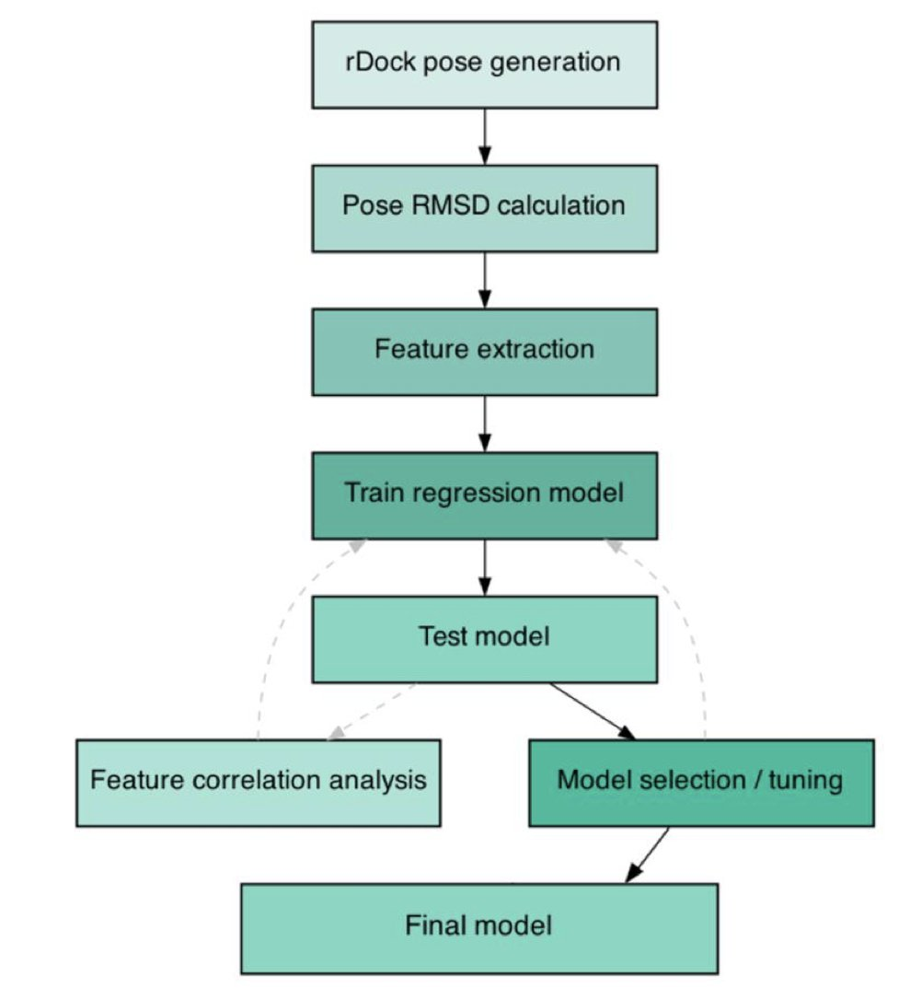
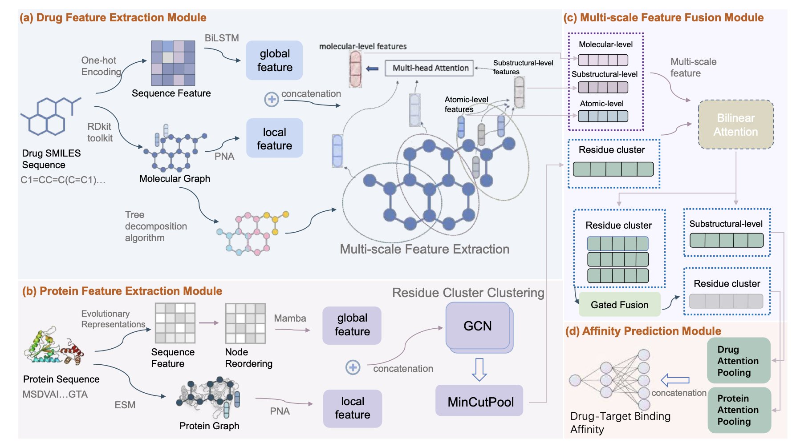
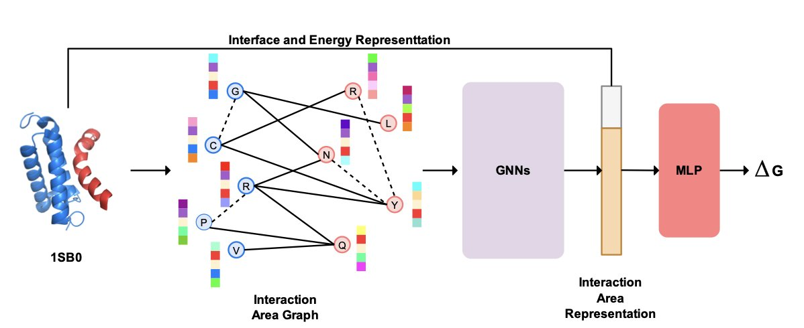

## 目录  
1. IRIS 是一个机器学习构象重排序工具，它通过学习大量真实结构，显著提高了 RNA-配体对接的准确性，解决了该领域长期存在的痛点。
2. HiF-DTA 模型通过一个创新的分层特征学习网络，在药物 - 靶点亲和力（Drug-Target Affinity, DTA）预测上实现了高精度，为计算药物发现开辟了新路径。
3. ProAffinity++ 算法融合蛋白质的序列与结构信息，通过图神经网络（Graph Neural Networks）精确预测蛋白质间的结合亲和力，其性能超越了现有的顶尖方法。

## 1. 机器学习搞定 RNA 对接：IRIS 工具大幅提升构象预测准确性  
  
  

分子对接，尤其是针对 RNA 这类柔性靶点，结果常令人困扰。计算程序会生成大量可能的结合构象（pose），但要判断哪个最接近真实情况却很困难。传统的打分函数（scoring function）在此环节表现不佳，因为 RNA 的结合口袋不像蛋白质那样规整，相互作用也更复杂。研究者可能耗费大量时间，最终发现追逐的只是一个算法预测的假象。  
  
IRIS 这款新工具为解决这个问题提供了新思路。它是一个经验丰富的「评审专家」，接收现有对接软件（如 rDock）生成的构象，然后用机器学习模型重新排序，筛选出最可信的结果。  
  
#### 模型的「杀手锏」是什么？  
  
首先是数据。模型成功的基础是高质量、大规模的训练数据。研究团队整理了迄今最大的核酸 - 配体复合物数据集，包含 1356 个结构。模型从这些真实结合模式中学习，就像新手观摩大师作品，逐渐掌握了判断优劣的直觉。  
  
其次是特征。模型做判断时，依赖一系列精心设计的特征组合，包括：  
  
这套组合拳能更全面地捕捉结合的本质，例如静电相互作用、空间形状互补以及配体与靶点的几何关系。如同侦探结合多种证据破案，结论更可靠。  
  
#### 效果究竟如何？  
  
数据说明了效果。使用 IRIS 重排序后，在前五个构象中找到近天然构象（RMSD < 2.0 Å）的成功率，从 rDock 默认的 55.4% 提升到 73.2%，相对提升了 31%。  
  
在药物研发中，这种准确率的提升让计算化学家和药物化学家可以更自信地筛选和设计分子。当计算工具预测的正确概率增加，他们就能更放心地投入资源进行后续的合成与测试，减少在错误方向上的投入。  
  
一个巧妙的设计是，训练数据同时包含 RNA 和 DNA 的复合物。这让模型学到了更普适的核酸 - 配体相互作用规律，使其对 RNA 和 DNA 靶点都有效。  
  
IRIS 的一个实用功能是直接预测每个构象的均方根偏差（Root Mean Square Deviation, RMSD）值。它定量地评估构象与真实结构的距离，为研究者提供了更精细的决策依据。  
  
IRIS 是开源免费的，可以无缝整合到现有计算流程中。完成对接后，用 IRIS 处理结果，就能得到一份更可靠的构象排名。对于 RNA 靶向药物领域的研究者，这是一个可以直接使用的实用工具。  
  
📜Title: IRIS: A Machine Learning-Based Pose Re-Ranking Tool for RNA-Ligand Docking  
🌐Paper: https://www.biorxiv.org/content/10.1101/2025.10.24.684232v1  

## 2. HiF-DTA：药物 - 靶点亲和力预测的新篇章  
  
  

### 核心观点：  
  
### 细节展开：  
在计算辅助药物发现领域，精确预测药物分子与靶点蛋白的结合亲和力，是决定筛选效率与成本的核心环节。近期，一个名为 HiF-DTA 的模型在此取得了进展。  
  
药物与靶点的结合，是在三维空间内发生的多尺度复杂相互作用。传统模型多侧重于序列信息，忽略了这一特性，如同欣赏画作时只看整体构图而忽略笔触细节。  
  
HiF-DTA 设计了一个双通道网络，同时处理全局和局部特征。它将药物分子分解为原子、子结构和完整分子三个层次进行分析，如同理解一块机械表，不仅观察其外观，也深入研究内部的齿轮与弹簧，从而理解其工作原理。  
  
为有效融合不同尺度的信息，模型采用了「多尺度双线性注意力」模块。该模块如同乐队指挥，协调不同层次的特征（原子、子结构、分子），精准模拟药物与靶点间的复杂作用。  
  
在三个公认的基准数据集（Davis、KIBA 和 Metz）上，HiF-DTA 与现有模型进行了性能比较。结果显示，其在 Davis 数据集上的一致性指数（CI，评估预测排序准确度的指标）首次超过 0.9，达到 0.9026，证明了其预测能力的提升。  
  
为验证模型设计的有效性，研究者进行了消融实验。结果证实，全局 - 局部特征提取和多尺度特征融合，都是模型取得优异性能的关键。这表明 HiF-DTA 的分层特征学习策略是成功的。  
  
📜论文标题：HiF-DTA: Hierarchical Feature Learning Network for Drug–Target Affinity Prediction  
🌐论文链接：https://arxiv.org/abs/2510.27281  

## 3. ProAffinity++：用图神经网络预测蛋白质结合亲和力  
  
  

在药物研发中，精确预测蛋白质间的结合亲和力至关重要，有助于设计更有效的药物。ProAffinity++ 算法在此方面展现出卓越的能力。  
  
该算法的关键在于，要准确预测两个蛋白质的结合程度，必须同时考虑其氨基酸序列和三维结构。传统方法常忽略其中之一，导致信息缺失。ProAffinity++ 则将两者结合。  
  
研究者利用图神经网络，将蛋白质结合的界面区域构建为一个网络，其中每个氨基酸残基是一个节点。通过一张二分图，算法能够描绘出两个蛋白质之间复杂的相互作用关系，捕捉决定结合强弱的局部微环境信息。  
  
为使模型理解蛋白质的特征，算法引入了预训练语言模型 ESM-1v 和反向折叠模型 ESM-IF。ESM-1v 从氨基酸序列中提取生物学特征；ESM-IF 揭示序列与结构间的深层联系。两者结合为算法提供了丰富的信息。  
  
在实际测试中，无论是在常规的结合亲和力预测，还是在抗原 - 抗体识别、错义突变等挑战性场景下，ProAffinity++ 的表现都全面超越了现有的顶尖方法。这证明了它是一个兼具泛化能力和实用价值的工具。  
  
研究者承认，算法仍有优化空间，例如增加神经网络深度或引入更多蛋白质构象数据，以进一步提升预测精度。这为计算辅助药物设计提供了新的可能性。  
  
📜标题：ProAffinity++: An End-to-End Algorithm for Predicting Protein-Protein Binding Affinity  
🌐论文：https://www.biorxiv.org/content/10.1101/2025.10.31.685718v2
