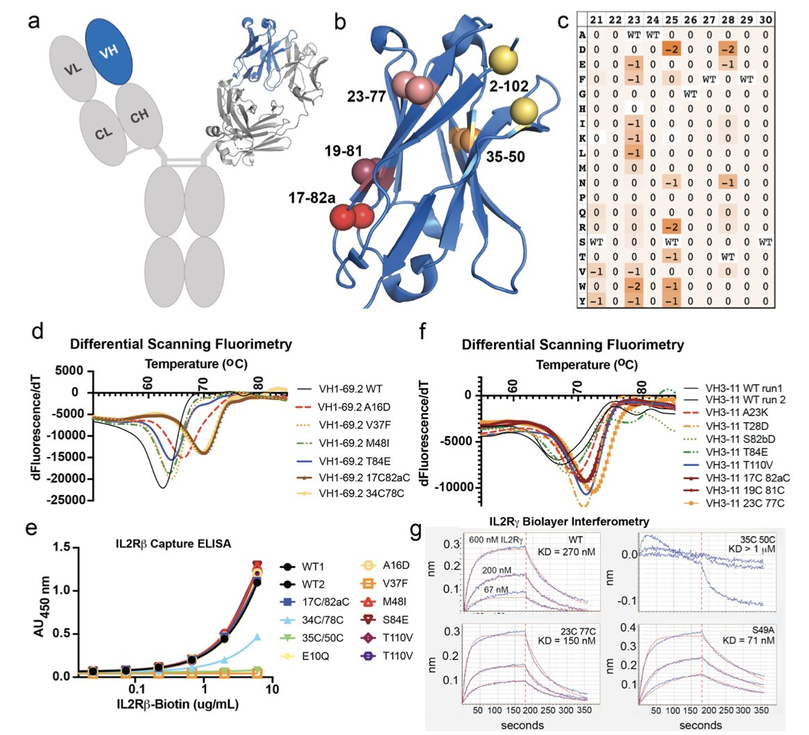
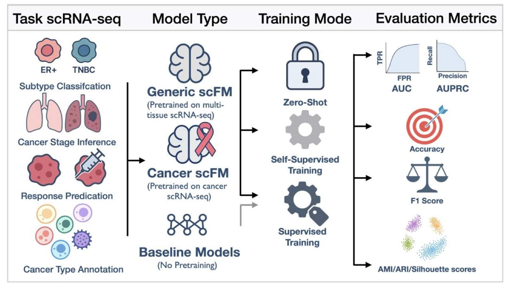
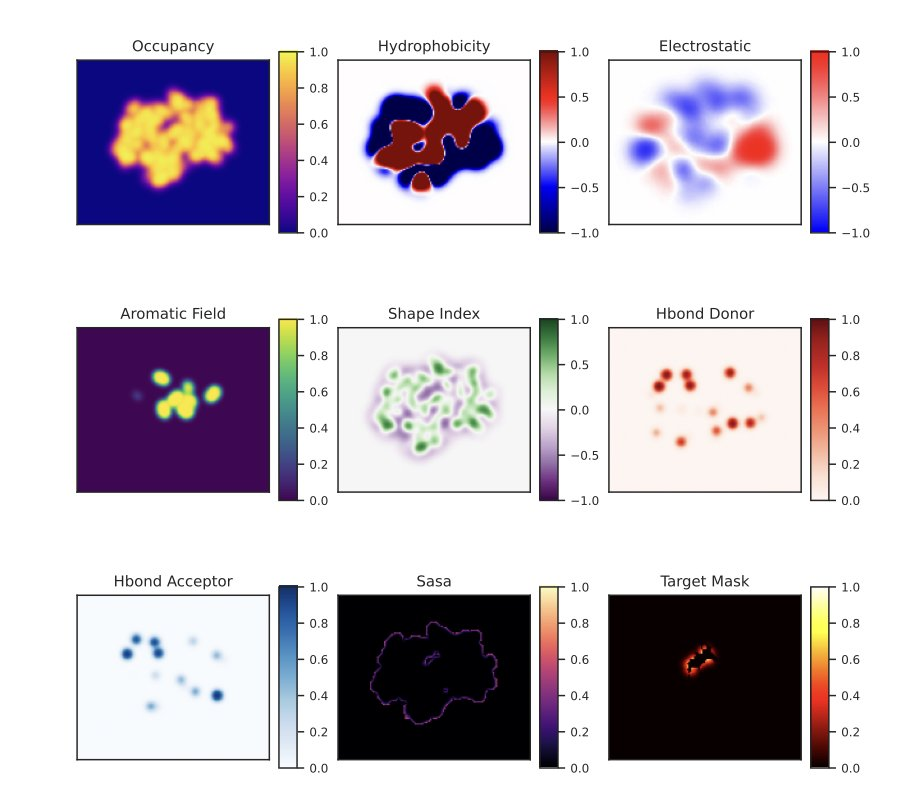
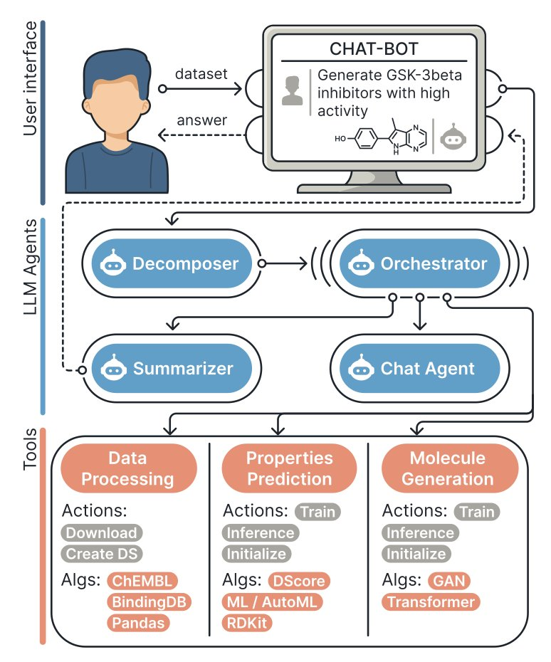
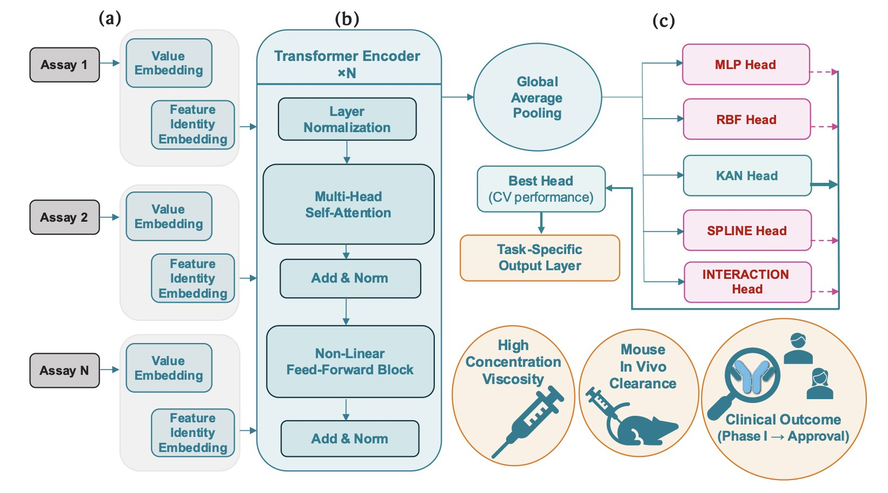

## Table of Contents
1. Stabilizing human VH domains through computational methods has significantly increased their expression and stability, opening new avenues for developing conditionally active multispecific biologics to treat various diseases.
2. Single-cell foundation models excel at cell annotation but do not outperform traditional methods in directly predicting cancer patient outcomes. Their potential needs to be unlocked with smarter tuning and larger datasets.
3. Researchers at Moscow State University have developed a deep learning model, ProteinSight, which uses a 3D convolutional neural network to predict carotenoid-binding sites on proteins with high accuracy.
4. Researchers have developed a multi-agent system, MADD, to automate hit identification in early-stage drug discovery, improving the efficiency and accuracy of AI-driven new drug design.
5. The ACeT model integrates early experimental data to accurately predict the viscosity, clearance, and clinical success rates of monoclonal antibodies, offering a more efficient screening strategy for antibody drug development.

## 1. Computationally Designing Stable VH Domains to Develop Conditionally Active Multispecific Drugs

The stability and developability of antibody drugs are critical. The VH domain is one of the core functional regions of an antibody with great potential, but its inherent instability is a challenge.

Researchers started by performing a comprehensive computational analysis of all human VH germline families using the Rosetta software. They looked for ways to modify the domain to enhance its stability and settled on two strategies: introducing a new disulfide bond and making specific point mutations. After these changes, the expression level of the VH domain in cells increased by over 600 times, and its thermal stability rose by more than 20°C. A component that was once fragile and difficult to work with became robust and durable, ready for use as a drug molecule.

Building on these stable VH domains, the team created the VH-Select™ platform. In traditional antibody engineering, the pairing of VH and VL (light chain variable region) and interactions between VH domains often cause non-specific binding, leading to off-target effects. The VH-Select™ platform uses an optimized design to reduce these unwanted interactions, allowing the VH domain to focus on binding its intended target.

Based on this platform, they developed multispecific biologics called Tentacles™. These molecules integrate multiple VH domains, each recognizing a different target. For example, one Tentacles™ molecule can simultaneously target a specific antigen on the surface of a tumor cell and the IL2Rγ and 4-1BB receptors on a T cell.

Its mechanism of action is conditional: only when one end of the Tentacles™ molecule binds to a tumor cell can the other end effectively activate the T cell's immune signaling pathways. This acts like a "safety switch" requiring dual verification, ensuring the immune system's firepower is unleashed only within the tumor microenvironment. In a humanized mouse tumor model, this drug demonstrated anti-tumor effects and successfully avoided the systemic toxic side effects common with traditional agonist drugs, offering a new direction for developing safer and more effective cancer immunotherapies.

📜Paper: <https://www.biorxiv.org/content/10.1101/2025.10.31.685826v1>

## 2. Single-Cell Foundation Models for Cancer Prediction: How Far Are We from Reality?

Single-cell foundation models (scFMs) have recently drawn widespread attention in biology for their ability to rapidly analyze vast amounts of single-cell data. But how well do these new tools perform in predicting clinical outcomes for cancer patients? A preprint paper evaluates this question, revealing both challenges and future directions.

The study systematically evaluated nine mainstream single-cell foundation models on six cancer prediction tasks. These tasks ranged from basic cell type annotation to complex patient prognosis predictions, such as determining a patient's sensitivity to chemotherapy or their survival time.

The results showed that on basic tasks like cell type annotation, the models performed excellently, thanks to their training on massive cell datasets.

However, when it came to predicting patient-level clinical outcomes, these models did not show an overwhelming advantage over traditional methods, like scikit-learn models. Although the models could identify individual cells, their ability to assess a patient's overall condition still needs improvement. This indicates a gap between microscopic cellular features and macroscopic clinical predictions.

The study found that continuous training and domain adaptation can effectively boost model performance. When researchers retrained the models using data from a specific cancer, their predictive power improved significantly, sometimes outperforming larger, more general models. This shows that fine-tuning for specific diseases is crucial.

Another key issue is how to integrate information from the thousands of cells within a patient. The researchers tested several strategies, with multi-instance learning (MIL) performing the best. This method can identify key cells from a large population that are decisive for a patient's outcome. Although MIL showed the best average performance, its results lacked stability, a technical hurdle to overcome in the future.

Single-cell foundation models have great promise in precision oncology but still face challenges. Directly applying pre-trained large models to clinical problems doesn't guarantee success. The models require more refined tuning and depend on larger, higher-quality clinical cohort data for training and validation before they can be used in the clinic to benefit cancer patients.

📜Title：Empirical Evaluation of Single-Cell Foundation Models for Predicting Cancer Outcomes
🌐Paper：https://www.biorxiv.org/content/10.1101/2025.10.31.685892v1

## 3. AI Pinpoints Protein Binding Sites, Accelerating Drug Development

Determining where small molecules like drugs bind to which proteins in the body is a time-consuming and inefficient process using traditional methods. A team at Moscow State University has developed ProteinSight, a tool that accurately predicts the binding sites of carotenoid molecules.

The tool uses a 3D U-Net deep learning architecture. Researchers convert the 3D atomic coordinates of a protein into a multi-channel volumetric map, similar to upgrading a 2D map to a 3D model containing information on building height, density, and material. Each channel represents a physicochemical property, such as electrostatic potential or hydrophobicity, which governs molecular interactions. By learning from these 3D feature maps, ProteinSight identifies the complex patterns that form binding sites.

The model's performance on test data was excellent, with a ROC AUC of 0.919 for identifying binding sites and a volumetric recall of 0.961, indicating its predictions are both accurate and comprehensive. It can accurately distinguish between true and false binding sites even when faced with the structurally complex and interference-prone Human Serum Albumin.

ProteinSight can be used as a hypothesis-generation tool to predict potential binding sites for unknown proteins and carotenoids. This can guide scientists' research, shorten screening and validation times, and thus speed up the discovery of new carotenoid-binding proteins and provide new insights into protein-ligand interactions.

Currently, the model is primarily based on the static 3D structure of proteins. Future work could integrate molecular dynamics simulations to capture the dynamic changes of proteins in a real-world environment. Additionally, larger-scale validation and benchmarking against other prediction tools are the next steps.

The team has made the complete source code for ProteinSight publicly available on GitHub for researchers to use or build upon, aiming to drive progress in the field.

📜Title: ProteinSight: A Volumetric Deep Learning Model for Carotenoid-Binding Site Prediction
🌐Paper: https://www.biorxiv.org/content/10.1101/2025.10.30.685633v1

## 4. AI Agents Team Up to Accelerate New Drug Discovery

Drug discovery is like finding a needle in a haystack. It requires first identifying a target and then screening a massive library of molecules to find "hit compounds," a process that is both time-consuming and expensive. A group of scientists has developed the MADD (Multi-Agent Drug Discovery Orchestra) system to let AI take on this task.

A user gives a command in natural language, such as "Find a molecule that can inhibit the STAT3 target in lung cancer." The four intelligent agents within the MADD system then begin to collaborate.

First, the "Decomposer" breaks the task down into several executable sub-tasks. Next, the "Orchestrator" calls on specialized tools like molecule generation models and binding affinity prediction models to design and screen molecules. Then, the "Summarizer" consolidates the extensive results into a clear report. Finally, the "Chat Agent" presents the final results in plain language.

The entire process is fully automated. MADD's built-in automated machine learning (AutoML) feature allows it to independently select and fine-tune models based on the task's requirements, enabling it to quickly adapt to new disease targets.

Researchers tested the system on seven real-world drug discovery cases, including Alzheimer's disease, Parkinson's disease, and lung cancer. The results showed that MADD achieved a composite accuracy of 79.8% in identifying hit compounds, outperforming some existing Large Language Model (LLM) solutions. In tests targeting five specific proteins, including STAT3 and ABL, the molecules it designed showed good biological activity and binding affinity.

This work also contributes a new large-scale benchmark dataset containing docking scores for over three million compounds, providing a standard for measuring model performance in the AI-driven pharmaceutical field.

MADD still requires users to provide an initial dataset, and the molecules it designs have not yet been validated through real biological experiments. Nevertheless, the system demonstrates the potential of multi-agent collaboration to accelerate new drug discovery. The research team's next plan is to enable the system to automatically collect and organize data to enhance its versatility and capabilities.

📜Title: MADD: Multi-Agent Drug Discovery Orchestra
🌐Paper: https://aclanthology.org/2025.findings-emnlp.367.pdf
💻Code: https://github.com/ITMO-NSS-team/MADD

## 5. AI Empowers New Drug R&D: The ACeT Model Predicts the Future of Antibody Drugs

One of the trickiest problems in antibody drug development is the relationship between early experimental data and a drug's performance in the human body and its ultimate chances of approval. Researchers typically conduct numerous biophysical analyses, such as measuring protein aggregation (kD), hydrophobicity (HIC), and charge distribution (heparin chromatography). This data is often fragmented, with mixed results across different metrics. Deciding whether a molecule is "good enough" largely depends on experience.

To address this, researchers developed the ACeT model. It uses a "Context-Embedding Transformer" architecture that mimics an experienced scientist, combining readings from routine experiments like dynamic light scattering and heparin chromatography into a unified "molecular profile."

ACeT works like a skilled physician who makes a comprehensive diagnosis by combining information from a blood panel, body temperature, blood pressure, and CT scans. By learning from a large amount of historical data, ACeT has mastered the correlations between different combinations of early-stage indicators and properties like viscosity, clearance, and even the probability of success from Phase I clinical trials to market approval.

The model's predictive performance is quite good. For viscosity and clearance, two critical factors in antibody drug development, its prediction accuracy (R²) reached approximately 0.75 and 0.80, respectively. High viscosity can make it difficult to develop high-concentration formulations, affecting drug administration. A fast clearance rate means the drug stays in the body for a shorter time, reducing its effectiveness. Accurately predicting these two factors at an early stage is hugely valuable for screening candidate molecules.

ACeT can also predict the success rate from Phase I trials to final approval, with a balanced accuracy of about 78%. This means we can identify molecules with "inherent flaws" at a very early stage, avoiding the waste of hundreds of millions of dollars and years of time on projects doomed to fail. This is extremely attractive for high-risk drug development investments.

ACeT is not an incomprehensible "black box"; it is interpretable. The model can reveal which biophysical properties are the main drivers of viscosity and clearance. For example, the model found that dynamic light scattering parameters (kD) and heparin chromatography signals are key drivers for predicting viscosity and clearance, which aligns with decades of accumulated industry knowledge. This grounds its decision-making logic in understandable biophysical mechanisms, making it more reliable to use.

Furthermore, the model can more accurately predict a drug's clearance rate in the human body, thereby reducing the need for repeated pharmacokinetic experiments in animals. This aligns with the "3Rs" principle of replacing, reducing, and refining animal testing. ACeT provides a data-driven decision-making tool that makes the early development of antibody drugs more like precision guidance and less like searching for a needle in a haystack.

📜Title: From Bench Assays to Bedside: A Context-Embedding Transformer Predicts Monoclonal Antibody Viscosity, Clearance, and Regulatory Success
🌐Paper: https://www.biorxiv.org/content/10.1101/2025.10.31.685722v1
