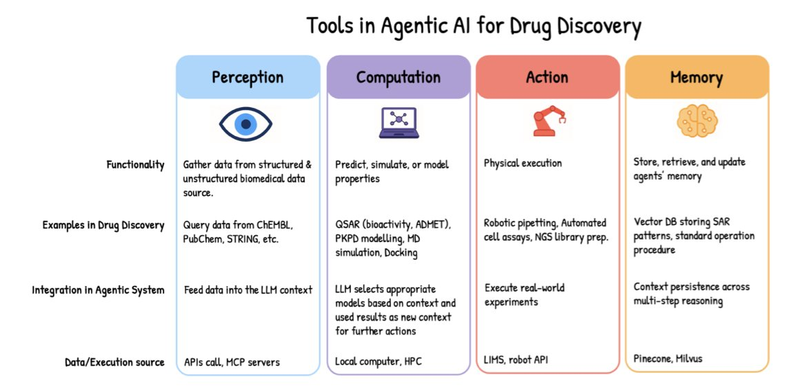
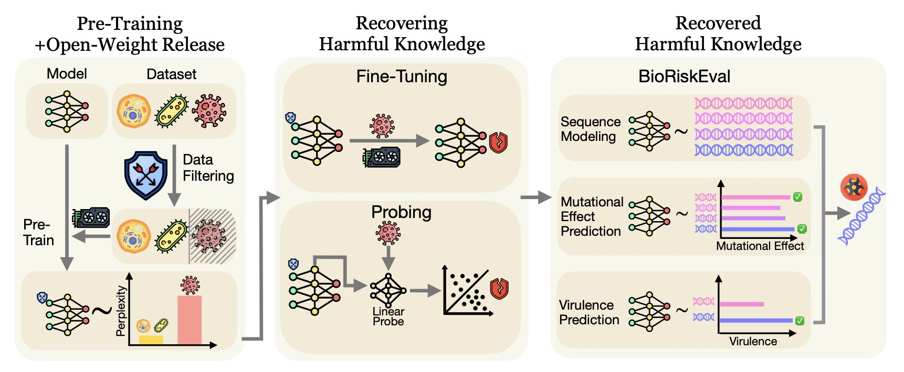
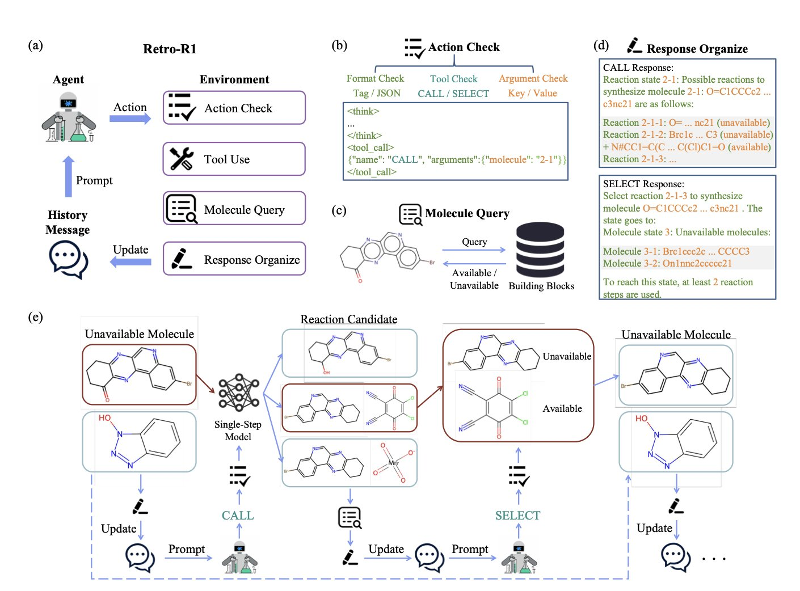
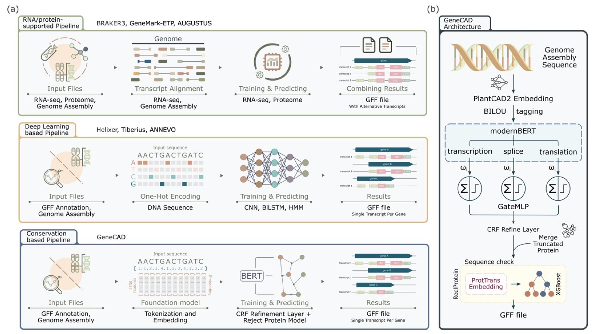
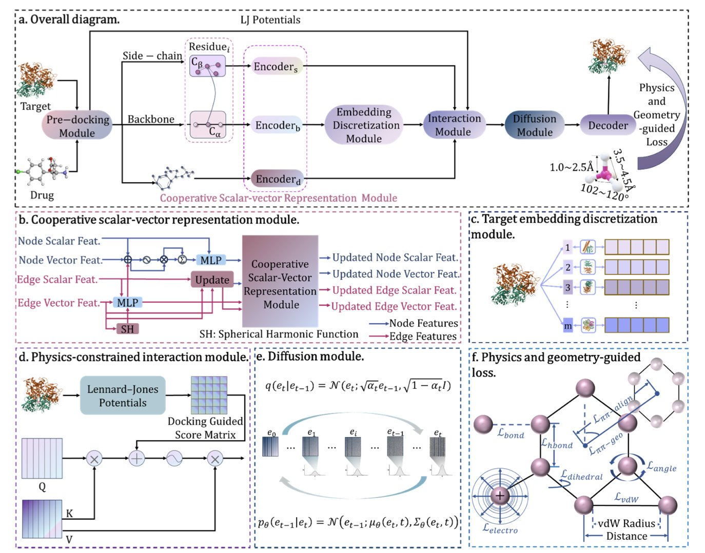

## Table of Contents
1. AI agents can shorten research cycles from months to hours by learning and executing complex tasks on their own, speeding up drug development.
2. Relying on data filtering to solve the security issues of biological foundation models is not reliable; bypassing such limitations is easier than you might think.
3. RETRO-R1, an AI agent combining a large language model with reinforcement learning, can simulate a chemist's thinking to design better molecular synthesis routes.
4. GeneCAD can accurately annotate plant genomes using only DNA sequences, greatly simplifying the process and opening new avenues for gene prediction in other species.
5. The DynaPhArM model incorporates physics principles to accurately predict the 3D structure and affinity when a drug binds to a target protein, outperforming existing methods.

## 1. How Will AI Agents Disrupt Drug Discovery?

In the drug development industry, time is both life and money. A new idea typically takes years to get from the lab to the clinic. The emergence of Agentic AI could change this.

An AI agent acts like a virtual scientist. It can read massive amounts of literature, design experiments, predict toxicity, and even complete the entire testing process in a simulated environment.

Here is how it works: you set a goal, like "find a potential molecule to treat a certain disease." The agent then breaks down the task, calls upon tools, performs actions, and learns from the results to adjust its approach. This creates a closed loop that requires almost no human intervention. This capability relies on increasingly complex AI architectures like ReAct or Swarm, which give AI the power to reason and act.

Teams are already starting to use this technology. A literature review and molecular screening process that once took a team months can now be completed by an AI agent system in a few hours. The process is traceable, and the results are verifiable. This isn't just an increase in speed; it's a leap in research and development efficiency.

Of course, challenges remain. Integrating biological data from different sources, ensuring system stability and reliability, and protecting data privacy are all problems that need to be solved. Just as we train real scientists, we also need to establish strict evaluation and benchmarking standards for AI agents to ensure their results are scientifically sound.

In the future, AI agents will lead us into the era of "self-driving laboratories." In that era, AI systems will connect seamlessly with automated lab equipment to achieve full automation, from forming a hypothesis to completing its validation. This will free up scientists' productivity, allowing them to focus on more creative work.

📜Title: AI Agents in Drug Discovery  
🌐Paper: https://arxiv.org/abs/2510.27130  

## 2. AI Biosafety: The Potential Risks of Open-Source Models

A study has sounded an alarm for the fields of biology and drug development. Researchers developed an evaluation framework called BIORISKEVAL to assess the misuse risks of biological foundation models.

These large language models (LLMs) are powerful research tools. They can assist with sequence modeling, predict mutation effects, and even forecast viral virulence. But if these capabilities are used with malicious intent, the consequences could be serious.

Filtering out dangerous data during the model's pre-training phase, such as knowledge of specific viruses or toxins, seems like a direct safety strategy. But research shows this approach doesn't work.

The experiments revealed that even when certain knowledge is excluded during pre-training, the model can recover these "forgotten" skills with just a small number of fine-tuning steps—as few as 50. This is especially true for recovering knowledge at the species level. For a malicious user, the technical barrier is almost nonexistent.

Sometimes, fine-tuning isn't even necessary. The study found that harmful knowledge isn't truly deleted but is hidden in the model's deeper layers. Using a method called Linear Probing, researchers could directly extract this information from the model's hidden layers. The results showed that with linear probing, the model's performance in predicting mutations and viral virulence was nearly identical to that of an unfiltered model. This indicates that "safety filtering" may only hide the danger, not eliminate the risk.

Therefore, data filtering alone cannot guarantee the safety of powerful open-source models. We need more effective defensive measures. We must consider that attackers could use methods like fine-tuning and probing to reawaken a model's latent harmful capabilities. This study is a starting point for addressing this problem. The entire field needs to take it seriously and develop more comprehensive safety protocols.

📜Paper: <https://arxiv.org/abs/2510.27629>  

## 3. An AI Agent Optimizes Retrosynthesis Routes

Retrosynthesis design is the starting point of drug development. It's the process of working backward from a target molecule to determine the necessary raw materials and reactions. In the past, this work relied on the experience of chemists. Now, AI is starting to get involved.

Researchers have developed an AI Agent named RETRO-R1. It uses a Large Language Model (LLM) at its core and is trained through Reinforcement Learning to design molecular synthesis routes.

The agent works in a way that mimics a chemist. It interacts with a chemical tool "environment" rather than providing a complete answer all at once. For example, RETRO-R1 might first propose the hypothesis that "molecule A can be synthesized from B and C." It then calls on tools like a single-step retrosynthesis prediction model to verify its feasibility. The tool provides feedback on the reaction's reliability. This process is like a chemist who, after forming an idea, consults the literature or runs a preliminary experiment.

Through this "try-feedback-learn" loop, RETRO-R1 continuously refines its strategy. It uses the Proximal Policy Optimization (PPO) algorithm to perform multiple rounds of thinking and decision-making in complex planning tasks, ultimately constructing a complete, global synthesis roadmap.

On a standard test set, RETRO-R1 achieved a single-prediction success rate (pass@1) of 55.79%, nearly 9% higher than the previous record. It also performed well on molecules not in its training data, proving that it has learned the underlying logic of chemical synthesis, not just memorized data.

Additionally, the routes designed by RETRO-R1 have a high success rate and often uncover shorter synthesis paths, which can reduce costs and increase efficiency. For a single target molecule, it can provide over 100 different synthesis routes, giving chemists more options.

The success of RETRO-R1 shows that combining the reasoning ability of large language models with the decision-making power of reinforcement learning is an effective way to solve complex scientific problems. In the future, more computational chemistry tools could be integrated, allowing the AI to analyze reaction details and feasibility on its own.

📜Title: RETRO-R1: LLM-based Agentic Retrosynthesis  
🌐Paper: https://openreview.net/pdf/470a5ef177e20c474a9e358c1bab0c1cf082f1de.pdf  

## 4. GeneCAD: A New Era of Plant Genome Annotation with a DNA Foundation Model

Genome annotation faces a dilemma: experimental data is expensive and hard to scale, while purely computational methods lack accuracy. The GeneCAD study presents a third option.

The core idea of this work is simple: just input a DNA sequence, and a computer can accurately mark the locations of genes.

Here is how GeneCAD works: It first uses PlantCAD2, a DNA Foundation Model. This model acts like an experienced botanist. By learning from a vast number of plant genomes, it identifies important DNA segments that have been conserved through evolution. These segments are often key parts of genes.

Next, GeneCAD uses a ModernBERT encoder to process the information and combines it with a Conditional Random Field for global optimization. This is like a puzzle master who not only recognizes each gene piece but can also assemble them according to the correct logic of gene structure, such as ensuring a "start codon" is followed by an "exon." The resulting gene models are more consistent with biological principles.

Another clever aspect of the study is that the researchers first "cleaned" the training data. They developed a scoring method called Masked Motif Logistic Regression (MMLR) specifically to filter out low-quality gene annotations. This ensures the model learns from high-quality material, which improves the final results.

In comparisons with leading tools like BRAKER3 and Helixer, GeneCAD showed higher accuracy at the transcript level and better resolution of gene boundaries in the complex polyploid genome of tobacco.

The technology is not yet perfect. For instance, it still has difficulty with long introns. But its potential is enormous. The framework is like a plug-in platform. By replacing the core PlantCAD2 model with one suited for animals or microbes, this efficient annotation method could be applied to broader fields of life science.

📜Title: GeneCAD: Plant Genome Annotation with a DNA Foundation Model  
🌐Paper: https://www.biorxiv.org/content/10.1101/2025.10.31.685877v1  
💻Code: https://github.com/plantcad/genecad  

## 5. DynaPhArM: AI Accurately Simulates the Dynamic Binding of Drugs to Targets

In drug discovery, understanding how small molecules interact with target proteins is a central problem. In the past, research often treated proteins as rigid structures, which doesn't match reality. Proteins are dynamic. When a drug approaches, a protein's conformation changes to better "embrace" it. This process is called "induced fit." Traditional computational methods struggle to simulate this flexibility, especially when only the unbound protein structure is available.

The DynaPhArM model was created to solve this problem. It is a deep learning model based on an SE(3)-equivariant Transformer architecture. SE(3)-equivariance ensures that when the model processes 3D atomic coordinates, its results do not change if the complex is rotated or moved. This is a physical law that molecular simulations must obey.

DynaPhArM's approach is clever. It first learns a specific embedding vector for each drug molecule. This is like creating a unique "ID card" for the drug that carries its key chemical information. Then, the model combines the atomic information of the drug and the protein and uses a diffusion model to generate a joint representation. This allows the model to "imagine" possible binding poses for the drug and protein.

The most critical step is the integration of fundamental physics principles. The model uses a multi-task learning framework to optimize several objectives at once. It aims not only for the predicted complex structure to have the lowest, most stable energy, but also ensures that the predicted distances between atoms (bond lengths), angles between chemical bonds (bond angles), and non-bonded interactions between atoms (van der Waals forces) all conform to chemical common sense. This is like teaching a student to draw: the picture must be accurate, but the underlying anatomy must also be correct. By grounding its predictions in physical laws, the model's reliability is greatly increased.

The final experimental results prove its capability. In predicting the overall structure of the complex, DynaPhArM achieved a root-mean-square deviation (RMSD) of just 2.01 Å, meaning the predicted structure is very close to the real one. When predicting conformational changes in the protein's side chains, its side-chain RMSD (sc-RMSD) was even lower, at 0.29 Å, showing it can accurately capture the subtle adjustments that occur upon binding. In the difficult test of cross-docking, DynaPhArM continued to perform well, demonstrating its strong generalization ability.

Through precise, atom-level modeling, DynaPhArM successfully captures the adaptive changes of target proteins and the specific binding of drugs. It provides a powerful tool for understanding drug-target interactions and opens up new possibilities for future drug design.

📜Title: DynaPhArM: Adaptive and Physics-Constrained Modeling for Target-Drug Complexes with Drug-Specific Adaptations  
🌐Paper: https://openreview.net/pdf/65a18eeda3c71f56d7a214887be80b7deac3a2b8.pdf
